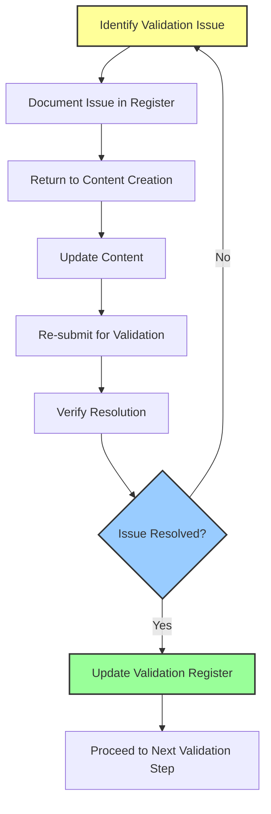

# 🔍 Content Validation Workflow

## 📋 Overview

This document outlines the systematic process for validating course content to ensure accuracy, practicality, and effectiveness. The content validation workflow is a critical quality assurance step that verifies all claims, instructions, and expected outcomes before course publication.

**Workflow ID**: VALID-01  
**Version**: 1.0  
**Last Updated**: 2025-04-12  

## 🎯 Objectives

1. Verify the accuracy of all factual claims in course materials
2. Confirm that all procedures and instructions are executable by target students
3. Validate revenue projections and market demand claims
4. Ensure content meets educational standards and learning outcomes
5. Test all code samples, tools, and technical procedures
6. Verify that all resources and references are current and accessible

## 🛠️ Required Tools

- Course content validation matrix
- Technical testing environment
- Market research data sources
- Expert review panel access
- Student persona profiles
- Validation scoring rubric

## 🔄 Workflow Steps

### Step 1: Initial Content Review

| Action | Description | Success Criteria |
|--------|-------------|------------------|
| Document inventory | Create a complete list of all content to be validated | All content components identified and cataloged |
| Claim extraction | Identify all factual claims, revenue projections, and technical statements | Comprehensive list of claims requiring validation |
| Procedure isolation | Isolate all step-by-step procedures for testing | All procedures clearly identified and documented |
| Reference collection | Compile all external references and resources | Complete reference list with accessibility status |

#### Documentation Requirements
- Create validation-inventory.md document listing all content components
- Develop claims-register.md with all statements requiring verification
- Compile procedures-register.md with all processes requiring testing

---

### Step 2: Technical Validation

| Action | Description | Success Criteria |
|--------|-------------|------------------|
| Code testing | Execute all code samples in a controlled environment | 100% of code examples function as described |
| Tool verification | Test all recommended tools and platforms | All tools function and are accessible to target audience |
| Process validation | Execute all technical processes end-to-end | All processes produce expected results |
| Environment testing | Verify compatibility with specified environments | All content works in the stated system environments |

#### Documentation Requirements
- Complete code-validation-report.md with testing results
- Update tool-verification-matrix.md with compatibility findings
- Document all test cases and results in technical-validation-log.md

---

### Step 3: Factual Claim Verification

| Action | Description | Success Criteria |
|--------|-------------|------------------|
| Research verification | Cross-reference claims with authoritative sources | All claims substantiated by credible sources |
| Expert review | Submit specialized claims for expert verification | Expert confirmation of technical accuracy |
| Market research validation | Verify market demand and revenue claims | Data-backed validation of market projections |
| Regulatory compliance | Ensure all claims meet legal requirements | No unsubstantiated or legally problematic claims |

#### Documentation Requirements
- Create factual-verification-report.md with claim validation status
- Compile expert-review-results.md with specialist feedback
- Update market-validation-report.md with economic projections

---

### Step 4: Educational Effectiveness Review

| Action | Description | Success Criteria |
|--------|-------------|------------------|
| Learning outcome mapping | Verify content matches stated learning outcomes | All learning objectives addressed by content |
| Instructional design review | Assess pedagogical approach and structure | Content follows established educational principles |
| Complexity assessment | Evaluate content against target audience skill level | Content appropriately matched to student capacity |
| Assessment validation | Verify that assessments measure stated outcomes | Assessments effectively measure learning outcomes |

#### Documentation Requirements
- Complete learning-outcome-matrix.md mapping content to objectives
- Create pedagogical-review-report.md with instructional analysis
- Document assessment-validation-results.md with evaluation findings

---

### Step 5: Student Perspective Testing

| Action | Description | Success Criteria |
|--------|-------------|------------------|
| Student persona testing | Review content from target audience perspective | Content meets needs of defined student personas |
| Comprehension testing | Verify clarity and understandability | Content accessible to target skill levels |
| Execution simulation | Test whether students can execute all steps | Instructions clear enough for independent execution |
| Time requirement validation | Verify estimated time requirements | Time estimates match actual execution time |

#### Documentation Requirements
- Create persona-testing-report.md with audience-based findings
- Document clarity-assessment-results.md with readability metrics
- Update time-requirement-analysis.md with execution time findings

---

### Step 6: Comprehensive Integration Validation

| Action | Description | Success Criteria |
|--------|-------------|------------------|
| Cross-module consistency | Verify consistency across course modules | No contradictions or inconsistencies between modules |
| Prerequisite validation | Confirm prerequisite knowledge is sufficient | Prerequisites accurately reflect required knowledge |
| Integration testing | Verify that all components work together | All modules and resources function as an integrated whole |
| Reference integrity | Confirm all cross-references and links function | All references and links are accurate and functional |

#### Documentation Requirements
- Create consistency-analysis-report.md with cross-module findings
- Document prerequisite-validation-results.md with requirements analysis
- Complete integration-testing-log.md with comprehensive test results

---

### Step 7: Validation Reporting

| Action | Description | Success Criteria |
|--------|-------------|------------------|
| Results compilation | Aggregate findings from all validation steps | Comprehensive validation results document |
| Issue categorization | Categorize and prioritize any identified issues | Issue register with severity and priority ratings |
| Resolution tracking | Document resolution of identified issues | Complete record of all issue resolutions |
| Final validation statement | Produce official validation declaration | Signed validation statement with performance metrics |

#### Documentation Requirements
- Create validation-summary-report.md with consolidated findings
- Develop issue-register.md with categorized problems and solutions
- Complete final-validation-statement.md with official approval

---

## 🚨 Validation Standards

### Accuracy Standards
- All factual claims must be verifiable from at least two reputable sources
- All code samples must execute successfully in the specified environment
- All revenue projections must be based on documented case studies or market research
- All procedures must be independently executable by target audience members

### Documentation Standards
- All validation findings must include evidence citations
- Issue registers must include severity ratings and resolution paths
- Validation reports must be version-controlled and dated
- All validation documents must follow standard formatting guidelines

### Approval Requirements
- Technical content requires subject matter expert approval
- Revenue claims require market research validation
- Educational structure requires instructional design approval
- Complete course requires final validation committee sign-off

---

## 🔄 Validation Loops

If any content fails validation, implement the following loop:



---

## 📊 Validation Metrics

Track these key metrics throughout the validation process:

| Metric | Target | Minimum Acceptable |
|--------|--------|-------------------|
| Factual Accuracy | 100% | 98% |
| Code Execution Success | 100% | 100% |
| Tool Verification | 100% | 100% |
| Procedure Executability | 100% | 95% |
| Learning Outcome Coverage | 100% | 95% |
| Resource Accessibility | 100% | 98% |
| Student Comprehension | 90%+ | 85% |
| Time Estimate Accuracy | ±10% | ±20% |

---

## 📝 Reporting Templates

### Validation Issue Template
```
## Validation Issue: [Issue ID]

**Issue Type**: [Factual/Technical/Educational/Procedural]
**Severity**: [Critical/Major/Minor]
**Location**: [Document/Module/Section]
**Description**: [Brief description of the issue]

**Evidence**: [Supporting evidence of the issue]
**Impact**: [Effect on learning outcomes or user experience]
**Resolution Path**: [Recommended approach to resolve]
**Assigned To**: [Person responsible for fixing]
**Due Date**: [Deadline for resolution]
```

### Validation Approval Template
```
## Validation Approval: [Section/Module/Course ID]

**Validator**: [Name and qualification]
**Validation Date**: [Date of completion]
**Validation Type**: [Technical/Educational/Market/Comprehensive]

**Metrics Summary**:
- Factual Accuracy: [Percentage]
- Code Execution: [Percentage]
- Procedure Executability: [Percentage]
- Resource Accessibility: [Percentage]

**Approval Statement**: [Official approval declaration]
**Conditions**: [Any conditions attached to the approval]
**Recommendation**: [Approve/Approve with Changes/Reject]
```

---

## 🔄 Integration with Other Workflows

- **From Content Creation**: Content enters validation after initial creation and internal review
- **To Content Update**: Failed validation items return to content creation workflow
- **To Resource Indexing**: Validated resources feed into resource indexing workflow
- **To Video Planning**: Validated content proceeds to video planning workflow

---

*This document defines the standard content validation process for PowerBridge.AI courses. All course content must successfully complete this validation workflow before publication or integration with other course components.* 