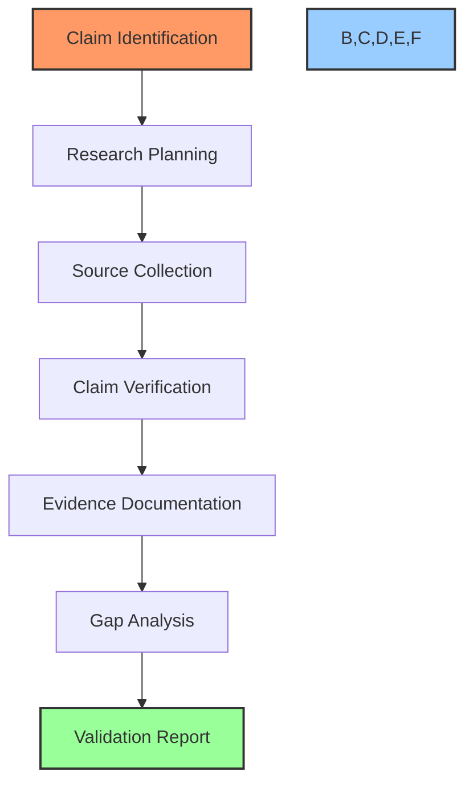

# 🔍 Research Validation Workflow

## 🎯 Purpose
This workflow provides a standardized process for validating all claims, skills, tools, and revenue projections mentioned in PowerBridge.AI courses. Following this process ensures that all course content is accurate, realistic, and achievable.

## 📋 Workflow Overview



## 📝 Step-by-Step Process

### Phase 1: Preparation

#### Step 1: Claim Identification
- Extract all factual claims from course material
- Categorize claims by type:
  - Skill viability claims
  - Tool functionality claims
  - Revenue projections
  - Market demand claims
  - Implementation feasibility claims
- Prioritize claims based on importance to course objectives

#### Step 2: Research Planning
- Define research questions for each claim
- Identify potential sources for verification:
  - Academic research
  - Industry reports
  - Expert testimonials
  - Case studies
  - Tool documentation
  - Market analyses
  - Competitor reviews
- Create research plan with timelines and priorities

### Phase 2: Research Execution

#### Step 3: Source Collection
- Gather relevant sources for each claim
- For each source, document:
  - Source URL/reference
  - Publication date
  - Author/organization
  - Credibility assessment
  - Relevance to claim
- Ensure diversity of sources for comprehensive validation

#### Step 4: Claim Verification
- Compare claim against collected sources
- Assess accuracy on 5-point scale:
  1. Fully verified with strong evidence
  2. Largely verified with some caveats
  3. Partially verified with significant caveats
  4. Largely unverified with minimal evidence
  5. Completely unverified or contradicted
- Document specific evidence supporting or contradicting claim
- Note any conditions or contexts that affect claim validity

#### Step 5: Evidence Documentation
- Create structured evidence database for each claim
- Link evidence directly to course content
- Format evidence for easy reference:
  - Claim: [Original claim from course]
  - Verification Status: [1-5 scale rating]
  - Primary Evidence: [Strongest supporting evidence]
  - Supporting Evidence: [Additional verification]
  - Caveats/Conditions: [Limitations or contexts]
  - Sources: [Full list of referenced sources]

### Phase 3: Analysis & Integration

#### Step 6: Gap Analysis
- Identify claims with insufficient validation
- Determine what additional research is needed
- Decide whether to:
  - Conduct additional research
  - Modify claims to match evidence
  - Remove unvalidated claims
  - Add appropriate disclaimers/caveats
- Create action plan for addressing gaps

#### Step 7: Validation Report
- Compile comprehensive validation report:
  - Executive summary of validation status
  - Detailed claim-by-claim verification
  - Evidence database
  - Gap analysis and recommendations
  - Suggested content modifications
- Include validation status metrics:
  - Percentage of claims fully verified
  - Distribution of verification ratings
  - Areas requiring modification

## 📊 Validation Requirements

### Skill Validation Requirements
- Must have evidence of real-world application
- Must have case studies of successful implementation
- Must have current (within 2 years) market demand
- Must be achievable with specified prerequisites
- Must be teachable within course timeframe

### Tool Validation Requirements
- Must be currently available and functional
- Must have documentation of features claimed
- Must be accessible at stated price point
- Must have evidence of real-world usage
- Must meet specified performance claims

### Revenue Validation Requirements
- Must have documented case studies of comparable earnings
- Must include statistical distribution (not just outliers)
- Must account for market saturation factors
- Must consider timeline to achieve stated revenue
- Must include effort/skill requirements disclosure

## 🛠️ Research Resources

### Primary Research Sources
- Industry reports (Gartner, Forrester, etc.)
- Academic publications and journals
- Government statistics (BLS, etc.)
- Professional association data
- Verified case studies
- Tool documentation and forums

### Secondary Research Sources
- Expert blogs and publications
- Community forums and discussions
- Social media evidence (with verification)
- Course reviews and testimonials
- Competitive analysis
- Market trends analysis

## 📑 Documentation Templates

### Claim Validation Template

```markdown
## Claim Validation: [Claim ID]

### Original Claim
> [Quote the exact claim from course material]

### Research Questions
1. [Primary question to verify claim]
2. [Secondary questions to address contexts/conditions]

### Sources Consulted
1. [Source 1 with URL, date, author, and credibility assessment]
2. [Source 2 with URL, date, author, and credibility assessment]
3. [Additional sources...]

### Evidence Summary
- **Verification Rating**: [1-5 scale]
- **Primary Evidence**: [Key evidence supporting/refuting claim]
- **Supporting Evidence**: [Additional verification details]
- **Contrary Evidence**: [Evidence contradicting or limiting claim]

### Conditions & Caveats
- [Important limitations or contexts]
- [Specific prerequisites required]
- [Time/effort considerations]

### Validation Outcome
- [Accept as is / Modify / Reject]
- **Recommended Modification**: [If applicable]
- **Justification**: [Reasoning for outcome]
```

### Revenue Validation Template

```markdown
## Revenue Validation: [Revenue Claim ID]

### Original Claim
> [Quote the exact revenue claim]

### Evidence Sources
1. [Source 1 with URL, date, author, and credibility assessment]
2. [Source 2 with URL, date, author, and credibility assessment]
3. [Additional sources...]

### Revenue Distribution Analysis
- **Minimum Observed**: $[amount]/month
- **Average Observed**: $[amount]/month
- **Median Observed**: $[amount]/month
- **Maximum Observed**: $[amount]/month
- **Sample Size**: [number of data points]

### Time & Effort Analysis
- **Typical Time to First Revenue**: [timeframe]
- **Typical Time to Claimed Revenue**: [timeframe]
- **Effort Requirements**: [hours/week or skill level]
- **Success Rate**: [percentage of attempts reaching claimed revenue]

### Market Factors
- **Market Saturation**: [Low/Medium/High]
- **Competition Level**: [Low/Medium/High]
- **Barrier to Entry**: [Low/Medium/High]
- **Market Trends**: [Growing/Stable/Declining]

### Validation Outcome
- [Accept as is / Modify / Reject]
- **Recommended Revenue Claim**: $[amount]-$[amount]/month
- **Recommended Disclosure**: [What should be disclosed about this revenue claim]
```

## 🔄 Validation Process Integration

### Integration with Content Creation
1. **Pre-Creation Validation**:
   - Validate core course concepts before detailed content
   - Establish evidence base for main revenue claims
   - Verify key tool functionality

2. **During-Creation Validation**:
   - Reference evidence database during content creation
   - Add appropriate caveats and conditions
   - Include range of expected outcomes

3. **Post-Creation Validation**:
   - Review complete content against validation reports
   - Ensure all claims are properly supported
   - Add disclaimers where appropriate

### Documentation Requirements
1. Update resource-index.md with all research sources
2. Create validation.md with claim-by-claim verification
3. Add validation status indicators to curriculum.md
4. Include appropriate disclaimers in course materials

## 📈 Success Criteria

A successfully validated course meets these criteria:

1. **Accuracy**: 90%+ of claims rate 1-2 on verification scale
2. **Transparency**: All revenue claims include full distribution
3. **Realism**: All implementation steps verified as executable
4. **Currency**: All tools and methods verified as current
5. **Comprehensiveness**: All major claims supported by multiple sources

## 🔄 Continuation Prompts

### Continue Research Validation

```
I'd like to continue the research validation for [Course Name]. Please read the checkpoint and continue validating claims from where we left off.
```

### Start New Course Validation

```
I'd like to start research validation for the [New Course Name] course. Please help me implement the research validation workflow for this course.
```

### Check Validation Status

```
What's the current validation status for [Course Name]? Please provide an overview of verified and unverified claims.
```

---

*This workflow provides a standardized process for validating all course content. Follow this workflow for each course to ensure accuracy and credibility.* 