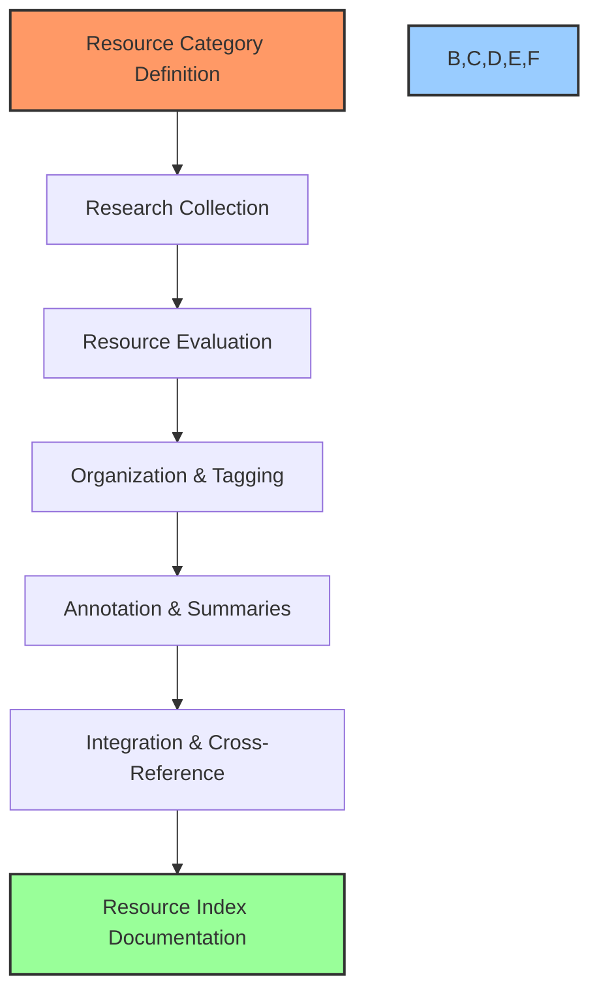

# 📚 Resource Indexing Workflow

## 🎯 Purpose
This workflow provides a standardized process for building comprehensive, organized resource libraries for each PowerBridge.AI course. These libraries serve as reference materials for students, validation evidence for course claims, and supporting documentation for course content.

## 📋 Workflow Overview



## 📝 Step-by-Step Process

### Phase 1: Planning & Collection

#### Step 1: Resource Category Definition
- Review course content and identify key topic areas
- Define resource categories aligned with course structure:
  - Official documentation
  - Tutorials and guides
  - Code repositories and examples
  - Tools and services
  - Community resources
  - Case studies
  - Academic resources
  - Monetization examples
  - Advanced topics
- Map resource needs to specific course sessions
- Identify critical vs. supplementary resource requirements

#### Step 2: Research Collection
- Conduct thorough search for each resource category:
  - Official product/tool documentation
  - GitHub repositories and code examples
  - YouTube tutorials and channels
  - Blogs and technical articles
  - Academic papers and research
  - Community forums and discussions
  - Case studies and success stories
  - Industry reports and analyses
  - Books and courses
- Document initial findings in raw resource list
- Include metadata (URL, date, author, format)

### Phase 2: Evaluation & Organization

#### Step 3: Resource Evaluation
- Assess each resource against quality criteria:
  - **Accuracy**: Correctness of information
  - **Currency**: How recent/up-to-date
  - **Comprehensiveness**: Depth of coverage
  - **Clarity**: Easy to understand
  - **Practicality**: Applicable to real-world use
  - **Authority**: Credibility of source
- Assign quality rating (1-5 scale)
- Flag core vs. supplementary resources
- Identify resources for validation evidence
- Document any discrepancies or contradictions

#### Step 4: Organization & Tagging
- Develop tagging system for resources:
  - Topic tags (aligned with course sections)
  - Difficulty level (Beginner, Intermediate, Advanced)
  - Resource type (Documentation, Tutorial, Code, etc.)
  - Core/Supplementary designation
  - Verification status (if used for validation)
- Tag each resource with appropriate metadata
- Group resources by course session/module
- Create resource relationship map for connected topics

#### Step 5: Annotation & Summaries
- Create concise summary for each core resource
- Add annotations explaining relevance to course
- Document key takeaways from each resource
- Note specific sections or elements of importance
- Include practical application context
- Highlight any caveats or limitations
- Add time estimates for consuming the resource

### Phase 3: Documentation & Integration

#### Step 6: Integration & Cross-Reference
- Link resources to specific course content:
  - Session materials
  - Exercise references
  - Project requirements
  - Validation claims
- Create cross-reference system between related resources
- Map revenue claim evidence to specific resources
- Identify implementation examples for practical exercises
- Document gaps where additional resources may be needed

#### Step 7: Resource Index Documentation
- Compile final resource-index.md document:
  - Table of contents by category
  - Session-specific resource lists
  - Comprehensive resource database with all metadata
  - Top resources by topic area
  - Getting started guide for resource utilization
- Create student-friendly resource guide
- Document resource validation connections
- Prepare internal reference notes for instructors

## 📊 Resource Categories & Types

### Required Resource Categories

1. **Official Documentation**
   - API references
   - Tool documentation
   - Platform guides
   - Technical specifications

2. **Tutorials & Guides**
   - Step-by-step tutorials
   - How-to guides
   - Best practices
   - Implementation examples

3. **Code & Templates**
   - GitHub repositories
   - Code examples
   - Starter templates
   - Component libraries

4. **Tools & Services**
   - Software tools
   - SaaS platforms
   - Development utilities
   - Testing resources

5. **Community Resources**
   - Forums and discussions
   - Discord communities
   - Stack Overflow threads
   - Reddit communities

6. **Case Studies**
   - Success stories
   - Implementation examples
   - Revenue verification cases
   - Business models

7. **Learning Resources**
   - Free courses
   - YouTube channels
   - Blogs and websites
   - Books and publications

8. **Market & Industry**
   - Market analyses
   - Industry reports
   - Trend forecasts
   - Competitive landscapes

## 📑 Resource Evaluation Framework

### Quality Assessment Criteria

Each resource should be evaluated on a 1-5 scale for:

1. **Accuracy** (How correct and reliable is the information?)
   - 5: Completely accurate, verified multiple sources
   - 4: Highly accurate with minor inconsistencies
   - 3: Generally accurate with some gaps
   - 2: Contains significant inaccuracies
   - 1: Unreliable or mostly incorrect

2. **Currency** (How up-to-date is the information?)
   - 5: Current, reflects latest versions/practices
   - 4: Recent, minor updates needed
   - 3: Somewhat dated but fundamentals still apply
   - 2: Outdated, needs significant updates
   - 1: Obsolete, no longer applicable

3. **Comprehensiveness** (How thoroughly does it cover the topic?)
   - 5: Covers topic exhaustively with excellent depth
   - 4: Very thorough coverage of most aspects
   - 3: Covers core elements adequately
   - 2: Partial coverage with significant gaps
   - 1: Minimal coverage, only touches on topic

4. **Clarity** (How clearly is the information presented?)
   - 5: Exceptionally clear, well-structured and accessible
   - 4: Very clear with good organization
   - 3: Generally clear but some confusing elements
   - 2: Difficult to follow in many areas
   - 1: Confusing and poorly organized

5. **Practicality** (How useful is it for practical application?)
   - 5: Directly applicable with immediate practical value
   - 4: Highly practical with clear applications
   - 3: Moderately practical with some application
   - 2: Limited practical application
   - 1: Primarily theoretical with little practical use

6. **Authority** (How credible is the source?)
   - 5: Official source or recognized industry expert
   - 4: Highly reputable source with established expertise
   - 3: Credible source with demonstrated knowledge
   - 2: Source with limited established credibility
   - 1: Unknown source or questionable credibility

### Overall Resource Rating

Calculate overall rating based on the average of all criteria, with additional designations:

- **Core Resource**: Essential reference for course (top 20%)
- **Recommended**: Strong secondary resource (next 30%)
- **Supplementary**: Additional resource for specific needs (remaining 50%)
- **Validation Evidence**: Used to verify course claims (special designation)

## 📚 Documentation Templates

### Resource Index Template

```markdown
# Resource Index: [Course Name]

## Table of Contents
- [Official Documentation](#official-documentation)
- [Tutorials & Guides](#tutorials-and-guides)
- [Code & Templates](#code-and-templates)
- [Tools & Services](#tools-and-services)
- [Community Resources](#community-resources)
- [Case Studies](#case-studies)
- [Learning Resources](#learning-resources)
- [Market & Industry](#market-and-industry)

## Resource Categories

### Official Documentation

#### [Resource Title]
- **URL**: [Link]
- **Author/Source**: [Name]
- **Last Updated**: [Date]
- **Type**: [Documentation Type]
- **Rating**: ⭐⭐⭐⭐⭐ (5/5)
- **Tags**: [tag1], [tag2], [tag3]
- **Relevance**: [Which course sections]
- **Summary**: [Concise description]
- **Key Sections**: 
  - [Section Title]: [Brief description]
  - [Section Title]: [Brief description]
- **Notes**: [Additional information]

[Additional resources follow the same format...]

## Session-Specific Resources

### Session 1: [Title]
- **Core Resources**:
  - [Resource 1]: [Brief description]
  - [Resource 2]: [Brief description]
- **Implementation Examples**:
  - [Example 1]: [Brief description]
  - [Example 2]: [Brief description]
- **Additional Resources**:
  - [Resource 3]: [Brief description]
  - [Resource 4]: [Brief description]

[Additional sessions follow the same format...]

## Revenue Verification Resources

### [Revenue Claim ID]
- **Claim**: [Revenue claim from course]
- **Verification Resources**:
  - [Resource 1]: [Evidence summary]
  - [Resource 2]: [Evidence summary]
  - [Resource 3]: [Evidence summary]
- **Analysis**: [Synthesis of verification evidence]

[Additional revenue claims follow the same format...]

## Getting Started Guide

### Recommended Learning Path
1. Start with [Resource X] to understand basics
2. Then explore [Resource Y] for practical applications
3. Reference [Resource Z] when implementing
4. Join [Community Resource] for ongoing support

### Quick Reference Resources
- For [Topic A]: [Resource link]
- For [Topic B]: [Resource link]
- For [Topic C]: [Resource link]
```

### Individual Resource Template

```markdown
## [Resource Title]

### Basic Information
- **URL**: [Link]
- **Author/Source**: [Name]
- **Published/Last Updated**: [Date]
- **Format**: [Article/Video/Tool/Repository/etc.]
- **Length/Size**: [Pages/Duration/Size]

### Evaluation
- **Accuracy**: ⭐⭐⭐⭐⭐ (5/5)
- **Currency**: ⭐⭐⭐⭐☆ (4/5)
- **Comprehensiveness**: ⭐⭐⭐⭐⭐ (5/5)
- **Clarity**: ⭐⭐⭐⭐☆ (4/5)
- **Practicality**: ⭐⭐⭐⭐⭐ (5/5)
- **Authority**: ⭐⭐⭐⭐⭐ (5/5)
- **Overall Rating**: ⭐⭐⭐⭐⭐ (4.8/5)
- **Designation**: [Core/Recommended/Supplementary/Validation]

### Content Summary
[Brief description of the resource's content and focus]

### Key Takeaways
- [Important point 1]
- [Important point 2]
- [Important point 3]

### Relevance to Course
- **Sessions**: [Relevant session numbers]
- **Topics**: [Specific course topics]
- **Exercises**: [Related exercises]

### Notes
- [Special considerations]
- [Specific sections to focus on]
- [How to best use this resource]
```

## 🔄 Resource Indexing Integration

### Integration with Research Validation
1. **Validation Support**:
   - Tag resources used for claim verification
   - Document evidence quality and relevance
   - Link resources to specific claims in validation.md

2. **Gap Identification**:
   - Identify areas lacking sufficient resources
   - Note contradictory information among resources
   - Flag topics needing additional validation

### Integration with Content Creation
1. **Content References**:
   - Link session content to specific resources
   - Cite sources for all factual information
   - Provide references for further reading

2. **Exercise Support**:
   - Include resources specific to exercise completion
   - Provide alternative approaches via resources
   - Link to troubleshooting resources

## 📈 Success Criteria

A successful resource index meets these criteria:

1. **Comprehensiveness**: Covers all course topics thoroughly
2. **Quality**: Contains high-quality, current resources
3. **Organization**: Well-structured and easily navigable
4. **Integration**: Tightly integrated with course content
5. **Validation**: Provides evidence for all major claims
6. **Practicality**: Focuses on practical, applicable resources
7. **Balance**: Includes appropriate mix of resource types

## 🔄 Continuation Prompts

### Continue Resource Indexing

```
I'd like to continue the resource indexing for [Course Name]. Please read the checkpoint and continue collecting and organizing resources from where we left off.
```

### Start Resource Indexing for New Course

```
I'd like to start resource indexing for the [New Course Name] course. Please help me implement the resource indexing workflow for this course.
```

### Check Resource Index Status

```
What's the current status of the resource index for [Course Name]? Please provide an overview of collected resources and remaining categories.
```

---

*This workflow provides a standardized process for building comprehensive resource libraries for each course. Follow this workflow to create valuable reference materials for students while supporting content validation.* 