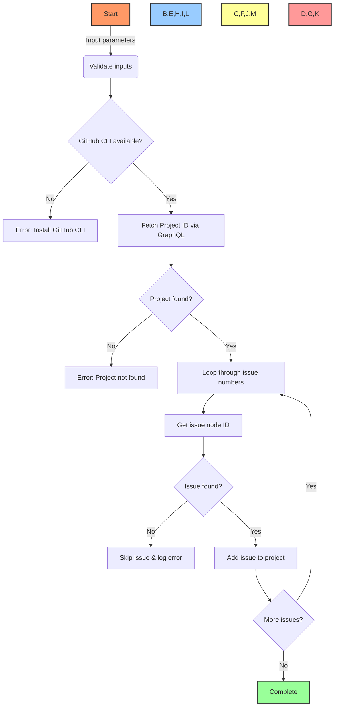

# 🔧 GitHub Project Issue Management Tool

## 🔍 Overview

This tool provides a simple way to add existing GitHub issues to GitHub Projects using the GitHub CLI and GraphQL API. It addresses the gap in MCP GitHub tools by allowing batch association of issues with projects.

## 📋 Table of Contents
- [🔍 Overview](#overview)
- [⚙️ Requirements](#requirements)
- [🚀 Installation](#installation)
- [📘 Usage](#usage)
- [🔄 Workflow](#workflow)
- [📊 Examples](#examples)
- [🔧 Troubleshooting](#troubleshooting)
- [🔄 Future Enhancements](#future-enhancements)

## ⚙️ Requirements

- GitHub CLI (`gh`) installed and authenticated
- PowerShell 5.1+
- Appropriate GitHub permissions to manage projects and issues

## 🚀 Installation

1. Save the script to your development folder
2. Ensure GitHub CLI is installed and authenticated:

```bash
# Check if GitHub CLI is installed
gh --version

# Authenticate if needed
gh auth login
```

## 📘 Usage

Run the script with the following parameters:

```powershell
.\github-project-issue-tool.ps1 -ProjectNumber <number> -OwnerOrg <organization> -RepoName <repository> -IssueNumbers <comma-separated-issue-numbers>
```

### Parameters:

| Parameter | Description | Required |
|-----------|-------------|----------|
| ProjectNumber | The project number (visible in URL) | ✅ |
| OwnerOrg | Organization or username owning the repo | ✅ |
| RepoName | Repository name containing the issues | ✅ |
| IssueNumbers | Comma-separated list of issue numbers | ✅ |

## 🔄 Workflow

The tool follows this workflow to add issues to a project:



## 📊 Examples

### Basic Usage:

```powershell
# Add issues 1, 2, and 3 to project number 1
.\github-project-issue-tool.ps1 -ProjectNumber 1 -OwnerOrg "PowerBridge-ai" -RepoName "BAD" -IssueNumbers 1,2,3
```

### Add Multiple Issues:

```powershell
# Add many issues to the BUILD A DAO : BOOT STRAP 14 project
.\github-project-issue-tool.ps1 -ProjectNumber 14 -OwnerOrg "PowerBridge-ai" -RepoName "BAD" -IssueNumbers 1,2,3,4,5,6,7,8,9,10,11,12
```

## 🔧 Troubleshooting

### Common Errors:

| Error | Solution |
|-------|----------|
| `gh: command not found` | Install GitHub CLI and ensure it's in your PATH |
| `Not authenticated` | Run `gh auth login` to authenticate |
| `Project not found` | Verify the project number and organization |
| `Issue not found` | Confirm issue exists in specified repository |
| `Permission denied` | Check your access rights to the repo and project |

## 🔄 Future Enhancements

Potential improvements for future versions:

- 🛠️ Add support for updating issue statuses within projects
- 🛠️ Create a full CLI tool with more project management capabilities
- 🛠️ Add batch processing from a CSV file
- 🛠️ Implement error recovery for partially completed operations
- 🛠️ Integrate with MCP GitHub tools as a plugin 