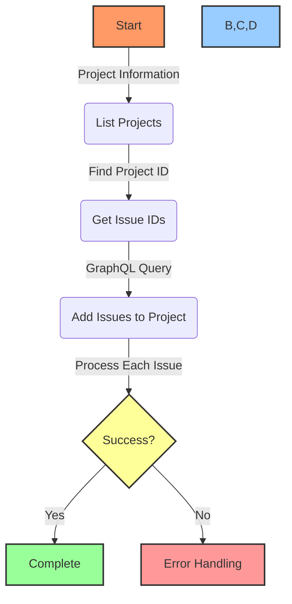
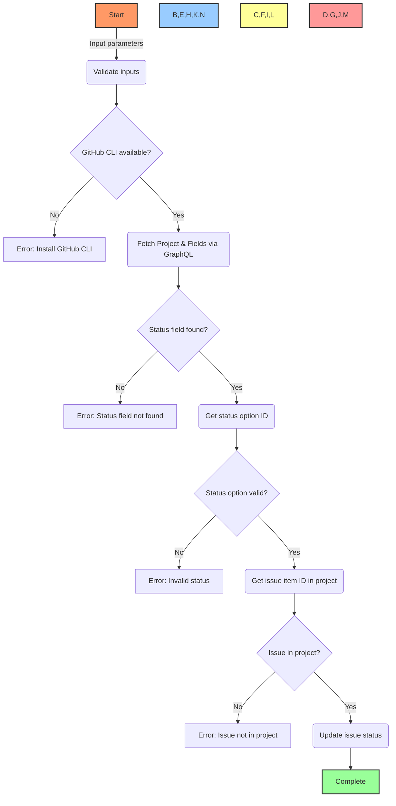

# 🔧 GitHub Project Management Tools

## 🔍 Overview

This toolset provides a simple way to manage GitHub Projects programmatically using the GitHub CLI and GraphQL API. It addresses gaps in the MCP GitHub tools by allowing batch operations and status management for GitHub Projects.

## 📋 Table of Contents
- [🔍 Overview](#overview)
- [🧰 Included Tools](#included-tools)
- [⚙️ Requirements](#requirements)
- [🚀 Installation](#installation)
- [📘 Usage](#usage)
  - [Adding Issues to Projects](#adding-issues-to-projects)
  - [Updating Issue Status](#updating-issue-status)
- [🔄 Workflows](#workflows)
- [📊 Examples](#examples)
- [🔧 Troubleshooting](#troubleshooting)
- [🔄 Future Enhancements](#future-enhancements)

## 🧰 Included Tools

This toolset includes the following scripts:

1. **add-issues-v2.ps1**: Add existing issues to GitHub Projects (v2) using GraphQL API
2. **update-issue-status.ps1**: Update issue status within a GitHub Project
3. **batch-add-issues.ps1**: Example batch script for specific projects

## ⚙️ Requirements

- GitHub CLI (`gh`) installed and authenticated
- PowerShell 5.1+
- Appropriate GitHub permissions to manage projects and issues

## 🚀 Installation

1. Save the scripts to your development folder
2. Ensure GitHub CLI is installed and authenticated:

```bash
# Check if GitHub CLI is installed
gh --version

# Authenticate if needed
gh auth login
```

## 📘 Usage

### Adding Issues to Projects

Use the `add-issues-v2.ps1` script with the following parameters:

```powershell
# Edit these variables in the script
$projectNumber = 13  # Your project number (use gh project list to find it)
$projectId = "PVT_kwHOCIpEY84A3Vlm"  # Your project ID from gh project list
$ownerOrg = "YourOrganization"
$repoName = "YourRepository"
$issueNumbers = @(1, 2, 3, 4, 5)  # Issue numbers to add
```

Then run the script:

```powershell
.\add-issues-v2.ps1
```

#### Finding Project Information:

```powershell
# List available projects
gh project list

# This will display project numbers and IDs
```

### Updating Issue Status

Use `update-issue-status.ps1` to change an issue's status within a project:

```powershell
.\update-issue-status.ps1 -ProjectNumber <number> -OwnerOrg <organization> -RepoName <repository> -IssueNumber <issue-number> -Status <status>
```

#### Parameters:

| Parameter | Description | Required |
|-----------|-------------|----------|
| ProjectNumber | The project number (visible in URL) | ✅ |
| OwnerOrg | Organization or username owning the repo | ✅ |
| RepoName | Repository name containing the issue | ✅ |
| IssueNumber | Single issue number to update | ✅ |
| Status | New status (Todo, In Progress, Done) | ✅ |

## 🔄 Workflows

### Adding Issues to Projects Workflow



### Updating Issue Status Workflow



## 📊 Examples

### Adding Issues to Projects:

```powershell
# Edit and run add-issues-v2.ps1 with your project info
$projectNumber = 13  # From gh project list
$projectId = "PVT_kwHOCIpEY84A3Vlm"  # From gh project list
$ownerOrg = "PowerBridge-ai"
$repoName = "BAD"
$issueNumbers = @(1, 2, 3, 4, 5, 6, 7, 8, 9, 10, 11, 12)

# Run the script
.\add-issues-v2.ps1
```

### Updating Issue Status:

```powershell
# Set issue #1 to "In Progress"
.\update-issue-status.ps1 -ProjectNumber 13 -OwnerOrg "PowerBridge-ai" -RepoName "BAD" -IssueNumber 1 -Status "In Progress"
```

## 🔧 Troubleshooting

### Common Errors:

| Error | Solution |
|-------|----------|
| `gh: command not found` | Install GitHub CLI and ensure it's in your PATH |
| `Not authenticated` | Run `gh auth login` to authenticate |
| `Project not found` | Verify the project number and use `gh project list` to confirm |
| `Could not resolve to an Organization` | Check organization name spelling |
| `Could not resolve to a node` | Ensure project ID is correct |
| `Variable not found` | Check GraphQL query formatting |

### Authentication Issues:

```powershell
# Check your authentication status
gh auth status

# List repositories to confirm access
gh repo list

# List projects to find correct project numbers and IDs
gh project list
```

## 🔄 Future Enhancements

Potential improvements for future versions:

- 🛠️ Combine tools into a single CLI utility with subcommands
- 🛠️ Add batch processing from a CSV file
- 🛠️ Support for retrieving project status and reporting
- 🛠️ Integration with GitHub Actions for workflow automation
- 🛠️ Web UI for managing projects without CLI
- 🛠️ Integrate with MCP GitHub tools as a plugin
- 🛠️ Support for custom fields and project views 