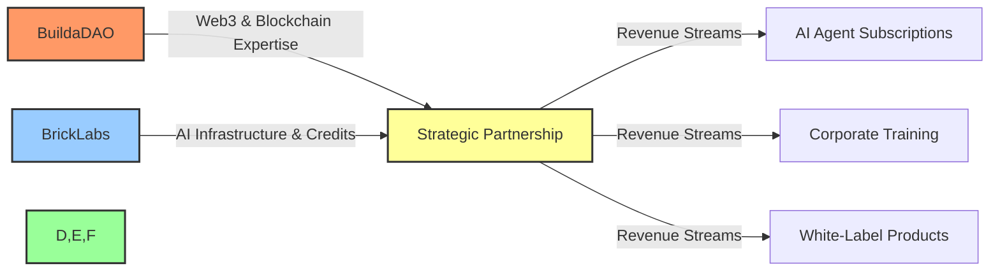
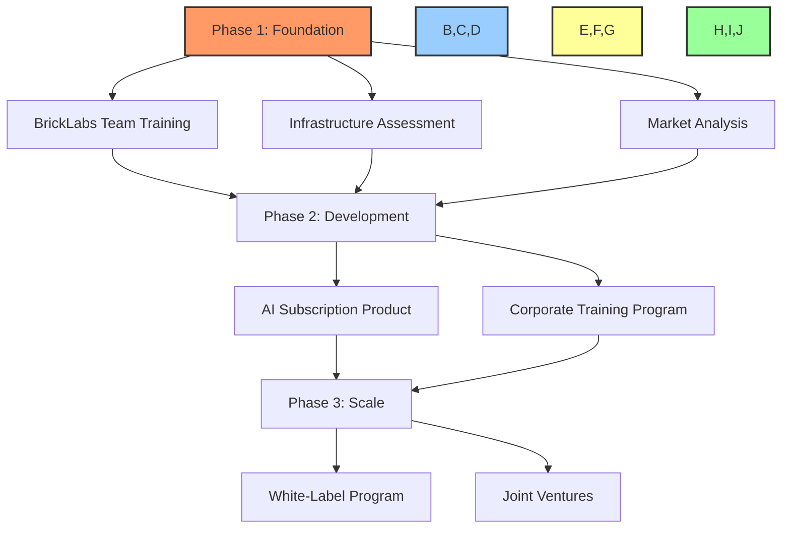

# 🤝 Strategic Partnership: BuildaDAO & BrickLabs

## Table of Contents
- [🔍 Partnership Overview](#partnership-overview)
- [💼 Value Exchange & Opportunity](#value-exchange--opportunity)
- [💰 Revenue Models](#revenue-models)
- [🛠️ Implementation Strategy](#implementation-strategy)
- [⚠️ Risks & Mitigation](#risks--mitigation)
- [📋 Next Steps](#next-steps)
- [📝 Agreement Signatures](#agreement-signatures)

---

## 🔍 Partnership Overview

BuildaDAO proposes a strategic alliance with BrickLabs to accelerate revenue generation and market penetration through complementary expertise, resources, and technologies. This partnership unites BuildaDAO's blockchain/Web3 leadership with BrickLabs' AI infrastructure and corporate connections.

**By signing this overview, you also agree to the attached comprehensive partnership agreement.**

---

## 💼 Value Exchange & Opportunity

### 🏗️ BuildaDAO Brings:
- **Web3 & Blockchain Expertise:** Smart contract development, DAO governance, token economics
- **AI-Blockchain Integration:** Proprietary workflows and systems for AI/blockchain convergence
- **Training & Upskilling:** Premium business transformation methodology (normally $1,000-$5,000 per business)
- **Market Access:** Connections to Web3 communities, investors, and growth partners
- **Product Strategy:** Revenue model optimization and go-to-market strategies

### 🔬 BrickLabs Brings:
- **AI Infrastructure:** Server credits from Microsoft, AWS, and other providers
- **AI Technology:** Modular AI agents and integration capabilities
- **Corporate Relationships:** Microsoft Startup Program and enterprise connections
- **Development Team:** Skilled AI engineers ready for upskilling
- **Market Validation:** Existing traction and minimum viable products

### 🚀 Joint Opportunity:
Develop multiple scalable revenue streams while creating competitive advantages through the fusion of AI and blockchain technologies. This partnership addresses BrickLabs' need for blockchain integration and BuildaDAO's goal of accelerated revenue generation.

---

## 💰 Revenue Models

### 1. 🤖 AI Agent Subscription Service
- Utilize BrickLabs' server credits and AI agents
- BuildaDAO to contribute proprietary workflow systems and blockchain integration
- Joint subscription model with revenue sharing
- Target: $25-75 per user/month with enterprise pricing tiers

### 2. 📚 Corporate AI Training & Upskilling
- BrickLabs team training at discounted rate ($500/participant vs. normal $1,000-5,000)
- Joint development of corporate training program
- White-label under BrickLabs for B2B sales
- Target: $2,500-10,000 per corporate client

### 3. 🏭 White-Label Products & Joint Ventures
- Co-develop blockchain-enabled AI products
- Leverage BuildaDAO's smart contract platform for automated payments and governance
- Create new revenue streams through licensing and customization
- Target: $10,000-50,000 per enterprise implementation

---

## 🛠️ Implementation Strategy

### 📅 Phase 1: Foundation (Weeks 1-4)
- BrickLabs team training (2-week program at $500/participant)
- Infrastructure assessment and integration planning
- Market analysis and product specification

### 📅 Phase 2: Development (Weeks 5-12)
- Build and launch AI subscription product
- Develop corporate training program
- Initial sales and marketing push

### 📅 Phase 3: Scale (Months 4-12)
- Expand product offerings
- Develop white-label program
- Explore joint ventures

---

## ⚠️ Risks & Mitigation

| Risk | Mitigation |
|------|------------|
| **IP Protection Concerns** | Clear delineation of proprietary IP in agreement; licensing for specific use cases only |
| **Revenue Sharing Disputes** | Smart contract-based revenue distribution with transparent metrics |
| **Market Adoption Challenges** | Phased approach with clear KPIs; pivot capability built into agreement |
| **Scale Limitations** | Infrastructure scaling plan with predefined investment thresholds |
| **Team Alignment Issues** | Regular strategic alignment meetings; clear decision-making framework |

---

## 📋 Next Steps

1. **Review & Sign:** Sign this overview document and attached partnership agreement
2. **Kickoff Meeting:** Schedule 2-hour strategic planning session
3. **Begin Training:** Start BrickLabs team training within 14 days
4. **Technical Assessment:** Complete technical integration assessment
5. **Launch Plan:** Finalize Phase 1 timeline and deliverables

---

## 📝 Agreement Signatures

By signing below, both parties agree to this strategic partnership overview and the attached comprehensive partnership agreement:

**BuildaDAO Representative:**

Name: _________________________ Title: _________________________

Signature: ______________________ Date: _________________________

**BrickLabs Representative:**

Name: _________________________ Title: _________________________

Signature: ______________________ Date: _________________________

---

*For questions or to schedule the kickoff meeting, please contact:*

Fabian Owuor, BuildaDAO | +254 721 948852 | fabian@buildadao.xyz

[Back to Top](#strategic-partnership-buildadao--bricklabs)