# 📝 Build a DAO – 2-Pager Pitch Deck

## Table of Contents
- [🔍 Executive Summary](#executive-summary)
- [🚨 Problem & Solution](#problem--solution)
- [🏗️ Product Overview](#product-overview)
- [💸 Business & Revenue Model](#business--revenue-model)
- [📈 Roadmap & Traction](#roadmap--traction)
- [🤖 Team & AI Advantage](#team--ai-advantage)
- [📞 Call to Action](#call-to-action)
- [📊 Projections & Revenue Scaling](#projections--revenue-scaling)

---

## 🔍 Executive Summary
Build a DAO (BAD) is the first AI-powered, no-code platform for launching and managing decentralized autonomous organizations (DAOs). BAD automates treasury, governance, and project management—enabling any organization to scale transparently, efficiently, and securely. Our platform empowers teams to deploy smart contracts, manage funds, and automate decision-making with embedded AI, all from a user-friendly UI.

---

## 🚨 Problem & Solution
### ❌ Problem
- Launching and managing a DAO is complex, expensive, and requires deep technical expertise
- No unified platform for treasury, governance, vesting, and project management
- Lack of automation and transparency in fund allocation and contributor rewards

### 💡 Solution
- **AI-powered smart contract engine:** No coding required
- **All-in-one UI:** Manage treasury, governance, vesting, and projects in one place
- **Automated payouts & validation:** AI and smart contracts handle compliance, voting, and payments

---

## 🏗️ Product Overview
- **Smart Contract Builder:** AI-guided, no-code deployment
- **Governance & Voting:** On-chain/off-chain proposals, automated execution
- **Treasury Management:** Automated, rule-based fund flows
- **Project & Task Management:** Roadmaps, milestones, contributor validation
- **Bounty & Incubator Marketplace:** Post tasks, fund projects, onboard contributors
- **Premium Support:** Concierge onboarding, AI consultancy, and compliance

```mermaid
graph TD
    A[🧑‍💼 Org/Team] --> B[🤖 AI-Powered UI]
    B --> C[🔗 Smart Contract Engine]
    C --> D[💰 Treasury]
    C --> E[🗳️ Governance]
    C --> F[⏳ Vesting]
    B --> G[📋 Project Management]
    G --> H[🎯 Bounty Marketplace]
    B --> I[🧠 AI Assistant]
    
    style A fill:#f96,stroke:#333,stroke-width:2px
    style B,G,I fill:#9cf,stroke:#333,stroke-width:2px
    style C,D,E,F,H fill:#9f9,stroke:#333,stroke-width:2px
```

---

## 💸 Business & Revenue Model
- **Freemium:** Free to launch, 3–5% fee on funds moved through smart contracts
- **Premium Subscription:** $2,500–$5,000/month for high-volume orgs (>$50k/mo), eliminates most fees, includes premium support
- **Incubator/Project Management Fee:** 10–40% of project funds, based on platform involvement
- **Bounty Marketplace:** Platform takes a % of each payout
- **Hackathon/Event Hosting:** Fees for hosting, sponsorships, and partnerships

---

## 📊 Projections & Revenue Scaling

**Assumptions:**
- Freemium users pay a 3–5% fee on all funds moved through smart contracts (example uses 4%)
- Premium users pay a flat $3,500/month (average) and no % fee
- Scenarios: 100, 1,000, and 10,000 users, each moving $1,000, $10,000, and $100,000 per user, respectively, per month

| 👥 Users | 💰 Avg. Funds/User | 🏦 Total Funds Managed | 🆓 Freemium Revenue (4%) | 💎 Premium Revenue (flat) |
|----------|-------------------|-----------------------|-------------------------|--------------------------|
| 100      | $1,000            | $100,000              | $4,000/mo               | $3,500/mo                |
| 1,000    | $10,000           | $10,000,000           | $400,000/mo             | $35,000/mo               |
| 10,000   | $100,000          | $1,000,000,000        | $40,000,000/mo          | $350,000/mo              |

- **Freemium:** Revenue scales directly with transaction volume
- **Premium:** Revenue scales with number of high-volume orgs, not transaction size
- **Hybrid:** As users upgrade to premium, % fee revenue decreases, but flat fee revenue increases

> 🚀 *With just 1,000 users moving $10,000/month each, BAD generates $400,000/month in freemium fees or $35,000/month if all are premium.*

---

## 📈 Roadmap & Traction
- **Phase 1:** Deploy core smart contract, launch AI-managed governance, UI live (0–3mo)
- **Phase 2:** Vesting, delegation, advanced governance, premium launch, project/task management (3–6mo)
- **Phase 3:** Bounty marketplace, incubator, hackathons, AI-driven validation, ecosystem expansion (6–12mo)
- **Traction:**
  - Core smart contract MVP complete
  - UI prototype in testing
  - Early adopter pipeline: DAOs, Web3 orgs, incubators

---

## 🤖 Team & AI Advantage
- **AI-First:** Platform, smart contract, and governance all managed and enhanced by AI
- **Founders:** Deep expertise in blockchain, AI, and organizational automation
- **Advisors:** Web3, compliance, and enterprise SaaS leaders
- **AI Edge:** Embedded LLMs for contract logic, governance, and project automation—no other platform offers this level of automation and intelligence

---

## 📞 Call to Action
- **Join us as a partner, investor, or early adopter!**
- Contact: [hello@buildadao.io/](mailto:hello@buildadao.io/)
- Learn more: [https://www.buildadao.io/](https://www.buildadao.io/)

[Back to Top](#build-a-dao--2-pager-pitch-deck) 