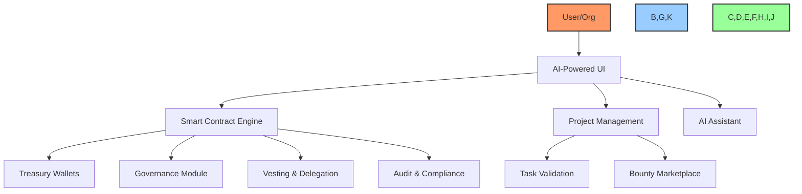
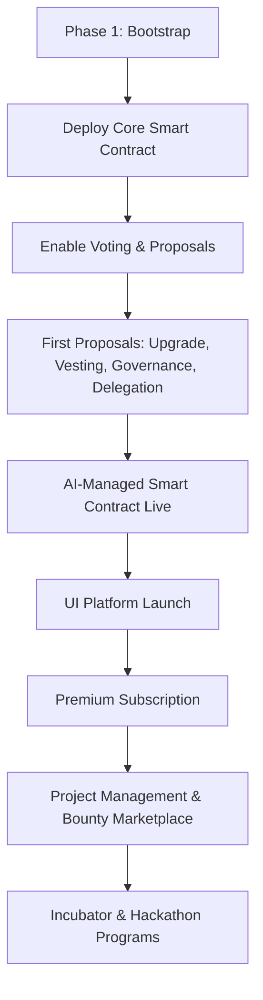

# 📝 Build a DAO Business Plan

"Building the Future, Together—with AI"

## Table of Contents
- [🔍 Executive Summary](#executive-summary)
- [🎯 Vision & Mission](#vision--mission)
- [🏗️ Core Products & Services](#core-products--services)
- [🧩 Platform Architecture](#platform-architecture)
- [💸 Revenue Model](#revenue-model)
- [📈 Roadmap & Phases](#roadmap--phases)
- [⚙️ Technology Stack](#technology-stack)
- [📊 KPIs & Success Metrics](#kpis--success-metrics)
- [🚨 Risk Analysis](#risk-analysis)
- [🔚 Conclusion](#conclusion)

---

## 🔍 Executive Summary
Build a DAO (BAD) is an AI-powered, smart contract-driven platform designed to automate and democratize organizational finance, governance, and project management. BAD enables any organization to:
- Seamlessly deploy a sophisticated DAO smart contract (no coding required)
- Automate treasury, payments, vesting, governance, and delegation
- Manage all DAO operations through a user-friendly, AI-assisted UI
- Fund, manage, and scale projects, hackathons, and incubators with full transparency

Our platform solves the critical gap of accessible, no-code DAO management—empowering organizations to focus on impact, not infrastructure.

---

## 🎯 Vision & Mission

### 🌍 Vision
Empower organizations globally to manage, govern, and grow their communities and treasuries with AI-driven, transparent, and automated smart contracts.

### 🚀 Mission
Deliver the world's most accessible, secure, and intelligent DAO platform—enabling any team to:
- Launch a DAO in minutes
- Automate all financial and governance operations
- Leverage AI for decision-making, compliance, and project management

---

## 🏗️ Core Products & Services

### 1. 🧠 AI-Managed DAO Smart Contract
- **Automated Treasury:** Receive, manage, and disburse funds with programmable rules
- **Governance & Voting:** On-chain and off-chain proposal creation, voting, and execution
- **Vesting & Delegation:** Multi-level vesting, role-based permissions, and delegation
- **Charter & Board Management:** Define and enforce organizational structure
- **Audit & Compliance:** Automated, transparent record-keeping and validation

### 2. 🖥️ No-Code UI Platform
- **Smart Contract Builder:** AI-guided contract creation and deployment
- **Member & Role Management:** Add/remove users, assign roles, manage permissions
- **Proposal & Voting Dashboard:** Create, archive, and manage proposals
- **Treasury & Wallet Management:** Track, allocate, and audit funds
- **Project & Task Management:** Roadmap, milestones, and contributor validation
- **AI Assistant:** Embedded AI for contract logic, governance, and project automation

### 3. 🏆 Hackathons, Incubators & Bounties
- **Incubator & Hackathon Management:** Fund and manage projects via the platform
- **Bounty Marketplace:** Organizations can post tasks; contributors earn stablecoins
- **Team Formation:** Find and onboard contributors for funded projects
- **Automated Payouts:** Smart contract validates and pays out upon task completion

---

## 🧩 Platform Architecture

---

## 💸 Revenue Model

### 1. 🆓 Freemium Platform
- **Free:** Deploy and use BAD smart contract and UI with a transaction fee (3-5%) on all funds moving in/out of the smart contract
- **Premium Subscription:**
  - For organizations moving >$50,000/month
  - Flat monthly fee (starting at $2,500–$5,000)
  - Includes premium support, concierge onboarding, and AI consultancy hours
  - Reduces or eliminates transaction fees

### 2. 🏦 Project Management & Incubator Fees
- **Incubator/Project Management Fee:** 10–40% of project funds, based on level of platform involvement (team sourcing, management, funding, etc.)
- **Bounty/Task Marketplace:** Platform takes a percentage of each bounty payout

### 3. 🏆 Hackathon Hosting
- **Event Fees:** Organizations pay to host hackathons/incubators on the platform
- **Sponsorships & Partnerships:** Additional revenue from ecosystem partners

---

## 📈 Roadmap & Phases

### 📅 Phase Breakdown
- **Phase 1 (0–3 months):**
  - Deploy MVP smart contract (treasury, voting, proposals)
  - Begin AI-managed governance
  - Launch UI for core DAO management
- **Phase 2 (3–6 months):**
  - Implement vesting, delegation, advanced governance
  - Launch premium subscription
  - Integrate project/task management
- **Phase 3 (6–12 months):**
  - Activate bounty marketplace, incubator, and hackathon programs
  - Enable AI-driven project validation and automated payouts
  - Expand integrations and ecosystem partnerships

---

## ⚙️ Technology Stack
- **Smart Contracts:** Solidity (Ethereum, EVM chains)
- **AI/Automation:** Embedded LLMs, custom agents
- **Frontend/UI:** React, Next.js
- **Backend:** Node.js, TypeScript
- **Payments:** USDC, USDT (stablecoins), ETH, fiat gateways
- **Governance:** On-chain & off-chain (Snapshot, Gnosis Safe)
- **Security:** Audits, automated compliance, escrow/milestone payments

---

## 📊 KPIs & Success Metrics
- Number of DAOs launched
- Total funds managed via platform
- Number of active organizations
- Transaction volume (monthly/annual)
- Number of proposals/votes processed
- Bounties completed and paid out
- Hackathons/incubators hosted
- Client satisfaction rate (target: 90%+)

---

## 🚨 Risk Analysis
| Risk | Mitigation |
|------|------------|
| Smart contract bugs | Rigorous audits, bug bounties, staged rollouts |
| Low initial traction | Aggressive outreach, partnerships, founder-led marketing |
| Payment issues | Escrow/milestone-based releases, stablecoin settlements |
| Skill mismatch | AI onboarding, contributor vetting, internal training |
| Regulatory uncertainty | Legal review, compliance modules, KYC/AML for large orgs |

---

## 🔚 Conclusion
Build a DAO is the next-generation, AI-powered platform for organizational automation, governance, and project management. By combining smart contracts, AI, and a no-code UI, BAD empowers any organization to scale transparently, efficiently, and securely—unlocking the full potential of decentralized operations.

[Back to Top](#build-a-dao-business-plan)