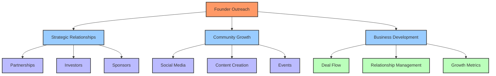
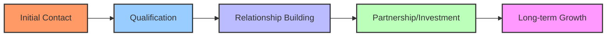
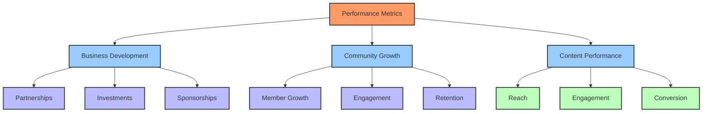

# 🚀 Founder Outreach Guide: Build A DAO

> A comprehensive framework for strategic outreach, community engagement, and relationship building in the Web3 ecosystem.

## 📋 Table of Contents

- [🔍 Introduction](#-introduction)
- [🎯 Strategic Outreach Framework](#-strategic-outreach-framework)
  - [👥 Audience Segmentation](#-audience-segmentation)
  - [📊 Engagement Tiers](#-engagement-tiers)
- [💼 Business Development Workflow](#-business-development-workflow)
  - [🤝 Partnership Development](#-partnership-development)
  - [💰 Investment Relations](#-investment-relations)
  - [🎯 Sponsorship Strategy](#-sponsorship-strategy)
- [🌐 Community Engagement System](#-community-engagement-system)
  - [📱 Social Media Strategy](#-social-media-strategy)
  - [📢 Content Distribution](#-content-distribution)
  - [🎮 Interactive Engagement](#-interactive-engagement)
- [📈 Performance Tracking](#-performance-tracking)
  - [📊 KPI Framework](#-kpi-framework)
  - [📈 Analytics Dashboard](#-analytics-dashboard)
- [🔄 Communication Templates](#-communication-templates)
  - [📧 Email Templates](#-email-templates)
  - [💬 Social Media Templates](#-social-media-templates)
  - [🤝 Meeting Scripts](#-meeting-scripts)
- [⚡ Quick Start Guide](#-quick-start-guide)

## 🔍 Introduction [⬆️](#-table-of-contents)

This guide provides a structured approach to outreach and relationship building for Build A DAO's founder. It combines proven methodologies with Web3-specific strategies to maximize engagement, partnerships, and growth opportunities.

### 🎯 Core Objectives

1. **Build Strategic Relationships**
   - Develop partnerships with key Web3 projects
   - Cultivate investor relationships
   - Establish sponsor connections

2. **Grow Community Engagement**
   - Increase active community participation
   - Foster meaningful interactions
   - Build brand loyalty

3. **Drive Sustainable Growth**
   - Secure strategic partnerships
   - Attract investment opportunities
   - Develop sponsorship relationships



## 🎯 Strategic Outreach Framework [⬆️](#-table-of-contents)

### 👥 Audience Segmentation [⬆️](#-table-of-contents)

#### 1. Business Partners
- **Type**: Web3 Projects, DAOs, Traditional Companies
- **Engagement Level**: High-touch, strategic
- **Communication Channel**: Direct meetings, email, calls

#### 2. Investors
- **Type**: VCs, Angel Investors, DAO Treasuries
- **Engagement Level**: Professional, data-driven
- **Communication Channel**: Formal presentations, reports

#### 3. Sponsors
- **Type**: Web3 Companies, Tech Firms, Community Projects
- **Engagement Level**: Value-focused, ROI-driven
- **Communication Channel**: Proposals, metrics reports

#### 4. Community Members
- **Type**: Developers, Users, Enthusiasts
- **Engagement Level**: Regular, value-adding
- **Communication Channel**: Social media, community platforms

### 📊 Engagement Tiers [⬆️](#-table-of-contents)



## 💼 Business Development Workflow [⬆️](#-table-of-contents)

### 🤝 Partnership Development [⬆️](#-table-of-contents)

#### 1. Initial Outreach
- Research potential partner
- Prepare personalized pitch
- Schedule initial meeting

#### 2. Qualification Process
- Assess strategic fit
- Evaluate technical compatibility
- Review financial implications

#### 3. Partnership Formation
- Define collaboration scope
- Establish mutual goals
- Create implementation timeline

### 💰 Investment Relations [⬆️](#-table-of-contents)

#### 1. Investor Identification
- Research investment criteria
- Analyze portfolio fit
- Prepare pitch materials

#### 2. Due Diligence Process
- Prepare financial documentation
- Technical documentation
- Legal compliance materials

#### 3. Investment Closing
- Negotiate terms
- Prepare legal documents
- Execute agreement

### 🎯 Sponsorship Strategy [⬆️](#-table-of-contents)

#### 1. Sponsorship Package Development
- Define sponsorship tiers
- Create value proposition
- Prepare marketing materials

#### 2. Sponsor Acquisition
- Identify potential sponsors
- Customize proposals
- Follow up process

#### 3. Sponsor Management
- Regular reporting
- Value delivery tracking
- Relationship maintenance

## 🌐 Community Engagement System [⬆️](#-table-of-contents)

### 📱 Social Media Strategy [⬆️](#-table-of-contents)

#### 1. Platform Selection
- Twitter: News and updates
- Discord: Community engagement
- LinkedIn: Professional network
- Telegram: Quick updates

#### 2. Content Calendar
- Daily updates
- Weekly deep dives
- Monthly newsletters
- Quarterly reports

### 📢 Content Distribution [⬆️](#-table-of-contents)

#### 1. Content Types
- Technical updates
- Community highlights
- Partnership announcements
- Educational content

#### 2. Distribution Channels
- Social media platforms
- Community forums
- Email newsletters
- Blog posts

### 🎮 Interactive Engagement [⬆️](#-table-of-contents)

#### 1. Community Events
- AMAs
- Workshops
- Hackathons
- Meetups

#### 2. Engagement Activities
- Polls and surveys
- Community challenges
- Reward programs
- Feedback sessions

## 📈 Performance Tracking [⬆️](#-table-of-contents)

### 📊 KPI Framework [⬆️](#-table-of-contents)

#### 1. Business Development Metrics
- Partnership conversion rate
- Investment secured
- Sponsorship revenue
- Deal pipeline value

#### 2. Community Metrics
- Active community members
- Engagement rates
- Content performance
- Event participation

### 📈 Analytics Dashboard [⬆️](#-table-of-contents)



## 🔄 Communication Templates [⬆️](#-table-of-contents)

### 📧 Email Templates [⬆️](#-table-of-contents)

#### 1. Initial Outreach
```markdown
Subject: [Build A DAO] Exploring Partnership Opportunities

Dear [Name],

I'm reaching out because [specific reason for connection]. Build A DAO is [brief value proposition].

Would you be open to a brief call to explore potential synergies?

Best regards,
[Your Name]
```

#### 2. Follow-up Template
```markdown
Subject: [Build A DAO] Following up on our discussion

Hi [Name],

I wanted to follow up on our conversation about [topic]. [Specific next steps or value add].

Looking forward to your thoughts.

Best regards,
[Your Name]
```

### 💬 Social Media Templates [⬆️](#-table-of-contents)

#### 1. Partnership Announcement
```markdown
🚀 Exciting News! Build A DAO is partnering with [Partner] to [specific goal/outcome].

This collaboration will [benefits/value].

Learn more: [link]
```

#### 2. Community Update
```markdown
📢 Community Update: [Update Title]

[Key points]

[Call to action]

Join the discussion: [link]
```

### 🤝 Meeting Scripts [⬆️](#-table-of-contents)

#### 1. Initial Partnership Meeting
1. Introduction (2-3 minutes)
2. Build A DAO Overview (5-7 minutes)
3. Potential Collaboration Areas (10-15 minutes)
4. Next Steps (5 minutes)

#### 2. Investor Pitch
1. Problem Statement (3-5 minutes)
2. Solution Overview (5-7 minutes)
3. Market Opportunity (5-7 minutes)
4. Team & Technology (5 minutes)
5. Financial Projections (5 minutes)
6. Investment Ask (3-5 minutes)

## ⚡ Quick Start Guide [⬆️](#-table-of-contents)

### Day 1-7: Setup & Planning
1. Review and customize templates
2. Set up tracking systems
3. Identify initial targets
4. Prepare outreach materials

### Week 2-3: Initial Outreach
1. Begin partner outreach
2. Start investor conversations
3. Launch community engagement
4. Schedule initial meetings

### Month 2: Relationship Building
1. Follow up on initial contacts
2. Develop deeper relationships
3. Begin partnership discussions
4. Expand community activities

### Month 3+: Growth & Optimization
1. Close initial partnerships
2. Secure first investments
3. Scale community engagement
4. Optimize based on metrics

---

Made with Power, Love, and AI • ⚡️❤️🤖 • POWERBRIDGE.AI 