# 🚀 Leadership & Operational Excellence Guide

> A comprehensive framework for organizational leaders to drive sustainable excellence, enhanced performance, and strategic alignment.

## 📋 Table of Contents

- [🔍 Introduction](#-introduction)
- [🎯 Strategic Vision & Goal Setting](#-strategic-vision--goal-setting)
  - [📊 SMART Criteria Framework](#-smart-criteria-framework)
  - [🧭 Destination Mapping Methodology](#-destination-mapping-methodology)
- [⚙️ Operational Workflow & Task Management](#-operational-workflow--task-management)
  - [📑 Hierarchical Task Structuring](#-hierarchical-task-structuring)
  - [🔄 Daily Operational Cadence](#-daily-operational-cadence)
- [🌐 Decentralized Leadership Models](#-decentralized-leadership-models)
  - [👥 Embracing Shared Governance](#-embracing-shared-governance)
  - [🎮 Executive Role in Distributed Systems](#-executive-role-in-distributed-systems)
- [💰 Resource Allocation & Financial Alignment](#-resource-allocation--financial-alignment)
  - [📈 Financial Goal Integration](#-financial-goal-integration)
  - [💼 Strategic Budgeting Frameworks](#-strategic-budgeting-frameworks)
- [🗣️ Communication & Meeting Excellence](#-communication--meeting-excellence)
  - [📝 Structured Meeting Protocols](#-structured-meeting-protocols)
  - [📱 Communication Channel Strategy](#-communication-channel-strategy)
- [🔄 Continuous Improvement Systems](#-continuous-improvement-systems)
  - [📊 Iterative Review Methodology](#-iterative-review-methodology)
  - [🧠 Leadership Development Pipeline](#-leadership-development-pipeline)
- [🤝 Ethical Leadership & Cultural Development](#-ethical-leadership--cultural-development)
  - [⚖️ Ethical Standards Framework](#-ethical-standards-framework)
  - [🌱 Positive Culture Cultivation](#-positive-culture-cultivation)
- [📏 Performance Metrics & Accountability](#-performance-metrics--accountability)
  - [📊 Key Performance Indicators](#-key-performance-indicators)
  - [👤 Accountability Structures](#-accountability-structures)
- [⚠️ Risk Management & Contingency Planning](#-risk-management--contingency-planning)
  - [🔍 Risk Assessment Methodology](#-risk-assessment-methodology)
  - [🛡️ Contingency Framework](#-contingency-framework)
- [💡 Technology Integration & Innovation](#-technology-integration--innovation)
  - [🤖 AI and Automation Strategy](#-ai-and-automation-strategy)
  - [✨ Innovation Culture Development](#-innovation-culture-development)
- [🚀 Implementation Roadmap](#-implementation-roadmap)

## 🔍 Introduction [⬆️](#-table-of-contents)

Operational excellence is a management philosophy focused on consistently and reliably outperforming the competition through constant improvement and dedication to customer value. This guide serves as a foundational document for training and empowering your organization's leadership, integrating proven methodologies with established best practices to ensure a cohesive and effective leadership approach.

When two companies share the same strategy, the operationally excellent organization will achieve higher revenues, lower costs, and reduced risk. This level of execution requires outstanding leadership and a culture that supports problem-solving, transparency, and continuous improvement.

## 🎯 Strategic Vision & Goal Setting [⬆️](#-table-of-contents)

### 📊 SMART Criteria Framework [⬆️](#-table-of-contents)

Ensure all organizational goals follow the SMART criteria to drive clarity and accountability:

| Component | Description | Implementation Strategy |
|-----------|-------------|-------------------------|
| **S**pecific | Clearly define the objective with no ambiguity | Detail exactly what is to be accomplished with who, what, where, when, and why |
| **M**easurable | Quantify progress indicators | Establish concrete metrics to track progress and determine success |
| **A**chievable | Set realistic targets given resources | Balance ambition with practicality based on available resources |
| **R**elevant | Align with organizational mission | Ensure goals contribute directly to organizational purposes and values |
| **T**ime-bound | Set deadlines for accountability | Create specific timeframes with milestone dates |

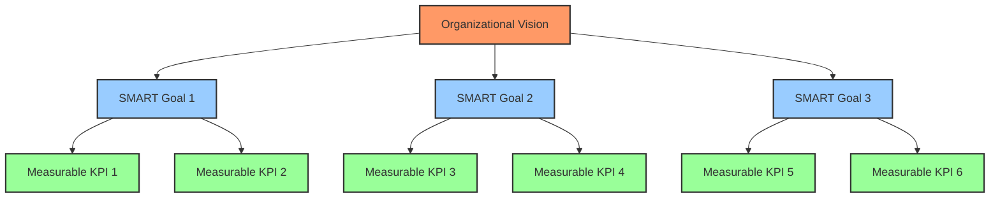

### 🧭 Destination Mapping Methodology [⬆️](#-table-of-contents)

Utilize the analogy of planning a journey to conceptualize goal setting:

1. **🏁 Destination**: Define the end goal with crystal clarity
   - What does success look like in tangible terms?
   - How will we know when we've arrived?
   
2. **🗺️ Route**: Outline the steps to reach the goal
   - What are the major milestones along the way?
   - What sequential actions must be taken?
   
3. **🚗 Vehicle**: Determine the resources and tools needed
   - What technologies will enable success?
   - What human resources are required?
   - What capabilities must be developed or acquired?
   
4. **⛽ Fuel**: Assess the energy, time, and capital required
   - What budget is necessary for completion?
   - What is the time investment from key stakeholders?
   - How will we maintain momentum throughout?

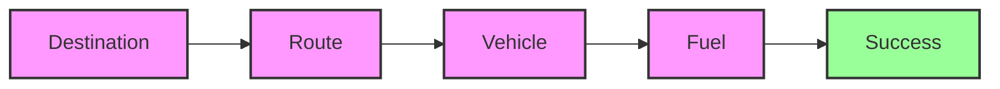

## ⚙️ Operational Workflow & Task Management [⬆️](#-table-of-contents)

### 📑 Hierarchical Task Structuring [⬆️](#-table-of-contents)

Implement a nested hierarchy of work components to ensure alignment from strategic vision to daily tasks:

1. **🎯 Objectives**: Broad goals aligned with strategic vision
   - Define 3-5 key objectives that directly support organizational strategy
   - Each objective should be measurable at the highest level
   
2. **📋 Tasks**: Specific actions to achieve objectives
   - Break each objective into 3-7 concrete tasks
   - Each task should have a clear owner and deadline
   
3. **📝 Subtasks**: Detailed steps within tasks
   - Divide complex tasks into manageable subtasks
   - Sequence subtasks to optimize workflow and dependencies
   
4. **✅ Checklists**: Itemized actions to ensure task completion
   - Create standardized checklists for recurring processes
   - Include quality assurance steps within checklists

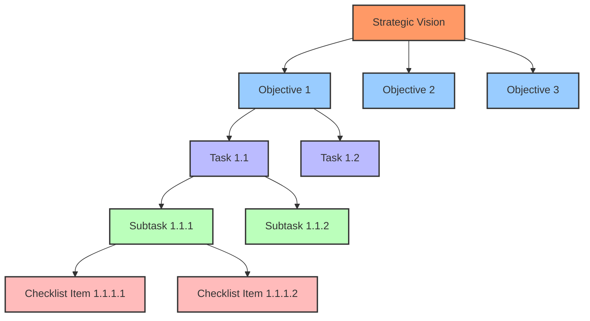

### 🔄 Daily Operational Cadence [⬆️](#-table-of-contents)

Encourage leaders to establish a consistent reflection practice using these six diagnostic questions:

1. **⏪ What was accomplished yesterday?**
   - Review completed tasks and milestones
   - Acknowledge progress and wins
   
2. **⏯️ What is the focus today?**
   - Identify 1-3 critical priorities
   - Allocate resources to these priorities
   
3. **⏩ What are the plans for tomorrow?**
   - Anticipate upcoming work and deliverables
   - Prepare necessary resources
   
4. **📍 Where do we currently stand?**
   - Assess current status against goals
   - Identify gaps requiring attention
   
5. **🔙 Where have we been?**
   - Recognize the journey and lessons learned
   - Apply insights from past experiences
   
6. **🔜 Where are we heading?**
   - Reaffirm long-term direction
   - Ensure daily actions align with strategic goals

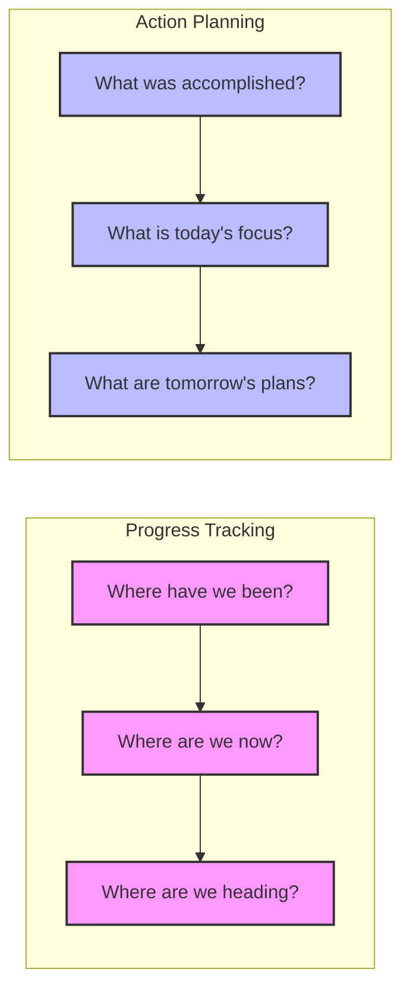

## 🌐 Decentralized Leadership Models [⬆️](#-table-of-contents)

### 👥 Embracing Shared Governance [⬆️](#-table-of-contents)

In today's increasingly autonomous organizational structures, leaders must:

1. **🔄 Foster a culture of shared governance**
   - Create decision-making frameworks that push authority to appropriate levels
   - Establish clear boundaries for decisions at different organizational levels
   
2. **📜 Utilize smart contracts for transparency and automation**
   - Implement systems that automate accountability
   - Create transparent agreement structures between teams and departments
   
3. **🤝 Encourage community participation in decision processes**
   - Design inclusive feedback mechanisms
   - Create formal channels for input from all organizational levels

### 🎮 Executive Role in Distributed Systems [⬆️](#-table-of-contents)

The modern executive must adapt to distributed leadership models by:

1. **🧩 Acting as a facilitator rather than a traditional top-down leader**
   - Focus on creating conditions for team success rather than directing every action
   - Develop coaching capabilities to guide rather than control
   
2. **🔗 Ensuring alignment of decentralized activities with organizational goals**
   - Create transparent connection points between local initiatives and global strategy
   - Implement regular alignment review mechanisms
   
3. **🔍 Monitoring and guiding distributed governance mechanisms**
   - Establish metrics for evaluating the effectiveness of shared governance
   - Create feedback loops to continuously improve governance systems

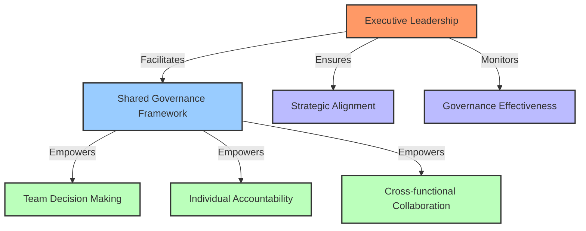

## 💰 Resource Allocation & Financial Alignment [⬆️](#-table-of-contents)

### 📈 Financial Goal Integration [⬆️](#-table-of-contents)

Connect operational activities directly to financial outcomes:

1. **🎯 Set clear financial targets for sustainability**
   - Establish specific revenue, profit, and cash flow targets (e.g., $25,000 monthly revenue)
   - Create visibility into the key financial metrics that drive organizational health
   
2. **⚖️ Evaluate projects based on financial contribution**
   - Develop ROI criteria for project approval
   - Implement regular financial impact assessments for ongoing initiatives
   - Create a standardized financial evaluation framework for new opportunities

### 💼 Strategic Budgeting Frameworks [⬆️](#-table-of-contents)

Ensure resources align with strategic priorities:

1. **🏆 Allocate resources strategically to achieve key milestones**
   - Prioritize budget allocation based on strategic importance
   - Create contingency funds for high-priority initiatives
   
2. **📊 Regularly review financial performance against benchmarks**
   - Implement monthly financial review cadence
   - Develop variance analysis protocols
   - Create corrective action mechanisms for significant variances

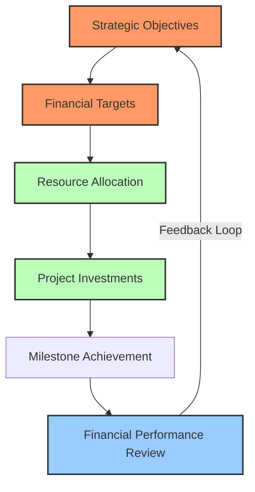

## 🗣️ Communication & Meeting Excellence [⬆️](#-table-of-contents)

### 📝 Structured Meeting Protocols [⬆️](#-table-of-contents)

Maximize meeting productivity and effectiveness:

1. **📋 Define clear agendas for each meeting type**
   - Create standard agenda templates for recurring meetings
   - Establish timing for each agenda item
   - Distribute agendas in advance
   
2. **👥 Assign specific roles for meeting efficiency**
   - Facilitator: Guides discussion and maintains focus
   - Note-taker: Documents decisions and action items
   - Timekeeper: Ensures agenda items stay within allocated time
   
3. **⏱️ Set time constraints to maintain focus**
   - Implement timeboxing for discussion topics
   - Create decision-making frameworks for when consensus isn't reached
   - Establish protocols for taking discussions "offline"

### 📱 Communication Channel Strategy [⬆️](#-table-of-contents)

Optimize organizational communication:

1. **🔧 Establish standardized communication platforms**
   - Define appropriate channels for different communication types
   - Create templates for common communication scenarios
   - Implement tools that enhance communication efficiency (e.g., Slack, email templates)
   
2. **🔄 Encourage transparent information sharing**
   - Create information repositories accessible to appropriate stakeholders
   - Develop communication cadences for regular updates
   - Establish norms for proactive information sharing

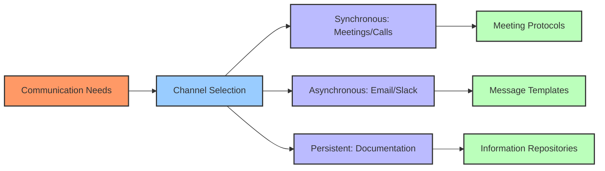

## 🔄 Continuous Improvement Systems [⬆️](#-table-of-contents)

### 📊 Iterative Review Methodology [⬆️](#-table-of-contents)

Create systems for ongoing enhancement:

1. **🔍 Regularly assess workflows and outcomes**
   - Implement review cadences for key processes
   - Develop metrics for process effectiveness
   - Create visualization tools for process performance
   
2. **👂 Encourage feedback from all organizational levels**
   - Establish anonymous feedback mechanisms
   - Create facilitated feedback sessions
   - Implement suggestion systems with clear follow-up protocols
   
3. **🔄 Adapt strategies based on data and feedback**
   - Develop decision frameworks for process adjustment
   - Create experimentation protocols for testing improvements
   - Implement learning documentation systems

### 🧠 Leadership Development Pipeline [⬆️](#-table-of-contents)

Build organizational capability through leadership growth:

1. **📚 Provide ongoing training opportunities**
   - Create individualized development plans
   - Establish learning resource libraries
   - Implement mentorship programs
   
2. **🔭 Encourage industry and trend awareness**
   - Support conference participation
   - Create knowledge-sharing mechanisms
   - Establish industry research responsibilities

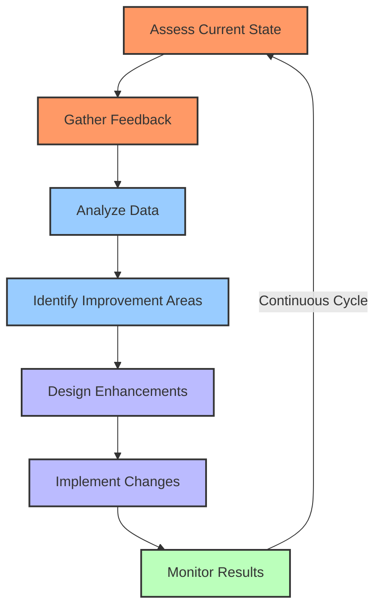

## 🤝 Ethical Leadership & Cultural Development [⬆️](#-table-of-contents)

### ⚖️ Ethical Standards Framework [⬆️](#-table-of-contents)

Establish and maintain ethical leadership practices:

1. **🦸 Lead by example in integrity and accountability**
   - Demonstrate transparent decision-making
   - Take responsibility for both successes and failures
   - Create clear consequences for ethical breaches
   
2. **🧭 Ensure alignment with organizational values**
   - Develop value-based decision frameworks
   - Create ethical scenario training
   - Implement values-alignment assessments

### 🌱 Positive Culture Cultivation [⬆️](#-table-of-contents)

Build a thriving organizational culture:

1. **🤝 Promote inclusivity, collaboration, and innovation**
   - Create cross-functional collaboration opportunities
   - Implement diversity and inclusion initiatives
   - Establish psychological safety protocols
   
2. **🏆 Recognize and reward contributions**
   - Develop recognition systems for both outcomes and behaviors
   - Create celebration rituals for achievements
   - Implement peer recognition mechanisms

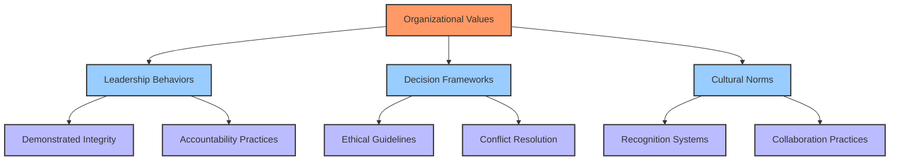

## 📏 Performance Metrics & Accountability [⬆️](#-table-of-contents)

### 📊 Key Performance Indicators [⬆️](#-table-of-contents)

Establish clear performance measurement systems:

1. **🎯 Define clear KPIs for each role and project**
   - Create balanced scorecards covering multiple performance dimensions
   - Establish leading and lagging indicators
   - Align individual KPIs with team and organizational objectives
   
2. **📈 Regularly monitor and report performance metrics**
   - Implement performance dashboards
   - Create reporting cadences for different organizational levels
   - Develop visualization tools for performance tracking

### 👤 Accountability Structures [⬆️](#-table-of-contents)

Create systems that reinforce responsibility:

1. **🔗 Establish clear lines of responsibility**
   - Implement RACI (Responsible, Accountable, Consulted, Informed) frameworks
   - Create decision rights matrices
   - Develop escalation protocols for accountability issues
   
2. **🔄 Implement regular performance review mechanisms**
   - Establish feedback cadences for different organizational levels
   - Create 360-degree feedback systems
   - Develop performance improvement protocols

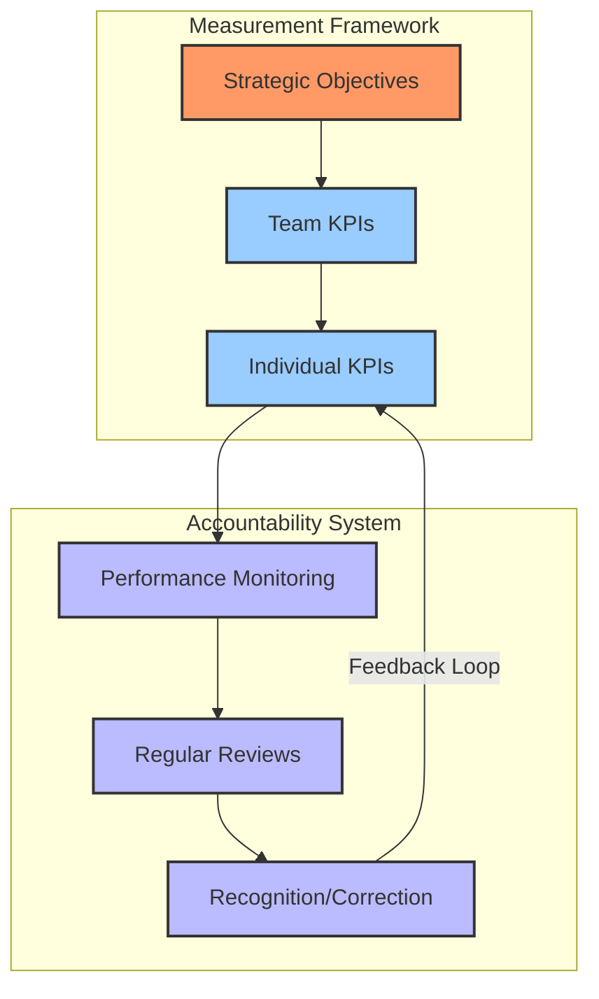

## ⚠️ Risk Management & Contingency Planning [⬆️](#-table-of-contents)

### 🔍 Risk Assessment Methodology [⬆️](#-table-of-contents)

Proactively identify and manage potential threats:

1. **🔎 Conduct regular risk assessments**
   - Implement risk identification workshops
   - Create risk scoring systems (probability x impact)
   - Develop risk registers with clear ownership
   
2. **🛡️ Develop mitigation strategies for identified risks**
   - Create risk response plans for high-priority risks
   - Implement risk monitoring systems
   - Establish risk response teams for different risk categories

### 🛡️ Contingency Framework [⬆️](#-table-of-contents)

Prepare for unexpected challenges:

1. **📝 Prepare backup plans for critical operations**
   - Identify single points of failure
   - Develop redundancy systems
   - Create detailed contingency protocols
   
2. **🧩 Ensure adaptability to unforeseen challenges**
   - Implement scenario planning exercises
   - Create rapid response frameworks
   - Develop crisis management protocols

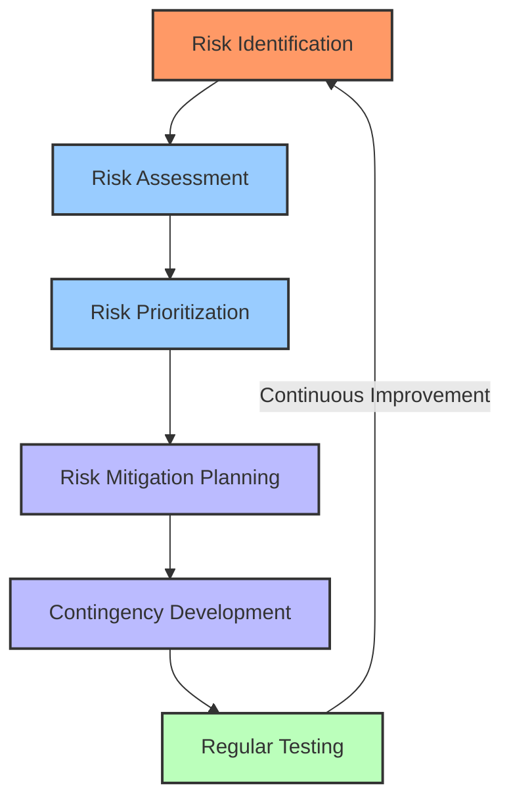

## 💡 Technology Integration & Innovation [⬆️](#-table-of-contents)

### 🤖 AI and Automation Strategy [⬆️](#-table-of-contents)

Leverage technology for operational advantage:

1. **🔌 Integrate AI tools for enhanced efficiency**
   - Identify processes suitable for automation
   - Implement data collection systems to enable AI
   - Develop ROI frameworks for technology investments
   
2. **⚙️ Automate routine tasks to focus on strategic initiatives**
   - Create automation roadmaps
   - Implement change management for technological transitions
   - Develop retraining programs for displaced tasks

### ✨ Innovation Culture Development [⬆️](#-table-of-contents)

Foster organizational creativity:

1. **🧪 Support experimentation and creative solutions**
   - Create innovation sandboxes
   - Implement idea management systems
   - Establish innovation funding mechanisms
   
2. **🔭 Monitor technological advancements relevant to the organization**
   - Assign technology scouting responsibilities
   - Create technology assessment frameworks
   - Develop technology adoption roadmaps

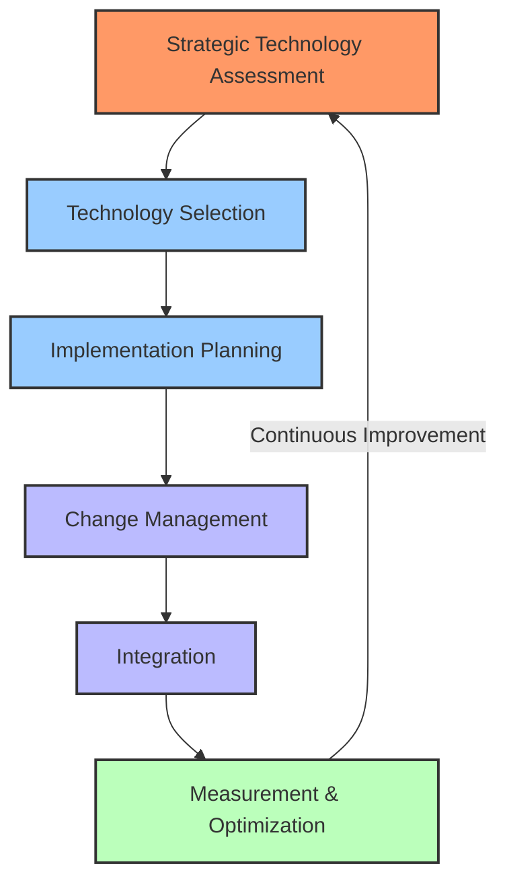

## 🚀 Implementation Roadmap [⬆️](#-table-of-contents)

To successfully implement this Leadership & Operational Excellence Guide:

1. **📋 Assessment Phase**
   - Evaluate current leadership practices against this framework
   - Identify gaps and priority areas for improvement
   - Create benchmark measurements for future comparison
   
2. **🎯 Customization Phase**
   - Tailor this guide to your organization's specific culture and needs
   - Incorporate industry-specific considerations
   - Adapt frameworks to align with existing systems
   
3. **📚 Education Phase**
   - Train leadership on the adapted frameworks
   - Create educational materials for different organizational levels
   - Develop mentorship programs for leadership development
   
4. **🏗️ Implementation Phase**
   - Begin with quick wins to build momentum
   - Establish pilot programs for more complex initiatives
   - Create feedback mechanisms for implementation quality
   
5. **📊 Measurement Phase**
   - Track implementation progress against established metrics
   - Conduct regular leadership assessments
   - Measure impact on key organizational outcomes
   
6. **🔄 Continuous Improvement Phase**
   - Gather feedback on framework effectiveness
   - Refine approaches based on real-world application
   - Document and share best practices and lessons learned

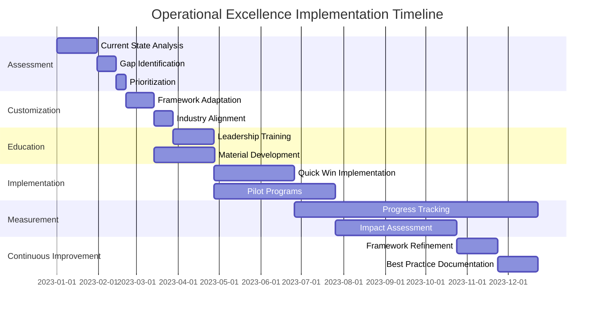

---

Made with Power, Love, and AI • ⚡️❤️🤖 • POWERBRIDGE.AI