# 📘 Leadership Operational Manual: Powerbridge AI Method

> A comprehensive methodology cheat sheet for organizational leaders to drive strategic execution, enhanced performance, and operational excellence.

## 📋 Table of Contents

- [🔍 Introduction](#-introduction)
- [🧭 Methodology Overview](#-methodology-overview)
- [🎯 SMART Goals Framework](#-smart-goals-framework)
- [🧠 Daily Leadership Cadence](#-daily-leadership-cadence)
- [🔁 Nested Workflow System](#-nested-workflow-system)
- [⚙️ AI-Enhanced Task Governance](#-ai-enhanced-task-governance)
- [📊 Needs & Resource Analysis](#-needs--resource-analysis)
- [🪙 Financial Alignment Strategy](#-financial-alignment-strategy)
- [🛠️ Meeting & Communication Structure](#-meeting--communication-structure)
- [🧪 Scientific Method for Strategic Problem-Solving](#-scientific-method-for-strategic-problem-solving)
- [📍 Milestone & Roadmap Mapping](#-milestone--roadmap-mapping)
- [🔍 Research-Backed Foundations](#-research-backed-foundations)
- [🚀 Implementation Roadmap](#-implementation-roadmap)

## 🔍 Introduction [⬆️](#-table-of-contents)

The Powerbridge AI Method is an authoritative leadership and operational excellence framework designed for presidents, department heads, project leads, and organizational decision-makers. This manual provides a systematic approach to leadership, emphasizing strategic execution, operational efficiency, and measurable outcomes.

Operational excellence is achieved when an organization consistently and reliably outperforms the competition through constant improvement and a dedication to customer value. This level of execution requires outstanding leadership, clear principles, and a culture that supports problem-solving and transparency.

## 🧭 Methodology Overview [⬆️](#-table-of-contents)

The Powerbridge AI Method uses a "Google Maps for Organizational Leadership" analogy to create an intuitive navigation system for execution:

| Component | Analogy | Description |
|-----------|---------|-------------|
| **Goal** | Final Destination | Specific, measurable goal — not vague (e.g., "We will achieve $1M in revenue by Q4" rather than "We want more revenue") |
| **Objectives** | Waypoints | Milestones or sub-goals needed to reach the final goal |
| **Tasks** | Directions | Clear, ordered steps to progress |
| **Resources** | Fuel / Vehicle | Team, budget, AI tools, technology, skills, time |
| **Milestones** | Road Signs | Business markers to track, evaluate, and pivot from |
| **Progress Tracking** | Daily Check-In Loop | "Where were we? Where are we now? Where are we going?" |

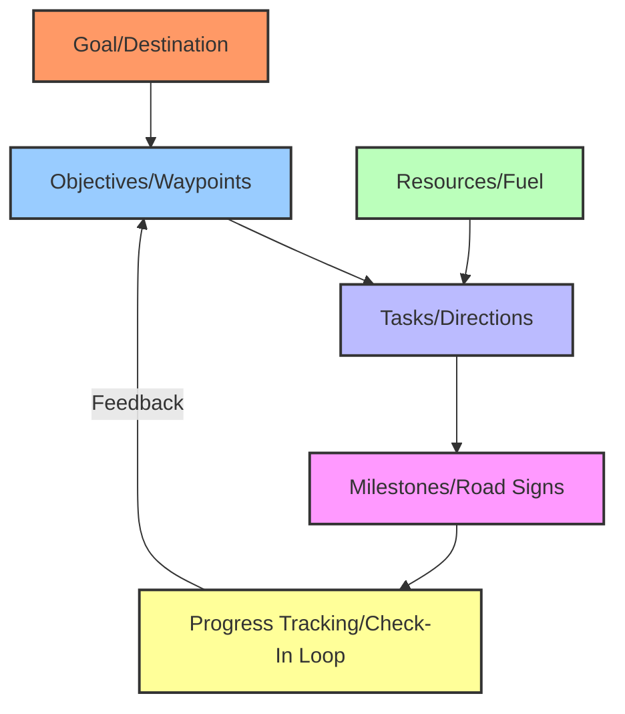

## 🎯 SMART Goals Framework [⬆️](#-table-of-contents)

Structure every major initiative according to the reinforced SMART framework:

### **S**pecific
- Define concrete, unambiguous objectives
- Answer who, what, where, when, and why
- Example: "Increase customer retention rate by 15% in the enterprise segment by Q4" vs. "Improve retention"

### **M**easurable
- Establish quantifiable criteria for success
- Define metrics that will track progress
- Example: "Acquire 500 new customers" vs. "Get more customers"

### **A**chievable
- Set challenging but realistic goals given available resources
- Ensure the team has the capability to deliver
- Example: "Increase production by 20%" (after confirming capacity) vs. "Double production" (without capacity analysis)

### **R**elevant
- Align goals with broader organizational mission and strategy
- Ensure the goal drives meaningful outcomes
- Example: "Improve customer onboarding efficiency to increase retention" vs. "Redesign onboarding" (without strategic purpose)

### **T**ime-bound
- Establish clear deadlines and timeframes
- Create urgency and focus
- Example: "Launch new product by June 30th" vs. "Launch new product soon"

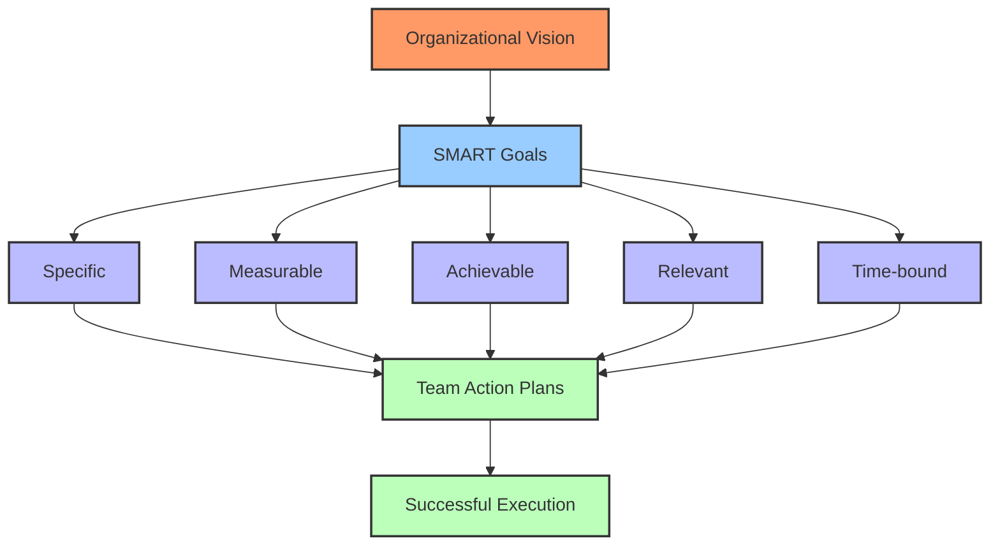

## 🧠 Daily Leadership Cadence [⬆️](#-table-of-contents)

Establish a daily reflection practice using these six diagnostic questions to maintain momentum and clarity:

### Reflection Questions

1. **⏮️ What did we do yesterday?**
   - Review accomplishments and progress
   - Acknowledge completed tasks and milestones
   - Identify lessons learned from yesterday's work

2. **⏯️ What are we doing today?**
   - Focus on most critical priorities
   - Align team activities with these priorities
   - Allocate resources appropriately

3. **⏭️ What needs to be done next?**
   - Anticipate upcoming work requirements
   - Prepare for dependencies and handoffs
   - Mitigate potential bottlenecks

4. **🔙 Where were we?**
   - Understand historical context
   - Recognize patterns and trends
   - Apply lessons from past experiences

5. **📍 Where are we now?**
   - Assess current status against plans
   - Identify gaps and opportunities
   - Gain clarity on present position

6. **🔜 Where are we going?**
   - Reaffirm direction and purpose
   - Ensure alignment with vision
   - Connect daily actions to strategic outcomes

These questions form the Leadership Loop that aligns all tasks to strategic direction and creates operational rhythm.

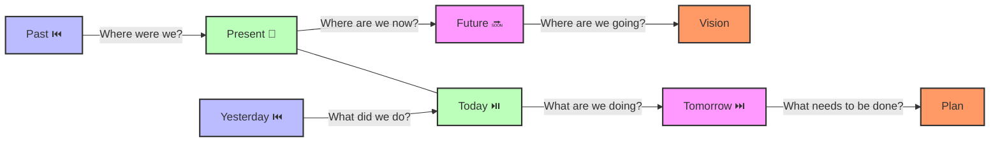

## 🔁 Nested Workflow System [⬆️](#-table-of-contents)

Implement a hierarchical task decomposition system that creates clarity and accountability:

> "Every objective has tasks → tasks have workflows → workflows have checklists."

### Task Hierarchy Example

```
🎯 GOAL: Achieve $10M Annual Revenue
 ↳ 🏆 Objective 1: Launch Premium Product Tier ($4M)
    ↳ 📋 Task 1.1: Complete product development
       ↳ 📝 Workflow 1.1.1: Feature prioritization process
          ↳ ✅ Checklist: Market research, customer interviews, competitor analysis
    ↳ 📋 Task 1.2: Create marketing campaign
       ↳ 📝 Workflow 1.2.1: Campaign development process
          ↳ ✅ Checklist: Messaging, channel strategy, asset creation, launch schedule

 ↳ 🏆 Objective 2: Expand Enterprise Customer Base ($6M)
    ↳ 📋 Task 2.1: Develop enterprise sales strategy
       ↳ 📝 Workflow 2.1.1: Sales playbook creation
          ↳ ✅ Checklist: Ideal customer profile, value proposition, objection handling
```

This system is recursive and nested, enabling precise progress tracking and accountability at every level.

Benefits of this approach include:
- Clear line of sight from strategic goals to daily actions
- Improved task ownership and accountability
- Enhanced progress visibility
- Simplified reporting structure
- More effective resource allocation

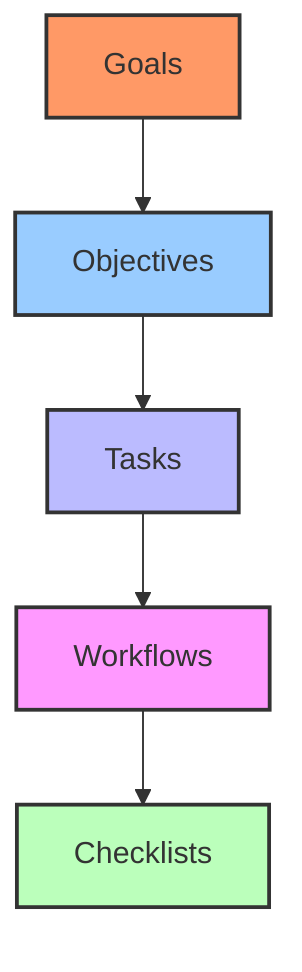

## ⚙️ AI-Enhanced Task Governance [⬆️](#-table-of-contents)

In the modern leadership paradigm, executives monitor performance rather than micromanaging execution. AI tools can significantly enhance this approach:

### AI Capabilities
- **📋 Task list generation**: Automated creation of task breakdowns from objectives
- **🔔 Notifications**: Intelligent alerting based on progress, delays, or dependencies
- **📊 Subtask management**: Systematic tracking of work components

### Leadership Responsibilities
- **✅ Task accuracy**: Ensuring the right work is identified
- **👥 Proper delegation**: Matching tasks to the right skills and capacity
- **⏩ Momentum and clarity**: Maintaining forward progress and removing obstacles

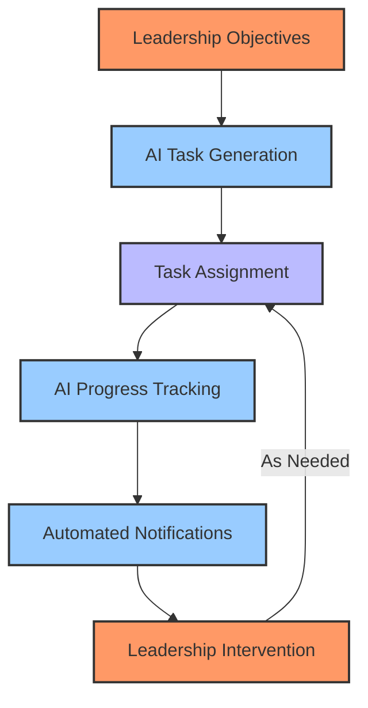

## 📊 Needs & Resource Analysis [⬆️](#-table-of-contents)

Before launching initiatives, perform a comprehensive needs assessment to determine:

### Resource Requirements
- **👥 Required skills**: Technical, managerial, and soft skills needed
- **🔧 Tools/infrastructure**: Technology, platforms, and facilities required
- **⏰ Available bandwidth**: Time and capacity constraints of team members
- **🧩 Missing pieces**: Gaps in capabilities or resources

### Allocation Planning
- **👤 Who is the right person/team?**: Matching capabilities to requirements
- **📚 What support or context do they need?**: Information, training, and resources required for success

This systematic approach ensures initiatives are properly resourced from the outset, reducing mid-project adjustments and enhancing execution quality.

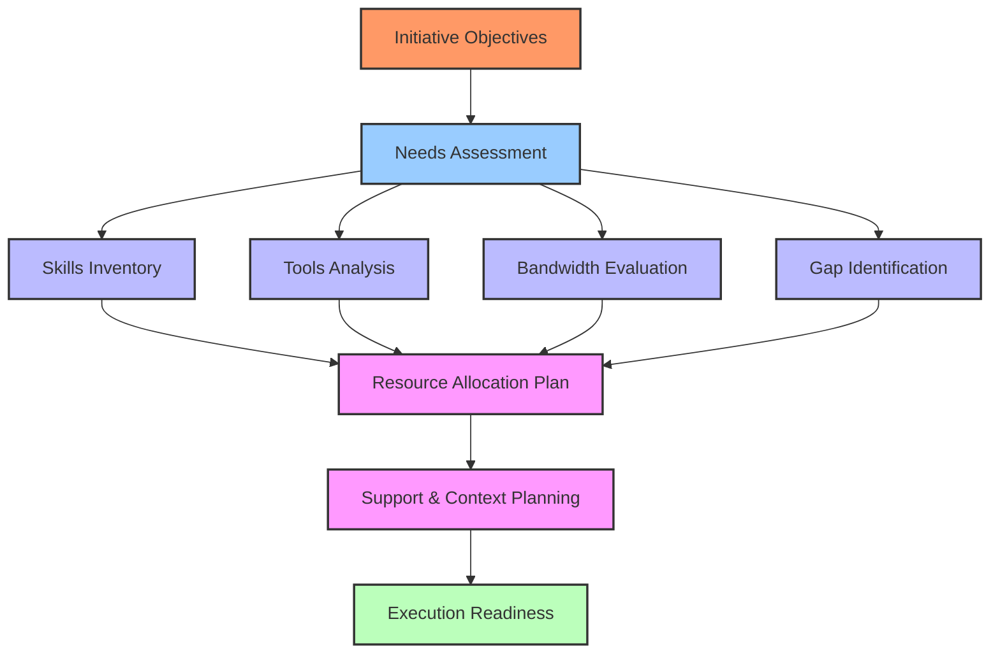

## 🪙 Financial Alignment Strategy [⬆️](#-table-of-contents)

Ensure all activities directly contribute to financial sustainability:

### Financial Threshold Principle
For example, if your salary goal is $5K/month/person and you have 5 people:
- Only pursue activities ≥ $25K/month in revenue contribution or pipeline
- This creates a clear financial filter for all initiatives

### Strategic Applications
This builds a filtering mechanism for:
- **💲 Opportunity evaluation**: Quickly assess if opportunities meet financial thresholds
- **📊 Project approval**: Establish clear ROI requirements for project authorization
- **⏱️ Time prioritization**: Allocate time based on financial impact

The financial alignment strategy creates discipline in resource allocation and ensures all activities contribute meaningfully to organizational sustainability.

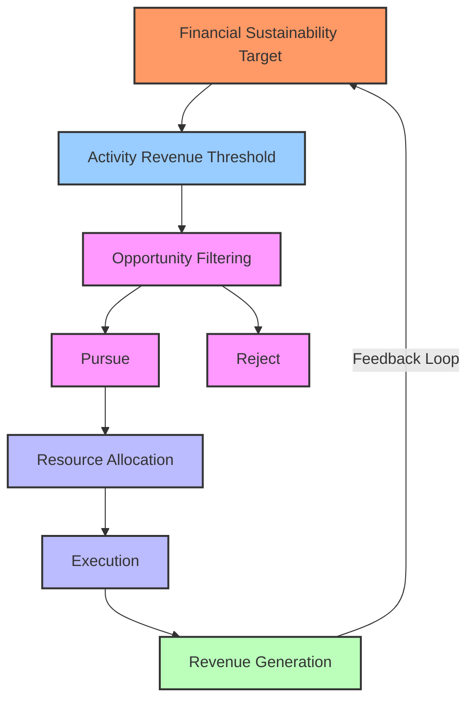

## 🛠️ Meeting & Communication Structure [⬆️](#-table-of-contents)

Standardize interactions across leadership to maximize efficiency and effectiveness:

### Meeting Framework
- **📝 Meeting Templates**: Define purpose, agenda, and desired outcomes for each meeting type
- **✅ Checklists**: Create before/during/after meeting protocols for consistency
- **🔄 Weekly Syncs**: Structure around the 6 core diagnostic questions

### Information Flow
- **📊 Status Boards**: Track objective progress in project management tools (GitHub/Notion/Linear)
- **📱 Async Updates**: Utilize project logs, AI reports, or brief video recordings for updates

Implementing standardized communication structures eliminates unnecessary meetings, reduces information gaps, and ensures everyone remains aligned while minimizing interruptions.

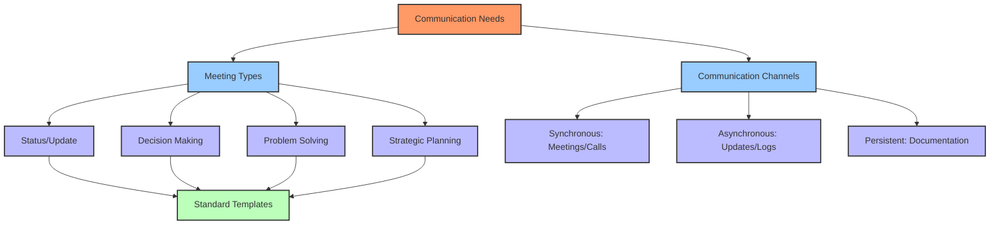

## 🧪 Scientific Method for Strategic Problem-Solving [⬆️](#-table-of-contents)

Apply scientific thinking to business problems through a structured approach:

### Problem-Solving Framework

| Step | Description | Business Application |
|------|-------------|----------------------|
| **🔍 Observation** | Where are we failing or succeeding? | Identify performance patterns and anomalies |
| **❓ Question** | Why is this happening? What do we need? | Define the problem statement precisely |
| **💡 Hypothesis** | What change will fix it? | Develop potential solutions based on data and experience |
| **🧪 Test** | Implement the change | Execute a controlled implementation of the solution |
| **📊 Measure** | Did it improve performance? | Collect and analyze results against success criteria |
| **🔄 Iterate** | Keep refining | Apply learnings to improve the solution |

This methodology brings rigor to business decision-making, reducing bias and increasing the likelihood of successful outcomes.

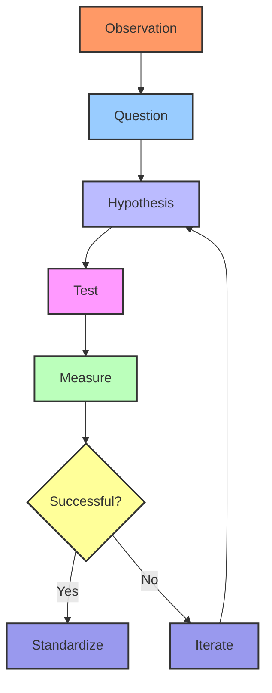

## 📍 Milestone & Roadmap Mapping [⬆️](#-table-of-contents)

Use major milestones to create organizational clarity and focus:

### Strategic Applications
- **💰 Anchor financial goals**: Connect milestones to revenue and profitability targets
- **🛡️ Secure operational stability**: Identify critical infrastructure and capability requirements
- **📈 Track evolution of goals**: Document how objectives mature and develop over time
- **🔀 Set pivot points**: Establish clear criteria for strategic shifts (e.g., when to diversify revenue or invest in IP)

Effective milestone planning creates a shared understanding of the journey ahead and enables teams to self-navigate while maintaining alignment with organizational direction.

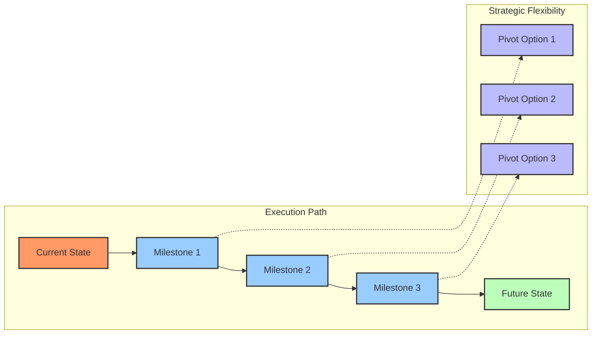

## 🔍 Research-Backed Foundations [⬆️](#-table-of-contents)

The Powerbridge AI methodology integrates established research and proven frameworks:

| Principle | Backing Theory / Framework | Key Applications |
|-----------|----------------------------|------------------|
| **🎯 SMART Goals** | Doran (1981); Goal-setting theory by Locke & Latham | Setting clear, actionable objectives |
| **🔄 Daily Loop Check-ins** | Agile Scrum daily stand-ups | Creating operational rhythm and accountability |
| **📊 Nested Workflows** | GTD (Getting Things Done), OKRs | Breaking down complex work into manageable components |
| **📋 Resource Analysis** | McKinsey 7S, SWOT/Gap Analysis | Ensuring initiatives are properly resourced |
| **🧪 Scientific Problem Solving** | Lean Six Sigma, PDCA (Plan-Do-Check-Act) | Bringing rigor to business decisions |
| **📍 Milestone Planning** | Project Management Institute (PMI) PMBOK | Creating clear roadmaps for execution |
| **💰 Financial Alignment** | 80/20 Rule, OKRs, Venture Capital Decision Trees | Focusing resources on highest-impact activities |

This foundation in established methodologies ensures that the Powerbridge AI approach is both innovative and grounded in proven principles of organizational effectiveness.

## 🚀 Implementation Roadmap [⬆️](#-table-of-contents)

To effectively implement this operational leadership methodology:

### 1. **📊 Assessment**
- Evaluate current leadership practices against this framework
- Identify gaps in operational excellence
- Establish baseline metrics for improvement tracking

### 2. **🎯 Prioritization**
- Select 2-3 methodology components to implement first
- Focus on areas with highest potential impact
- Create specific implementation objectives

### 3. **📝 Planning**
- Develop detailed implementation plans for selected components
- Assign clear ownership and timelines
- Identify required resources and support

### 4. **👥 Alignment**
- Secure stakeholder buy-in through clear communication
- Train leadership team on selected methodologies
- Establish shared understanding of expected outcomes

### 5. **🏁 Execution**
- Implement methodology components according to plan
- Monitor adoption and address resistance
- Provide coaching and support during transition

### 6. **📈 Measurement**
- Track implementation progress and impact
- Gather feedback on methodology effectiveness
- Document lessons learned and best practices

### 7. **🔄 Expansion**
- Incorporate additional methodology components
- Refine implementation based on experience
- Scale successful approaches across the organization

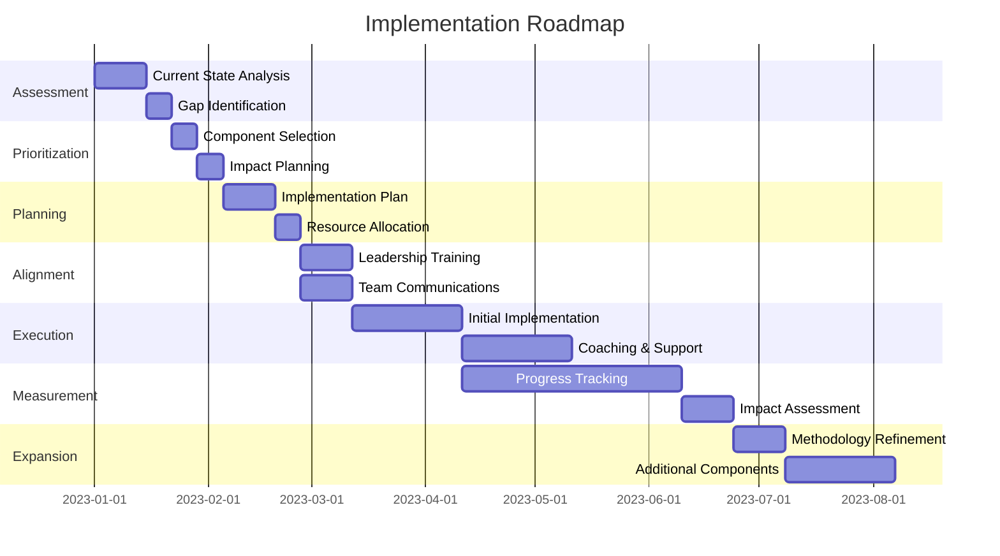

---

Made with Power, Love, and AI • ⚡️❤️🤖 • POWERBRIDGE.AI