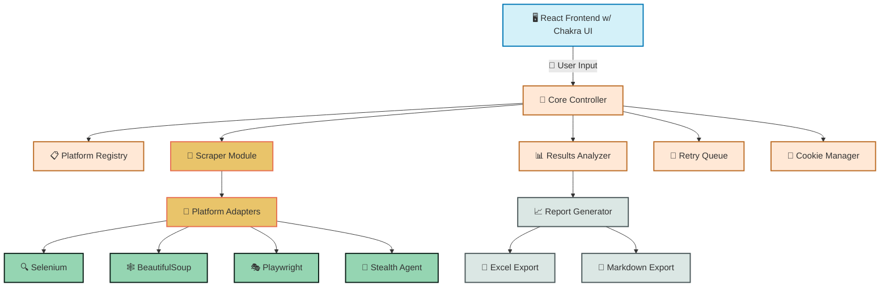

# 🔍 DevOpSec Search

> A specialized tool for discovering, verifying and recovering platform accounts associated with organizational email addresses through automated credential checks.

## 📋 Table of Contents

- [🔍 Overview](#-overview)
- [✨ Features](#-features)
- [🛠️ Installation](#-installation)
- [🚀 Getting Started](#-getting-started)
- [📊 Architecture](#-architecture)
- [⚙️ Configuration](#-configuration)
- [📚 Documentation](#-documentation)

## 🔍 Overview [⬆️](#-table-of-contents)

DevOpSec Search is a specialized recovery tool designed to systematically discover platform accounts associated with organizational emails. The tool automates the process of checking various platforms for account existence, leveraging password reset functionality to verify email association without requiring actual credentials.

This tool addresses the critical need to regain control over organizational accounts that may have been created by former team members using company email addresses, allowing for comprehensive platform recovery during administrative transitions.

## ✨ Features [⬆️](#-table-of-contents)

- 🔄 **Multi-Platform Scanning** - Check email usage across numerous platforms
- 🔐 **Account Verification** - Confirm email association through password reset functionality
- 🔍 **Automated Discovery** - Minimal manual intervention through intelligent web scraping
- 🛡️ **Stealth Techniques** - Avoid platform anti-scraping measures
- 📊 **Comprehensive Reporting** - Generate detailed Excel and Markdown reports

## 🛠️ Installation [⬆️](#-table-of-contents)

```bash
# Clone the repository
git clone <repository-url> devopsec-search

# Navigate to project directory
cd devopsec-search

# Install dependencies
npm install

# Build the project
npm run build
```

### 🔌 Prerequisites

- Node.js (v14 or higher)
- npm or yarn
- Chrome browser (for Playwright/Puppeteer)

## 🚀 Getting Started [⬆️](#-table-of-contents)

```bash
# Start both the backend server and React frontend
npm run dev

# Alternatively, start them separately:
# Start the backend server
npm run server

# In a separate terminal, start the React frontend
npm start
```

The application will be available at http://localhost:3000.

## 📊 Architecture [⬆️](#-table-of-contents)



## ⚙️ Configuration [⬆️](#-table-of-contents)

The application can be configured through the UI or by modifying the following files:

- `src/data/platforms.ts` - Platform definitions and selectors
- `.env` - Environment configuration

Example `.env` file:

```
PORT=3001
NODE_ENV=development
PROXY_URL=http://your-proxy-if-needed
```

## 📚 Documentation [⬆️](#-table-of-contents)

- [📘 DevOpSec Search Documentation](../devopsec-search.md) - Full documentation
- [📘 Admin Recovery Checklist](../Admin-Recovery-Checklist.md) - Process for credential recovery
- [📘 DevOpSec Guide](../dev-opsec.md) - Operational security guidelines

## 🤝 Troubleshooting [⬆️](#-table-of-contents)

### Common Issues

- **Browser Automation Failures**: Ensure Chrome is installed and up-to-date
- **CAPTCHA Challenges**: Use the cookie injection feature to bypass CAPTCHA
- **API Connection Errors**: Verify the backend server is running on the correct port

### Stealth Mode

For platforms with strict anti-bot measures:

1. Use the "Add Cookie" feature after manually logging in
2. Consider lowering the concurrency setting
3. Increase the delay between requests

## 📧 Contact [⬆️](#-table-of-contents)

For support or questions, please contact the development team.

---

Made with Power, Love, and AI • ⚡️❤️🤖 • POWERBRIDGE.AI 