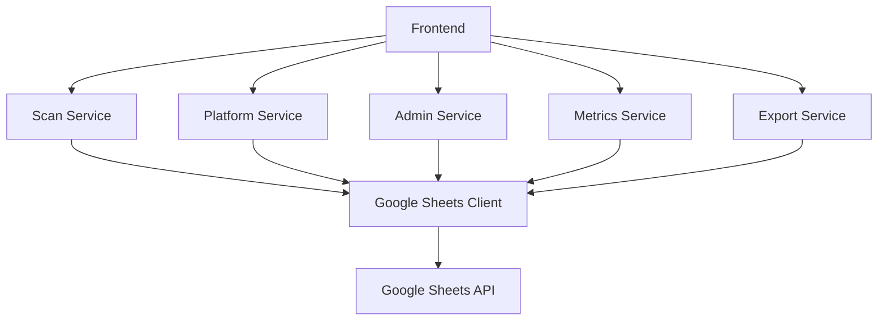

# DevOpSec Search v2 - Development Notes

## 📋 Project Overview

DevOpSec Search is a platform discovery and security scanning tool that identifies organization accounts across platforms and reports potential security issues. The application uses a React/TypeScript frontend and a TypeScript backend with Google Sheets as the database.

## 🏗️ System Architecture

### Core Components

1. **Google Sheets Integration Layer** ✅
   - Location: `src/services/sheetsClient.ts`
   - Purpose: Handles all interactions with Google Sheets API
   - Features:
     - Authentication with service account
     - CRUD operations on sheets
     - Batch operations for performance
     - Data transformation

2. **Scan Management Service** ✅
   - Location: `src/services/scanService.ts`
   - Purpose: Manages scan creation, retrieval, and updates
   - Features:
     - Create new scans
     - Retrieve scan history
     - Update scan status
     - Aggregate scan results

3. **Platform Service** ✅
   - Location: `src/services/platformService.ts`
   - Purpose: Manages platform and category data
   - Features:
     - List platforms and categories
     - Update platform information
     - Platform status tracking

4. **Admin Service** ✅
   - Location: `src/services/adminService.ts`
   - Purpose: Manages application configuration
   - Features:
     - API key management
     - Security settings
     - Export configuration
     - Storage settings

5. **Metrics Service** ✅
   - Location: `src/services/metricsService.ts`
   - Purpose: Calculates application metrics
   - Features:
     - Dashboard metrics
     - Status summaries
     - Chart data generation

6. **Export Service** ✅
   - Location: `src/services/exportService.ts`
   - Purpose: Generates exportable reports
   - Features:
     - Excel export
     - CSV export
     - Report formatting

### Component Relationships

## 📊 Data Model

### Google Sheets Structure

1. **Configuration Sheet**
   - API keys
   - Security settings
   - Export settings
   - Storage settings

2. **Platforms Sheet**
   - Platform ID
   - Platform name
   - Category
   - Status
   - Priority

3. **Scans Sheet**
   - Scan ID
   - Date created
   - Email count
   - Platform count
   - Status
   - Results summary

4. **Results Sheet**
   - Result ID
   - Scan ID
   - Email
   - Platform
   - Status
   - Method
   - Flags

## 📋 Implementation Status

### Core Components
- [🟢] Google Sheets Integration - Completed
- [🟢] Scan Management - Completed
- [🟢] Platform Service - Completed
- [🟢] Admin Service - Completed
- [🟢] Metrics Service - Completed
- [🟢] Export Service - Completed

### Technical Details

#### Google Sheets Integration
- Authentication: Google service account
- Sheet ID: Configurable via admin panel
- Sheet scope: `https://www.googleapis.com/auth/spreadsheets`
- Rate limiting: 100 requests per 100 seconds per user
- Data validation with Zod schema
- Batch operations for performance

#### Type System
- TypeScript interfaces for all data models
- Runtime validation with Zod
- Strict null checking enabled
- Comprehensive type definitions

#### Testing Strategy
- Unit tests with Jest (planned)
- Mock Google Sheets API for testing (planned)
- Integration tests for critical flows (planned)

## 🛠️ Implementation Plan

### Phase 1: Core Infrastructure ✅
1. Google Sheets integration layer
2. Basic data models and types
3. Initial unit tests

### Phase 2: Service Layer ✅
1. Scan management service
2. Platform service
3. Admin service

### Phase 3: Advanced Features ✅
1. Metrics service
2. Export service
3. Additional unit tests

### Phase 4: Integration
1. Connect frontend to backend services
2. End-to-end testing
3. Performance optimization

## 🧪 Testing Requirements

### Unit Testing
- Service modules: 90% coverage
- Utility functions: 95% coverage
- Edge case handling: Comprehensive

### Integration Testing
- Google Sheets API integration
- Frontend-backend communication
- Error handling

## 🚀 Next Steps

1. Write unit tests for services
2. Connect frontend to backend services
3. Implement end-to-end testing
4. Optimize performance

## 📝 Technical Decisions Log

### Decision: Google Sheets as Database
- **ID**: DEC-001
- **Context**: Need a simple, accessible storage solution that doesn't require server setup
- **Options Considered**:
  1. Firebase Firestore
  2. LocalStorage with export
  3. Google Sheets
- **Decision**: Google Sheets
- **Rationale**: 
  - No server required
  - Accessible from anywhere
  - Built-in access control
  - Easy to view/edit manually if needed
  - Simple API with good TypeScript support
- **Implications**: 
  - Rate limiting considerations
  - Need to handle offline scenarios
  - Data structure limitations
- **Status**: Implemented

### Decision: TypeScript for Backend
- **ID**: DEC-002
- **Context**: Need a type-safe language compatible with frontend
- **Options Considered**:
  1. JavaScript
  2. TypeScript
- **Decision**: TypeScript
- **Rationale**: 
  - Type safety
  - Code completion
  - Better error detection
  - Shared types with frontend
- **Implications**: 
  - Additional build step
  - Type definitions maintenance
- **Status**: Implemented

### Decision: Service Design Pattern
- **ID**: DEC-003
- **Context**: Need an organized approach to backend functionality
- **Options Considered**:
  1. Single monolithic module
  2. Service-based architecture
  3. Class-based modules
- **Decision**: Service-based architecture with classes
- **Rationale**: 
  - Better organization
  - Clear separation of concerns
  - Easier testing
  - Dependency injection support
- **Implications**: 
  - Need to maintain service relationships
  - Potential for circular dependencies
- **Status**: Implemented

## 🔧 Implementation Details

### Google Sheets Client
The Google Sheets client is implemented as a class that handles all interactions with the Google Sheets API. It provides methods for:
- Reading data from sheets
- Writing data to sheets
- Appending data to sheets
- Batch updating multiple ranges
- Creating new sheets
- Initializing sheet structure

This client abstracts away the complexity of the Google Sheets API and provides a simple interface for the other services.

### Service Dependencies
Services are designed with dependency injection to improve testability. The services have the following dependencies:

1. **SheetsClient**: No dependencies
2. **AdminService**: SheetsClient
3. **PlatformService**: SheetsClient
4. **ScanService**: SheetsClient
5. **MetricsService**: SheetsClient, ScanService, PlatformService
6. **ExportService**: ScanService

This dependency structure allows for easy mocking during testing and provides a clear organization of the code.

---

Made with Power, Love, and AI • ⚡️❤️�� • POWERBRIDGE.AI 