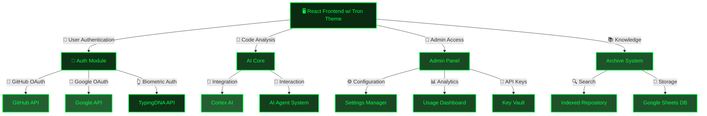
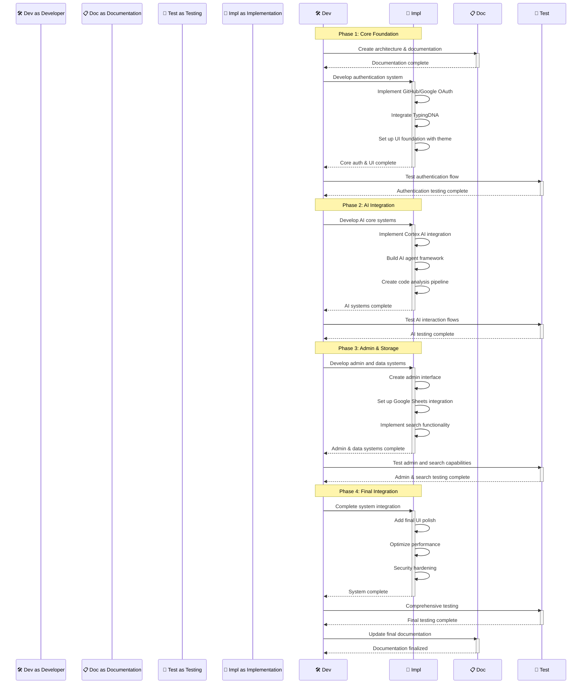

# 🤖 Bolt AI UI Coding Assistant Framework

> A comprehensive AI-powered framework for code analysis, assistance, and development with secure authentication, administration, and data archival capabilities.

## 📋 Table of Contents

- [🔍 Overview](#-overview)
- [🎯 Core Objectives](#-core-objectives)
- [🏗️ Architecture](#-architecture)
- [🛠️ Key Features](#-key-features)
- [🚀 Implementation Strategy](#-implementation-strategy)
- [⚙️ Technical Requirements](#-technical-requirements)
- [🔐 Security Considerations](#-security-considerations)
- [📊 Reporting & Analysis](#-reporting--analysis)
- [🗺️ Development Roadmap](#-development-roadmap)

## 🔍 Overview [⬆️](#-table-of-contents)

Bolt AI UI Coding Assistant is a sophisticated framework designed to assist developers in analyzing, writing, and optimizing code through AI-powered insights. The system integrates seamlessly with popular authentication providers while maintaining high security standards with biometric verification. All interactions and results are archived in a searchable knowledge base that persists through Google Sheets integration.

## 🎯 Core Objectives [⬆️](#-table-of-contents)

1. **🔐 Secure Authentication** - Multi-layered authentication with OAuth and biometric verification
2. **🧠 AI-Powered Assistance** - Intelligent code analysis and generation using modern AI models
3. **👑 Administrative Control** - Comprehensive admin interface for system configuration
4. **📊 Data Persistence** - Scalable storage of interactions and results via Google Sheets
5. **🔍 Knowledge Search** - Advanced search capabilities across historical code solutions
6. **👤 User Experience** - Sleek, responsive interface with cyberpunk-inspired aesthetics

## 🏗️ Architecture [⬆️](#-table-of-contents)

### 🧩 Component Description [⬆️](#-table-of-contents)

| Component | Description | Responsibility |
|-----------|-------------|----------------|
| **🖥️ React Frontend** | User interface with Tron-inspired theme | User interactions, code display, AI chat |
| **🔐 Auth Module** | Multi-provider authentication system | User authentication, session management |
| **👆 TypingDNA Integration** | Biometric verification through typing patterns | Secondary authentication, stealth password verification |
| **🧠 AI Core** | Central AI orchestration system | Manages AI service interactions and responses |
| **👑 Admin Panel** | Administrative interface | System configuration, API settings, analytics |
| **📚 Archive System** | Knowledge persistence | Stores historical interactions and code solutions |
| **📁 Google Sheets DB** | Database alternative | Storage of all application data in Google Sheets |

## 🛠️ Key Features [⬆️](#-table-of-contents)

### 🔐 Authentication System [⬆️](#-table-of-contents)

- **🔑 Multi-Provider Auth** - Support for GitHub and Google OAuth
- **👆 Biometric Verification** - TypingDNA integration for keystroke analysis
- **👤 User Profiles** - Personalized experiences and history
- **🔒 Stealth Mode Authentication** - Hidden biometric verification using @devopsec-search.md password

### 🧠 AI Assistance Capabilities [⬆️](#-table-of-contents)

- **📝 Code Generation** - AI-powered code creation and completion
- **🔄 Code Refactoring** - Intelligent suggestions for code improvement
- **🐛 Debugging Support** - Error analysis and solution proposals
- **📚 Documentation Generation** - Automatic documentation for code
- **🧪 Test Creation** - Generate unit tests for code segments

### 👑 Admin Control Center [⬆️](#-table-of-contents)

- **🔑 API Key Management** - Secure storage and rotation of AI service keys
- **⚙️ System Configuration** - Global settings and default behaviors
- **📊 Usage Analytics** - Insights into system usage and performance
- **🧠 AI Model Selection** - Configure which AI models to use
- **👥 User Management** - Control access and permissions

### 📚 Knowledge Repository [⬆️](#-table-of-contents)

- **🔍 Advanced Search** - Find past code solutions and interactions
- **📋 Code Snippets Library** - Organized storage of useful code
- **🏷️ Tagging System** - Categorize and label stored knowledge
- **📈 Usage Trends** - Identify commonly used solutions
- **🔄 Export/Import** - Transfer knowledge between systems

## 🚀 Implementation Strategy [⬆️](#-table-of-contents)

### 🗃️ Technology Stack Selection [⬆️](#-table-of-contents)

Based on requirements and scalability needs:

| Layer | Technologies | Justification |
|-------|--------------|---------------|
| **Frontend** | React, Next.js, Chakra UI (customized) | Modern framework with SSR capabilities and customizable UI |
| **Backend** | Node.js, Express, Firebase Functions | Scalable serverless architecture with easy integration |
| **Authentication** | Firebase Auth, GitHub/Google OAuth, TypingDNA | Comprehensive auth system with biometric capabilities |
| **Database** | Google Sheets API | As specified, using Sheets instead of traditional SQL |
| **AI Integration** | Cortex AI API, OpenAI | Multiple AI providers for diverse capabilities |
| **Search** | Algolia | Fast, feature-rich search with complex queries |

### 📅 Development Phases [⬆️](#-table-of-contents)

## ⚙️ Technical Requirements [⬆️](#-table-of-contents)

### 💻 Frontend Requirements [⬆️](#-table-of-contents)

- **🔧 Framework**: React with Next.js
- **🎨 UI Library**: Customized Chakra UI with Tron theme
- **🔄 State Management**: Redux Toolkit or Context API
- **🧪 Testing**: Jest, React Testing Library
- **📱 Responsive Design**: Support for desktop and mobile views

#### 🎨 UI Theme Specifications [⬆️](#-table-of-contents)

- **Primary Colors**: Black (`#000000`) background with neon green (`#00ff41`) accents
- **Secondary Colors**: Dark grays (`#1a1a1a`, `#2a2a2a`) for panels and cards
- **Accent Colors**: Cyan (`#00ffd9`) for highlights and important actions
- **Typography**: Monospace fonts (e.g., "Source Code Pro", "Fira Code")
- **Visual Elements**: Grid lines, circuit-like patterns, glowing elements

### 🔧 Backend Requirements [⬆️](#-table-of-contents)

- **🚀 Runtime**: Node.js with Express
- **☁️ Deployment**: Firebase Functions or similar serverless platform
- **🔌 API Structure**: RESTful with GraphQL option for complex queries
- **🧪 Testing**: Jest, Supertest
- **📝 Documentation**: Swagger/OpenAPI specification

### 🔐 Authentication Requirements [⬆️](#-table-of-contents)

- **🔑 OAuth Providers**: GitHub and Google implementation
- **👆 TypingDNA**: Account for setup complexity and API requirements
- **🔒 Security**: JWT-based sessions with short expiration and refresh tokens
- **🛡️ Protection**: Rate limiting, CSRF protection, and secure cookie handling

### 📊 Database Requirements [⬆️](#-table-of-contents)

- **📝 Google Sheets**: Specific schema design for structured data storage
- **🔄 Caching**: Redis or similar for performance optimization
- **🔍 Search Index**: Maintain a separate search index (Algolia) synchronized with Sheets data
- **📈 Scaling**: Consider Sheets limitations and implement sharding if needed

### 🧠 AI Integration Requirements [⬆️](#-table-of-contents)

- **🔌 Cortex AI**: Primary AI engine with appropriate API integration
- **🔄 Fallback Services**: Alternative AI services for redundancy
- **⚡ Performance**: Optimized request handling with streaming responses
- **💰 Cost Management**: Token usage tracking and optimization

## 🔐 Security Considerations [⬆️](#-table-of-contents)

### 🛡️ Authentication Security [⬆️](#-table-of-contents)

- **🔍 Multi-factor Authentication**: Combine OAuth with TypingDNA verification
- **🔐 Session Management**: Secure, short-lived tokens with proper renewal
- **🔒 Access Control**: Role-based permissions with least privilege principle
- **👁️ Privacy**: Securely store and process biometric data with appropriate disclosure

### 🔒 Data Protection [⬆️](#-table-of-contents)

- **🔐 Encryption**: End-to-end encryption for sensitive data
- **🔍 Access Logs**: Comprehensive logging of all access to sensitive information
- **🛡️ Input Validation**: Strict validation to prevent injection attacks
- **🧹 Data Minimization**: Only store necessary information for the required duration

### 🧪 Vulnerability Management [⬆️](#-table-of-contents)

- **🔍 Regular Scanning**: Scheduled security scans of dependencies
- **🚨 Update Policies**: Immediate updates for critical vulnerabilities
- **📝 Security Testing**: Regular penetration testing and security audits
- **🐛 Bug Bounty**: Consider a responsible disclosure program

## 📊 Reporting & Analysis [⬆️](#-table-of-contents)

### 📈 Analytics Dashboard [⬆️](#-table-of-contents)

- **👥 User Metrics**: Active users, session durations, feature usage
- **🧠 AI Metrics**: Query volume, response times, token usage
- **💾 Storage Metrics**: Data growth, query performance
- **⚠️ Error Rates**: System errors, AI failures, authentication issues

### 🔍 Search Capabilities [⬆️](#-table-of-contents)

- **📝 Full-Text Search**: Search across all stored code and interactions
- **🏷️ Faceted Search**: Filter by language, frameworks, complexity, tags
- **🔍 Code-Aware Search**: Understand code structures and patterns
- **📊 Relevance Ranking**: Intelligent sorting of results

### 📊 Export Formats [⬆️](#-table-of-contents)

- **📄 Markdown**: Formatted documentation with code blocks
- **📑 PDF**: Professionally formatted reports with syntax highlighting
- **📊 CSV/Excel**: Structured data for further analysis
- **💻 Code Archives**: Packaged code samples with metadata

## 🗺️ Development Roadmap [⬆️](#-table-of-contents)

### 🎯 Phase 1: Foundation (Weeks 1-3) [⬆️](#-table-of-contents)

- [🔴] Project setup and architecture documentation
- [🔴] Frontend skeleton with Tron theme implementation
- [🔴] Authentication system with GitHub and Google OAuth
- [🔴] Basic TypingDNA integration
- [🔴] Initial Google Sheets database setup

### 🎯 Phase 2: AI Integration (Weeks 4-6) [⬆️](#-table-of-contents)

- [🔴] Cortex AI API integration
- [🔴] Code analysis and generation features
- [🔴] AI agent framework implementation
- [🔴] Chat interface for AI interaction
- [🔴] Code editor integration

### 🎯 Phase 3: Admin & Storage (Weeks 7-9) [⬆️](#-table-of-contents)

- [🔴] Admin panel creation
- [🔴] API key management system
- [🔴] Advanced Google Sheets integration
- [🔴] Search indexing and implementation
- [🔴] Knowledge base organization

### 🎯 Phase 4: Finalization (Weeks 10-12) [⬆️](#-table-of-contents)

- [🔴] UI polishing and responsiveness
- [🔴] Performance optimization
- [🔴] Security hardening
- [🔴] Comprehensive testing
- [🔴] Documentation finalization

### 🎯 Phase 5: Future Enhancements [⬆️](#-table-of-contents)

- [🔴] Additional AI model integrations
- [🔴] IDE plugins and extensions
- [🔴] Advanced analytics and insights
- [🔴] Team collaboration features
- [🔴] Marketplace for custom tools

---

Made with Power, Love, and AI • ⚡️❤️🤖 • POWERBRIDGE.AI 