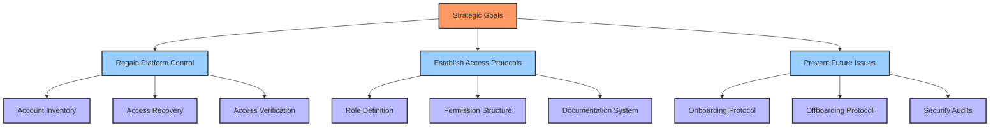
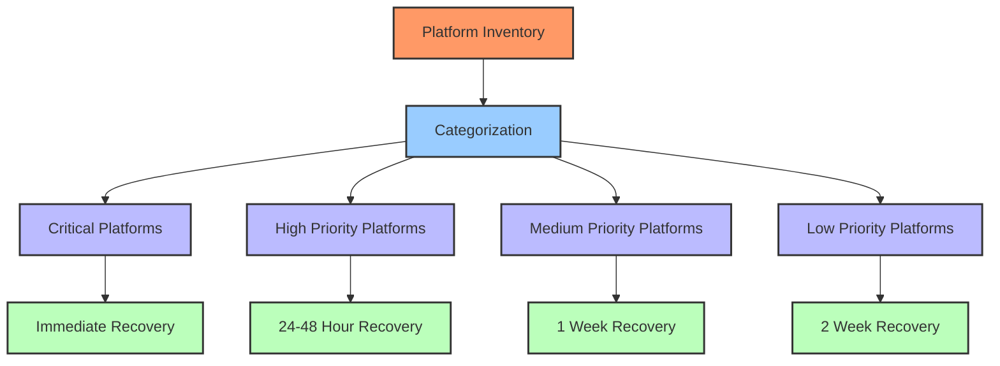
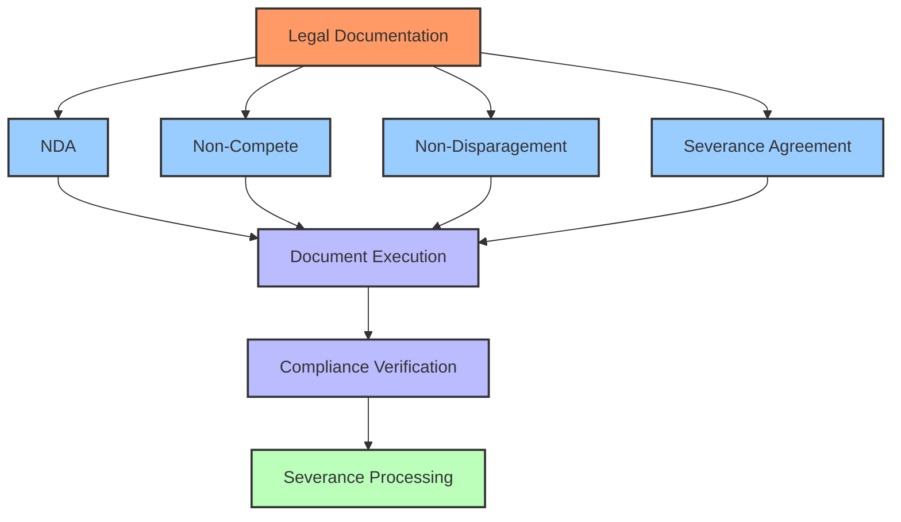
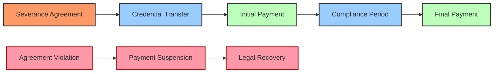
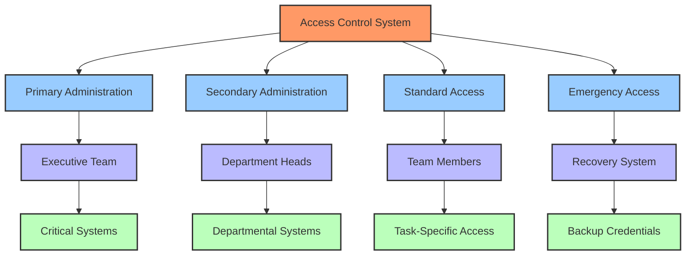
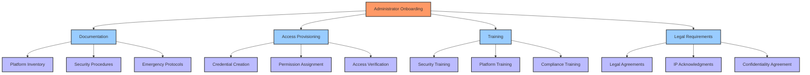
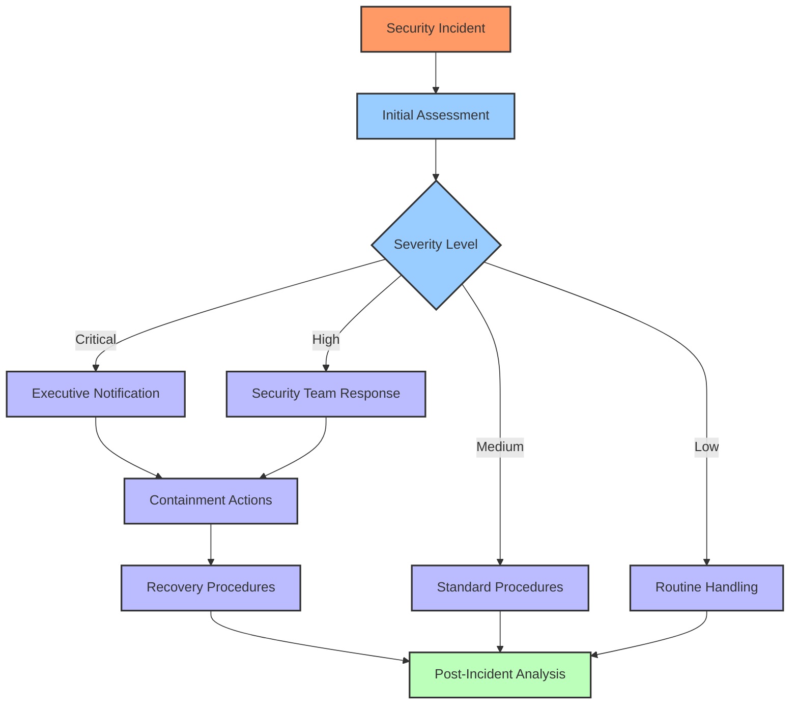
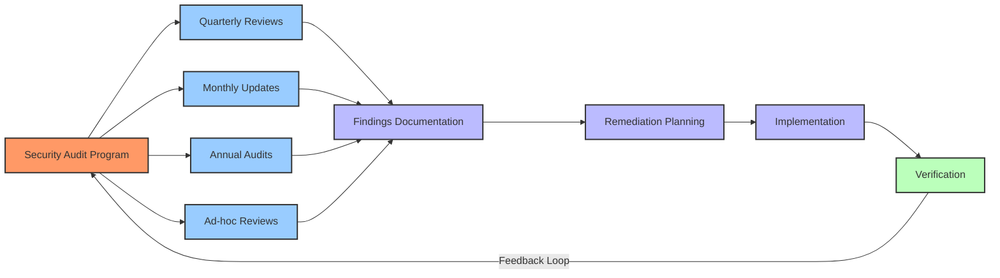
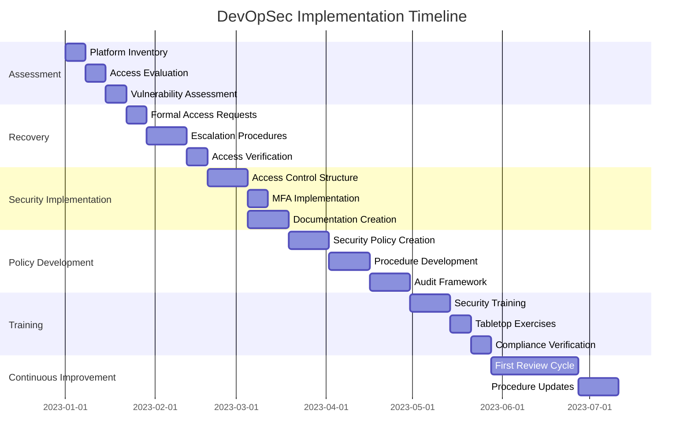

# 🔐 Development Operations Security Guide

> A comprehensive framework for regaining and maintaining control over organization platforms, managing administrative access, and establishing secure onboarding/offboarding protocols.

## 📋 Table of Contents

- [🔍 Introduction](#-introduction)
- [🎯 Strategic Goals & Objectives](#-strategic-goals--objectives)
  - [🧭 Account Recovery Framework](#-account-recovery-framework)
  - [📊 Administrative Access Hierarchy](#-administrative-access-hierarchy)
- [⚙️ Platform Recovery Workflow](#-platform-recovery-workflow)
  - [📑 Platform Inventory & Assessment](#-platform-inventory--assessment)
  - [📝 Formal Recovery Protocol](#-formal-recovery-protocol)
  - [🔄 Escalation Procedures](#-escalation-procedures)
- [🚪 Administrator Offboarding Process](#-administrator-offboarding-process)
  - [📋 Transition Documentation](#-transition-documentation)
  - [⚖️ Legal Framework](#-legal-framework)
  - [💰 Compensation & Severance Guidelines](#-compensation--severance-guidelines)
- [🛡️ Access Control Implementation](#-access-control-implementation)
  - [🔑 Multi-Level Authorization Structure](#-multi-level-authorization-structure)
  - [📊 Role-Based Access Control](#-role-based-access-control)
- [🔄 Administrator Onboarding Protocol](#-administrator-onboarding-protocol)
  - [📝 Documentation Requirements](#-documentation-requirements)
  - [🔐 Secure Access Provisioning](#-secure-access-provisioning)
- [⚠️ Risk Management & Contingency Planning](#-risk-management--contingency-planning)
  - [🔍 Vulnerability Assessment](#-vulnerability-assessment)
  - [🛡️ Emergency Response Procedures](#-emergency-response-procedures)
- [📊 Compliance & Audit Framework](#-compliance--audit-framework)
  - [📝 Documentation Standards](#-documentation-standards)
  - [🔍 Regular Security Audits](#-regular-security-audits)
- [🚀 Implementation Roadmap](#-implementation-roadmap)

## 🔍 Introduction [⬆️](#-table-of-contents)

The Development Operations Security Guide provides a structured framework for regaining and maintaining control over organizational platforms, systems, and digital assets. This guide addresses both the immediate need to recover access from departing administrators and the establishment of long-term security protocols to prevent similar challenges in the future.

Operational security is essential for protecting intellectual property, maintaining business continuity, and safeguarding the organization's digital footprint. This guide integrates proven security methodologies with practical workflows to ensure a systematic approach to administrative access management.

## 🎯 Strategic Goals & Objectives [⬆️](#-table-of-contents)

### 🧭 Account Recovery Framework [⬆️](#-table-of-contents)

The primary goal is to regain complete control over all organizational platforms through a systematic approach:

1. **🎯 Regain Administrative Control**
   - Recover access to all digital platforms and systems
   - Secure organizational accounts against unauthorized access
   - Re-establish proper access hierarchies

2. **📊 Establish Clear Access Protocols**
   - Implement role-based access control system
   - Document platform ownership and access levels
   - Create secure credential management system

3. **🛡️ Prevent Future Access Issues**
   - Develop comprehensive onboarding/offboarding procedures
   - Implement access monitoring and auditing
   - Create redundant admin access to critical systems



### 📊 Administrative Access Hierarchy [⬆️](#-table-of-contents)

Establish a clear hierarchical structure for platform access:

| Access Level | Role | Responsibilities | Access Scope |
|--------------|------|------------------|--------------|
| **Level 1: Executive** | C-Suite, Directors | Final authority, emergency access | Master admin access, recovery tools |
| **Level 2: Administrative** | Department Heads, Lead Developers | Day-to-day administration, user management | Admin access, limited to department |
| **Level 3: Operational** | Team Members, Project Leads | Regular platform usage, content creation | Standard user access with specific permissions |
| **Level 4: External** | Contractors, Temporary Staff | Limited access for specific tasks | Temporary, specific access with expiration |

This tiered structure ensures that:
- No single administrator has exclusive control over critical systems
- Clear escalation paths exist for access issues
- Administrative permissions match job responsibilities
- Regular access reviews maintain security posture

## ⚙️ Platform Recovery Workflow [⬆️](#-table-of-contents)

### 📑 Platform Inventory & Assessment [⬆️](#-table-of-contents)

Create a comprehensive inventory of all platforms requiring administrative recovery:

1. **📋 Platform Categorization**
   
   | Category | Platforms | Priority | Current Admin |
   |----------|-----------|----------|--------------|
   | **Social Media** | Twitter, LinkedIn, Facebook, Instagram, TikTok, YouTube | High | [Former Admin Names] |
   | **Development** | GitHub, Version Control, CI/CD Systems | Critical | [Former Admin Names] |
   | **Web Infrastructure** | Domain Registrars (Namecheap), Hosting Providers | Critical | [Former Admin Names] |
   | **Email & Communication** | Gmail, Discord, Slack | High | [Former Admin Names] |
   | **Web3 Platforms** | Blockchain Wallets, NFT Marketplaces, DeFi Platforms | High | [Former Admin Names] |
   | **Business Services** | Accounting, CRM, Project Management | Medium | [Former Admin Names] |

2. **🔍 Access Evaluation**
   - Document current access status for each platform
   - Identify critical vs. non-critical systems
   - Determine recovery difficulty and required methods

3. **📊 Recovery Prioritization**
   - Prioritize platforms based on business impact
   - Identify dependencies between platforms
   - Create recovery sequence plan



### 📝 Formal Recovery Protocol [⬆️](#-table-of-contents)

Implement a structured approach to regain platform access:

1. **📄 Initial Documentation**
   - Document all known platform details
   - Compile evidence of organizational ownership
   - List all known administrators and their access levels

2. **✉️ Formal Request Process**
   - Send formal written request to former administrators
   - Clearly detail required access credentials
   - Specify response timeframe (48 hours recommended)
   - Include legal notification of obligations

3. **📋 Credential Transfer Workflow**
   
   ```mermaid
   sequenceDiagram
       participant OrgRep as Organization Representative
       participant FormerAdmin as Former Administrator
       participant Platform as Platform Provider
       participant Legal as Legal Team
       
       OrgRep->>FormerAdmin: Formal Access Request
       activate OrgRep
       activate FormerAdmin
       
       Note over OrgRep,FormerAdmin: Include credential list<br/>and legal obligations
       
       alt Cooperative Response
           FormerAdmin->>OrgRep: Provide Credentials
           OrgRep->>OrgRep: Verify Access
           OrgRep->>FormerAdmin: Confirm Receipt
           OrgRep->>FormerAdmin: Process Severance
       else Non-Response (48 hours)
           OrgRep->>Legal: Initiate Escalation
           Legal->>FormerAdmin: Legal Notice
           Note over Legal,FormerAdmin: 24-hour final notice
       else Refusal
           OrgRep->>Platform: Account Recovery Request
           OrgRep->>Legal: Legal Action Initiation
       end
       
       deactivate FormerAdmin
       deactivate OrgRep
   ```

4. **✅ Verification Process**
   - Test all provided credentials immediately
   - Change passwords and recovery information
   - Document successful transfers
   - Update platform inventory status

### 🔄 Escalation Procedures [⬆️](#-table-of-contents)

If formal requests for access are unsuccessful, implement escalation procedures:

1. **⚖️ Legal Escalation**
   - Issue formal legal notice of obligations
   - Specify potential legal and financial consequences
   - Set final compliance deadline (24 hours)

2. **🛡️ Platform-Specific Recovery**
   - Contact platform support with ownership documentation
   - Utilize platform-specific account recovery options
   - Submit business verification documentation

3. **🔀 Alternative Access Methods**
   
   | Platform Type | Primary Recovery | Secondary Recovery | Tertiary Recovery |
   |---------------|------------------|-------------------|-------------------|
   | **Social Media** | Admin transfer request | Business verification | Corporate challenge |
   | **Development** | Organization transfer | Support ticket | Legal ownership claim |
   | **Web Infrastructure** | Registrar ownership verification | ICANN dispute | Legal action |
   | **Email & Communication** | Admin recovery | Domain verification | Provider escalation |
   | **Web3 Platforms** | Multi-sig recovery | Contract ownership verification | DAO governance |

4. **📱 Direct Platform Intervention**
   - Escalate to platform's business support
   - Provide legal documentation of ownership
   - Request administrative intervention

```mermaid
graph TD
    A[Access Request Failed] --> B[Legal Notice]
    B --> C{Response?}
    
    C -->|Yes| D[Process Credentials]
    C -->|No| E[Platform-Specific Recovery]
    
    E --> F{Successful?}
    F -->|Yes| G[Update Access Controls]
    F -->|No| H[Legal Action]
    
    classDef start fill:#f96,stroke:#333,stroke-width:2px
    classDef process fill:#9cf,stroke:#333,stroke-width:2px
    classDef decision fill:#bbf,stroke:#333,stroke-width:2px
    classDef end fill:#bfb,stroke:#333,stroke-width:2px
    
    class A start
    class B,E,H process
    class C,F decision
    class D,G end
```

## 🚪 Administrator Offboarding Process [⬆️](#-table-of-contents)

### 📋 Transition Documentation [⬆️](#-table-of-contents)

Create comprehensive documentation for the administrator transition:

1. **📝 Platform Access Inventory**
   - Complete list of all platforms and systems
   - Current access status and credentials
   - Recovery methods and backup contacts

2. **🔑 Credential Transfer Checklist**
   
   ```
   🎯 GOAL: Complete Administrative Transition
    ↳ 🏆 Objective 1: Document All Platform Access
       ↳ 📋 Task 1.1: Create platform inventory
          ↳ 📝 Workflow 1.1.1: Platform documentation process
             ↳ ✅ Checklist:
                □ List all platform names
                □ Document URLs/access points
                □ Note account usernames
                □ Identify account email addresses
                □ Document 2FA methods in use
                □ List recovery emails/phones
                □ Identify linked accounts
       ↳ 📋 Task 1.2: Verify ownership documentation
          ↳ 📝 Workflow 1.2.1: Ownership verification process
             ↳ ✅ Checklist:
                □ Gather account creation information
                □ Collect billing records
                □ Document business verification info
                □ Gather domain ownership proof
                □ Identify founding team members
    
    ↳ 🏆 Objective 2: Secure Credential Transfer
       ↳ 📋 Task 2.1: Create secure transfer method
          ↳ 📝 Workflow 2.1.1: Secure credential sharing
             ↳ ✅ Checklist:
                □ Set up encrypted communication channel
                □ Create password transfer protocol
                □ Establish verification system
                □ Document successful transfers
   ```

3. **📊 Status Tracking System**
   - Track progress of each credential recovery
   - Document verification status
   - Note escalation actions taken

### ⚖️ Legal Framework [⬆️](#-table-of-contents)

Establish the legal foundation for the transition process:

1. **📜 Required Legal Documents**
   - **Non-Disclosure Agreement (NDA)**
     - Prohibit sharing of sensitive information
     - Include perpetual confidentiality clause
     - Specify organizational data protection
   
   - **Non-Compete Agreement**
     - Define competitive restrictions
     - Specify geographic and industry limitations
     - Set reasonable time restrictions
   
   - **Non-Disparagement Clause**
     - Prohibit negative statements about the organization
     - Include both public and private communications
     - Cover all media forms (social, traditional, web3)
   
   - **Severance Agreement**
     - Detail compensation package
     - Include payment schedule
     - Specify conditions for payment

2. **⚠️ Legal Consequences for Non-Compliance**
   - Define breach of contract terms
   - Specify financial penalties
   - Include severance forfeiture conditions
   - Detail legal remedies available to the organization

3. **✍️ Execution Process**
   - Require legal document signing before severance
   - Document receipt and acknowledgment
   - Establish verification of compliance



### 💰 Compensation & Severance Guidelines [⬆️](#-table-of-contents)

Establish clear parameters for severance compensation:

1. **💵 Compensation Structure**
   - Retro pay at $2,000-2,500 per month (vs. standard $5,000)
   - Six-month compensation period
   - Total package: $12,000-15,000 per administrator

2. **📅 Payment Timeline**
   - Initial payment upon credential verification
   - Structured payments over defined period
   - Final payment upon compliance verification

3. **⚠️ Forfeiture Conditions**
   - Non-compliance with credential requests
   - Breach of any signed agreements
   - Disparagement or confidentiality violations
   - Intentional damage to organizational assets



## 🛡️ Access Control Implementation [⬆️](#-table-of-contents)

### 🔑 Multi-Level Authorization Structure [⬆️](#-table-of-contents)

Implement a secure hierarchical access control system:

1. **👑 Primary Administration**
   - Organization leadership holds ultimate access
   - Multiple executives share top-level access
   - Secured with hardware MFA devices

2. **👥 Secondary Administration**
   - Department heads granted administrative access
   - Limited to relevant platforms
   - Regular access review and rotation

3. **🔄 Recovery Protocols**
   - Documented recovery procedures for each access level
   - Multiple recovery paths for critical systems
   - Regular testing of recovery procedures



### 📊 Role-Based Access Control [⬆️](#-table-of-contents)

Establish clear role-based permissions for all systems:

1. **📋 Role Definition Matrix**
   
   | Role | Description | Permission Level | Platform Access |
   |------|-------------|------------------|-----------------|
   | **Executive** | C-suite, Directors | Full administrative | All platforms |
   | **Technical Lead** | CTO, Lead Developer | Technical administrative | Development, infrastructure |
   | **Marketing Lead** | CMO, Marketing Director | Content administrative | Social media, marketing |
   | **Developer** | Engineers, Programmers | Repository access | GitHub, dev environment |
   | **Content Creator** | Writers, Designers | Content creation | Content platforms |
   | **Support** | Customer Support | Customer interaction | Support platforms |

2. **🔐 Least Privilege Implementation**
   - Grant minimum access needed for role
   - Regular permission audits
   - Time-limited elevated access when required

3. **👥 Shared Account Policy**
   - Prohibit personal account use for organizational assets
   - Implement team accounts with tracked access
   - Regular password rotation for shared accounts

## 🔄 Administrator Onboarding Protocol [⬆️](#-table-of-contents)

### 📝 Documentation Requirements [⬆️](#-table-of-contents)

Establish comprehensive documentation for administrator onboarding:

1. **📋 Access Documentation**
   - Complete platform inventory
   - Role-specific access requirements
   - Authentication and authorization procedures

2. **🔐 Security Requirements**
   - Password complexity requirements
   - MFA implementation guidelines
   - Secure credential storage protocols

3. **⚖️ Legal Documentation**
   - Access control agreements
   - Confidentiality requirements
   - Intellectual property protections



### 🔐 Secure Access Provisioning [⬆️](#-table-of-contents)

Implement secure processes for granting platform access:

1. **🔑 Credential Management System**
   - Secure password generation
   - Encrypted credential storage
   - Separate transmission of username and password

2. **👥 Multi-Person Authorization**
   - Require approval from multiple stakeholders
   - Document all access authorizations
   - Regular access review process

3. **📝 Access Acknowledgment**
   - Formal acceptance of responsibility
   - Documentation of security training
   - Acknowledgment of access policies

## ⚠️ Risk Management & Contingency Planning [⬆️](#-table-of-contents)

### 🔍 Vulnerability Assessment [⬆️](#-table-of-contents)

Identify and address potential security vulnerabilities:

1. **📊 Risk Assessment Matrix**
   
   | Risk | Likelihood | Impact | Mitigation Strategy |
   |------|------------|--------|---------------------|
   | Admin departure without transition | High | Critical | Implement shared admin access |
   | Credential loss | Medium | High | Create secure backup system |
   | Unauthorized access | Medium | Critical | Implement MFA and access logs |
   | Account lockout | Medium | High | Document recovery procedures |
   | Platform policy changes | Medium | Medium | Regular policy monitoring |
   | Social engineering | Low | Critical | Security awareness training |

2. **🛡️ Preventative Measures**
   - Regular security training
   - Access monitoring and logging
   - Periodic penetration testing
   - Security policy enforcement

3. **📝 Documentation Requirements**
   - Regular platform inventory updates
   - Current access records
   - Recovery procedure documentation
   - Contact information for platform support

### 🛡️ Emergency Response Procedures [⬆️](#-table-of-contents)

Establish clear protocols for security incidents:

1. **🚨 Incident Response Plan**
   - Define incident categories and severity levels
   - Establish notification procedures
   - Create containment and recovery strategies
   - Document post-incident analysis requirements

2. **👥 Response Team Structure**
   - Assign incident response roles
   - Define escalation procedures
   - Establish communication protocols
   - Document decision-making authority

3. **🏢 External Resources**
   - Legal counsel contact information
   - Platform support escalation paths
   - Cybersecurity resources
   - Law enforcement contacts



## 📊 Compliance & Audit Framework [⬆️](#-table-of-contents)

### 📝 Documentation Standards [⬆️](#-table-of-contents)

Establish comprehensive documentation requirements:

1. **📋 Required Documentation**
   - Complete platform inventory
   - Access control records
   - Security incident logs
   - Recovery procedure documentation
   - Audit trail of access changes

2. **🔄 Update Procedures**
   - Regular documentation review schedule
   - Change management process
   - Version control implementation
   - Responsibility assignment

3. **📊 Compliance Verification**
   - Regular self-audits
   - Documentation completeness checks
   - Accuracy verification procedures
   - Remediation tracking

### 🔍 Regular Security Audits [⬆️](#-table-of-contents)

Implement a systematic security audit process:

1. **📅 Audit Schedule**
   - Quarterly access control reviews
   - Monthly platform inventory updates
   - Annual comprehensive security audit
   - Ad-hoc reviews after significant changes

2. **📊 Audit Scope**
   - Access control verification
   - Password policy compliance
   - Recovery procedure testing
   - Security awareness assessment
   - Documentation review

3. **📈 Continuous Improvement**
   - Implement audit findings
   - Track security metrics
   - Update security procedures
   - Enhance training based on audit results



## 🚀 Implementation Roadmap [⬆️](#-table-of-contents)

To successfully implement this DevOpSec framework:

1. **📊 Assessment Phase**
   - Evaluate current platform access status
   - Identify critical vulnerabilities
   - Document existing security measures
   - Prioritize recovery actions

2. **🔑 Recovery Phase**
   - Implement formal access requests
   - Execute escalation procedures as needed
   - Verify access to all platforms
   - Document successful recovery actions

3. **🔐 Security Implementation Phase**
   - Establish new access control structure
   - Implement enhanced security measures
   - Create comprehensive documentation
   - Deploy credential management solutions

4. **📝 Policy Development Phase**
   - Create formal security policies
   - Develop onboarding/offboarding procedures
   - Establish audit frameworks
   - Document emergency response protocols

5. **👥 Training Phase**
   - Train team on new security procedures
   - Implement security awareness program
   - Conduct tabletop exercises
   - Verify understanding and compliance

6. **🔄 Continuous Improvement Phase**
   - Establish regular review cycles
   - Implement feedback mechanisms
   - Update procedures based on lessons learned
   - Enhance security measures as needed



---

Made with Power, Love, and AI • ⚡️❤️🤖 • POWERBRIDGE.AI
