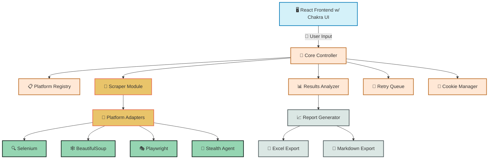
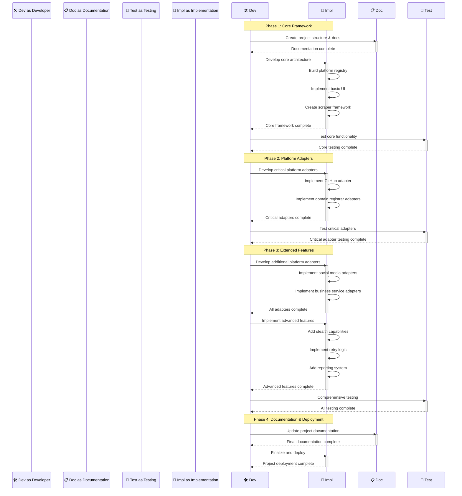

# 🔍 DevOpSec Search

> A specialized tool for discovering, verifying and recovering platform accounts associated with organizational email addresses through automated credential checks.

## 📋 Table of Contents

- [🔍 Overview](#-overview)
- [🎯 Core Objectives](#-core-objectives)
- [🏗️ Architecture](#-architecture)
- [🛠️ Key Features](#-key-features)
- [🚀 Implementation Strategy](#-implementation-strategy)
- [⚙️ Technical Requirements](#-technical-requirements)
- [🔐 Security Considerations](#-security-considerations)
- [📊 Reporting](#-reporting)
- [🗺️ Development Roadmap](#-development-roadmap)

## 🔍 Overview [⬆️](#-table-of-contents)

DevOpSec Search is a specialized recovery tool designed to systematically discover platform accounts associated with organizational emails. The tool automates the process of checking various platforms for account existence, leveraging password reset functionality to verify email association without requiring actual credentials.

This tool addresses the critical need to regain control over organizational accounts that may have been created by former team members using company email addresses, allowing for comprehensive platform recovery during administrative transitions.

## 🎯 Core Objectives [⬆️](#-table-of-contents)

1. **🔎 Account Discovery** - Systematically identify platforms where organizational emails have been used
2. **🧪 Verification** - Confirm email association through password reset functionality
3. **🔄 Automation** - Minimize manual intervention through intelligent web scraping
4. **🛡️ Evasion** - Implement stealth techniques to avoid platform anti-scraping measures
5. **📝 Documentation** - Generate comprehensive reports of discovered accounts and their status

## 🏗️ Architecture [⬆️](#-table-of-contents)



### 🧩 Component Description [⬆️](#-table-of-contents)

| Component | Description | Responsibility |
|-----------|-------------|----------------|
| **🖥️ React Frontend** | User interface built with React and Chakra UI | User input, settings configuration, results display |
| **🧠 Core Controller** | Central coordination module | Orchestrates the detection process and delegates tasks |
| **📋 Platform Registry** | Database of platform login and password reset URLs | Provides target information for scrapers |
| **🤖 Scraper Module** | Web scraping controller | Manages the different scraping technologies |
| **🧩 Platform Adapters** | Platform-specific scraping logic | Handles unique aspects of each platform |
| **📊 Results Analyzer** | Processes scraper outputs | Determines account existence from responses |
| **💾 Retry Queue** | Failed attempt manager | Handles retries and rate limiting |
| **🔑 Cookie Manager** | Stores user-provided cookies | Enables authentication for protected platforms |
| **📈 Report Generator** | Creates output reports | Formats results into Excel or Markdown |

## 🛠️ Key Features [⬆️](#-table-of-contents)

### 📧 Email Verification System [⬆️](#-table-of-contents)

- **🎯 Multi-Platform Scanning** - Check email usage across numerous platforms
- **🔄 Batch Processing** - Test multiple email addresses simultaneously
- **🧪 Password Reset Verification** - Use "forgot password" functionality to verify accounts

### 🕸️ Advanced Web Scraping [⬆️](#-table-of-contents)

- **🔄 Multi-Engine Support** - Leverage Selenium, Beautiful Soup, and Playwright
- **🛡️ Stealth Techniques** - Randomized user agents, proxy rotation, request throttling
- **🧠 Adaptive Parsing** - Intelligent HTML parsing for different platform structures

### 🚧 Obstacle Handling [⬆️](#-table-of-contents)

- **🔄 Automatic Retries** - 5 attempts with increasing backoff
- **👥 Manual Intervention Flagging** - Identify CAPTCHA and other challenges
- **🍪 Cookie Injection** - Support for manual cookie provision

### 📊 Reporting System [⬆️](#-table-of-contents)

- **📑 Excel Export** - Comprehensive spreadsheet reports
- **📝 Markdown Documentation** - Formatted reports following organizational standards
- **🚦 Status Indicators** - Clear visualization of verification status

## 🚀 Implementation Strategy [⬆️](#-table-of-contents)

### 🗃️ Platform Categories for Verification [⬆️](#-table-of-contents)

Based on the organization's platform inventory:

| Category | Platforms | Priority |
|----------|-----------|----------|
| **Social Media** | Twitter, LinkedIn, Facebook, Instagram, TikTok, YouTube | High |
| **Development** | GitHub, GitLab, Bitbucket, CI/CD Systems | Critical |
| **Web Infrastructure** | Domain Registrars, Hosting Providers | Critical |
| **Email & Communication** | Gmail, Discord, Slack | High |
| **Web3 Platforms** | Blockchain Wallets, NFT Marketplaces | Medium |
| **Business Services** | Accounting, CRM, Project Management | Medium |

### 📅 Development Phases [⬆️](#-table-of-contents)



## ⚙️ Technical Requirements [⬆️](#-table-of-contents)

### 💻 Development Stack [⬆️](#-table-of-contents)

- **🔧 Language**: TypeScript
- **🚀 Runtime**: Node.js
- **🖥️ Frontend**: React with Chakra UI
- **🔄 State Management**: Context API or Redux
- **🧪 Testing**: Jest, React Testing Library
- **🚢 Build/Deployment**: Webpack, Docker

### 🧰 Key Libraries [⬆️](#-table-of-contents)

| Category | Libraries | Purpose |
|----------|-----------|---------|
| **Web Scraping** | Playwright, Puppeteer, Cheerio | Automated browser control and HTML parsing |
| **Proxy Handling** | proxy-chain, proxy-agent | Proxy configuration and rotation |
| **Stealth** | puppeteer-extra-plugin-stealth, random-useragent | Anti-detection measures |
| **Export** | xlsx, json2md | Report generation |
| **UI** | @chakra-ui/react, react-icons, react-table | User interface components |

### 🔌 API Integrations (Future) [⬆️](#-table-of-contents)

- **📧 Google Email API** - For potential email verification
- **🕸️ Proxy Services** - For IP rotation
- **☁️ Cloud Storage** - For saving/loading reports

## 🔐 Security Considerations [⬆️](#-table-of-contents)

### 🛡️ Data Protection [⬆️](#-table-of-contents)

- **🔒 Local Storage** - Store all sensitive data locally, avoid cloud transmission
- **🔑 Credential Handling** - Never store actual passwords, only verification statuses
- **🗑️ Data Cleanup** - Automatic purging of session data after use

### 🥷 Ethical Considerations [⬆️](#-table-of-contents)

- **⏱️ Rate Limiting** - Respect platform rate limits to avoid service disruption
- **🚫 Access Limitations** - Tool only verifies email existence, does not attempt access
- **🔍 Legitimate Use** - For organizational account recovery only

### 🧪 Testing Parameters [⬆️](#-table-of-contents)

- **🧮 Limits** - Maximum attempts per platform (5)
- **⏲️ Timeouts** - Configurable request timeouts
- **📊 Success Metrics** - Clear criteria for account verification

## 📊 Reporting [⬆️](#-table-of-contents)

### 📄 Report Components [⬆️](#-table-of-contents)

- **📧 Email Address** - The email being checked
- **🌐 Platform** - Service name and category
- **✅ Status** - Verification result (Confirmed, Not Found, Requires Manual Check)
- **🔍 Method** - How verification was determined
- **📅 Timestamp** - When verification occurred
- **🔄 Retry Count** - Number of attempts made
- **🚩 Flags** - Special conditions (CAPTCHA encountered, etc.)

### 📋 Sample Report Format [⬆️](#-table-of-contents)

#### Excel Format:

| Email | Platform | Category | Status | Method | Timestamp | Retries | Flags | Notes |
|-------|----------|----------|--------|--------|-----------|---------|-------|-------|
| user@example.com | GitHub | Development | ✅ Confirmed | Password Reset | 2023-07-21 14:30 | 1 | None | - |
| user@example.com | Twitter | Social Media | ❓ Manual Check | - | 2023-07-21 14:32 | 5 | CAPTCHA | Requires manual verification |
| user@example.com | AWS | Web Infrastructure | ❌ Not Found | Password Reset | 2023-07-21 14:35 | 1 | None | - |

#### Markdown Format:

```markdown
# 📊 DevOpSec Search Report - 2023-07-21

## 📧 Email: user@example.com

### ✅ Confirmed Accounts

| Platform | Category | Method | Timestamp | Retries | Notes |
|----------|----------|--------|-----------|---------|-------|
| GitHub | Development | Password Reset | 2023-07-21 14:30 | 1 | - |

### ❓ Manual Verification Required

| Platform | Category | Timestamp | Retries | Flags | Notes |
|----------|----------|-----------|---------|-------|-------|
| Twitter | Social Media | 2023-07-21 14:32 | 5 | CAPTCHA | Requires manual verification |

### ❌ Not Found

| Platform | Category | Method | Timestamp | Retries | Notes |
|----------|----------|--------|-----------|---------|-------|
| AWS | Web Infrastructure | Password Reset | 2023-07-21 14:35 | 1 | - |

## 📊 Summary

- Total Platforms Checked: 3
- Confirmed Accounts: 1
- Manual Verification Required: 1
- Not Found: 1
```

## 🗺️ Development Roadmap [⬆️](#-table-of-contents)

### 🎯 Phase 1: Core Framework (Week 1-2) [⬆️](#-table-of-contents)

- [🔴] Project setup and documentation
- [🔴] Core architecture implementation
- [🔴] Basic UI development
- [🔴] Platform registry creation
- [🔴] Basic scraper framework

### 🎯 Phase 2: Critical Platform Adapters (Week 3-4) [⬆️](#-table-of-contents)

- [🔴] Development platform adapters (GitHub, GitLab)
- [🔴] Web infrastructure adapters (domain registrars, hosting)
- [🔴] Core functionality testing

### 🎯 Phase 3: Extended Features (Week 5-7) [⬆️](#-table-of-contents)

- [🔴] Social media platform adapters
- [🔴] Business service adapters
- [🔴] Stealth capabilities implementation
- [🔴] Retry logic and CAPTCHA detection
- [🔴] Reporting system development

### 🎯 Phase 4: Documentation & Deployment (Week 8) [⬆️](#-table-of-contents)

- [🔴] Comprehensive testing
- [🔴] Documentation finalization
- [🔴] Deployment package creation
- [🔴] User guide development

### 🎯 Phase 5: Future Enhancements [⬆️](#-table-of-contents)

- [🔴] Google Email API integration
- [🔴] Advanced proxy handling
- [🔴] Expanded platform coverage
- [🔴] Automated recovery workflows

---

Made with Power, Love, and AI • ⚡️❤️🤖 • POWERBRIDGE.AI 