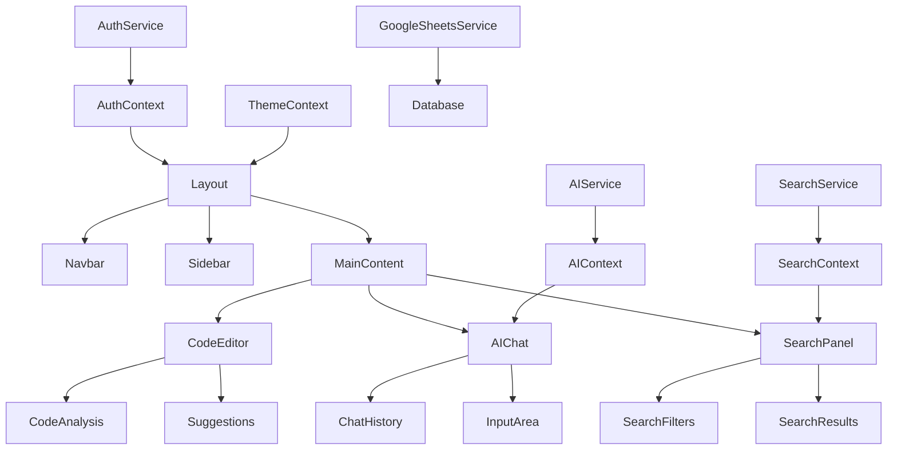
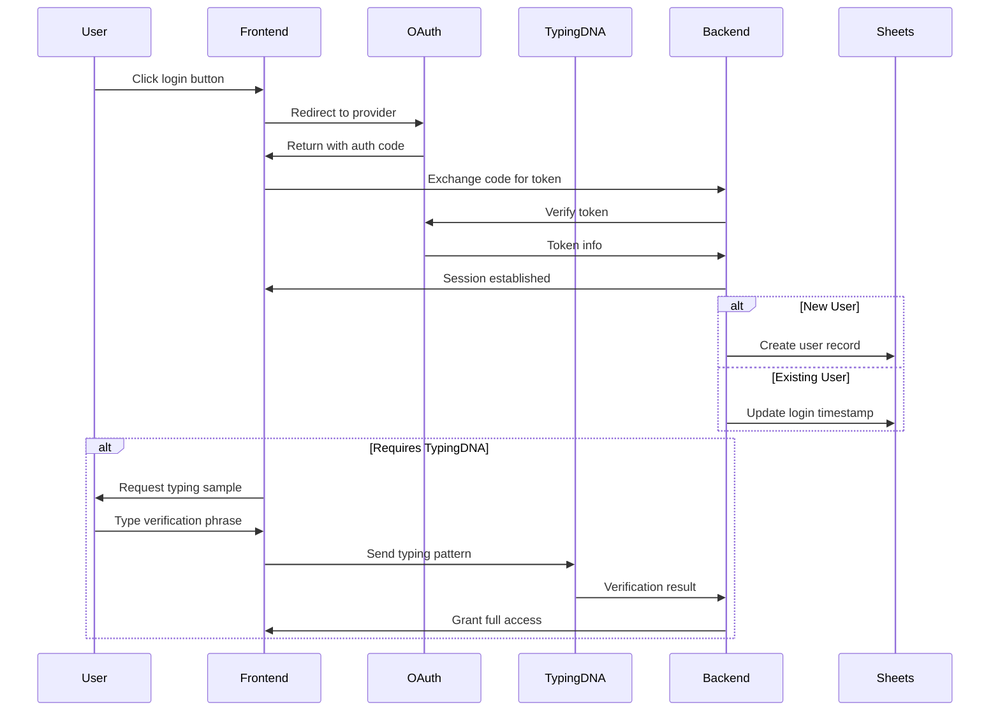
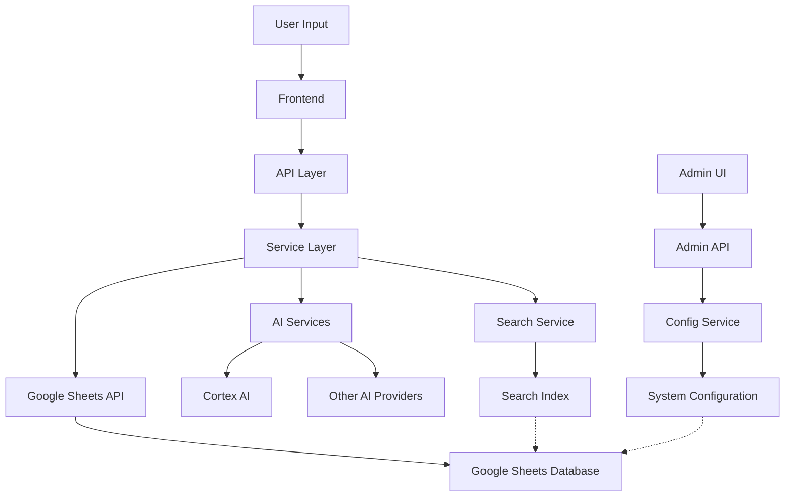

# Bolt AI UI Coding Assistant Framework - File Structure

## Project Structure Overview

```
bolt-ai-assistant/
├── .github/                    # GitHub configuration
├── docs/                       # Documentation
├── public/                     # Static assets
└── src/                        # Source code
    ├── components/             # React components
    ├── contexts/               # Context providers
    ├── hooks/                  # Custom React hooks
    ├── pages/                  # Next.js pages
    ├── services/               # Service integrations
    ├── styles/                 # Global styles
    ├── types/                  # TypeScript type definitions
    └── utils/                  # Utility functions
```

## Frontend Structure

### Components

```
src/components/
├── admin/                      # Admin panel components
│   ├── ApiKeyManager.tsx       # API key management
│   ├── ConfigSettings.tsx      # Configuration settings
│   ├── Dashboard.tsx           # Admin dashboard
│   ├── UserManagement.tsx      # User management
│   └── index.ts                # Component exports
├── auth/                       # Authentication components
│   ├── GithubLogin.tsx         # GitHub login button
│   ├── GoogleLogin.tsx         # Google login button
│   ├── LoginForm.tsx           # Main login form
│   ├── TypingDnaInput.tsx      # TypingDNA verification
│   └── index.ts                # Component exports
├── code/                       # Code-related components
│   ├── CodeEditor.tsx          # Monaco-based code editor
│   ├── CodeAnalysis.tsx        # Code analysis display
│   ├── SuggestionPanel.tsx     # AI suggestions
│   └── index.ts                # Component exports
├── common/                     # Shared components
│   ├── Button.tsx              # Custom button
│   ├── Card.tsx                # Card container
│   ├── Input.tsx               # Form inputs
│   ├── Layout.tsx              # Page layout
│   ├── Loading.tsx             # Loading indicators
│   ├── Modal.tsx               # Modal dialogs
│   ├── Navbar.tsx              # Navigation bar
│   ├── Sidebar.tsx             # Sidebar navigation
│   └── index.ts                # Component exports
├── search/                     # Search components
│   ├── SearchBar.tsx           # Main search interface
│   ├── SearchFilters.tsx       # Search refinement
│   ├── SearchResults.tsx       # Results display
│   └── index.ts                # Component exports
└── theme/                      # Theme components
    ├── ThemeProvider.tsx       # Theme context provider
    ├── TronElements.tsx        # Tron visual elements
    └── index.ts                # Component exports
```

### Pages

```
src/pages/
├── admin/                      # Admin pages
│   ├── api-keys.tsx            # API key management
│   ├── config.tsx              # System configuration
│   ├── dashboard.tsx           # Admin dashboard
│   ├── users.tsx               # User management
│   └── index.tsx               # Admin home
├── api/                        # API routes
│   ├── ai/                     # AI endpoints
│   ├── auth/                   # Auth endpoints
│   ├── admin/                  # Admin endpoints
│   └── search/                 # Search endpoints
├── auth/                       # Auth pages
│   ├── login.tsx               # Login page
│   ├── callback.tsx            # OAuth callback
│   └── verify.tsx              # Verification
├── search/                     # Search pages
│   └── index.tsx               # Search interface
├── _app.tsx                    # App wrapper
├── _document.tsx               # Document wrapper
├── index.tsx                   # Home page
└── 404.tsx                     # Not found page
```

## Backend Structure

### Services

```
src/services/
├── ai/                         # AI services
│   ├── cortex.ts               # Cortex AI integration
│   ├── agent.ts                # AI agent framework
│   ├── codeAnalysis.ts         # Code analysis
│   └── index.ts                # Service exports
├── auth/                       # Auth services
│   ├── github.ts               # GitHub OAuth
│   ├── google.ts               # Google OAuth
│   ├── typingDna.ts            # TypingDNA integration
│   ├── session.ts              # Session management
│   └── index.ts                # Service exports
├── db/                         # Database services
│   ├── googleSheets.ts         # Google Sheets API
│   ├── schema.ts               # Database schema
│   ├── cache.ts                # Caching layer
│   └── index.ts                # Service exports
├── search/                     # Search services
│   ├── algolia.ts              # Algolia integration
│   ├── indexing.ts             # Search indexing
│   └── index.ts                # Service exports
└── admin/                      # Admin services
    ├── apiKeys.ts              # API key management
    ├── config.ts               # System config
    ├── users.ts                # User management
    └── index.ts                # Service exports
```

## API Structure

```
src/pages/api/
├── ai/                         # AI endpoints
│   ├── analyze.ts              # Code analysis
│   ├── complete.ts             # Code completion
│   ├── chat.ts                 # AI chat
│   └── generate.ts             # Code generation
├── auth/                       # Auth endpoints
│   ├── github/                 # GitHub OAuth
│   ├── google/                 # Google OAuth
│   ├── typing-dna.ts           # TypingDNA verification
│   ├── login.ts                # Login handler
│   ├── logout.ts               # Logout handler
│   └── verify.ts               # Verification handler
├── admin/                      # Admin endpoints
│   ├── keys.ts                 # API key management
│   ├── config.ts               # Configuration
│   ├── users.ts                # User management
│   └── stats.ts                # System statistics
└── search/                     # Search endpoints
    ├── query.ts                # Search execution
    ├── index.ts                # Index management
    └── suggest.ts              # Search suggestions
```

## Google Sheets Database Schema

```
Google Drive/
└── Bolt AI Database/
    ├── users.sheet             # User data
    │   ├── id                  # Unique identifier
    │   ├── email               # User email
    │   ├── name                # User name
    │   ├── auth_provider       # Auth provider
    │   ├── provider_id         # Provider identifier
    │   ├── typing_dna_profile  # TypingDNA profile
    │   ├── created_at          # Creation timestamp
    │   ├── last_login          # Last login timestamp
    │   └── role                # User role
    ├── api_keys.sheet          # API keys
    │   ├── id                  # Key identifier
    │   ├── service             # Service name
    │   ├── key                 # Encrypted key
    │   ├── created_at          # Creation timestamp
    │   └── last_used           # Last usage timestamp
    ├── code_snippets.sheet     # Code archive
    │   ├── id                  # Snippet identifier
    │   ├── user_id             # Creator identifier
    │   ├── title               # Snippet title
    │   ├── description         # Snippet description
    │   ├── language            # Programming language
    │   ├── code                # Actual code
    │   ├── tags                # Associated tags
    │   ├── created_at          # Creation timestamp
    │   └── updated_at          # Last update timestamp
    ├── ai_interactions.sheet   # AI interaction logs
    │   ├── id                  # Interaction identifier
    │   ├── user_id             # User identifier
    │   ├── query               # User query
    │   ├── response            # AI response
    │   ├── model               # AI model used
    │   ├── tokens_used         # Token count
    │   ├── created_at          # Creation timestamp
    │   └── feedback            # User feedback
    └── system_config.sheet     # System configuration
        ├── key                 # Setting key
        ├── value               # Setting value
        ├── type                # Value type
        ├── description         # Setting description
        └── updated_at          # Last update timestamp
```

## Key Component Relationships



## Infrastructure Components

### Authentication Flow



### Data Flow



## Feature-Component Mapping

| Feature | Primary Components | Services | Pages |
|---------|-------------------|----------|-------|
| **Authentication** | `LoginForm`, `GithubLogin`, `GoogleLogin`, `TypingDnaInput` | `auth/*` | `/auth/*` |
| **Code Editor** | `CodeEditor`, `CodeAnalysis`, `SuggestionPanel` | `ai/codeAnalysis` | `/` |
| **AI Chat** | `ChatInterface`, `MessageList`, `InputArea` | `ai/agent` | `/chat` |
| **Search** | `SearchBar`, `SearchFilters`, `SearchResults` | `search/*` | `/search` |
| **Admin Panel** | `Dashboard`, `ApiKeyManager`, `ConfigSettings`, `UserManagement` | `admin/*` | `/admin/*` |
| **Knowledge Base** | `SnippetList`, `SnippetView`, `SnippetEditor` | `db/googleSheets` | `/snippets/*` |

## Size and Metrics

- Estimated total number of files: ~120
- Estimated lines of code: ~15,000
- Key directories by size:
  - `src/components/`: ~40 files
  - `src/services/`: ~25 files
  - `src/pages/`: ~20 files
  - `src/api/`: ~15 files
  - `src/hooks/`: ~10 files
  - `src/contexts/`: ~5 files

## Dependencies

### Frontend Dependencies
- React & Next.js (core framework)
- Chakra UI (customized for Tron theme)
- React Query (data fetching)
- Monaco Editor (code editing)
- Firebase Auth (authentication)
- TypingDNA API client
- Algolia Search
- Framer Motion (animations)

### Backend Dependencies
- Next.js API routes
- Google APIs (Sheets, Drive, Auth)
- TypingDNA API
- Cortex AI client
- Redis (optional caching)
- Firebase Admin SDK

## Notes

- The file structure follows a feature-based organization pattern
- Component naming uses PascalCase
- Services and utilities use camelCase
- Files are organized by feature then by type
- Google Sheets serves as the primary database
- All API endpoints are implemented as Next.js API routes 