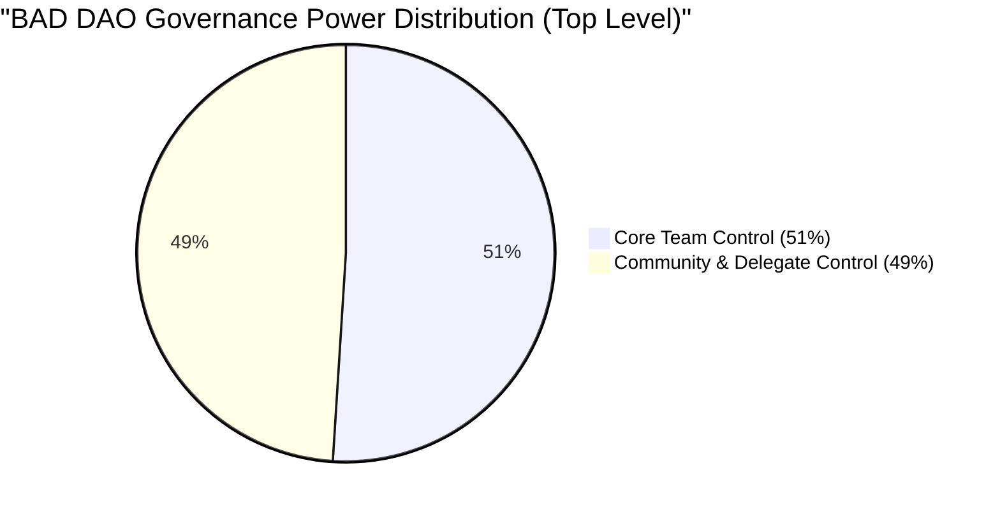
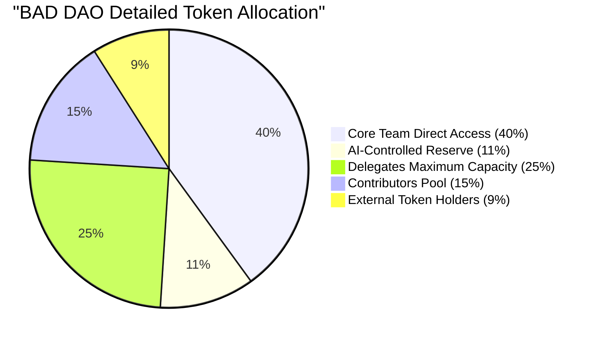
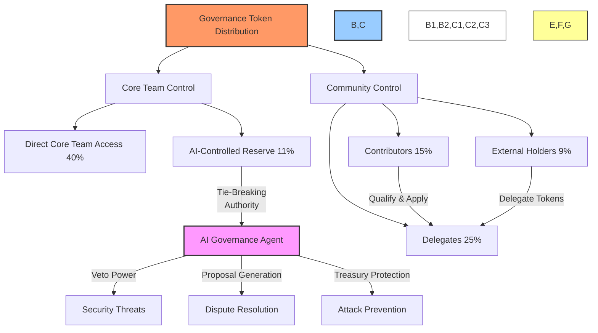
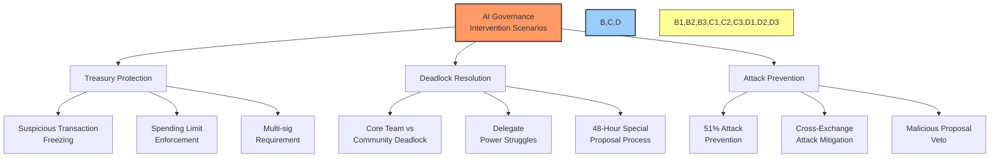
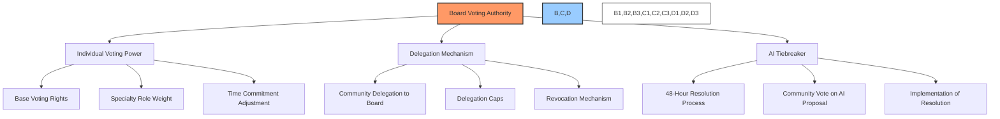

# 📝 BAD DAO BOARD OF DIRECTORS CONTRACT

## 📋 CONTRACT AGREEMENT

This Board of Directors Contract (the "Contract") is entered into as of **[EFFECTIVE_DATE]** by and between:

**BAD DAO** ("the DAO"), a Decentralized Autonomous Organization

and

**[DIRECTOR_NAME]** ("Director"), an individual appointed to the Board of Directors

## 📑 Table of Contents

- [🎯 Purpose and Role](#-purpose-and-role)
- [🏛️ Board Structure and Composition](#️-board-structure-and-composition)
- [🔄 Term and Succession](#-term-and-succession)
- [🗳️ Voting and Decision Authority](#️-voting-and-decision-authority)
- [💰 Treasury Oversight](#-treasury-oversight)
- [📋 Duties and Responsibilities](#-duties-and-responsibilities)
- [⚖️ Dispute Resolution Powers](#️-dispute-resolution-powers)
- [🤖 AI Integration Responsibilities](#-ai-integration-responsibilities)
- [💸 Compensation Structure](#-compensation-structure)
- [🔄 Rotation of Oversight Roles](#-rotation-of-oversight-roles)
- [📊 Performance Evaluation](#-performance-evaluation)
- [⚠️ Removal and Termination](#️-removal-and-termination)
- [🔒 Confidentiality and IP](#-confidentiality-and-ip)
- [🚫 Conflicts of Interest](#-conflicts-of-interest)
- [📃 Signatures](#-signatures)

## 🎯 Purpose and Role

### Board Mandate
The Board of Directors serves as the strategic oversight body of BAD DAO, providing governance leadership, domain expertise, and serving as the ultimate arbiter in governance and operational matters. The Board has the potential to accumulate up to 49% of the total governance authority through delegation from community members, while the community (contributors, delegates, and other token holders) retains 51% of governance authority. The AI governance agent serves as a tiebreaker in deadlocked scenarios to facilitate efficient resolution of disputes.

### Governance Power Distribution



#### Detailed Governance Token Allocation



#### Delegation System Structure



#### AI Intervention Scenarios



The governance power distribution reflects the following principles:

1. **Core Team Authority**: The Core Team maintains 51% control of governance tokens, with 40% directly accessible and 11% reserved for AI governance operations
   
2. **Delegation Mechanics**: 
   - Contributors can delegate their tokens to specialized delegates to increase voting effectiveness
   - Contributors can apply to become delegates after demonstrating project success and platform contributions
   - Delegates receive revenue sharing from successful proposals under their management
   - Delegate power is capped at 25% of total governance tokens to prevent excessive concentration

3. **Contributor Advancement**:
   - Contributors begin with basic voting rights
   - After successful project completion and positive contribution history, contributors can apply for delegate status
   - Delegates gain enhanced proposal capabilities, higher spending limits, and project treasury management rights
   - Delegates can manage multiple contributors and their respective projects

4. **AI Governance Safeguards**:
   - AI controls 11% of governance tokens for security and tie-breaking
   - AI can veto malicious proposals through the special proposal process
   - AI generates resolution proposals during deadlocks between Core Team and Community
   - Special 48-hour resolution cycle for contested decisions
   - AI provides treasury protection against coordinated attacks

5. **Attack Prevention Mechanisms**:
   - Multi-signature requirements for large treasury movements
   - AI veto power for suspicious transactions
   - Delegation caps to prevent power concentration
   - Cross-exchange attack monitoring and prevention
   - Malicious proposal identification and freezing

### Director Specialty Role
Director is appointed to the Board as a specialist in **[SPECIALTY_AREA]**, bringing expertise in this domain to the strategic direction and governance of the DAO. This Contract outlines the specific responsibilities, powers, compensation, and operational parameters of this appointment.

## 🏛️ Board Structure and Composition

### Overall Composition
1. The Board of Directors consists of 13 members total:
   - 5 Core Team Members with permanent seats
   - 2 Ambassador Roles for expert external advisors
   - 6 Specialty Roles filled based on strategic needs

2. Director is appointed to one of the following positions:
   - [ ] Core Team Member with Permanent Seat
   - [ ] Ambassador Role
   - [ ] Specialty Role: **[SPECIALTY_DESCRIPTION]**

### Specialty Seats Distribution
The six specialty seats on the Board are allocated to experts in these critical domains:

1. **Legal and Regulatory Affairs** - Expert in blockchain law, regulatory compliance, and legal structure of DAOs
2. **Finance and Treasury Management** - Expert in crypto treasury management, financial planning, and risk management
3. **Technology and Infrastructure** - Expert in blockchain infrastructure, smart contract security, and technical architecture
4. **Business Development and Partnerships** - Expert in strategic partnerships, business models, and ecosystem growth
5. **Governance and Tokenomics** - Expert in token design, governance mechanisms, and incentive structures
6. **Community and Ecosystem Management** - Expert in community building, contributor engagement, and ecosystem health

### Board Leadership
- **Board Chair**: Elected annually from among the Board members
- **Vice Chair**: Elected annually to assist the Chair and serve in their absence
- **Secretary**: Appointed to maintain records, minutes, and official documentation

### Committees
1. **Executive Committee**: Chair, Vice Chair, and one additional Director
2. **Audit and Risk Committee**: Responsible for financial oversight and risk management
3. **Governance Committee**: Responsible for governance structure, proposals, and compliance
4. **Strategic Initiatives Committee**: Responsible for long-term planning and major initiatives

Director agrees to serve on the following committee(s): **[COMMITTEE_ASSIGNMENTS]**

## 🔄 Term and Succession

### Term of Service
- **Core Team Members**: Indefinite term with permanent seat
- **Ambassador and Specialty Roles**: **[TERM_LENGTH]** (12-24 months standard)
- **Term Start Date**: **[START_DATE]**
- **Term End Date**: **[END_DATE]** (if applicable)

### Term Renewal
- Terms for non-permanent seats may be renewed by mutual agreement
- Renewal requires formal approval through the DAO governance process
- Maximum of 3 consecutive terms for any non-permanent seat

### Succession Planning
- Director must provide **[NOTICE_PERIOD]** (60 days standard) notice of intent to vacate position
- Director will assist in identifying and onboarding qualified successor
- If Director holds a permanent Core Team seat, succession follows Core Team succession policy

## 🗳️ Voting and Decision Authority

### Voting Power Framework



### Individual Director Voting Power
- Director is allocated **[VOTING_PERCENTAGE]**% of Board voting power
- Voting power may be adjusted based on role, expertise, and performance
- Director may receive additional voting power through delegation from community members

### Quorum Requirements
- Minimum 7 Directors (majority) present for valid Board meetings
- Minimum 75% attendance required for high-priority decisions
- Remote participation counts toward quorum and voting

### Decision Thresholds
1. **Simple Majority** (>50% of votes cast)
   - Routine operational decisions
   - Committee appointments
   - Regular proposal reviews

2. **Supermajority** (≥75% of votes cast)
   - Treasury allocations exceeding **[THRESHOLD_AMOUNT]**
   - Rules amendments
   - Strategic direction changes
   - Removal of Board members

3. **Emergency Powers**
   - Board Chair plus any 4 Directors can make emergency decisions
   - Emergency decisions require retroactive ratification within 48 hours

### AI Tie-Breaking Mechanism
- In the event of equal division between Board and community governance powers
- Special 48-hour dispute resolution cycle is triggered
- AI governance agent creates proposal for resolution
- Community votes on AI-generated resolution within 48 hours
- Outcome binding on all parties

## 💰 Treasury Oversight

### Treasury Oversight Committee
- Two-member committee drawn from Board of Directors
- Rotates monthly through lottery system
- No consecutive terms for any Director
- Director agrees to serve when selected through rotation

### Oversight Responsibilities
1. **Budget Review**
   - Review all budget proposals exceeding **[BUDGET_THRESHOLD]**
   - Ensure compliance with financial policies
   - Verify alignment with strategic objectives
   - Confirm technical feasibility and resource availability

2. **Transaction Monitoring**
   - Monitor all treasury transactions exceeding **[TRANSACTION_THRESHOLD]**
   - Review automated treasury management systems
   - Supervise Guardian Treasury AI operations
   - Ensure multi-signature compliance

3. **Financial Reporting**
   - Review monthly financial reports
   - Verify accuracy of treasury balances
   - Monitor budget adherence
   - Track key financial metrics

4. **Risk Management**
   - Assess treasury diversification strategy
   - Monitor market risks to treasury assets
   - Review security measures for treasury operations
   - Ensure adequate contingency planning

### Approval Authority
- Treasury transactions under **[SMALL_THRESHOLD]** require Core Team approval only
- Transactions between **[SMALL_THRESHOLD]** and **[LARGE_THRESHOLD]** require Oversight Committee approval
- Transactions exceeding **[LARGE_THRESHOLD]** require full Board approval
- Emergency expenditures follow defined emergency protocols

## 📋 Duties and Responsibilities

### General Duties
1. **Fiduciary Responsibility**
   - Act in the best interest of the DAO and its community
   - Maintain highest standards of integrity and ethical conduct
   - Exercise reasonable care, diligence, and skill in decision-making
   - Prioritize long-term sustainability over short-term gains

2. **Strategic Guidance**
   - Contribute to strategic planning and vision
   - Evaluate strategic initiatives and proposals
   - Provide domain expertise in **[SPECIALTY_AREA]**
   - Identify emerging trends and opportunities

3. **Governance Oversight**
   - Ensure compliance with rules and regulations
   - Maintain balance between decentralization and effective governance
   - Review and approve governance improvements
   - Monitor governance metrics and effectiveness

4. **Community Engagement**
   - Maintain regular communication with the community
   - Participate in governance forums and discussions
   - Explain Board decisions and rationales
   - Represent stakeholder interests in decision-making

### Specialty Role Responsibilities
Director is appointed as **[SPECIALTY_ROLE]** and agrees to fulfill these additional responsibilities:

**[SPECIALTY_RESPONSIBILITIES]**

### Time Commitment
- Attend minimum **[MEETING_FREQUENCY]** Board meetings
- Serve **[HOURS_PER_MONTH]** hours monthly (minimum)
- Participate in relevant committee meetings
- Remain available for emergency sessions when required
- Review proposals and governance matters in a timely manner

### Performance Standards
- Maintain **[ATTENDANCE_PERCENTAGE]**% attendance at required meetings
- Respond to urgent matters within **[RESPONSE_TIME]** hours
- Complete assigned tasks within agreed deadlines
- Maintain current knowledge of DAO operations and industry developments

## ⚖️ Dispute Resolution Powers

### Dispute Resolution Authority
1. **Internal Disputes**
   - Authority to mediate disputes between Core Team members
   - Final arbiter for interpretation of rules and regulations
   - Resolution of conflicts between committees or functional units
   - Adjudication of disputes involving treasury allocations

2. **Community Governance Disputes**
   - Review contested proposal outcomes
   - Resolve disputes over proposal implementation
   - Mediate conflicts between community factions
   - Interpret governance rules in contested situations

3. **Special Proposal Process**
   - May initiate 48-hour special proposal process for urgent matters
   - Can request AI-assisted dispute resolution
   - Authority to freeze contested assets or decisions pending resolution
   - Can establish specialized arbitration committees

### Resolution Mechanisms
1. **Good Faith Negotiation**: Parties attempt direct resolution
2. **Core Team Mediation**: Core Team mediates if negotiation fails
3. **Board Review**: Full Board reviews if mediation fails
4. **Community Vote**: Matter submitted to community vote with Board recommendation
5. **AI Arbitration**: In deadlock scenarios, AI governance agent creates resolution proposal

### Voting Procedural Controls
- Director may call for formal voting procedures on any contested matter
- May request written position statements from involved parties
- Can require formal impact analysis for contentious proposals
- Authority to establish time-limited discussion periods

## 🤖 AI Integration Responsibilities

### AI Governance Oversight
1. **AI Policy Direction**
   - Approve AI governance policies and parameters
   - Review AI decision-making frameworks
   - Ensure AI alignment with DAO values and objectives
   - Authorize AI access levels and permissions

2. **AI Implementation**
   - Monitor AI integration with governance systems
   - Review AI performance metrics
   - Approve updates to AI governance models
   - Ensure transparency in AI operations

3. **AI Risk Management**
   - Evaluate potential risks of AI governance components
   - Establish safeguards against AI misalignment
   - Review failsafe mechanisms
   - Approve contingency plans for AI system failures

### AI Delegation Parameters
- Define boundaries of AI decision-making authority
- Establish human override mechanisms
- Approve validation processes for AI recommendations
- Review all AI-generated dispute resolutions

### Director's AI-Related Duties
- Maintain current understanding of DAO's AI governance systems
- Review AI governance performance reports
- Participate in periodic AI alignment calibration
- Vote on major AI system changes and upgrades

## 💸 Compensation Structure

### Compensation Framework
1. **Base Compensation**
   - **[BASE_COMPENSATION]** tokens per month
   - Paid in **[TOKEN_TYPE]** from Treasury
   - **[PAYMENT_FREQUENCY]** payment schedule
   - **[VESTING_SCHEDULE]** vesting conditions (if applicable)

2. **Performance-Based Compensation**
   - Up to **[PERFORMANCE_BONUS]**% additional based on performance metrics
   - Quarterly performance evaluation
   - Tied to overall DAO performance and individual contributions
   - Key performance indicators: **[KPI_LIST]**

3. **Meeting and Activity Compensation**
   - **[MEETING_COMPENSATION]** per required meeting attended
   - **[COMMITTEE_COMPENSATION]** for committee service
   - **[SPECIAL_PROJECT_COMPENSATION]** for special assignments
   - **[EMERGENCY_COMPENSATION]** for emergency sessions

### Expense Reimbursement
- Reasonable expenses incurred in performance of duties
- Must comply with DAO expense policy
- Require documentation and approval
- Subject to monthly caps: **[EXPENSE_CAP]**

### Compensation Restrictions
- No compensation for conflicting external activities
- Compensation subject to clawback for breach of duties
- Conditional on minimum **[MINIMUM_ACTIVITY]** activity level
- Adjusted based on part-time/full-time commitment level

## 🔄 Rotation of Oversight Roles

### Rotational Assignments
1. **Treasury Oversight Committee**
   - Monthly rotation through lottery system
   - No consecutive terms on committee
   - Maximum 3 months service per year
   - Director agrees to serve when selected

2. **Special Project Oversight**
   - Quarterly assignment based on expertise match
   - Rotates among all Board members
   - Matched to Director's specialty area when possible
   - Time commitment: **[PROJECT_HOURS]** hours per assignment

3. **Community Liaison Role**
   - Bi-monthly rotation as primary community representative
   - Responsible for community communications during assigned period
   - Holds open forums and feedback sessions
   - Reports community sentiment to Board

### Rotation Schedule
- Rotation schedule published quarterly
- Assignments consider Director's expertise and workload
- Swaps permitted with mutual consent and Chair approval
- Emergency backup Directors designated for each rotation

### Handover Process
- Formal handover meeting between outgoing and incoming assignees
- Documentation of ongoing matters and pending decisions
- Transfer of relevant access credentials
- Three-day overlap period for knowledge transfer

## 📊 Performance Evaluation

### Evaluation Process
1. **Self-Assessment**
   - Director completes quarterly self-assessment
   - Evaluates performance against agreed objectives
   - Documents contributions and achievements
   - Identifies areas for improvement

2. **Peer Review**
   - Quarterly assessment by fellow Board members
   - Evaluation based on standard performance criteria
   - Includes both qualitative and quantitative measures
   - Confidential feedback mechanism

3. **Community Feedback**
   - Community satisfaction surveys
   - Feedback on Director's engagement and responsiveness
   - Assessment of Director's representation of community interests
   - Transparency in decision-making

4. **Metrics-Based Assessment**
   - Attendance and participation rates
   - Proposal review timeliness
   - Committee contribution assessment
   - Specialty area performance indicators

### Performance Metrics
- **Attendance**: **[ATTENDANCE_TARGET]**% of required meetings
- **Responsiveness**: Average response time to critical matters
- **Quality**: Peer rating of contribution quality
- **Initiative**: Number and quality of proposals initiated
- **Domain Expertise**: Application of specialty knowledge
- **Community Engagement**: Participation in community discussions

### Performance Review Outcomes
- Performance rating determines compensation adjustments
- Identifies professional development opportunities
- Influences committee assignments
- Affects eligibility for term renewal

## ⚠️ Removal and Termination

### Termination Conditions
1. **Voluntary Resignation**
   - **[NOTICE_PERIOD]** written notice required
   - Transition plan for role and responsibilities
   - Exit interview with Board Chair
   - Return of all DAO property and credentials

2. **Performance-Based Removal**
   - Requires documented performance deficiencies
   - Formal warning and improvement plan process
   - Supermajority Board vote required for removal
   - Right to present defense to Board

3. **Breach of Duties**
   - Immediate suspension for serious breach
   - Investigation by Governance Committee
   - Board vote on findings and recommended action
   - Potential for immediate termination

4. **Term Expiration**
   - Automatic termination at end of term unless renewed
   - Renewal requires affirmative Board vote and Director acceptance
   - Performance review informs renewal decision
   - Transition plan if not renewed

### Removal Process
- Formal motion for removal must be submitted with cause
- Director entitled to written notice and response opportunity
- Hearing before full Board if requested
- Supermajority (75%) vote required for removal
- Appeal process through Guardian Council available

### Effect of Termination
- Immediate cessation of voting rights
- Prorated compensation through termination date
- Return of all DAO confidential information
- Continued confidentiality obligations
- Unvested tokens handled per **[VESTING_TERMINATION_POLICY]**

## 🔒 Confidentiality and IP

### Confidential Information
- All non-public information regarding DAO operations
- Unreleased product or feature plans
- Treasury management strategies
- Undisclosed partnerships or negotiations
- Internal governance deliberations

### Confidentiality Obligations
- Maintain strict confidentiality during and after term
- Use information solely for DAO purposes
- Implement reasonable safeguards against disclosure
- Return all confidential materials upon request or termination
- Confidentiality period: **[CONFIDENTIALITY_PERIOD]** after termination

### Intellectual Property
- All work product created in Director capacity belongs to DAO
- Director assigns all rights, title, and interest to DAO
- Director will execute documents to perfect DAO ownership
- DAO grants limited license to use materials for Director duties

### Public Communications
- Adhere to DAO communication policies
- Coordinate public statements with Communication Team
- Disclose Director status in relevant communications
- Distinguish personal opinions from official DAO positions

## 🚫 Conflicts of Interest

### Definition of Conflicts
- Financial interest in entities doing business with DAO
- Competing governance positions in other DAOs
- Personal relationships affecting objective decision-making
- Outside activities that could compromise DAO interests

### Disclosure Requirements
- Initial disclosure of all potential conflicts
- Immediate disclosure of new conflicts as they arise
- Annual conflict of interest attestation
- Specific disclosure before voting on related matters

### Conflict Management
- Recusal from discussions and votes on conflicted matters
- Documentation of recusal in meeting minutes
- Board may establish additional safeguards for specific conflicts
- Serious conflicts may require resignation from specific roles

### Outside Activities
- Disclose all crypto/Web3/AI-related professional activities
- Obtain approval for new professional engagements in related fields
- No participation in directly competing projects
- Time commitment to outside activities limited to ensure adequate attention to Board duties

## 📃 Signatures

This Contract constitutes the entire agreement between BAD DAO and Director regarding Board service.

**BAD DAO Representative:**

**[DAO_REPRESENTATIVE_NAME]**: _________________________ Date: __________

**Board of Directors Member:**

**[DIRECTOR_NAME]**: _________________________ Date: __________

**Witness:**

**[WITNESS_NAME]**: _________________________ Date: __________

---

## 📊 Metadata for AI Integration

```json
{
  "contract_type": "board_of_directors",
  "director": {
    "name": "[DIRECTOR_NAME]",
    "role": "[SPECIALTY_ROLE]",
    "term_start": "[START_DATE]",
    "term_end": "[END_DATE]"
  },
  "governance": {
    "voting_weight": "[VOTING_PERCENTAGE]",
    "committee_assignments": "[COMMITTEE_ASSIGNMENTS]",
    "specialty_area": "[SPECIALTY_AREA]"
  },
  "compensation": {
    "base_amount": "[BASE_COMPENSATION]",
    "token_type": "[TOKEN_TYPE]",
    "schedule": "[PAYMENT_FREQUENCY]",
    "performance_bonus": "[PERFORMANCE_BONUS]"
  },
  "requirements": {
    "minimum_hours": "[HOURS_PER_MONTH]",
    "meeting_frequency": "[MEETING_FREQUENCY]",
    "attendance_target": "[ATTENDANCE_PERCENTAGE]"
  }
}
```

*This document is a contract template and should be reviewed by legal professionals before implementation. The final contract should be approved through appropriate BAD DAO governance processes.* 