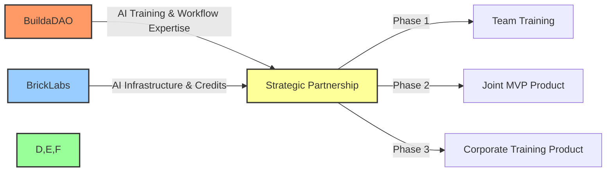
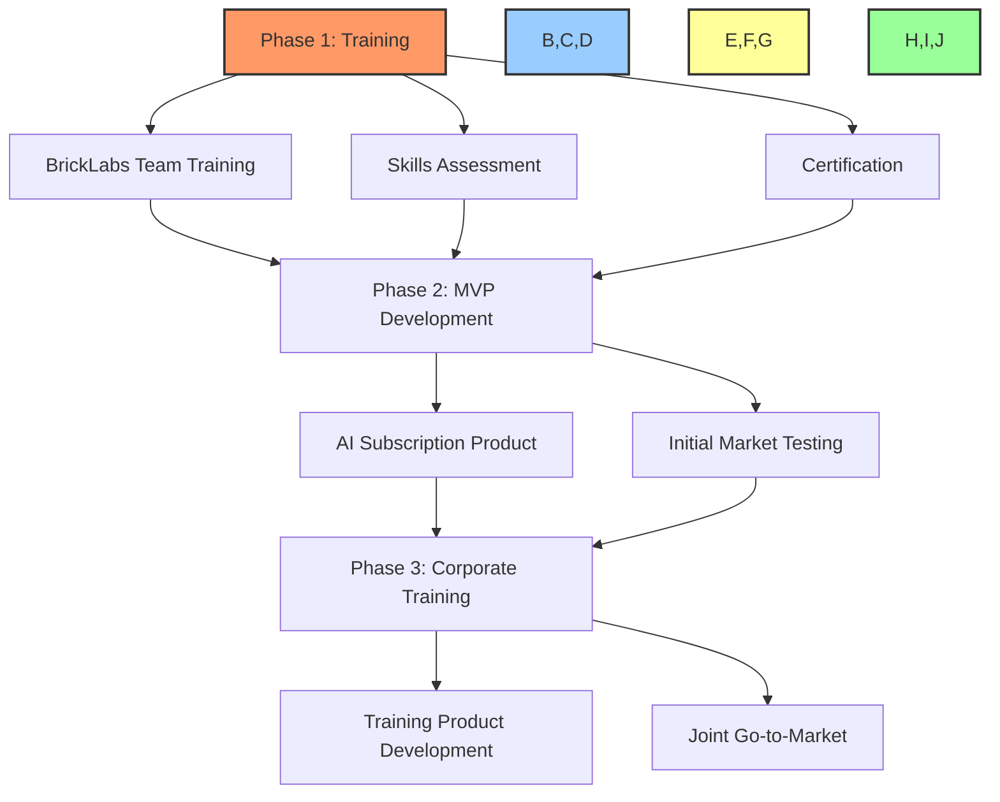

# 🤝 Amended Strategic Partnership: BuildaDAO & BrickLabs

## 📋 Table of Contents
- [📝 Document Information](#document-information)
- [🔍 Partnership Overview](#partnership-overview)
- [💼 Value Exchange & Opportunity](#value-exchange--opportunity)
- [💰 Revenue Models](#revenue-models)
- [🛠️ Implementation Strategy](#implementation-strategy)
- [📊 Resource Allocation](#resource-allocation)
- [⚠️ Risks & Mitigation](#risks--mitigation)
- [📋 Next Steps](#next-steps)
- [✍️ Agreement Signatures](#agreement-signatures)

---

## 📝 Document Information
**Original Agreement Date:** [ORIGINAL DATE]
**Amendment Date:** [CURRENT DATE]
**Version:** 2.0

## 🔍 Partnership Overview

BuildaDAO and BrickLabs hereby formalize their strategic alliance to accelerate revenue generation and market penetration through complementary expertise, resources, and technologies. This amended agreement reflects the discussions and counter-offers accepted during our recent meeting.

**By signing this overview, you also agree to the attached comprehensive partnership agreement, training services work order, and server credits usage agreement.**

## 💼 Value Exchange & Opportunity

### 🏗️ BuildaDAO Brings:
- 🤖 **AI Development Expertise:** Advanced Cursor AI workflows, prompting techniques, and development methodologies
- 🎓 **Training & Upskilling:** Premium AI development training (normally $3,000 per person, offered at $500 per person for partnership)
- 🧰 **Development Kit:** Proprietary BuildaDAO development kit (value: $5,000)
- ⚡ **Process Optimization:** Methods to reduce development time from days to hours
- 📊 **Product Strategy:** Revenue model optimization and go-to-market strategies

### 🔬 BrickLabs Brings:
- ☁️ **AI Infrastructure:** Server credits from Microsoft, AWS, and other providers (value to be determined)
- 🤖 **AI Technology:** Modular AI agents and integration capabilities
- 👨‍💻 **Development Team:** Four developers for training and joint product development
- 📈 **Market Validation:** Existing traction and minimum viable products
- 💰 **Cash Investment:** $2,000 for initial team training

### 🚀 Joint Opportunity:
Develop multiple scalable revenue streams through a phased approach:
1. 🎓 **Phase 1:** BrickLabs team training and skill certification
2. 🏗️ **Phase 2:** Joint MVP development for subscription service
3. 📚 **Phase 3:** Corporate training product development and marketing

## 💰 Revenue Models

### 1. 🤖 AI Agent Subscription Service (Phase 2)
- ☁️ Utilize BrickLabs' server credits for development and initial hosting
- 🧰 BuildaDAO to contribute proprietary workflow systems and technical expertise
- 💲 Joint subscription model with revenue sharing
- 📊 Target: $25-75 per user/month with enterprise pricing tiers

### 2. 📚 Corporate AI Training & Upskilling (Phase 3)
- 🎓 Joint development of corporate training program based on BuildaDAO methodologies
- 🏷️ White-label under joint branding for B2B sales
- 💰 Target: $2,500-10,000 per corporate client
- 📝 Based on training provided to BrickLabs team in Phase 1

### 3. 🏭 Future Opportunities (Post Phase 3)
- ✨ Additional products and services to be determined
- 🛠️ Building on foundation established in Phases 1-3
- 📑 Subject to mutual agreement and separate work orders

## 🛠️ Implementation Strategy

### 📅 Phase 1: Training (Weeks 1-4)
- 👨‍💻 BrickLabs team training (up to 10 team members at $500/participant, minimum 4)
- 📊 Skills assessment and workflow analysis
- 🛠️ Development methodology implementation
- 🎓 Team certification

### 📅 Phase 2: MVP Development (Weeks 5-12)
- 🏗️ Build and launch AI subscription product
- ☁️ Utilize server credits within established caps
- 📈 Demonstrate efficiency gains from training
- 🧪 Initial market testing

### 📅 Phase 3: Corporate Training Product (Months 4-12)
- 📚 Develop joint corporate training offering
- 📣 Create marketing materials and sales process
- 🚀 Launch to market with joint branding
- 💰 Establish revenue sharing mechanisms

## 📊 Resource Allocation

### 💲 Training Investment
- 💰 BrickLabs to pay BuildaDAO $2,000 for training services (full payment upfront via ERC-20 USDT)
- 👥 Covers training for 4-10 team members
- 📉 Represents 83% discount from standard pricing

### ☁️ Server Credits Allocation
- 💻 BrickLabs to provide server credits with a value not to exceed [AMOUNT TBD]
- 🎯 Credits to be used exclusively for joint product development
- 🛑 Hard caps on usage as specified in Server Credits Usage Agreement
- 🔄 Transition to cost-sharing model after credit exhaustion

### ⏱️ Time Commitment
- 🧑‍🏫 BuildaDAO: [X] hours for training, [Y] hours for product development
- 👨‍💻 BrickLabs: [Z] hours for training participation, team resources for development

## ⚠️ Risks & Mitigation

| Risk | Mitigation |
|------|------------|
| 🔒 **IP Protection Concerns** | Clear delineation of proprietary IP in agreement; licensing for specific use cases only |
| 🛑 **Server Credit Overuse** | Hard caps and usage monitoring; monthly reporting |
| 💰 **Revenue Sharing Disputes** | Smart contract-based revenue distribution with transparent metrics |
| 📉 **Market Adoption Challenges** | Phased approach with clear KPIs; pivot capability built into agreement |
| 👥 **Team Alignment Issues** | Regular strategic alignment meetings; clear decision-making framework |

## 📋 Next Steps

1. 📝 **Review & Sign:** Sign this amended partnership agreement and attached documents
2. 📅 **Training Setup:** Schedule BrickLabs team training sessions
3. 🖥️ **Infrastructure Setup:** Configure server access and monitoring
4. 📊 **Technical Assessment:** Complete initial skills assessment
5. 🛠️ **Product Planning:** Finalize MVP specifications and timeline

## ✍️ Agreement Signatures

By signing below, both parties agree to this amended strategic partnership and the attached documents:

**BuildaDAO Representative:**

Name: _________________________ Title: _________________________

Signature: ______________________ Date: _________________________

**BrickLabs Representative:**

Name: _________________________ Title: _________________________

Signature: ______________________ Date: _________________________

---

*This amended agreement replaces the previous version dated [ORIGINAL DATE] and constitutes, together with the attached Training Services Work Order and Server Credits Usage Agreement, the complete understanding between the parties.*

[Back to Top](#-amended-strategic-partnership-buildadao--bricklabs) 