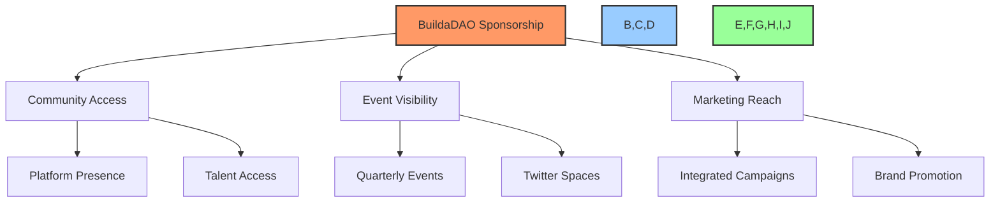

# 🤝 BuildaDAO Brand Sponsorship Agreement

## 📋 Table of Contents
- [📝 Document Information](#document-information)
- [🔍 Sponsorship Overview](#sponsorship-overview)
- [💎 Sponsorship Tiers](#sponsorship-tiers)
- [📊 Sponsor Benefits](#sponsor-benefits)
- [📅 Event Schedule & Visibility](#event-schedule--visibility)
- [📈 Marketing Integration](#marketing-integration)
- [⚠️ Terms & Conditions](#terms--conditions)
- [📋 Next Steps](#next-steps)
- [✍️ Agreement Signatures](#agreement-signatures)

---

## 📝 Document Information
**Proposal Date:** [DATE]  
**Version:** 1.0  
**Reference:** BuildaDAO Brand Sponsorship Agreement #[NUMBER]

## 🔍 Sponsorship Overview

BuildaDAO is pleased to present this sponsorship opportunity to [SPONSOR NAME]. As a Web3 ecosystem builder, we offer unique access to a thriving community of developers, creators, and organizations at the forefront of blockchain innovation.

Our sponsorship packages provide strategic visibility, community engagement, and marketing opportunities through our platform, events, and digital channels. By partnering with BuildaDAO, sponsors gain valuable exposure to our targeted audience of Web3 professionals and enthusiasts.

## 💎 Sponsorship Tiers

BuildaDAO offers three strategic sponsorship tiers designed to meet different engagement objectives and budgets:

### 🥉 Tier 1: Community Presence - $2,500
Our entry-level sponsorship provides essential visibility within the BuildaDAO ecosystem.

### 🥈 Tier 2: Event Partner - $7,500
Expanded visibility including prominent placement at our regular events.

### 🥇 Tier 3: Strategic Alliance - $20,000
Our premium sponsorship offering comprehensive marketing integration.

## 📊 Sponsor Benefits

| Benefit | 🥉 Tier 1 $2,500 | 🥈 Tier 2 $7,500 | 🥇 Tier 3 $20,000 |
|---------|--------------|--------------|----------------|
| **Platform Presence** | ✅ | ✅ | ✅ |
| Logo on BuildaDAO Website | ✅ | ✅ | ✅ |
| Dedicated Business Profile | ✅ | ✅ | ✅ |
| Job Posting Access | 3 per month | 10 per month | Unlimited |
| Featured Contributor Access | Basic | Enhanced | Priority |
| **Event Visibility** | ❌ | ✅ | ✅ |
| Logo on Event Materials | ❌ | ✅ | ✅ |
| Banner/Table Presence | ❌ | ✅ | ✅ |
| Event Announcements | ❌ | 1 per event | 3 per event |
| Speaking Opportunities | ❌ | ❌ | 1 per quarter |
| **Marketing Integration** | ❌ | ❌ | ✅ |
| Dedicated Marketing Campaigns | ❌ | ❌ | Quarterly |
| Community Newsletter Features | ❌ | ❌ | Monthly |
| Twitter Space Participation | ❌ | ❌ | Bi-monthly |
| Custom Content Creation | ❌ | ❌ | 1 per month |

## 📅 Event Schedule & Visibility

BuildaDAO hosts regular events designed to maximize sponsor visibility and engagement:

### 🗣️ Twitter Spaces
- **Frequency:** Weekly/Bi-weekly
- **Audience:** 300-500 live listeners, 1,000+ replays
- **Topics:** Web3 development, blockchain innovation, DAO governance

### 🎪 Quarterly Events
- **Format:** Hybrid (physical and virtual)
- **Attendance:** 200-400 participants
- **Features:** Keynotes, workshops, networking, demonstrations

### 📆 Annual Planning
For the upcoming 12 months, BuildaDAO will host:
- 24+ Twitter Spaces
- 4 Quarterly Events
- 1 Annual Summit

## 📈 Marketing Integration

### Tier 1: Community Presence ($2,500)
- Logo placement on website
- Dedicated business profile on BuildaDAO platform
- Job and opportunity posting capabilities
- Access to community talent pool

### Tier 2: Event Partner ($7,500)
*Includes all Tier 1 benefits, plus:*
- Brand visibility at quarterly events
- Logo placement on physical and digital event materials
- Dedicated table/banner space at physical events
- Announcements during events
- Increased job posting capacity

### Tier 3: Strategic Alliance ($20,000)
*Includes all Tier 1 & 2 benefits, plus:*
- Dedicated marketing campaigns within BuildaDAO community
- Regular features in community newsletters
- Speaking opportunities at events
- Participation in Twitter Spaces
- Custom content creation and distribution
- Deep integration of sponsor's offerings within community

## ⚠️ Terms & Conditions

### 📝 Agreement Term
- Initial sponsorship term: 12 months
- Renewal option available at then-current rates

### 💰 Payment Terms
- 50% due upon agreement signing
- 50% due within 90 days of signing
- All amounts in USD
- Payment methods: Wire transfer, crypto payment (specific tokens accepted: [LIST])

### 🔄 Sponsor Responsibilities
- Provide high-resolution logos and brand assets
- Submit content for profiles and marketing materials
- Approve marketing materials within 5 business days
- Designate point of contact for coordination

### ⛔ Restrictions
- No promotion of competing DAO platforms
- Content subject to BuildaDAO community guidelines
- Compliance with applicable regulations required

## 📋 Next Steps

1. **Review Proposal:** Evaluate sponsorship tiers and benefits
2. **Select Tier:** Choose appropriate sponsorship level
3. **Implementation Planning:** Coordinate platform presence and marketing activities
4. **Agreement Signing:** Complete and sign sponsorship agreement
5. **Kickoff Meeting:** Schedule coordination call to initiate partnership

## ✍️ Agreement Signatures

By signing below, the parties agree to the terms outlined in this sponsorship agreement:

**BuildaDAO Representative:**

Name: _________________________ Title: _________________________

Signature: ______________________ Date: _________________________

**[SPONSOR NAME] Representative:**

Name: _________________________ Title: _________________________

Signature: ______________________ Date: _________________________

---

*This sponsorship agreement is valid for 30 days from the proposal date. All benefits subject to availability and BuildaDAO policies. Additional terms and conditions may apply.*

[Back to Top](#-buildadao-brand-sponsorship-agreement) 