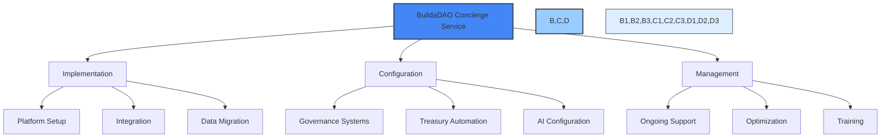

# 🔷 BuildaDAO Premium Concierge Service

## 📋 Table of Contents
- [📝 Service Overview](#service-overview)
- [🤖 Service Components](#service-components)
- [💎 Service Packages](#service-packages)
- [📊 Implementation Process](#implementation-process)
- [👥 Client Responsibilities](#client-responsibilities)
- [⏱️ Timeline & Deliverables](#timeline--deliverables)
- [💰 Pricing & Terms](#pricing--terms)
- [📋 Next Steps](#next-steps)

---

## 📝 Service Overview

BuildaDAO's Premium Concierge Service provides comprehensive implementation, configuration, and ongoing management of our advanced Web3 governance platform. While our platform is designed for self-service use, organizations with complex requirements or limited technical resources can benefit from our expert-led implementation and management services.

Our team of Web3 and AI specialists will guide your organization through setup, configuration, customization, and ongoing optimization of BuildaDAO's powerful automation and AI capabilities. This white-glove service ensures maximum value from your BuildaDAO implementation with minimal technical lift from your team.

## 🤖 Service Components

Our concierge service provides expert implementation and management of BuildaDAO's core AI and automation capabilities:

### 🏛️ Automated Governance
- Custom governance framework implementation
- Proposal templates and workflows
- Voting threshold configuration
- Permission structure setup
- Multi-sig integration

### 💰 Treasury Automation
- Treasury account configuration
- Automated payment rules
- Financial controls implementation
- Multi-chain treasury management
- Financial reporting setup

### 💸 Automated Payouts & Payroll
- Contributor payment system setup
- Recurring payment configuration
- Multi-currency support implementation
- Tax compliance configuration
- Payment approval workflows

### 📊 AI Project Management
- AI agent configuration for project tracking
- Task creation and management automation
- Progress tracking and reporting
- Resource allocation optimization
- Deadline management system

### 🗳️ AI-Enhanced Voting
- Voting system implementation
- Delegation mechanics configuration
- Vote analysis and reporting
- Fraud detection systems
- Historical voting pattern analysis

### 📝 AI Proposals & Documentation
- Proposal template configuration
- AI-assisted proposal drafting
- Documentation generation
- Knowledge base setup
- Version control implementation

### 👥 AI Delegation Systems
- Delegation pool setup
- Reputation system configuration
- Expertise matching systems
- Governance performance analytics
- Delegation strategy optimization

### 💹 AI Investment Framework
- Investment criteria configuration
- Risk assessment parameters
- Due diligence automation
- Portfolio tracking implementation
- Performance analytics setup

## 💎 Service Packages

BuildaDAO offers three comprehensive service packages designed to meet different organizational needs:

### 🔹 Essential Implementation - Starting at $25,000
For organizations seeking basic implementation of core platform capabilities:
- Platform setup and configuration
- Core governance framework implementation
- Basic treasury and payment automation
- Standard AI configuration
- Initial team training (up to 5 users)
- 30 days of post-implementation support

### 🔷 Advanced Implementation - Starting at $50,000
For organizations requiring deeper customization and integration:
- All Essential Implementation features
- Custom governance model implementation
- Advanced treasury automation and controls
- Enhanced AI configuration and customization
- Integration with existing tools and platforms
- Extended team training (up to 15 users)
- 90 days of post-implementation support
- Quarterly optimization reviews

### 💠 Enterprise Management - Starting at $100,000/year
For organizations requiring ongoing management and optimization:
- All Advanced Implementation features
- Dedicated implementation team
- Ongoing platform management and administration
- Continuous optimization and enhancement
- Priority support and escalation
- Regular stakeholder reporting
- Governance strategy consulting
- Unlimited team training and support
- Annual platform audit and optimization

## 📊 Implementation Process

Our structured implementation methodology ensures a smooth, efficient deployment of the BuildaDAO platform:

### 1️⃣ Discovery & Planning (2-4 weeks)
- **Needs Assessment**: Comprehensive analysis of your organization's governance needs
- **Solution Design**: Custom implementation plan development
- **Architecture Planning**: Technical architecture and integration mapping
- **Timeline Development**: Detailed project timeline and milestone schedule

### 2️⃣ Implementation (4-12 weeks)
- **Core Platform Setup**: Base platform deployment and configuration
- **Governance Framework**: Custom governance model implementation
- **Treasury Configuration**: Financial controls and automation setup
- **AI Systems Integration**: Configuration of AI agents and workflows
- **Security Implementation**: Access controls and security measures

### 3️⃣ Testing & Validation (2-4 weeks)
- **Functionality Testing**: Comprehensive testing of all implemented features
- **Security Validation**: Security assessment and penetration testing
- **User Acceptance Testing**: Stakeholder validation of implemented systems
- **Performance Optimization**: System performance tuning

### 4️⃣ Training & Handover (2-4 weeks)
- **Administrator Training**: Platform management training for system administrators
- **User Training**: End-user training sessions
- **Documentation Development**: Comprehensive implementation documentation
- **Support Transition**: Transition to ongoing support model

### 5️⃣ Ongoing Management (Enterprise Package)
- **Platform Administration**: Day-to-day management of platform
- **User Support**: Ongoing support for platform users
- **System Monitoring**: Continuous monitoring of platform performance
- **Regular Updates**: Implementation of platform updates and enhancements
- **Performance Reporting**: Regular stakeholder reporting

## 👥 Client Responsibilities

To ensure successful implementation, client organizations should plan to provide:

- **Executive Sponsor**: Decision-maker with authority to approve governance framework
- **Project Lead**: Primary point of contact for implementation coordination
- **Subject Matter Experts**: Team members familiar with existing governance processes
- **Technical Resources**: IT support for any required integrations
- **User Participation**: End-user availability for testing and training
- **Timely Feedback**: Prompt review and feedback on deliverables
- **Content & Assets**: Organizational content, branding, and other required assets

## ⏱️ Timeline & Deliverables

### Sample Implementation Timeline

| Phase | Duration | Key Deliverables |
|-------|----------|-----------------|
| Discovery & Planning | 2-4 weeks | Needs assessment, implementation plan, project schedule |
| Core Implementation | 4-8 weeks | Platform deployment, governance framework, treasury setup |
| AI Configuration | 2-4 weeks | AI agents configuration, workflow automation, reporting setup |
| Testing & Validation | 2-4 weeks | System testing, security validation, performance tuning |
| Training & Handover | 2-4 weeks | Training sessions, documentation, support transition |
| **Total Duration** | **12-24 weeks** | **Fully implemented platform** |

### Key Deliverables

- **Implementation Plan**: Detailed project plan and architecture document
- **Configured Platform**: Fully configured BuildaDAO platform
- **Governance Framework**: Implemented governance model and processes
- **Treasury System**: Configured treasury and payment automation
- **AI Components**: Deployed and configured AI agents and workflows
- **Security Implementation**: Access controls and security measures
- **Documentation**: Comprehensive implementation documentation
- **Training Materials**: Administrator and user training resources

## 💰 Pricing & Terms

### Pricing Structure

| Service Package | Base Price | Payment Schedule |
|-----------------|------------|------------------|
| Essential Implementation | From $25,000 | 50% upfront, 50% upon completion |
| Advanced Implementation | From $50,000 | 40% upfront, 30% at midpoint, 30% upon completion |
| Enterprise Management | From $100,000/year | Annual payment or quarterly installments |

### Additional Services

| Service | Price Range |
|---------|-------------|
| Custom Integration Development | $5,000-$25,000 |
| Advanced Data Migration | $10,000-$30,000 |
| Custom AI Agent Development | $15,000-$40,000 |
| Additional Training Sessions | $2,500-$5,000 |
| Governance Strategy Consulting | $10,000-$25,000 |

### Terms & Conditions

- **Contract Duration**: Implementation services followed by optional management services
- **Service Level Agreement**: Defined response times and resolution commitments
- **Change Management**: Structured process for scope or requirement changes
- **Intellectual Property**: Client retains ownership of all organizational data
- **Confidentiality**: Strict confidentiality of client information and processes
- **Termination**: Terms for early termination with appropriate notice

## 📋 Next Steps

1. **Initial Consultation**: Schedule an initial consultation to discuss your requirements
2. **Needs Assessment**: Complete a detailed needs assessment and discovery process
3. **Proposal Development**: Receive a customized implementation proposal and quote
4. **Agreement Finalization**: Review and finalize service agreement
5. **Project Kickoff**: Begin implementation with formal kickoff meeting

---

For more information about BuildaDAO's Premium Concierge Service, please contact our implementation team at concierge@buildadao.xyz or schedule a consultation through our website. 