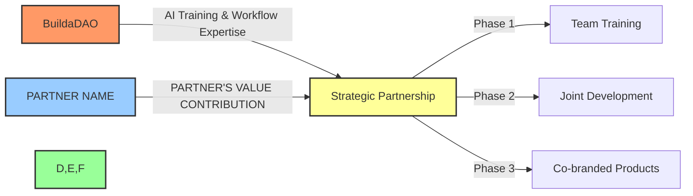
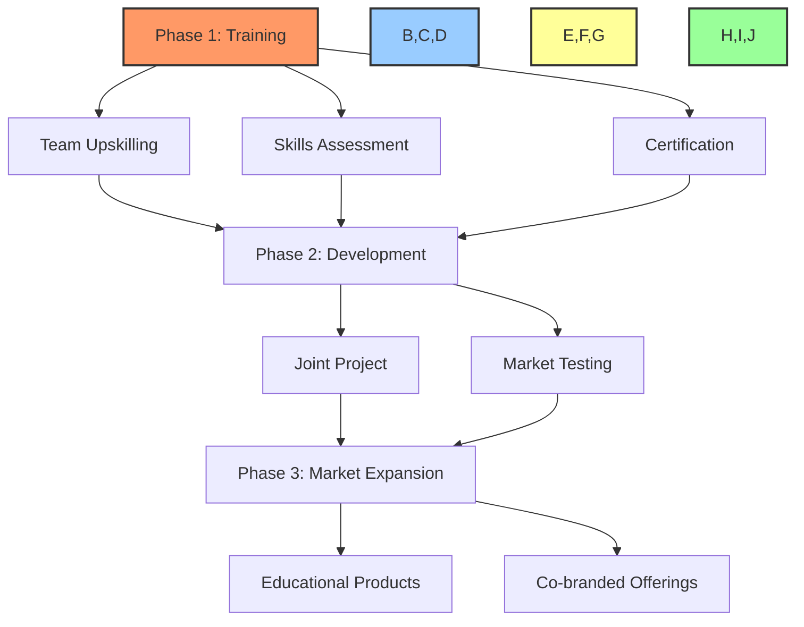

# 🤝 BuildaDAO Educational Partnership Proposal

## 📋 Table of Contents
- [📝 Document Information](#document-information)
- [🔍 Partnership Overview](#partnership-overview)
- [💼 Value Exchange Framework](#value-exchange-framework)
- [💰 Revenue Models](#revenue-models)
- [🛠️ Implementation Strategy](#implementation-strategy)
- [📊 Resource Requirements](#resource-requirements)
- [⚠️ Risks & Mitigation](#risks--mitigation)
- [📋 Next Steps](#next-steps)
- [✍️ Agreement Signatures](#agreement-signatures)

---

## 📝 Document Information
**Proposal Date:** [DATE]
**Version:** 1.0
**Reference:** BuildaDAO Educational Partnership Template #2

## 🔍 Partnership Overview

BuildaDAO proposes a strategic alliance with [PARTNER NAME] to establish a mutually beneficial partnership focused on AI development education and implementation. This partnership unites BuildaDAO's blockchain/AI expertise with [PARTNER NAME]'s [PARTNER'S PRIMARY VALUE OFFERING].

By combining our complementary resources and expertise, we can create significant value for both organizations while delivering exceptional AI development training and implementation services.

## 💼 Value Exchange Framework

### 🏗️ BuildaDAO Brings:
- 🤖 **AI Development Expertise:** Advanced Cursor AI workflows, prompting techniques, and development methodologies
- 🎓 **Training & Upskilling:** Premium AI development training (normally $3,000 per person, partnership rates available)
- 🧰 **Development Kit:** Proprietary BuildaDAO development kit (value: $5,000)
- ⚡ **Process Optimization:** Methods to reduce development time from days to hours
- 📊 **Product Strategy:** Revenue model optimization and go-to-market strategies

### 🔬 [PARTNER NAME] Brings:
- [EMOJI] **[CONTRIBUTION 1]:** [DESCRIPTION]
- [EMOJI] **[CONTRIBUTION 2]:** [DESCRIPTION]
- [EMOJI] **[CONTRIBUTION 3]:** [DESCRIPTION]
- [EMOJI] **[CONTRIBUTION 4]:** [DESCRIPTION]
- [EMOJI] **[CONTRIBUTION 5]:** [DESCRIPTION]

### 🚀 Joint Opportunity:
This partnership enables both organizations to:
1. 🎓 **Phase 1:** Upskill [PARTNER NAME]'s team in cutting-edge AI development methodologies
2. 🏗️ **Phase 2:** Apply these skills to develop [JOINT PRODUCT/PROJECT]
3. 📚 **Phase 3:** Create co-branded educational products and services for the broader market

## 💰 Revenue Models

The partnership will generate value through multiple revenue streams:

### 1. 🎓 Team Training & Upskilling
- 💲 **Investment:** [PARTNER NAME] invests $[AMOUNT] for team training
- 📊 **Value Received:** Training valued at $[STANDARD RATE] (representing [DISCOUNT]% partnership discount)
- 💼 **ROI Metrics:** [SPECIFIC EXPECTED OUTCOMES]

### 2. 🤖 Joint Development Project
- 🏗️ **Description:** [DESCRIBE JOINT DEVELOPMENT PROJECT]
- 💰 **Revenue Model:** [DESCRIBE HOW THIS GENERATES REVENUE]
- 📈 **Target Market:** [SPECIFY TARGET AUDIENCE]
- 💲 **Pricing Strategy:** [PRICING DETAILS]

### 3. 📚 Co-Branded Educational Products
- 🏷️ **Offerings:** [LIST POTENTIAL CO-BRANDED PRODUCTS]
- 💼 **Market Positioning:** [POSITIONING STRATEGY]
- 💰 **Revenue Split:** [REVENUE SHARING ARRANGEMENT]
- 📊 **Projected Value:** [ESTIMATED MARKET VALUE]

## 🛠️ Implementation Strategy

### 📅 Phase 1: Training ([TIMEFRAME])
- 👨‍💻 [PARTNER NAME] team training ([NUMBER] team members)
- 📊 Skills assessment and workflow analysis
- 🛠️ Development methodology implementation
- 🎓 Team certification

### 📅 Phase 2: Development ([TIMEFRAME])
- 🏗️ Build [JOINT PRODUCT/PROJECT]
- ⚙️ Utilize [SPECIFIC RESOURCES] from both organizations
- 📈 Demonstrate efficiency gains from training
- 🧪 Initial market testing

### 📅 Phase 3: Market Expansion ([TIMEFRAME])
- 📚 Develop co-branded educational offerings
- 📣 Create joint marketing strategy
- 🚀 Launch to broader market
- 💰 Implement revenue sharing mechanisms

## 📊 Resource Requirements

### 💲 Financial Investment
- 💰 [PARTNER NAME] to invest $[AMOUNT] for initial training services
- 📉 Represents [DISCOUNT]% discount from standard rates
- 💼 Additional investment requirements to be determined for Phase 3

### 🔄 Resource Allocation
- 🧩 [PARTNER NAME] to provide: [LIST RESOURCES]
- 🛠️ BuildaDAO to provide: [LIST RESOURCES]
- 👥 Both organizations to contribute to [JOINT RESPONSIBILITIES]

### ⏱️ Time Commitment
- 🧑‍🏫 BuildaDAO: [X] hours for training, [Y] hours for development
- 👨‍💻 [PARTNER NAME]: [Z] hours for training participation, team resources for development

## ⚠️ Risks & Mitigation

| Risk | Mitigation |
|------|------------|
| 🔒 **IP Protection Concerns** | Clear delineation of proprietary IP in agreement; licensing for specific use cases only |
| 📈 **Resource Overcommitment** | Phased approach with defined scope; regular resource assessment |
| 💰 **Revenue Sharing Disputes** | Smart contract-based revenue distribution with transparent metrics |
| 📉 **Market Adoption Challenges** | Phased approach with clear KPIs; pivot capability built into agreement |
| 👥 **Team Alignment Issues** | Regular strategic alignment meetings; clear decision-making framework |

## 📋 Next Steps

1. 📝 **Proposal Review:** Review and discuss this partnership proposal
2. 📋 **Resource Assessment:** Evaluate resource requirements and availability
3. 📄 **Agreement Drafting:** Develop formal partnership agreement
4. 🗓️ **Implementation Planning:** Create detailed timeline and milestone schedule
5. 🚀 **Kickoff:** Commence Phase 1 activities

## ✍️ Agreement Signatures

If this proposal aligns with your strategic objectives, please indicate your interest by signing below to initiate the formal agreement process:

**BuildaDAO Representative:**

Name: _________________________ Title: _________________________

Signature: ______________________ Date: _________________________

**[PARTNER NAME] Representative:**

Name: _________________________ Title: _________________________

Signature: ______________________ Date: _________________________

---

*This proposal is valid for 30 days from the proposal date and serves as a framework for developing a comprehensive partnership agreement. The final terms will be documented in a separate partnership agreement, training services work order, and other relevant documents.*

[Back to Top](#-buildadao-educational-partnership-proposal) 