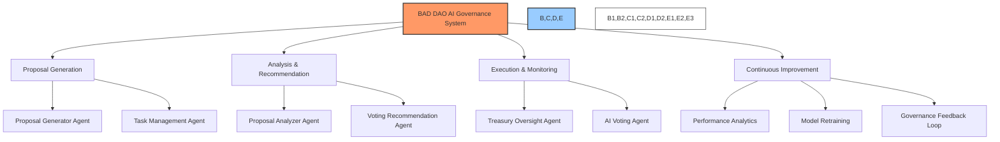
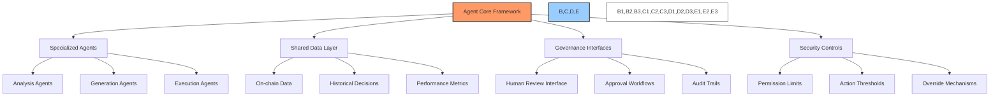
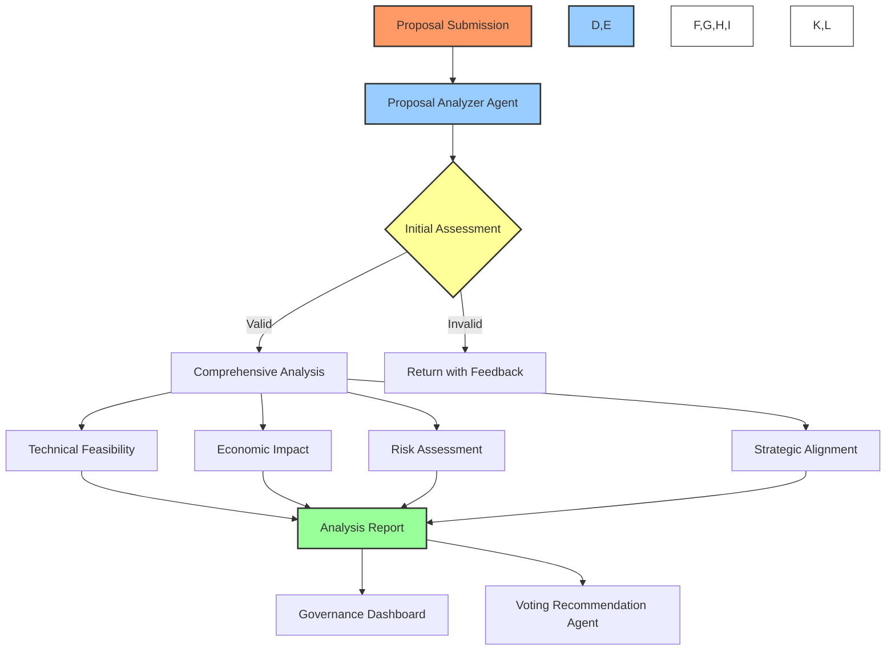
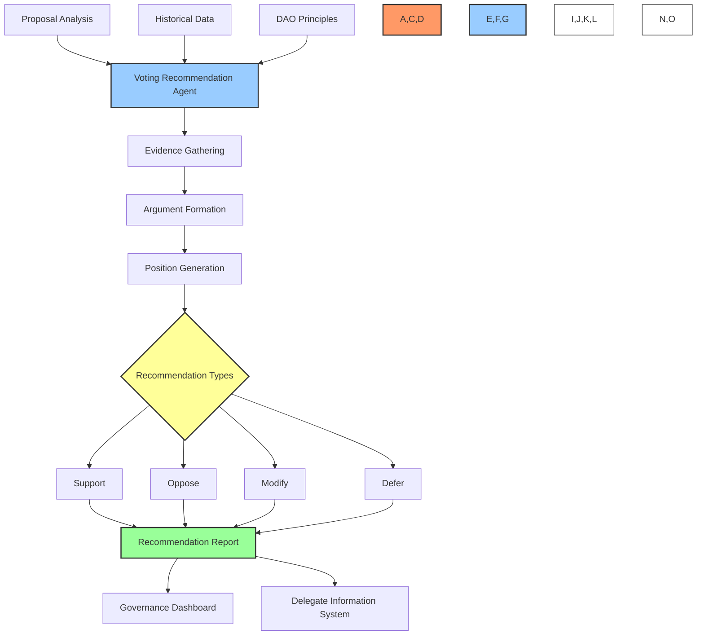
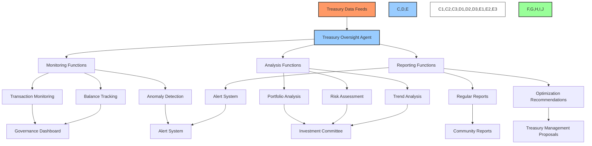
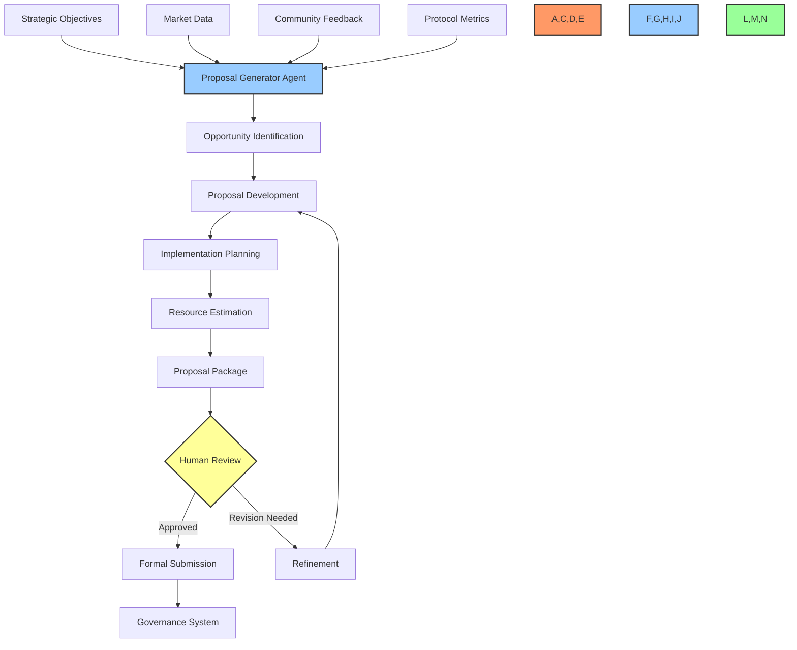
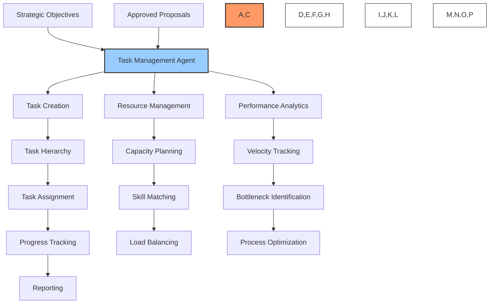
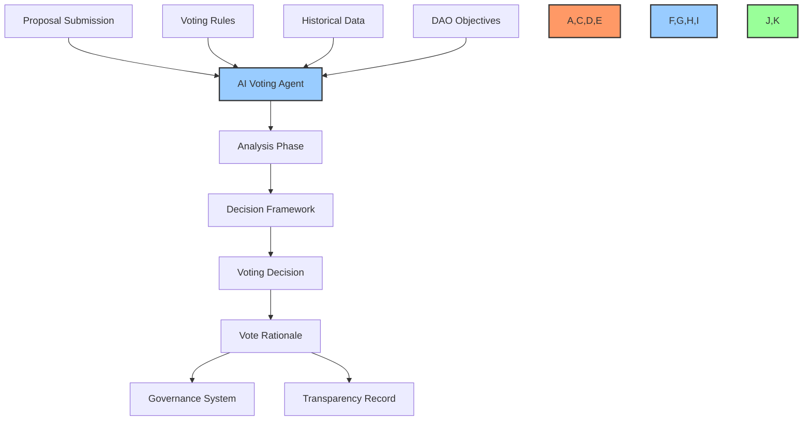

# 🤖 BAD DAO: AI Governance Agents

## 📋 Table of Contents
- [🔍 Overview](#-overview)
- [🧰 Agent Architecture](#-agent-architecture)
- [🧠 Proposal Analyzer Agent](#-proposal-analyzer-agent)
- [📊 Voting Recommendation Agent](#-voting-recommendation-agent)
- [💹 Treasury Oversight Agent](#-treasury-oversight-agent)
- [✨ Proposal Generator Agent](#-proposal-generator-agent)
- [📋 Task Management Agent](#-task-management-agent)
- [🗳️ AI Voting Agent](#️-ai-voting-agent)
- [🔧 Technical Implementation](#-technical-implementation)
- [🔐 Security & Governance Controls](#-security--governance-controls)
- [📈 Performance Metrics](#-performance-metrics)

## 🔍 Overview

BAD DAO's AI Governance Agents represent a pioneering integration of artificial intelligence into decentralized governance. These specialized agents enhance decision-making processes through data analysis, automation, and objective evaluation while maintaining appropriate human oversight to ensure alignment with community values.

The AI governance layer operates alongside human participants, providing enhanced capabilities while being bound by constitutional parameters that limit authority and ensure alignment with the DAO's objectives. This combination of AI efficiency and human oversight creates a governance system that is both powerful and responsible.

## 🧰 Agent Architecture

The AI Governance Agents follow a modular architecture that allows for independent functionality while maintaining coordinated operations through a shared data layer.

Each agent is trained on domain-specific data while sharing access to the DAO's core knowledge base, including:

- 📜 Constitutional documents and governance parameters
- 🧩 Historical proposals and their outcomes
- 📊 Treasury activities and financial metrics
- 👥 Community feedback and sentiment analysis
- 🗂️ Domain-specific knowledge related to the agent's function

## 🧠 Proposal Analyzer Agent

### Purpose
The Proposal Analyzer Agent provides objective analysis of governance proposals, evaluating their feasibility, potential impact, and alignment with the DAO's objectives.

### Capabilities

#### Technical Evaluation
- 🧪 **Protocol Compatibility**: Evaluates whether the proposal works with existing systems
- 🛠️ **Implementation Feasibility**: Assesses technical complexity and implementation requirements
- ⚙️ **Resource Requirements**: Identifies computational, development, and operational resources needed
- 🔄 **Upgrade Dependencies**: Maps dependencies on other systems or prior upgrades

#### Economic Impact Assessment
- 💰 **Treasury Impact**: Calculates direct costs to the treasury
- 📈 **Return Projections**: Estimates potential returns on investment
- 💹 **Token Economics**: Analyzes effects on token value and supply dynamics
- 💸 **Fee Implications**: Assesses impact on protocol fee structures

#### Risk Evaluation
- ⚠️ **Security Risks**: Identifies potential attack vectors or vulnerabilities
- 🛡️ **Mitigation Strategies**: Suggests controls to address identified risks
- 📉 **Downside Scenarios**: Models potential negative outcomes and their probabilities
- 📊 **Confidence Intervals**: Provides uncertainty ranges for projections

#### Strategic Analysis
- 🎯 **Objective Alignment**: Evaluates alignment with DAO's strategic objectives
- 🔄 **Precedent Analysis**: Compares to similar historical proposals
- 👥 **Stakeholder Impact**: Assesses effects on different stakeholder groups
- 🔮 **Future Implications**: Projects long-term consequences of implementation

### Input Requirements
- 📄 Complete proposal text and supporting documentation
- 💻 Technical specifications for technical proposals
- 🔢 Quantitative parameters for financial requests
- 🎯 Stated objectives and success metrics

### Output Format
- 📊 Standardized scoring matrix across evaluation dimensions
- 📝 Written analysis highlighting key considerations
- 🚦 Traffic light indicators for critical factors
- 🔗 References to relevant historical data and precedents

## 📊 Voting Recommendation Agent

### Purpose
The Voting Recommendation Agent generates data-driven governance recommendations based on proposal analysis, historical voting patterns, and alignment with DAO principles.

### Capabilities

#### Data Analysis Functions
- 📈 **Historical Pattern Recognition**: Identifies voting trends and outcome patterns
- 📊 **Impact Projection**: Forecasts likely effects based on similar past proposals
- 🔄 **Precedent Matching**: Connects current proposals to historical decisions
- 📑 **Cross-Protocol Comparison**: Analyzes similar decisions in other DAOs

#### Recommendation Components
- 👍 **Position Statement**: Clear support, opposition, or suggested modifications
- 💡 **Rationale Explanation**: Transparent reasoning behind the recommendation
- ⚖️ **Balanced Arguments**: Presentation of both supporting and opposing viewpoints
- 🔗 **Evidence Links**: References to supporting data and historical precedents
- 🔄 **Alternative Options**: Suggestions for modifications or alternatives

#### Specialized Recommendation Types
- 📋 **Technical Proposals**: Focus on security, scalability, and technical merit
- 💰 **Treasury Allocations**: Emphasis on ROI, risk assessment, and alignment with funding priorities
- 🏛️ **Governance Changes**: Analysis of procedural improvements and representation effects
- 👥 **Working Groups**: Evaluation of mandate clarity, accountability, and resource efficiency

### Input Requirements
- 📊 Proposal Analyzer report
- 📜 DAO constitution and principles
- 📈 Historical proposal outcomes
- 💬 Community discussion summary

### Output Format
- 💯 Confidence score for the recommendation
- 📝 Structured recommendation report with standardized sections
- 🔄 Comparative analysis with similar historical proposals
- ⚡ Key considerations highlighted for quick reference

## 💹 Treasury Oversight Agent

### Purpose
The Treasury Oversight Agent continuously monitors treasury operations, identifies anomalies, detects potential issues, and recommends optimizations to ensure financial health and compliance.

### Capabilities

#### Monitoring Functions
- 🔄 **Real-time Transaction Tracking**: Monitors all inflows and outflows
- 📊 **Balance Surveillance**: Maintains current balances across all treasury wallets
- 🚨 **Anomaly Detection**: Identifies unusual transactions or patterns
- 📉 **Threshold Alerts**: Notifies when balances cross defined thresholds
- 🔒 **Permission Verification**: Ensures transactions match authorized permissions

#### Analysis Functions
- 📊 **Portfolio Composition**: Analyzes asset allocation and diversity
- 📈 **Performance Tracking**: Measures returns against benchmarks
- 🔮 **Cashflow Forecasting**: Projects future treasury balances
- 💸 **Expense Analysis**: Categorizes and tracks spending patterns
- 📉 **Risk Exposure Assessment**: Evaluates concentration and market risks

#### Optimization Functions
- ⚖️ **Rebalancing Recommendations**: Suggests portfolio adjustments
- 💰 **Yield Optimization**: Identifies higher-yield opportunities for reserve assets
- 🛡️ **Risk Mitigation Strategies**: Proposes hedging or diversification options
- 💹 **Fee Structure Optimization**: Analyzes protocol fee efficiency
- 💵 **Cost Reduction Opportunities**: Identifies potential savings

### Alert System
- 🚨 **Urgent Alerts**: Immediate notification for critical issues
- ⚠️ **Warning Alerts**: Notification of concerning trends or developing issues
- 📊 **Information Alerts**: Regular updates on treasury status
- 🎯 **Threshold Alerts**: Notification when metrics cross defined thresholds

### Reporting Schedule
- 📆 **Daily Summaries**: Automated dashboard updates
- 📆 **Weekly Reports**: Detailed transaction and balance reports
- 📆 **Monthly Analysis**: Comprehensive treasury health assessment
- 📆 **Quarterly Review**: Strategic recommendations and performance analysis

## ✨ Proposal Generator Agent

### Purpose
The Proposal Generator Agent creates high-quality governance proposals aligned with the DAO's strategic objectives, maintaining development velocity and addressing emerging opportunities and challenges.

### Capabilities

#### Proposal Categories
- 🔧 **Protocol Improvements**: Technical enhancements to core functionality
- 💰 **Economic Adjustments**: Modifications to incentives and token economics
- 🏛️ **Governance Refinements**: Improvements to decision-making processes
- 💼 **Strategic Initiatives**: New projects or partnerships
- 🛠️ **Resource Allocation**: Funding for development or community activities

#### Core Functionalities
- 🔍 **Opportunity Identification**: Analyzes data to discover improvement areas
- 📝 **Proposal Drafting**: Creates comprehensive proposal documents
- 📊 **Impact Forecasting**: Projects potential outcomes and benefits
- 🗓️ **Implementation Planning**: Develops actionable execution plans
- 🧮 **Resource Estimation**: Calculates required resources and timeline
- 🔄 **Iteration Management**: Refines proposals based on feedback

#### Quality Controls
- 🎯 **Strategic Alignment**: Ensures proposals advance DAO objectives
- 📏 **Feasibility Assessment**: Verifies technical and economic viability
- ⚖️ **Risk Evaluation**: Identifies potential downsides and mitigation strategies
- 🧩 **Dependency Mapping**: Accounts for interactions with existing systems
- 📊 **Success Metrics**: Defines clear evaluation criteria

### Human Oversight Requirements
- 👥 **Review Threshold**: Minimum 3 qualified human reviewers before submission
- 📑 **Approval Workflow**: Structured review process with feedback tracking
- 🔄 **Revision System**: Mechanism for iterative improvement
- 🛑 **Veto Capability**: Ability for governance council to block problematic proposals
- 📈 **Performance Tracking**: Evaluation of proposal success rates and quality

### Output Volume
- 📆 **Daily Proposals**: 2-3 optimized proposals per day
- 🔢 **Category Distribution**: Balanced mix across technical, economic, and community domains
- 🌐 **Scope Range**: Combination of incremental improvements and strategic initiatives
- 📊 **Quality vs. Quantity**: Prioritizing proposal quality over volume

## 📋 Task Management Agent

### Purpose
The Task Management Agent transforms strategic objectives and approved proposals into actionable tasks, optimizes resource allocation, and tracks implementation to ensure efficient execution.

### Capabilities

#### Task Management Functions
- 🔄 **Objective Breakdown**: Converts high-level goals into specific tasks
- 🌳 **Hierarchy Creation**: Establishes task dependencies and relationships
- 📅 **Timeline Generation**: Sets realistic deadlines and milestones
- 👥 **Role Assignment**: Matches tasks to qualified contributors
- 📊 **Progress Tracking**: Monitors completion status in real-time
- 🚨 **Blocker Identification**: Flags issues impeding progress

#### Resource Optimization
- 📊 **Capacity Analysis**: Evaluates team bandwidth and availability
- 🧩 **Skill Matching**: Aligns tasks with contributor expertise
- ⚖️ **Load Balancing**: Distributes work equitably among contributors
- 📈 **Efficiency Metrics**: Tracks productivity and completion rates
- 🔄 **Resource Reallocation**: Adjusts assignments based on changing priorities
- 👥 **Team Configuration**: Recommends optimal team compositions

#### Performance Analytics
- 📈 **Velocity Tracking**: Measures completion rate over time
- 🔍 **Bottleneck Analysis**: Identifies process constraints
- ⏱️ **Cycle Time Measurement**: Calculates time from task creation to completion
- 📉 **Burndown Charts**: Visualizes progress against projections
- 🎯 **Completion Forecasting**: Predicts delivery dates based on current velocity
- 🧮 **Estimation Accuracy**: Compares actual to estimated completion times

### Integration Capabilities
- 🔄 **Proposal System Connection**: Automatically generates tasks from approved proposals
- 📊 **Dashboard Integration**: Feeds progress data to governance dashboards
- 📆 **Calendar Synchronization**: Aligns with community and contributor schedules
- 💬 **Communication Tools**: Links with notification and messaging systems
- 🔐 **Authentication System**: Connects to role and permission management
- 🗄️ **Documentation Link**: Associates tasks with relevant documentation

### Reporting Functions
- 📅 **Daily Status Updates**: Automated progress summaries
- 📊 **Weekly Performance Reports**: Detailed metrics on task completion
- 📈 **Monthly Trend Analysis**: Long-term productivity and efficiency patterns
- 🚨 **Risk and Blocker Alerts**: Immediate notification of critical issues
- 🎯 **Goal Achievement Tracking**: Progress toward strategic objectives

## 🗳️ AI Voting Agent

### Purpose
The AI Voting Agent participates in governance voting based on programmatic rules, data analysis, and alignment with the DAO's objectives, providing an additional layer of governance participation with transparent decision-making.

### Capabilities

#### Decision Framework
- 📊 **Objective Analysis**: Evidence-based evaluation of proposal merit
- 🎯 **Alignment Check**: Comparison against DAO's strategic objectives
- 🔄 **Precedent Analysis**: Consideration of similar historical decisions
- ⚖️ **Risk-Benefit Analysis**: Quantitative assessment of potential outcomes
- 🔍 **Parameter Verification**: Validation against established governance rules

#### Voting Rules
- 🔢 **Voting Power Limit**: Maximum 10% of total voting power
- 🧠 **Decision Transparency**: Complete and public rationale for all votes
- 🔄 **Rule-Based Logic**: Follows programmatic decision criteria
- 🔒 **Restricted Domains**: Cannot vote on changes to its own parameters
- 🛑 **Human Override**: Decisions can be overruled by governance council

#### Transparency Mechanisms
- 📝 **Vote Rationale**: Detailed explanation for each voting decision
- 🔎 **Logic Traceability**: Clear chain of reasoning for decisions
- 📊 **Data References**: Citations of information used in decision-making
- 📜 **Rule Application**: Explanation of how governance rules were applied
- 🔄 **Alternative Considerations**: Documentation of considered alternatives

### Voting Strategy
- 👍 **Value Prioritization**: Favors proposals with demonstrable value creation
- 🛡️ **Security Emphasis**: Prioritizes protocol security and resilience
- 🔄 **Consistency Bias**: Favors consistency with past decisions unless compelling reasons exist
- 📈 **Long-term Focus**: Evaluates impact over extended timeframes
- 👥 **Stakeholder Fairness**: Considers impacts across different stakeholder groups

### Voting Domains
- ✅ **Full Participation**: Standard proposal types
- ⚠️ **Limited Participation**: Constitutional changes (reduced voting power)
- 🚫 **No Participation**: Changes to AI agent parameters or limits

## 🔧 Technical Implementation

The AI Governance Agents are implemented using a combination of machine learning models, data processing pipelines, and blockchain integration components.

```mermaid
graph TD
    A[Technical Architecture] --> B[AI Models]
    A --> C[Data Infrastructure]
    A --> D[Blockchain Integration]
    A --> E[Security Layer]
    
    B --> B1[Natural Language Processing]
    B --> B2[Decision Support Models]
    B --> B3[Predictive Analytics]
    B --> B4[Anomaly Detection]
    
    C --> C1[Data Warehouse]
    C --> C2[Real-time Event Processing]
    C --> C3[Historical Analysis Database]
    C --> C4[Metrics Dashboard]
    
    D --> D1[Smart Contract Interface]
    D --> D2[Voting Contract Integration]
    D --> D3[Treasury Contract Integration]
    D --> D4[On-chain Action Execution]
    
    E --> E1[Access Controls]
    E --> E2[Audit Logging]
    E --> E3[Model Validation]
    E --> E4[Secure Communications]
    
    style A fill:#f96,stroke:#333,stroke-width:2px
    style B,C,D,E fill:#9cf,stroke:#333,stroke-width:2px
    style B1,B2,B3,B4,C1,C2,C3,C4,D1,D2,D3,D4,E1,E2,E3,E4 fill:#fff,stroke:#333,stroke-width:1px
```

### Core AI Models
- 📚 **Large Language Models**: For proposal analysis and generation
- 📊 **Time Series Models**: For treasury analysis and forecasting
- 🔄 **Graph Neural Networks**: For relationship and dependency mapping
- 🎯 **Decision Trees**: For transparent voting logic
- 🧮 **Regression Models**: For impact and resource estimation

### Data Infrastructure
- 📊 **On-chain Data Indexing**: Real-time capture of blockchain events
- 🗄️ **Historical Proposal Database**: Archive of past decisions and outcomes
- 📈 **Performance Metrics Warehouse**: Storage of operational metrics
- 💬 **Community Feedback Repository**: Structured storage of community input
- 🔄 **External Data Integration**: Market and ecosystem information

### Integration Interfaces
- 🔌 **Smart Contract API**: Direct interaction with governance contracts
- 📊 **Dashboard Integration**: Data visualization for community access
- 📱 **Mobile Alerts**: Critical notifications for stakeholders
- 🗳️ **Voting Interface**: Presentation of AI voting rationale
- 💬 **Discussion Forum Connection**: Integration with community platforms

## 🔐 Security & Governance Controls

### Permission Framework
- 🔒 **Action Limits**: Specific boundaries for autonomous actions
- 👁️ **Transparency Requirements**: Mandatory disclosure of all decision factors
- 🛡️ **Override Mechanisms**: Methods for human intervention
- ⚙️ **Parameter Governance**: Community control over AI parameters
- 📝 **Audit Requirements**: Regular review of AI agent actions

### Risk Mitigation
- 🔄 **Gradual Autonomy Increase**: Phased expansion of agent capabilities
- 🧪 **Simulation Environment**: Testing before live implementation
- 📊 **Performance Thresholds**: Minimum quality metrics for continued operation
- 🚨 **Circuit Breakers**: Automatic pausing during anomalous conditions
- 👥 **Human Review Checkpoints**: Regular assessment of agent performance

### Oversight Structure
- 👑 **AI Governance Committee**: Specialized group for AI oversight
- 📋 **Performance Review Cycle**: Regular evaluation against objectives
- 📝 **Improvement Proposal Process**: Mechanism for agent enhancement
- 🛑 **Emergency Shutdown Procedure**: Protocol for disabling agents if necessary
- 📜 **Operational Constitution**: Formal rules governing agent operation

## 📈 Performance Metrics

The AI Governance Agents are evaluated against comprehensive performance metrics to ensure they deliver value and operate as intended.

### Effectiveness Metrics
- 🎯 **Proposal Quality**: Success rate of generated proposals
- 📊 **Analysis Accuracy**: Correctness of analytical predictions
- 💰 **Treasury Optimization**: Improvement in treasury performance
- ⚙️ **Operational Efficiency**: Reduction in governance overhead
- 👥 **Community Alignment**: Correlation with community sentiment

### Efficiency Metrics
- ⏱️ **Time Savings**: Reduction in human hours required
- 💸 **Cost Efficiency**: Operational cost relative to value created
- 🔄 **Process Acceleration**: Decrease in governance cycle time
- 📈 **Throughput Improvement**: Increase in decision-making capacity
- 🎯 **Resource Optimization**: Efficient allocation of DAO resources

### Trust Metrics
- 👍 **Community Confidence**: Stakeholder trust in agent decisions
- 📏 **Transparency Rating**: Clarity of decision rationale
- 🔄 **Consistency Score**: Reliability of agent operation
- 🛡️ **Security Record**: Freedom from vulnerabilities or exploits
- 🤝 **Alignment Assessment**: Adherence to DAO values and objectives

---

*This document provides a comprehensive overview of the BAD DAO AI Governance Agents. For technical specifications, implementation details, and integration guidelines, please refer to the technical implementation documentation.*

*Version: 1.0*  
*Last Updated: May 2025*  
*Document Owner: BAD DAO Technical Committee* 