# 🤖 BAD DAO: Automated Treasury Functions

## 📋 Table of Contents
- [🔍 Overview](#-overview)
- [🔄 Core Automation Functions](#-core-automation-functions)
- [📊 Financial Automation](#-financial-automation)
- [🔐 Security Mechanisms](#-security-mechanisms)
- [📈 Analytics and Reporting](#-analytics-and-reporting)
- [🧪 Testing Framework](#-testing-framework)
- [🔌 Integration Points](#-integration-points)

## 🔍 Overview

The BAD DAO implements a sophisticated system of automated treasury functions to enhance efficiency, reduce governance overhead, and ensure timely execution of financial operations. This document details the specific automated mechanisms implemented in the treasury system, their operational parameters, and the security controls that govern them.

```mermaid
graph TD
    A[🤖 Automated Treasury System] --> B[💸 Payment Automation]
    A --> C[⚖️ Rebalancing System]
    A --> D[📈 Revenue Distribution]
    A --> E[🛡️ Security Controls]
    A --> F[📊 Analytics Engine]
    
    B --> B1[Recurring Payments]
    B --> B2[Threshold-based Funding]
    B --> B3[Execution Pipeline]
    
    C --> C1[Target Allocation Maintenance]
    C --> C2[Volatility Management]
    C --> C3[Opportunity Optimization]
    
    D --> D1[Revenue Capture]
    D --> D2[Allocation Logic]
    D --> D3[Distribution Execution]
    
    E --> E1[Anomaly Detection]
    E --> E2[Circuit Breakers]
    E --> E3[Transaction Verification]
    
    F --> F1[Real-time Monitoring]
    F --> F2[Performance Analytics]
    F --> F3[Reporting Automation]
    
    style A fill:#f96,stroke:#333,stroke-width:2px
    style B,C,D,E,F fill:#9cf,stroke:#333,stroke-width:2px
    style B1,B2,B3,C1,C2,C3,D1,D2,D3,E1,E2,E3,F1,F2,F3 fill:#fff,stroke:#333,stroke-width:1px
```

The automated treasury system operates on predefined rules and parameters approved through governance, with appropriate safeguards to ensure security while maintaining operational flexibility.

## 🔄 Core Automation Functions

### 💸 Recurring Payment System

The recurring payment system enables automatic execution of approved regular payments:

1. **Core Team Compensation**
   - **Frequency**: Bi-weekly or monthly (configurable per recipient)
   - **Validation**: Automatic verification against approved compensation records
   - **Assets**: Stablecoin allocation from operational treasury
   - **Parameters**: 
     - Maximum payment: $25,000 equivalent per individual per month
     - Require 3/5 multi-sig approval for any modification
     - 72-hour notification prior to execution

2. **Infrastructure and Service Costs**
   - **Frequency**: Based on service provider schedules (weekly/monthly/quarterly)
   - **Validation**: Invoice matching against approved service contracts
   - **Assets**: USDC or specified payment token from operational treasury
   - **Parameters**:
     - Service registry maintained on-chain
     - Maximum service payment: $50,000 equivalent per service per month
     - Payment variance alert (>10% change from previous period)

3. **Contributor Rewards**
   - **Frequency**: Monthly based on contribution metrics
   - **Validation**: Data-driven verification against contribution metrics
   - **Assets**: Mixed allocation (80% stablecoin, 20% BAD tokens)
   - **Parameters**:
     - Maximum total monthly distribution: $100,000 equivalent
     - Individual cap: $10,000 equivalent per contributor per month
     - Performance-based calculation using verified on-chain metrics

4. **Ecosystem Grants**
   - **Frequency**: Milestone-based releases per grant agreement
   - **Validation**: Milestone verification by grants committee (3/5 approval)
   - **Assets**: As specified in grant agreements
   - **Parameters**:
     - Maximum automatic release: $25,000 equivalent per milestone
     - Larger amounts require additional verification
     - 48-hour notice period before execution

### ⚖️ Treasury Rebalancing

The rebalancing system maintains optimal treasury allocation:

1. **Target Allocation Maintenance**
   - **Trigger**: 5% deviation from target allocation in any asset class
   - **Rebalancing Method**: Gradual adjustment over 3-7 days to minimize market impact
   - **Execution Timing**: During periods of optimal liquidity and gas prices
   - **Parameters**:
     - Maximum daily rebalance: 2% of total treasury value
     - Rebalancing pause during extreme market volatility
     - Notification to treasury committee before execution

2. **Stablecoin Management**
   - **Target**: 40% of treasury in stablecoins with equal distribution across USDC, DAI, USDT
   - **Yield Strategy**: Automatic deployment to vetted yield protocols
   - **Risk Controls**: Maximum 20% exposure to any single platform
   - **Parameters**:
     - Weekly yield harvesting and redeployment
     - Automatic withdrawal if platform risk score changes
     - Emergency withdrawal capability with 2/5 multi-sig

3. **Native Token Management**
   - **Liquidity Provision**: Maintain DEX liquidity targets via automated LP management
   - **Buy-back Execution**: Protocol-fee-driven quarterly buy-back and burn
   - **Parameters**:
     - Minimum liquidity threshold: $5M equivalent across top 3 DEXs
     - Maximum buy-back impact: 1% of 24-hour trading volume per day
     - Buy-back execution only during specified price stability conditions

4. **Asset Diversification**
   - **Rebalancing Conditions**: Market-condition-aware adjustment of crypto holdings
   - **Blue-chip Allocation**: Maintain 60% ETH, 30% BTC, 10% other blue-chips
   - **Parameters**:
     - Correlation-based rebalancing during market shifts
     - Dollar-cost averaging for large position adjustments
     - Counter-cyclical rebalancing during extreme market conditions

### 📈 Revenue Distribution

The revenue distribution system processes protocol revenue:

1. **Revenue Capture**
   - **Sources**: Protocol fees, service charges, partnership revenue
   - **Collection Frequency**: Real-time accumulation with weekly distribution
   - **Verification**: On-chain validation of revenue sources and amounts
   - **Parameters**:
     - Minimum distribution threshold: $5,000 equivalent
     - Revenue categorization by source type
     - Automatic currency conversion for non-stable assets

2. **Allocation Logic**
   - **Default Distribution**:
     - 50% to operational treasury
     - 30% to development fund
     - 15% to community rewards
     - 5% to emergency reserves
   - **Adaptive Logic**: 
     - Low runway condition: Increase operational allocation to 70%
     - High growth condition: Increase development allocation to 50%
     - Market downturn: Increase emergency reserves to 15%
   - **Parameters**:
     - Weekly analysis of treasury condition
     - Quarterly governance review of allocation percentages
     - Condition-based triggers for allocation adjustments

3. **Execution Process**
   - **Timing**: Weekly distribution every Monday at 14:00 UTC
   - **Batching**: Consolidated transactions to minimize gas costs
   - **Notification**: Distribution reports to treasury committee and public dashboard
   - **Parameters**:
     - Gas price maximum for execution
     - Fallback timing for network congestion
     - Distribution delay circuit breaker (maximum 72-hour delay)

## 🔐 Security Mechanisms

To protect treasury assets while enabling automation:

### 🛡️ Circuit Breakers

Circuit breakers automatically halt transactions based on specific triggers:

1. **Transaction Size Breakers**
   - **Single Transaction Limit**: Maximum 1% of total treasury value
   - **Daily Volume Limit**: Maximum 3% of total treasury value
   - **Weekly Volume Limit**: Maximum 10% of total treasury value
   - **Response**: Automatic pause and alert to treasury committee

2. **Market Condition Breakers**
   - **Extreme Volatility**: >10% market movement in 24 hours
   - **Liquidity Crisis**: Significant DEX liquidity reduction
   - **Stablecoin Depeg**: >2% deviation from peg for >6 hours
   - **Response**: Temporary halt of non-essential transactions

3. **Transaction Pattern Breakers**
   - **Unusual Frequency**: >200% increase in transaction frequency
   - **Destination Analysis**: Transfers to new or flagged addresses
   - **Time Pattern Anomalies**: Transactions outside normal operation hours
   - **Response**: Security verification requirement and notification

### 🔍 Verification Layers

Multiple verification layers ensure transaction validity:

1. **Pre-Execution Verification**
   - **Parameter Validation**: Range and sanity checks on all parameters
   - **Recipient Verification**: Whitelist validation for all payment destinations
   - **Authorization Check**: Verification against governance-approved parameters
   - **Timing Check**: Confirmation of appropriate timing within allowed windows

2. **Execution Monitoring**
   - **Transaction Simulation**: Dry-run simulation before actual execution
   - **Gas Optimization**: Dynamic gas price calculation with maximum limits
   - **Concurrent Transaction Detection**: Prevention of duplicate operations
   - **Smart Contract Safety**: Runtime verification of contract interaction safety

3. **Post-Execution Verification**
   - **Transaction Confirmation**: Multi-block confirmation requirement
   - **Balance Verification**: Post-transaction balance reconciliation
   - **Audit Record Creation**: Detailed transaction records for audit trail
   - **Notification System**: Status updates to relevant stakeholders

### 🔑 Access Controls

Comprehensive access controls govern automated functions:

1. **Role-Based Access Control**
   - **Admin Role**: Full system configuration (requires 4/7 multi-sig)
   - **Treasury Committee**: Parameter adjustment within limits (requires 3/5 multi-sig)
   - **Automation Role**: Execution of pre-approved functions only
   - **Audit Role**: Read-only access for monitoring and reporting

2. **Function-Level Permissions**
   - **Configuration Access**: Parameter adjustment within approved ranges
   - **Execution Access**: Triggering specific automated functions
   - **Reporting Access**: Generating and accessing financial reports
   - **Emergency Control**: Circuit breaker activation and deactivation

3. **Execution Constraints**
   - **Value Thresholds**: Maximum transaction values by function
   - **Frequency Limits**: Rate limiting of automated functions
   - **Targeting Restrictions**: Whitelisted addresses for fund transfers
   - **Time Windows**: Allowed execution periods for each function type

## 📊 Analytics and Reporting

The automated system maintains comprehensive analytics:

### 📉 Real-time Monitoring

The monitoring system provides:

1. **Treasury Health Monitoring**
   - **Balance Tracking**: Real-time tracking of all treasury wallets and contracts
   - **Allocation Analysis**: Continuous comparison against target allocations
   - **Runway Calculation**: Updated runway projections based on current balances and burn rate
   - **Performance Tracking**: Yield performance across all treasury assets

2. **Transaction Monitoring**
   - **Execution Tracking**: Status of all automated transactions
   - **Gas Optimization**: Analysis of transaction costs and timing optimization
   - **Failure Detection**: Immediate notification of failed transactions
   - **Pattern Analysis**: Detection of unusual transaction patterns

3. **Market Condition Monitoring**
   - **Asset Price Tracking**: Real-time price feeds for all treasury assets
   - **Volatility Calculation**: Market volatility metrics for risk assessment
   - **Correlation Analysis**: Asset correlation measurement for diversification assessment
   - **Liquidity Monitoring**: DEX and CEX liquidity tracking for major assets

### 📊 Automated Reporting

The system generates regular reports:

1. **Daily Reports**
   - **Treasury Snapshot**: Current allocations and balances
   - **Transaction Summary**: All automated transactions in past 24 hours
   - **Exception Report**: Any flagged activities requiring attention
   - **Distribution**: Treasury committee and dashboard

2. **Weekly Reports**
   - **Performance Analysis**: Weekly yield and growth metrics
   - **Allocation Drift**: Current vs target allocation analysis
   - **Revenue Summary**: Protocol revenue capture and distribution details
   - **Distribution**: Treasury committee, governance forum, and dashboard

3. **Monthly Reports**
   - **Comprehensive Treasury Report**: Full financial status and metrics
   - **Automation Efficiency Analysis**: Cost savings and performance metrics
   - **Strategic Recommendations**: AI-generated allocation recommendations
   - **Distribution**: Full governance community, public dashboard, and archive

## 🧪 Testing Framework

The automated functions undergo rigorous testing:

### 🔬 Simulation Environment

The testing environment includes:

1. **Mainnet Forking**: Testing on forked mainnet for realistic conditions
2. **Historical Scenario Replay**: Testing against historical market events
3. **Parameter Sensitivity Analysis**: Testing across parameter ranges
4. **Adversarial Testing**: Security-focused testing with attack simulations

### 🔄 Continuous Validation

Ongoing validation includes:

1. **Pre-deployment Testing**:
   - **Unit Tests**: Function-level testing of all components
   - **Integration Tests**: Testing interaction between components
   - **System Tests**: End-to-end testing of complete workflows
   - **Security Audits**: Professional audit of all automated functions

2. **Post-deployment Monitoring**:
   - **Transaction Validation**: Verification of all executed transactions
   - **Parameter Compliance**: Validation of parameter adherence
   - **Performance Benchmarking**: Comparison against expected performance
   - **Anomaly Investigation**: Thorough review of any detected anomalies

## 🔌 Integration Points

The automated treasury functions integrate with:

### 🧩 Governance System Integration

Integration with governance includes:

1. **Parameter Governance**:
   - Parameters controlled via governance proposals
   - Implementation of approved parameter changes
   - Time-locked parameter updates for security

2. **Execution Authorization**:
   - Governance-approved authorization for function enablement
   - Role-based permission management
   - Function-specific approval requirements

3. **Reporting and Accountability**:
   - Execution reports to governance system
   - Performance metrics for governance review
   - Quarterly governance assessment of automation performance

### 🔗 External System Integrations

External integrations include:

1. **DeFi Protocol Integrations**:
   - Yield farming protocols for treasury yield
   - Lending platforms for efficient capital use
   - DEX integrations for rebalancing operations

2. **Data Oracle Connections**:
   - Price feed oracles for real-time pricing
   - Risk assessment oracles for security validation
   - Market condition oracles for adaptive strategies

3. **Cross-chain Treasury Management**:
   - Multi-chain asset tracking and management
   - Cross-chain rebalancing capabilities
   - Unified treasury view across blockchains

---

*This document provides a comprehensive overview of the BAD DAO Automated Treasury Functions. For technical implementation details, specific API documentation, and integration guidelines, please refer to the technical implementation documentation.*

*Version: 1.0*  
*Last Updated: May 2025*  
*Document Owner: BAD DAO Treasury Committee* 