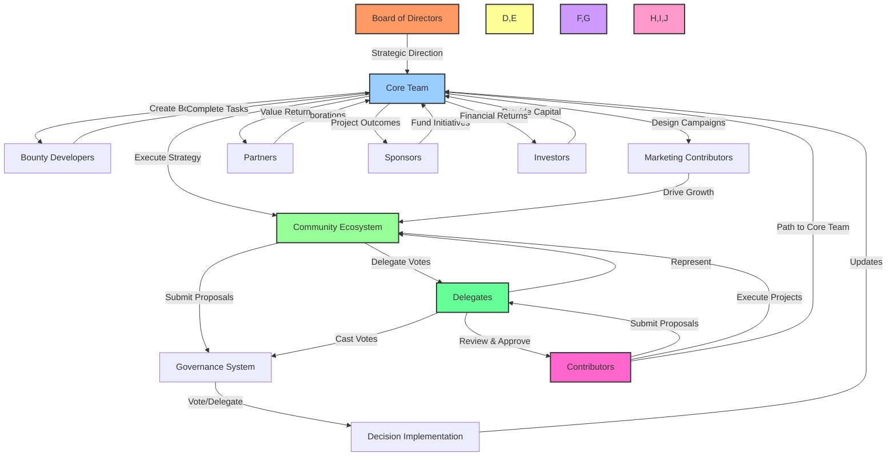

# 🌐 BAD DAO Community Engagement Strategy 2.0

## 📋 Table of Contents
- [📝 Executive Summary](#-executive-summary)
- [👥 Community Roles & Definitions](#-community-roles--definitions)
- [🔄 Role Interaction Workflow](#-role-interaction-workflow)
- [🗺️ Strategic Roadmap & Timeline](#️-strategic-roadmap--timeline)
- [📊 KPIs & Success Metrics](#-kpis--success-metrics)
- [🎯 Actionable Results Framework](#-actionable-results-framework)
- [📣 Community Call-to-Action Templates](#-community-call-to-action-templates)
- [📆 12-Month Campaign Calendar](#-12-month-campaign-calendar)

## 📝 Executive Summary

The BAD DAO 2.0 initiative addresses declining community engagement by implementing a value-centric, transactional model that eliminates passive participation. This strategy establishes a four-year (16-season) completionist framework where community members receive proportional value based on their contributions, culminating in a comprehensive DAO experience including governance participation, project development, proposal creation, and financial returns.

This document serves as the strategic blueprint for transforming community engagement from energy-draining to energy-exchanging interactions, ensuring all stakeholders understand their roles, responsibilities, and potential rewards within the ecosystem.

## 👥 Community Roles & Definitions

### 🏛️ Core Team

**Definition:** Full-time, salaried professionals dedicated to BAD DAO development and operations.

**Responsibilities:**
- 🧭 Strategic direction and implementation
- 🛠️ Protocol and platform development
- 💰 Treasury management and financial planning
- 🏛️ Community governance oversight
- ✅ Proposal review and implementation

**Value Exchange:**
- 💵 Monthly base compensation: $5,000
- 🪙 Performance-based token allocation
- ⚖️ Voting power multiplier: 1.5x on technical proposals
- 🔑 Direct access to treasury for approved initiatives

### 👷 Contributors

**Definition:** Token holders who actively participate by creating proposals and adding value to the ecosystem.

**Qualification Process:**
- 📝 Complete contributor qualification test
- 📬 Receive initial token allocation upon qualification
- 📋 Submit proposal to relevant delegate or AI review system
- ✅ Receive delegate approval for contribution role
- 🧠 Demonstrate specific expertise or value addition

**Responsibilities:**
- 💡 Develop and submit improvement proposals
- 🔨 Execute on approved contribution initiatives
- 📊 Regular reporting on progress and outcomes
- 🗳️ Active participation in governance voting

**Contributor Rank System:**
1. **🔰 Novice Contributor (Level 1)**
   - 0️⃣ 0 completed projects
   - 1️⃣ Max 1 active proposal at a time
   - 👀 Requires higher delegate oversight
   - 💰 Access to smaller budget initiatives (<$5,000)

2. **🧩 Established Contributor (Level 2)**
   - 📊 1-3 successful completed projects
   - 2️⃣ Max 2 active proposals at a time
   - 👁️ Reduced oversight requirements
   - 💰 Access to medium budget initiatives ($5,000-$15,000)

3. **⭐ Senior Contributor (Level 3)**
   - 📊 4-8 successful completed projects
   - 3️⃣ Max 3 active proposals at a time
   - 🔍 Minimal oversight requirements
   - 💰 Access to larger budget initiatives ($15,000-$50,000)

4. **🌟 Lead Contributor (Level 4)**
   - 📊 9+ successful completed projects
   - 3️⃣ Max 3 active proposals at a time
   - 🚀 Self-directed with outcome reporting
   - 💰 Access to strategic initiatives ($50,000+)
   - 🪜 Eligible for Core Team consideration

**💲 Compensation Framework:**

1. **🪙 Token Contribution Component (40% weight)**
   - 📊 Reward proportional to tokens staked on proposal
   - 🧮 Formula: `(Individual Token Contribution ÷ Total Token Contribution) × 40% of Total Reward`
   - 📝 Example: If contributor stakes 500 of 1500 total tokens, they receive `(500/1500) × 40% = 13.3%` of total reward base

2. **⚙️ Work Effort Component (60% weight)**
   - 📊 Quantified based on:
     - ⏱️ Time tracking (20%): Hours logged and verified
     - 🌟 Deliverable quality (25%): Peer and delegate review scores
     - 🏁 Milestone achievement (15%): Percentage of milestones completed on time

3. **🛡️ Anti-Monopolization Protections:**
   - 🔒 Hard cap on simultaneous proposals per contributor level
   - ⏲️ Minimum 30-day cooling period between project completions and new proposals (can be waived by delegates for critical needs)
   - ⚠️ Warning system for unauthorized project hopping:
     - 1️⃣ First offense: Formal warning
     - 2️⃣ Second offense: 90-day proposal suspension
     - 3️⃣ Third offense: Removal from contributor status (must re-qualify)

4. **🚀 Performance Multipliers:**
   - ⏱️ On-time completion: 1.1x multiplier
   - 💰 Under-budget delivery: 1.15x multiplier
   - 🌟 Exceptional quality (top 10% review score): 1.2x multiplier
   - 🧮 Combined maximum multiplier cap: 1.3x

5. **💸 Reward Distribution Timeline:**
   - 3️⃣0️⃣% upon proposal approval
   - 4️⃣0️⃣% at predetermined milestones
   - 3️⃣0️⃣% upon successful completion and review
   - 🔼 Bonus multipliers applied to final 30% portion

**💱 Value Exchange:**
- 💰 Project-based compensation based on proposal scope and framework above
- 🪙 Token rewards for completed contributions
- 📈 Rank advancement with successful project completions
- 🏆 Pathway to Core Team consideration for consistently high performers
- 🌟 Recognition and reputation building within community

**📊 Progress Tracking:**
- 📱 Contributor Dashboard showing:
  - 📈 Current rank and projects to next level
  - 🔄 Active proposals and their status
  - 📝 Token contribution history
  - ⚙️ Work effort metrics
  - 💵 Compensation history and projections

**🔄 Contributor Proposal Process:**

1. **📝 Proposal Development & Submission**
   - ✍️ Contributor drafts proposal using standardized template
   - 📄 Proposal must include:
     - ❓ Problem statement and solution
     - 📊 Expected impact and value to DAO
     - 💰 Required resources and budget
     - ⏱️ Timeline with clear milestones
     - 🪙 Token contribution commitment (minimum threshold based on proposal size)
     - 💪 Work effort commitment with deliverables
     - 📏 Success metrics and evaluation criteria

2. **🔍 Initial Review**
   - 📤 Proposal submitted to designated delegate or AI review system
   - 🧪 Technical review for feasibility and resource requirements
   - 📊 Assessment of contributor rank eligibility for proposal size
   - 💬 Preliminary feedback provided within 72 hours
   - ✏️ Revisions may be requested before proceeding

3. **🪙 Token Commitment Phase**
   - ✅ Approved proposals enter token commitment phase
   - 1️⃣ Proposal creator commits their tokens first
   - 👥 Other contributors can commit tokens to show support
   - 🎯 Minimum threshold of 1500 tokens required to proceed
   - 📆 Token commitment phase lasts 5 days
   - 🔒 Tokens are locked until proposal completion or rejection

4. **🗳️ Community Voting**
   - 📊 Proposals meeting token threshold move to community vote
   - 5️⃣ 5-day voting period
   - 👥 Delegates may vote with delegated power
   - ✅ Approval requires meeting criteria for proposal type

5. **🚀 Execution Phase**
   - 💰 Approved proposals receive initial 30% funding
   - 🔨 Contributor begins work according to timeline
   - 📊 Regular updates required (frequency based on contributor rank)
   - 🏁 Milestone achievements trigger additional 40% funding
   - 📱 Community can track progress via dashboards

6. **✅ Completion & Review**
   - 📝 Contributor submits completion report
   - 🔍 Delegate and peer review of deliverables
   - 📊 Performance metrics calculated
   - 💰 Final 30% funding released with applicable multipliers
   - 📈 Contributor rank updated based on performance

7. **📏 Impact Tracking**
   - 📊 Post-implementation performance tracking
   - 📈 Value generated tracked against projections
   - 🔄 Long-term impact assessment after 90 days
   - 📝 Results inform future proposal evaluations

### 🏛️ Board of Directors

**Definition:** Strategic oversight body composed of 5-7 industry leaders.

**Responsibilities:**
- 🧭 Long-term strategic direction
- 👁️ Core team accountability
- 🤝 Major partnership approvals
- 🧯 Crisis management oversight

**Value Exchange:**
- 🪙 Quarterly token allocation (time-locked)
- 🌟 Reputation enhancement within industry
- 🔄 Network expansion opportunities
- ⚖️ Weighted voting powers on constitutional proposals (2x)

### 👥 Delegates

**Definition:** Elected representatives who accumulate voting power from token holders.

**Responsibilities:**
- 🧠 Specialized domain expertise (technical, financial, marketing)
- 📝 Proposal analysis and improvement
- ✅ Contributor proposal review and approval
- 💬 Regular communication with delegators
- 🗳️ Voting on behalf of delegated tokens

**Value Exchange:**
- 📊 Reputation score (1.0-1.3x voting multiplier)
- 💰 Delegate compensation from protocol (0.5% of delegated tokens annually)
- 🌟 Featured profile and thought leadership platform
- 🔄 Network expansion opportunities

### 🤝 Partners

**Definition:** Organizations with formal, mutually beneficial agreements with BAD DAO.

**Types:**
1. **🖥️ Technology Partners:** Provide technical infrastructure or integration
2. **📢 Distribution Partners:** Expand BAD DAO reach to new audiences
3. **🧠 Knowledge Partners:** Provide expertise and educational resources
4. **🌐 Ecosystem Partners:** Complementary projects within the ecosystem

**Value Exchange:**
- 🛠️ Co-development opportunities
- 💰 Revenue sharing agreements (10-30% based on partnership type)
- 📣 Cross-promotional marketing
- 🔑 Early access to new features
- 🪙 Custom-designed token incentives

### 💰 Sponsors

**Definition:** Entities providing financial support for specific initiatives or overall operations.

**Responsibilities:**
- 💵 Provide funding for dedicated initiatives
- 🗳️ Participate in sponsored project governance
- 📣 Promote BAD DAO within their networks

**Value Exchange:**
- 🎯 Prominent brand placement
- 🔑 First access to project outcomes
- 🪙 Custom token allocation (non-voting)
- 🎮 Participation in sponsored initiative direction

### 💼 Investors

**Definition:** Entities providing capital in exchange for token allocation and returns.

**Responsibilities:**
- 💰 Strategic capital deployment
- 🔄 Network introductions and growth support
- 🔗 Long-term alignment with protocol success

**Value Exchange:**
- 🪙 Token allocation with predetermined vesting schedule
- 📊 Quarterly financial and development reports
- 🔑 Priority access to new investment opportunities
- 💵 Proportional returns based on protocol revenue (15-25% of total revenue)

### 👨‍💻 Bounty Developers

**Definition:** Independent developers who complete specific, pre-defined development tasks.

**Responsibilities:**
- 💻 Deliver quality code meeting specifications
- ⏱️ Meet established deadlines
- 🔍 Participate in code reviews
- 📝 Document work comprehensively

**Value Exchange:**
- 💰 Task-based compensation (tokens and/or stablecoins)
- 🌟 Reputation building within developer community
- 🪜 Pathway to core contributor status
- 🧠 Skills development and portfolio building

### 📣 Marketing Contributors

**Definition:** Specialists who execute targeted marketing initiatives on commission basis.

**Responsibilities:**
- 🎨 Create promotional content
- 📢 Execute marketing campaigns
- 📊 Track and report performance metrics
- 🔍 Identify new marketing opportunities

**Value Exchange:**
- 💰 Commission-based compensation (10-20% of attributable revenue)
- 🪙 Performance-based token bonuses
- 📁 Professional portfolio development
- 🔄 Network expansion within DAO ecosystem

## 🔄 Role Interaction Workflow



### 🔄 Value Flow Dynamics

1. **📑 Contributor Proposal Lifecycle:**
   - 📝 Token holder completes qualification test
   - 💡 Contributor develops proposal
   - 🔍 Delegate reviews and approves proposal
   - 🛠️ Contributor executes approved initiative
   - 🌐 Community and DAO receive value
   - 💰 Contributor receives compensation and recognition

2. **🗳️ Proposal Lifecycle:**
   - 📝 Community member submits proposal
   - 🗳️ Delegates and token holders vote
   - 🔨 Core team implements approved proposals
   - 💰 Value generated flows back to contributors

3. **🏗️ Project Development:**
   - 📋 Core team defines project requirements
   - 💻 Bounty developers build components
   - 🤝 Partners integrate solutions
   - 💰 Sponsors fund specific initiatives
   - 📊 Value distributes to all participants

4. **📈 Growth Mechanism:**
   - 📣 Marketing contributors promote initiatives
   - 👥 New members join ecosystem
   - 💰 New value flows into treasury
   - 💸 Treasury allocates to core team/contributors/investors
   - 🌐 Ecosystem expands with new opportunities

## 🗺️ Strategic Roadmap & Timeline

### 🔄 Four-Year Completionist Framework (16 Seasons)

#### 🏗️ Year 1: Foundation (Seasons 1-4)
- **🏛️ Season 1: Community Architecture** (Q2 2025)
  - 👥 Role definition and onboarding processes
  - 🏛️ Governance framework implementation
  - 🏆 Initial bounty program launch
  
- **⚙️ Season 2: Engagement Mechanics** (Q3 2025)
  - 👥 Delegate system activation
  - 🤝 Partner onboarding framework
  - 👨‍💻 Developer relations program
  
- **📈 Season 3: Growth Acceleration** (Q4 2025)
  - 📣 Marketing contributor program
  - 💰 Commission-based promotion system
  - 🏆 Community milestone rewards
  
- **💰 Season 4: Value Capture** (Q1 2026)
  - 💸 Initial revenue sharing implementation
  - 📊 Contribution-to-value tracking system
  - 📝 Quarterly performance reviews

#### 🚀 Year 2: Expansion (Seasons 5-8)
- **🌐 Season 5: Ecosystem Development** (Q2 2026)
  - 🔗 Multi-chain integration
  - 🤝 Cross-DAO collaboration framework
  - 🧩 Advanced partnership models
  
- **👥 Season 6: Specialized Contribution** (Q3 2026)
  - 🧠 Domain-specific working groups
  - 🏆 Expert contributor incentives
  - 📚 Specialized knowledge repository
  
- **💡 Season 7: Community-Led Innovation** (Q4 2026)
  - 💰 Innovation funding pool
  - 🚀 Community incubator program
  - 👨‍🏫 Contribution-based mentorship

- **💹 Season 8: Revenue Diversification** (Q1 2027)
  - 🧩 Product suite expansion
  - 🛠️ Service offering development
  - 💰 Multiple revenue stream activation

#### 📈 Year 3: Maturation (Seasons 9-12)
- **📊 Season 9-12:** Focused on scaling successful programs, optimizing governance, and maximizing stakeholder value (Q2 2027 - Q1 2028)

#### ⚡ Year 4: Optimization (Seasons 13-16)
- **🔍 Season 13-16:** Focused on long-term sustainability, leadership transition, and maximizing community outcomes (Q2 2028 - Q1 2029)

### 🏁 Key Milestones

1. **🏛️ Q2 2025: Role Framework Completion**
   - 📝 All role definitions documented
   - 💰 Compensation structures defined
   - 🚪 Onboarding processes implemented
   
2. **👥 Q3 2025: 100 Active Contributors**
   - 👨‍💻 Minimum 25 bounty developers
   - 📣 15 marketing contributors
   - 👥 10 delegates
   - 🗳️ 50 regular proposal participants
   
3. **🤝 Q4 2025: Partnership Network**
   - 🖥️ 5 technology partners
   - 📢 3 distribution partners
   - 🌐 7 ecosystem partners
   - 💰 2 major sponsors
   
4. **💰 Q1 2026: Revenue Generation**
   - 💹 First profitable quarter
   - 💸 Initial contributor profit sharing
   - 💵 Investor return distribution
   
5. **🚀 Q2 2026: Expansion Milestone**
   - 👥 500 active contributors
   - 🤝 25 partnership agreements
   - 💰 10 revenue-generating projects
   - 🏛️ Community-led governance transition

6. **📈 Q3 2026 - Q1 2028: Scaling and Optimization**
   - 📊 Growth targets adjusted quarterly
   - 🔄 Full completionist program implementation

## 📊 KPIs & Success Metrics

### 👥 Engagement Metrics
- **👥 Active Contributors:** Number of members making meaningful contributions monthly
  - 📈 Y1 Target: 250 contributors
  - 📈 Y2 Target: 750 contributors
  - 📈 Y3 Target: 1,500 contributors
  - 📈 Y4 Target: 2,500 contributors

- **🗳️ Proposal Participation:** Percentage of token holders voting on proposals
  - 📊 Y1 Target: 15% participation
  - 📊 Y2 Target: 25% participation
  - 📊 Y3 Target: 35% participation
  - 📊 Y4 Target: 45% participation

- **🔄 Contribution Frequency:** Average contributions per active member monthly
  - 📈 Y1 Target: 2.5 contributions
  - 📈 Y2 Target: 4 contributions
  - 📈 Y3 Target: 5.5 contributions
  - 📈 Y4 Target: 7 contributions

### 💰 Financial Metrics
- **💹 Treasury Growth:** Annual percentage increase in treasury value
  - 📈 Y1 Target: 25% growth
  - 📈 Y2 Target: 40% growth
  - 📈 Y3 Target: 60% growth
  - 📈 Y4 Target: 75% growth

- **💵 Revenue Per Contributor:** Average value generated per active contributor
  - 💰 Y1 Target: $500/month
  - 💰 Y2 Target: $1,500/month
  - 💰 Y3 Target: $3,000/month
  - 💰 Y4 Target: $5,000/month

- **🪙 Token Utility Ratio:** Percentage of tokens used for governance/utility vs. speculation
  - 📊 Y1 Target: 30% utility
  - 📊 Y2 Target: 50% utility
  - 📊 Y3 Target: 65% utility
  - 📊 Y4 Target: 75% utility

### 💻 Development Metrics
- **✅ Bounty Completion Rate:** Percentage of bounties successfully completed
  - 📊 Y1 Target: 65% completion
  - 📊 Y2 Target: 75% completion
  - 📊 Y3 Target: 85% completion
  - 📊 Y4 Target: 90% completion

- **🌟 Code Quality Score:** Average quality assessment of submitted code
  - 📊 Y1 Target: 7.5/10 average
  - 📊 Y2 Target: 8.0/10 average
  - 📊 Y3 Target: 8.5/10 average
  - 📊 Y4 Target: 9.0/10 average

- **⏱️ Release Cadence:** Time between significant feature releases
  - 📅 Y1 Target: 60 days
  - 📅 Y2 Target: 45 days
  - 📅 Y3 Target: 30 days
  - 📅 Y4 Target: 21 days

### 🔄 Retention Metrics
- **👥 Contributor Retention:** Percentage of contributors active for >6 months
  - 📊 Y1 Target: 25% retention
  - 📊 Y2 Target: 40% retention
  - 📊 Y3 Target: 55% retention
  - 📊 Y4 Target: 70% retention

- **📈 Completionist Progress:** Average progress through 4-year program
  - 📊 Y1 Target: 15% completion rate
  - 📊 Y2 Target: 35% completion rate
  - 📊 Y3 Target: 60% completion rate
  - 📊 Y4 Target: 40% graduation rate

## 🎯 Actionable Results Framework

### 🏛️ Core Team Actions

1. **📊 Quarterly Role Review**
   - 📝 Evaluate role performance against KPIs
   - 💰 Adjust compensation and incentives
   - 📄 Update role documentation
   - 👤 Action owner: Operations Lead
   - 📅 Completion timeline: Last week of each quarter

2. **📢 Monthly Community Call**
   - 📊 Present progress updates
   - 🏆 Recognize top contributors
   - 📢 Announce new initiatives
   - 👤 Action owner: Community Lead
   - 📅 Completion timeline: First week of each month

3. **🏆 Bi-weekly Bounty Release**
   - 📝 Publish new development opportunities
   - 📊 Update bounty completion scoreboard
   - 🌟 Highlight successful bounty completions
   - 👤 Action owner: Development Lead
   - 📅 Completion timeline: Every two weeks

### 👷 Contributor Actions

1. **📝 Contribution Documentation**
   - 📄 Record all contributions in tracking system
   - 🔗 Link contributions to specific projects
   - 📊 Quantify value added when possible
   - 👤 Action owner: Individual Contributors
   - ⏱️ Completion timeline: Within 48 hours of contribution

2. **📊 Quarterly Progression Review**
   - 📝 Self-assess completionist progress
   - 🎯 Set next-quarter contribution goals
   - 📚 Request specific skill development
   - 👤 Action owner: Individual Contributors
   - 📅 Completion timeline: First week of each quarter

3. **💬 Monthly Feedback Submission**
   - 📝 Provide structured feedback on programs
   - 💡 Suggest process improvements
   - 🗳️ Vote on community priorities
   - 👤 Action owner: Individual Contributors
   - 📅 Completion timeline: Last week of each month

### 🤝 Partner/Sponsor Actions

1. **📊 Quarterly Value Assessment**
   - 📝 Evaluate partnership ROI
   - 📄 Document mutual benefits realized
   - 🎯 Set next-quarter objectives
   - 👤 Action owner: Partnership Lead
   - 📅 Completion timeline: Third week of each quarter

2. **🧭 Bi-annual Strategy Alignment**
   - 📝 Review long-term strategic alignment
   - 📄 Adjust partnership terms as needed
   - 🔍 Explore expansion opportunities
   - 👤 Action owner: Strategic Partnerships Director
   - 📅 Completion timeline: Q2 and Q4

## 📣 Community Call-to-Action Templates

### 🚪 New Member Onboarding

```
🚀 JOIN THE BUILDERS: BAD DAO NEEDS YOUR SKILLS

We're not looking for passive participants. We're seeking builders, creators, and innovators ready to exchange value and earn rewards.

✅ CHOOSE YOUR PATH:
- 💻 Develop code, earn bounties
- 📣 Market projects, earn commissions
- 🧠 Contribute expertise, earn reputation
- 👥 Delegate votes, earn delegation rewards

👉 YOUR FIRST STEPS:
1. 📝 Complete our skills assessment
2. 💬 Join our Discord orientation
3. 🔍 Select your first contribution opportunity
4. 🏁 Start your 4-year completionist journey

🔗 [Get Started Now]: [LINK]
```

### 💻 Bounty Program Promotion

```
💻 DEVELOPERS WANTED: SOLVE, BUILD, EARN

Current bounties need your expertise! Not just coding—building the future of decentralized organization.

🏆 THIS WEEK'S TOP BOUNTIES:
- 🔥 [Specific Bounty Name] - $XXX Reward
- 🔥 [Specific Bounty Name] - $XXX Reward
- 🔥 [Specific Bounty Name] - $XXX Reward

⚡ WHY PARTICIPATE:
- 💰 Direct token compensation
- 🌟 Build your on-chain reputation
- 🪜 Path to core contributor status
- 🌐 Be part of something transformative

🔍 [Browse All Bounties]: [LINK]
```

### 🗳️ Governance Participation

```
🗳️ YOUR VOICE MATTERS: CRITICAL VOTE LIVE

Active proposal requires your vote in the next 48 hours. This isn't just governance—it's building our future together.

📋 PROPOSAL OVERVIEW:
- 📑 Title: [Proposal Title]
- 📊 Impact: [High/Medium/Low]
- ⚖️ Your Voting Power: [XXX]
- ⏱️ Closes: [Date/Time]

💪 VALUE EXCHANGE:
- 🪙 Voting rewards: X tokens per proposal
- 📈 Governance XP towards completionist status
- 🧭 Direct influence on our shared direction

✅ [Cast Your Vote Now]: [LINK]
```

### 🤝 Partnership Invitation

```
🤝 PARTNERSHIP OPPORTUNITY: GROW TOGETHER

BAD DAO is seeking strategic partners who bring value and receive value in return. No passive relationships—only mutual growth.

🌟 PARTNER BENEFITS:
- 💰 Revenue sharing: 10-30% based on contribution
- 🛠️ Co-development opportunities
- 👥 Access to our developer community
- 🪙 Custom token allocation

📊 SUCCESS METRICS:
- 🎯 Clear KPIs established upfront
- 📝 Quarterly value assessment
- 📊 Transparent reporting
- 📈 Scalable engagement model

📩 [Schedule Partnership Discussion]: [LINK]
```

### 🏆 Completionist Program Milestone

```
🏆 MILESTONE ACHIEVED: [X]% COMPLETION

Congratulations! You've reached [Milestone Name] in your BAD DAO completionist journey. Here's what you've unlocked:

🎁 REWARDS UNLOCKED:
- 🪙 [Specific reward] tokens added to your wallet
- 🔑 [New permission/access] now available
- 👑 [Special role] activated on Discord
- 🚀 [Next opportunity] now available

📊 YOUR PROGRESS:
- 📈 Current Level: [Level]
- 🎯 Next Milestone: [Next Milestone Name]
- 📅 Est. Completion: [Date]

🚀 [Continue Your Journey]: [LINK]
```

## 📆 12-Month Campaign Calendar

### 🏗️ Month 1: "Builders Wanted" (Role Definition Campaign) - May 2025
- **🔍 Focus:** Clear definition of all community roles
- **🛠️ Key Activities:**
  - 📝 Role documentation release
  - 👤 "Day in the life" spotlights for each role
  - 📋 Contributor qualification test development
  - 🔗 Delegate-Contributor connection system
  - 👥 Initial onboarding wave
- **🎯 Success Metric:** 50 new qualified contributors matched to appropriate roles

### 💻 Month 2: "Bounty Hunters" (Developer Engagement) - June 2025
- **🔍 Focus:** Expanding the developer ecosystem
- **🛠️ Key Activities:**
  - 🏆 Launch 25 new bounties across difficulty levels
  - 📚 Developer workshop series
  - 👨‍🏫 Code review mentorship program
  - 🌟 Recognition system for quality submissions
- **🎯 Success Metric:** 75% bounty completion rate with 40+ unique developers

### 👥 Month 3: "Delegate Drive" (Governance Campaign) - July 2025
- **🔍 Focus:** Establishing a robust delegation system
- **🛠️ Key Activities:**
  - 🗳️ Delegate candidate nominations
  - 🎤 Delegate pitch presentations
  - ⚖️ Voting power analysis tools
  - 🏆 Delegation ceremony and recognition
- **🎯 Success Metric:** 35% of voting power actively delegated

### 🤝 Month 4: "Partner Pursuit" (Partnership Expansion) - August 2025
- **🔍 Focus:** Strategic partnership development
- **🛠️ Key Activities:**
  - 🌟 Partner showcase events
  - 🔌 Integration demonstration workshops
  - 📊 Partnership ROI calculator release
  - 🔄 Fast-track partnership process
- **🎯 Success Metric:** 5 new strategic partnerships formalized

### 💰 Month 5: "Revenue Revolution" (Value Capture Focus) - September 2025
- **🔍 Focus:** Establishing clear value flows
- **🛠️ Key Activities:**
  - 📊 Revenue model workshops
  - 🔗 Contribution-to-value mapping
  - 💸 Initial value distribution
  - 📝 Financial transparency reporting
- **🎯 Success Metric:** First profitable month with value distribution

### 📣 Month 6: "Marketing Multipliers" (Commission-based Marketing) - October 2025
- **🔍 Focus:** Establishing performance marketing framework
- **🛠️ Key Activities:**
  - 👤 Marketing contributor onboarding
  - 📊 Attribution system implementation
  - 🎨 Creative asset development
  - 💰 Commission structure launch
- **🎯 Success Metric:** 20 active marketing contributors with positive ROI

### 🏆 Month 7: "Milestone Makers" (Progress Recognition) - November 2025
- **🔍 Focus:** Celebrating completionist program progress
- **🛠️ Key Activities:**
  - 📊 Progress visualization tools
  - 🏆 Achievement unlocking ceremonies
  - 🎁 Milestone rewards distribution
  - 🚀 Progress acceleration opportunities
- **🎯 Success Metric:** 60% of active contributors advancing in completionist track

### 🧠 Month 8: "Expertise Exchange" (Knowledge Sharing) - December 2025
- **🔍 Focus:** Developing internal expertise marketplace
- **🛠️ Key Activities:**
  - 📋 Skill inventory creation
  - 🔄 Knowledge exchange platform launch
  - 👨‍🏫 Expert-led workshops
  - 👥 Mentorship matching program
- **🎯 Success Metric:** 100+ hours of knowledge exchange logged

### 💰 Month 9: "Sponsor Spotlight" (Funding Relationships) - January 2026
- **🔍 Focus:** Developing sustainable sponsor relationships
- **🛠️ Key Activities:**
  - 📋 Sponsor package development
  - 💡 Sponsored initiative proposals
  - 📊 Funding allocation transparency
  - 🏆 Sponsor recognition program
- **🎯 Success Metric:** 3 major sponsor relationships established

### 🔌 Month 10: "Integration Innovation" (Technical Expansion) - February 2026
- **🔍 Focus:** Expanding technical capabilities
- **🛠️ Key Activities:**
  - 🔗 Cross-chain integration bounties
  - 🌐 API development program
  - 🤝 Technical partnership initiatives
  - 💻 Developer hackathon
- **🎯 Success Metric:** 5 new technical integrations completed

### 🎨 Month 11: "Community Creators" (Content Development) - March 2026
- **🔍 Focus:** Expanding community-created content
- **🛠️ Key Activities:**
  - 👤 Content creator onboarding
  - 📱 Multi-format content development
  - 📢 Distribution channel expansion
  - 💰 Content monetization framework
- **🎯 Success Metric:** 50+ pieces of community-created content with attribution

### 🎉 Month 12: "Year One Celebration" (Completionist Showcase) - April 2026
- **🔍 Focus:** Celebrating first year achievements
- **🛠️ Key Activities:**
  - 🏆 Contributor recognition awards
  - 📊 Year one impact report
  - 📈 Completionist progress showcase
  - 🗺️ Year two preview and roadmap
- **🎯 Success Metric:** 25% retention of month 1 contributors with advancement

---

*This document is version controlled and will be updated quarterly. All community members are encouraged to submit improvement proposals through the governance system.*

*Version: 1.0*
*Last Updated: May 2025*
*Document Owner: BAD DAO Core Team* 