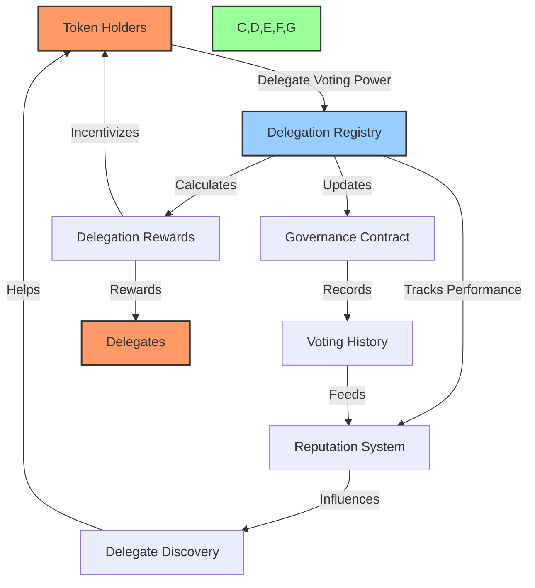
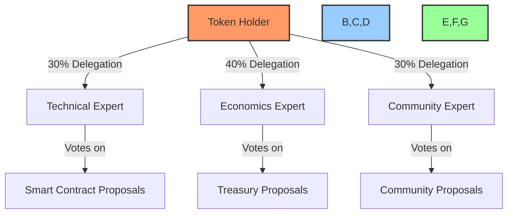
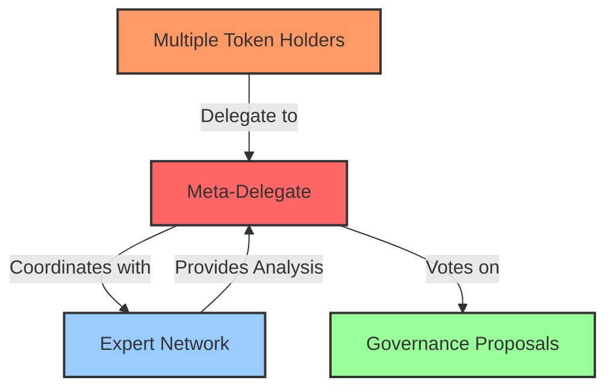
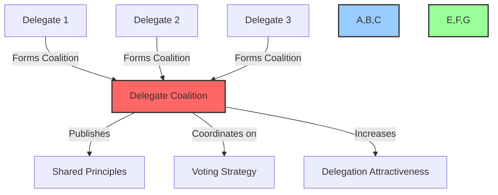

# 📋 BAD DAO Delegation Guide

## Table of Contents
- [📚 Overview of Delegation](#-overview-of-delegation)
- [🏗️ BAD DAO Delegation System Architecture](#️-bad-dao-delegation-system-architecture)
- [💡 Delegation Mechanics](#-delegation-mechanics)
- [⚖️ Voting Power & Calculation](#️-voting-power--calculation)
- [🏆 Incentives & Rewards](#-incentives--rewards)
- [📊 Delegation Dashboard & Interface](#-delegation-dashboard--interface)
- [👤 Becoming a Delegate](#-becoming-a-delegate)
- [💼 Delegating Your Voting Power](#-delegating-your-voting-power)
- [🔄 Modifying the Delegation System](#-modifying-the-delegation-system)
- [📝 Example Delegation Scenarios](#-example-delegation-scenarios)
- [❓ Frequently Asked Questions](#-frequently-asked-questions)

## 📚 Overview of Delegation

### What is Delegation?

Delegation is a governance mechanism that allows token holders to transfer their voting power to another address without transferring ownership of their tokens. This creates an efficient division of governance labor where:

- **Token holders** can maintain their governance rights without actively participating in every vote
- **Delegates** can accumulate voting power to become specialized governance participants
- **The DAO** benefits from more informed and consistent governance participation

Delegation helps solve the challenges of low voter participation and uninformed voting by enabling those with expertise, time, and interest to vote on behalf of others.

### The Value of Delegation

Effective delegation provides several key benefits:

1. **Enhanced governance participation** through specialized delegates who focus on governance activities
2. **Improved decision quality** as delegates develop expertise in specific governance areas
3. **Reduced governance fatigue** for token holders who wish to maintain influence without active participation
4. **Alignment of incentives** through delegation rewards and reputation systems
5. **Greater scalability** of the governance system as the DAO grows

## 🏗️ BAD DAO Delegation System Architecture

The BAD DAO delegation system consists of several interconnected components:



### Core Components

1. **Delegation Registry**: Tracks who has delegated to whom and maintains the delegation history
2. **Reputation System**: Evaluates delegate performance based on participation and alignment
3. **Reward Distribution**: Calculates and distributes incentives to delegates and delegators
4. **Delegation Interface**: User interface for exploring delegates and managing delegations

## 💡 Delegation Mechanics

### Time-Locking & Commitment

The BAD DAO delegation system implements a time-locking mechanism to prevent strategic manipulation of voting power:

- **Minimum Delegation Period**: 7 days
- **Revocation Process**: 7-day lockup before the return of voting power
- **Delegation Splitting**: Token holders can split their delegation across multiple delegates (minimum 10% per delegate)

### Delegation Caps & Limits

To prevent excessive concentration of voting power and maintain the decentralized nature of governance:

- **Maximum Delegation Cap**: 5% of the total token supply per delegate
- **Minimum Delegation Amount**: No enforced minimum, but practical minimum based on gas costs
- **Splitting Requirements**: When splitting delegation, minimum 10% of holdings to any single delegate

### Delegation Implementation

At a technical level, delegation is implemented through:

```yaml
delegation_mechanics:
  registry_contract: "Records all delegation assignments and history"
  voting_power_calculation: "Aggregates delegated tokens with time-weighting factors"
  revocation_mechanism: "Time-locked, with 7-day lockup period"
  transaction_requirements: "Standard gas fees for delegation transactions"
```

## ⚖️ Voting Power & Calculation

### Base Voting Power

In the BAD DAO governance system:

- 1 BAD token = 1 base vote
- Voting power can be delegated without transferring token ownership
- Delegation applies to all governance votes (cannot delegate for specific proposals only)

### Time-Weighted Voting

The BAD DAO implements time-weighted voting to reward long-term holders:

```yaml
time_weighted_voting:
  30_day_holding: "1.2x multiplier"
  90_day_holding: "1.5x multiplier"
  180_day_holding: "2.0x multiplier"
```

### Delegation Impact on Voting Power

When delegation occurs:

1. The delegator's voting power is transferred to the delegate
2. The delegator retains token ownership and economic rights
3. Time-weighting factors from the original holder are preserved
4. Delegates accumulate voting power from multiple delegators

## 🏆 Incentives & Rewards

The BAD DAO delegation system includes incentives for both delegates and delegators to encourage participation and quality governance:

### Delegator Rewards

```yaml
delegator_incentives:
  base_apy: "0.2% annual yield on delegated tokens"
  performance_bonus: "0.3-1.8% additional based on delegate performance"
  loyalty_bonus: "0.5% additional per 90 days of continuous delegation"
  payment_source: "Treasury allocation for governance incentives"
  payment_frequency: "Monthly distributions"
```

### Delegate Rewards

```yaml
delegate_incentives:
  base_reward: "0.5-2% APY based on delegated amount"
  participation_bonus: "Additional rewards for consistent voting"
  alignment_bonus: "Rewards for votes that align with proposal outcomes"
  reputation_impact: "Performance affects delegate ranking and visibility"
```

### Slashing Conditions

The reputation system implements penalties for delegate behaviors that harm governance:

- Missing critical votes: Reputation penalty
- Opposing consensus without explanation: Requires public justification or reputation penalty
- Principle violations: Potential delegation revocation and reputation damage

## 📊 Delegation Dashboard & Interface

### Delegate Discovery

The delegation dashboard provides token holders with tools to discover and evaluate potential delegates:

- **Delegate Directory**: Searchable list of active delegates
- **Performance Metrics**: Historical voting participation and alignment
- **Expertise Tags**: Self-declared areas of expertise and focus
- **Delegation Strategy**: Published delegation principles and voting framework
- **Communication History**: Previous governance contributions and rationales

### Delegation Management

Token holders can manage their delegations through:

- **Delegation Interface**: User-friendly UI for delegation assignments
- **Delegation Portfolio**: Track and manage multiple delegations
- **Performance Tracking**: Monitor delegate voting activity and alignment
- **Reward Dashboard**: View earned delegation rewards
- **Revocation Controls**: Manage delegation timelock and changes

## 👤 Becoming a Delegate

### Delegate Qualifications

To qualify as a delegate in the BAD DAO system:

```yaml
delegate_qualifications:
  minimum_tokens: "50,000 BAD tokens staked in delegation contract"
  training_completion: "Successful completion of delegation training"
  participation_history: "Established track record of governance participation"
  published_principles: "Public declaration of delegation principles and framework"
  communication_commitment: "Regular updates to delegators"
```

### Delegate Responsibilities

Delegates take on specific governance responsibilities:

1. **Analysis & Research**: Thorough evaluation of all proposals in their domain
2. **Active Participation**: Consistent voting (minimum 80% of proposals)
3. **Transparency**: Publishing voting rationales and decision frameworks
4. **Communication**: Regular updates and engagement with delegators
5. **Representation**: Acting in the best interests of delegators and the DAO

### Becoming a Delegate: Step-by-Step

1. Meet the minimum qualification requirements
2. Complete delegate training program
3. Stake required tokens in the delegation contract
4. Publish your delegation principles and expertise areas
5. Begin building reputation through active participation

## 💼 Delegating Your Voting Power

### How to Delegate

1. **Research Delegates**: Review delegate profiles, voting history, and principles
2. **Choose Your Strategy**: 
   - Single delegate: Assign all voting power to one trusted delegate
   - Domain experts: Split voting power among specialists in different areas
   - Backup delegation: Primary delegate with backup options
3. **Execute Delegation**: Through the delegation interface in the BAD DAO dashboard
4. **Monitor Performance**: Track delegate voting and participation
5. **Manage Rewards**: View and claim earned delegation incentives

### Choosing a Delegate

Consider these factors when selecting delegates:

- **Alignment**: How closely their principles match your governance preferences
- **Expertise**: Their knowledge and focus in areas important to you
- **Participation**: History of consistent and thoughtful governance involvement
- **Communication**: Clear explanations of voting decisions and rationales
- **Reputation**: Overall standing in the governance community

### Managing Your Delegation

Ongoing delegation management includes:

- Regular review of delegate performance
- Evaluating reward accumulation and claiming
- Considering delegation changes when needed (subject to timelock)
- Participating in delegate discussions and feedback

## 🔄 Modifying the Delegation System

### Governance Proposal Process

Changes to the delegation system require governance proposals following the standard BAD DAO proposal process:

1. **Draft Creation**: Create a proposal using the standard template
2. **Community Discussion**: 7-day feedback period
3. **Formal Submission**: On-chain proposal submission
4. **Voting Period**: 5-day voting window
5. **Implementation**: If approved, changes are implemented after the timelock period

### Delegation-Specific Proposal Requirements

Proposals to modify the delegation system must include:

```yaml
delegation_proposal_requirements:
  category: "DEL (Delegation)"
  required_approvals: "4/6 Core Team Members (including AI)"
  quorum: "80% of core team voting power"
  timelock: "7 days before implementation"
  
  required_fields:
    - "Delegation mechanics affected"
    - "Current vs. proposed parameters"
    - "Implementation steps and timeline"
    - "Technical specifications"
```

### Example Modification Areas

Common delegation system modifications include:

- Adjustment of reward parameters
- Changes to timelock durations
- Updates to delegate qualification requirements
- Modifications to reputation calculation factors
- Introduction of new delegation features

## 📝 Example Delegation Scenarios

### Scenario 1: Domain Expert Delegation



**Example**:
Alice holds 10,000 BAD tokens and wants expertise-based governance participation. She researches delegate profiles and splits her delegation:
- 3,000 tokens to Bob, a smart contract expert
- 4,000 tokens to Carol, a finance specialist
- 3,000 tokens to Dave, a community governance expert

Each delegate votes on proposals in their domain of expertise, giving Alice specialized representation across all proposal types.

### Scenario 2: Meta-Delegate Coordination



**Example**:
Eva becomes a meta-delegate, accumulating voting power from multiple delegators. She doesn't rely solely on her own analysis but coordinates with a network of domain experts. For each proposal:
1. Eva distributes the proposal to relevant experts in her network
2. Experts provide analysis and recommendations
3. Eva synthesizes input and publishes her voting rationale
4. Eva casts votes based on the collective expertise

This approach combines the efficiency of delegation with the wisdom of diverse expertise.

### Scenario 3: Delegate Coalition



**Example**:
Three delegates with complementary expertise form a coalition:
- They publish shared governance principles
- They coordinate research efforts on proposals
- They remain independent but align on core values
- Token holders can delegate to the coalition as a whole
- The coalition increases delegation attractiveness through combined expertise

## ❓ Frequently Asked Questions

### General Delegation Questions

**Q: Can I delegate only a portion of my tokens?**  
A: Yes, you can delegate any percentage of your tokens, and even split your delegation among multiple delegates.

**Q: If I delegate my tokens, can I still transfer or sell them?**  
A: Yes, you maintain full token ownership and transfer rights. However, if you transfer tokens that have been delegated, the delegation for those tokens will end.

**Q: How do I earn rewards from delegation?**  
A: Delegators earn a base rate (0.2% APY) plus performance and loyalty bonuses based on delegate participation and delegation duration.

### Technical Delegation Questions

**Q: How is voting power calculated with delegation?**  
A: Voting power combines the number of tokens with time-weighting multipliers. When delegated, the delegate receives this combined voting power.

**Q: Can delegates re-delegate voting power they've received?**  
A: No, voting power can only be delegated once. Delegates cannot further delegate voting power they've received from others.

**Q: What happens if a delegate doesn't vote on a proposal?**  
A: If a delegate misses a vote, their reputation score is affected, which impacts their visibility in the delegate discovery system and may affect their rewards.

### Delegation Management Questions

**Q: How do I change my delegation?**  
A: You can change your delegation through the delegation interface, but changes are subject to the 7-day timelock period.

**Q: What happens if a delegate acts against my interests?**  
A: You can revoke your delegation (subject to the timelock period) and choose a different delegate. The reputation system will also reflect poor delegate performance.

**Q: Can the DAO force a delegate to vote a certain way?**  
A: No, delegates maintain their autonomy in voting decisions. However, their reputation and rewards are tied to their governance participation and alignment with the DAO's interests.

---

This guide will be updated as the BAD DAO delegation system evolves. For questions or suggestions, please submit them through the governance forum or directly to the core team.

*Last updated: 2023-05-01* 