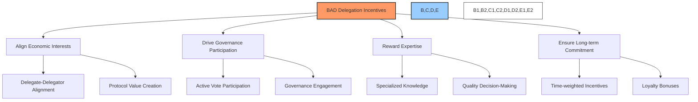
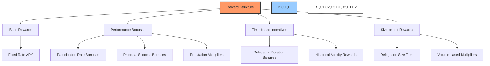
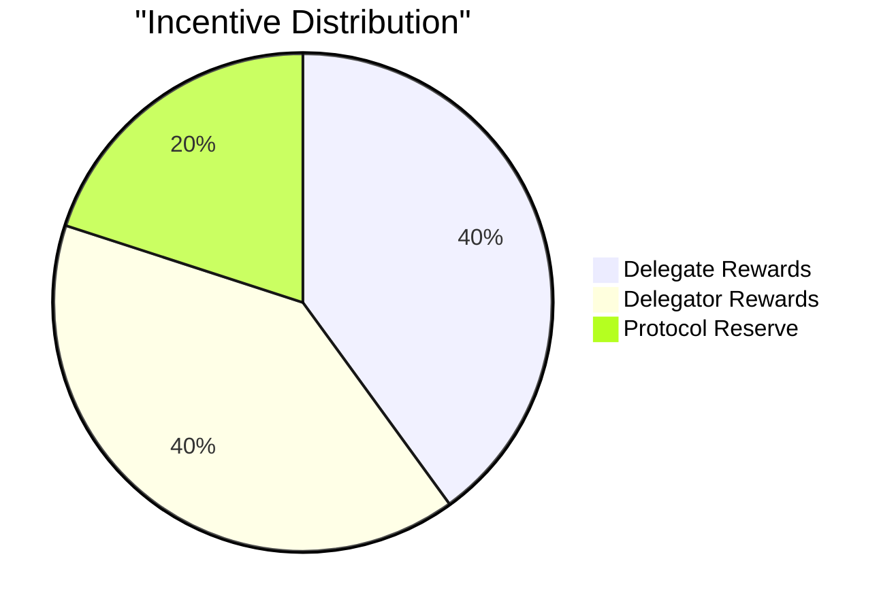
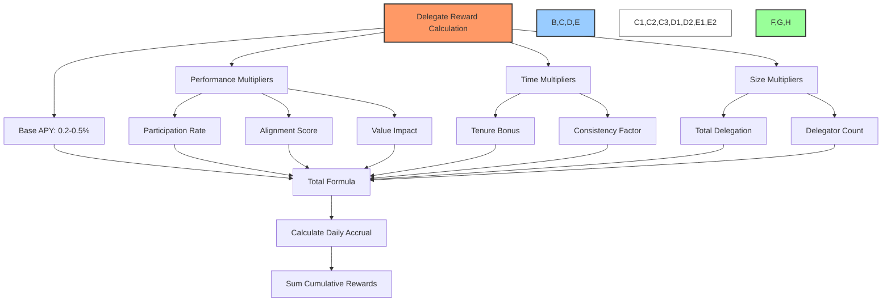
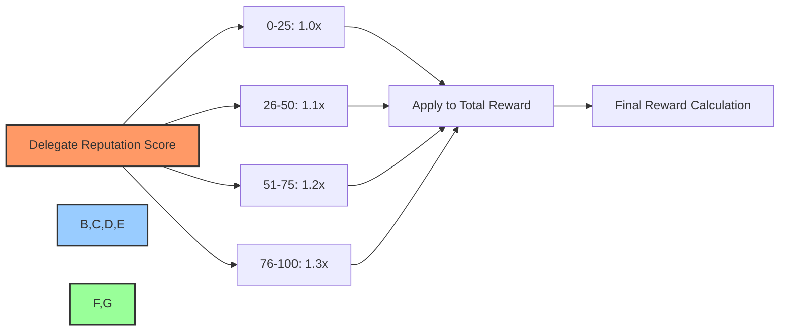
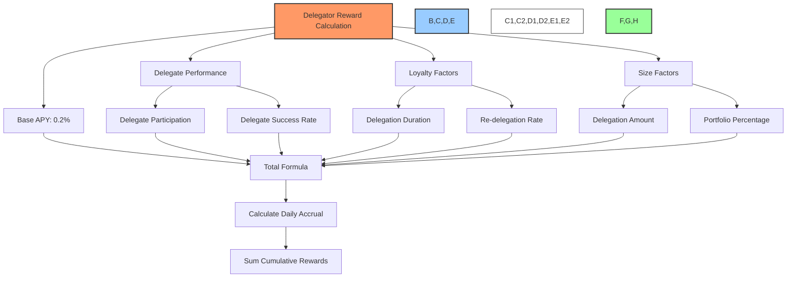
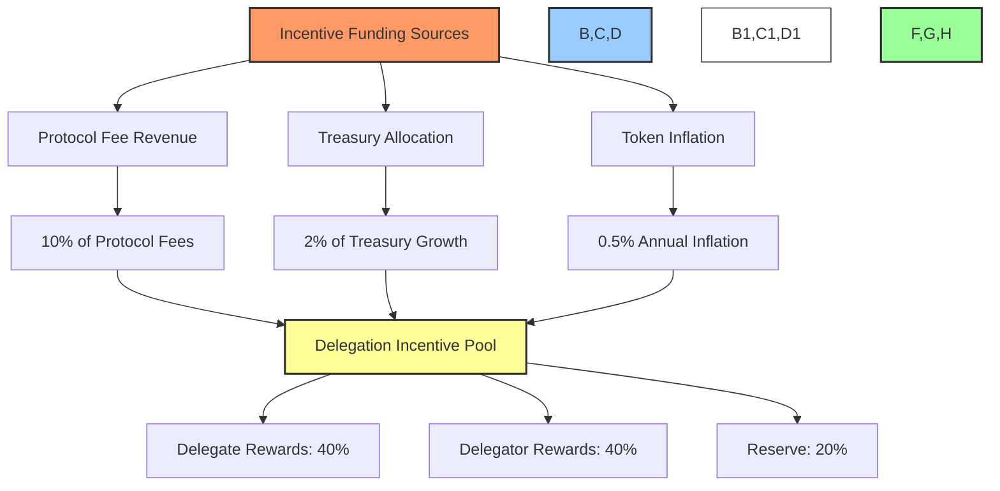
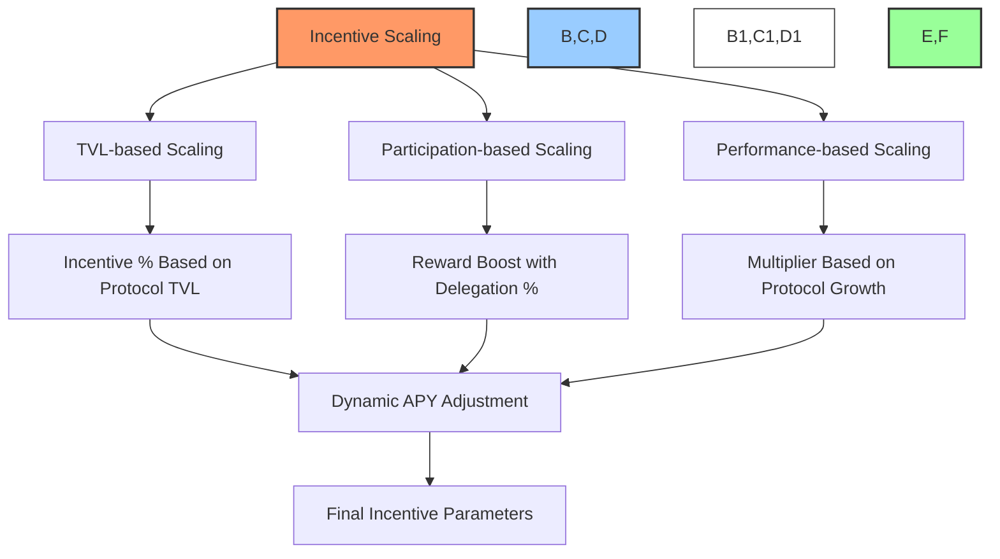
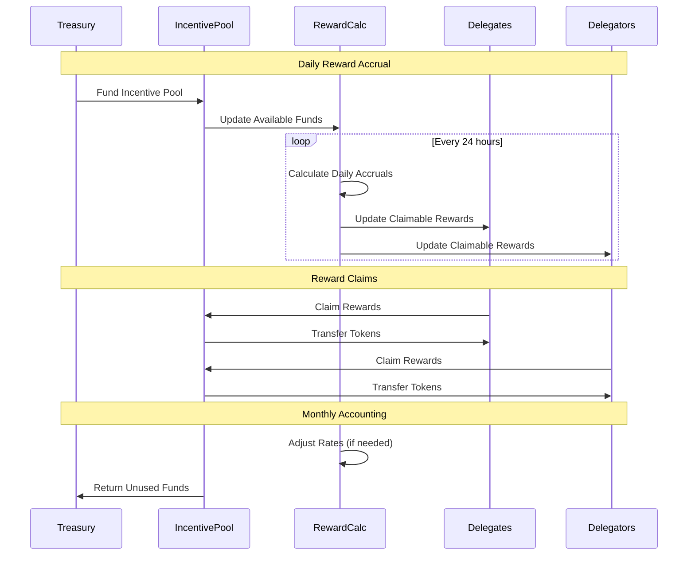
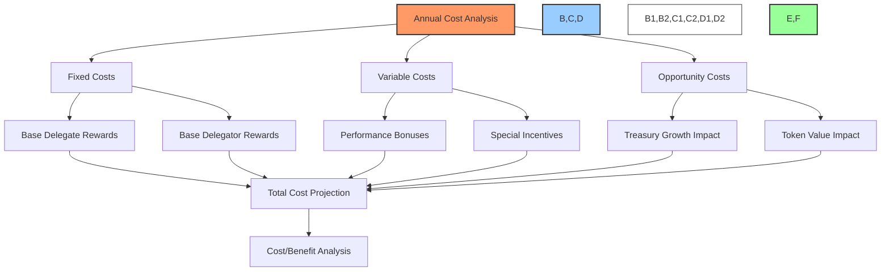

# 🎁 BAD DAO: Delegation Incentives

## 📋 Table of Contents
- [🔍 Overview](#-overview)
- [💰 Incentive Framework](#-incentive-framework)
- [🏆 Delegate Rewards](#-delegate-rewards)
- [💎 Delegator Rewards](#-delegator-rewards)
- [📊 Economic Model](#-economic-model)
- [🛠️ Implementation Details](#️-implementation-details)
- [📈 Performance Analysis](#-performance-analysis)

## 🔍 Overview

The BAD DAO Delegation Incentive system is designed to promote active governance participation by rewarding both delegates and delegators for their contribution to the DAO's decision-making process. This document describes the economic incentives that drive delegation, the reward calculation mechanisms, and the expected outcomes of the incentive structure.



The incentive system serves several key purposes:

1. **Encourage Delegation**: Motivate token holders to participate in governance through delegation
2. **Reward Active Delegates**: Compensate delegates for their time and expertise
3. **Align Interests**: Create economic alignment between delegates, delegators, and the protocol
4. **Promote Quality**: Incentivize high-quality governance decisions
5. **Drive Participation**: Increase overall governance participation rates

## 💰 Incentive Framework

The incentive framework is built on several core principles:

### 🧮 Reward Structure



1. **Base Rewards**: Fundamental compensation for participation
2. **Performance Bonuses**: Additional rewards for high-quality governance activity
3. **Time-based Incentives**: Rewards that increase with longer-term commitment
4. **Size-based Rewards**: Scale rewards based on delegation amounts

### 🎯 Design Principles

The incentive system is designed around these key principles:

1. **Value Creation**: Rewards must align with creating value for the protocol
2. **Sustainability**: The economic model must be sustainable long-term
3. **Fairness**: All participants should be rewarded proportionally to their contribution
4. **Transparency**: Reward calculations should be clear and verifiable
5. **Adaptability**: The system should adjust to changing protocol needs

### ⚖️ Distribution Balance



The distribution of incentives is balanced to ensure all stakeholders benefit:

- **40%** - Delegate rewards
- **40%** - Delegator rewards
- **20%** - Protocol reserve (for future incentive adjustments)

## 🏆 Delegate Rewards

### 💰 Reward Formula



Delegate rewards are calculated using a comprehensive formula that considers multiple factors:

#### Base Rate Component
- **Base Rate**: 0.2-0.5% APY on total delegated tokens
- The base rate may vary based on protocol parameters and treasury health

#### Performance Multipliers
- **Participation Rate**:
  - +0.1% for 90%+ voting participation
  - +0.05% for 80-90% voting participation
  - No bonus for <80% participation

- **Alignment Score**:
  - +0.2% for 80%+ votes with winning outcome
  - +0.1% for 70-80% votes with winning outcome
  - No bonus for <70% alignment

- **Value Impact**:
  - +0.1% for delegates who submit valuable proposals 
  - Evaluated based on proposal acceptance and implementation

#### Time Multipliers
- **Tenure Bonus**:
  - +0.05% per month of active service (capped at +0.6%)
  - Resets if delegate becomes inactive for >30 days

- **Consistency Factor**:
  - +0.1% for uninterrupted service over 6 months
  - +0.2% for uninterrupted service over 12 months

#### Size Multipliers
- **Total Delegation**:
  - +0.1% for managing >1M tokens
  - +0.05% for managing >500K tokens

- **Delegator Count**:
  - +0.05% for representing >50 unique delegators
  - +0.1% for representing >100 unique delegators

### 📊 Reward Tiers

| 🏆 Tier | 📋 Requirements | 💰 Potential APY |
|---------|----------------|----------------|
| 🥇 Expert | 95%+ participation, >1M delegated, 12+ months service | Up to 2.0% |
| 🥈 Proficient | 85%+ participation, >500K delegated, 6+ months service | Up to 1.5% |
| 🥉 Standard | 80%+ participation, any delegation size, any tenure | Up to 1.0% |
| ⚪ Basic | <80% participation, any delegation size, any tenure | 0.2-0.5% |

### 🧠 Reputation Multiplier



A delegate's reputation score provides an additional multiplier to their rewards:
- **0-25 score**: 1.0x multiplier (no change)
- **26-50 score**: 1.1x multiplier
- **51-75 score**: 1.2x multiplier
- **76-100 score**: 1.3x multiplier

## 💎 Delegator Rewards

### 💰 Reward Formula



Delegator rewards are designed to incentivize delegation to high-performing delegates and long-term commitment:

#### Base Rate Component
- **Base Rate**: 0.2% APY calculated on delegated tokens
- Basic compensation for participation in the governance system

#### Delegate Performance Factors
- **Delegate Participation**:
  - +0.1% when delegate participates in >90% of proposals
  - +0.05% when delegate participates in 80-90% of proposals

- **Delegate Success Rate**:
  - +0.2% when delegate votes with majority on >80% of proposals
  - +0.1% when delegate votes with majority on 70-80% of proposals

#### Loyalty Factors
- **Delegation Duration**:
  - +0.05% per month of continuous delegation (capped at +0.6%)
  - Incentivizes long-term commitment to chosen delegates

- **Re-delegation Rate**:
  - +0.1% for maintaining delegation to same delegate for 6+ months
  - Promotes stable delegation relationships

#### Size Factors
- **Delegation Amount**:
  - +0.1% for delegating >100K tokens
  - +0.05% for delegating >50K tokens

- **Portfolio Percentage**:
  - +0.1% for delegating >50% of token holdings
  - Rewards commitment to governance process

### 📊 Example Calculation

```
For a delegator with:
- 50,000 tokens delegated
- 6 months continuous delegation to same delegate
- Delegate has 95% participation and 85% success rate

Calculation:
Base rate: 0.2%
Delegate participation bonus: +0.1%
Delegate success bonus: +0.2%
Duration bonus: +0.3% (0.05% * 6 months)
Re-delegation bonus: +0.1%
Delegation amount bonus: +0.05%

Total APY: 0.95%

Annual reward: 50,000 * 0.95% = 475 tokens
Monthly accrual: ~39.6 tokens
```

## 📊 Economic Model

### 💸 Funding Sources



The delegation incentive system is funded through multiple sources to ensure sustainability:

1. **Protocol Fee Revenue**:
   - 10% of all protocol fees directed to delegation incentives
   - Establishes direct link between protocol usage and governance rewards

2. **Treasury Allocation**:
   - 2% of annual treasury growth allocated to incentives
   - Connects governance quality with treasury performance

3. **Token Inflation**:
   - Up to 0.5% annual inflation specifically for delegation incentives
   - Creates predictable base funding independent of other revenue

### 📈 Incentive Scaling



The incentive system scales dynamically based on several factors:

1. **TVL-based Scaling**:
   - Base reward rates scale with total protocol TVL
   - Higher TVL enables higher sustainable reward rates

2. **Participation-based Scaling**:
   - Reward multipliers increase as overall delegation percentage grows
   - Creates positive feedback loop encouraging wider participation

3. **Performance-based Scaling**:
   - Protocol growth and performance metrics influence reward rates
   - Aligns rewards with successful governance outcomes

### 🔄 Budget Controls

To maintain economic sustainability, the system includes several budget control mechanisms:

1. **Annual Budget Cap**:
   - Maximum annual incentive budget capped at 2% of treasury value
   - Prevents excessive dilution or treasury depletion

2. **Automatic Rate Adjustment**:
   - APY rates adjust automatically based on participation levels
   - Enables balance between attractive rates and sustainability

3. **Governance Override**:
   - DAO can adjust parameters through governance proposals
   - Provides flexibility to adapt to changing conditions

## 🛠️ Implementation Details

### 📝 Smart Contract Implementation

```solidity
// Key reward calculation functions (simplified)
function calculateDelegateRewards(address delegate, uint256 period) public view returns (uint256) {
    DelegateInfo storage info = delegateRegistry[delegate];
    
    // Base rate calculation
    uint256 baseRate = DELEGATE_BASE_RATE;
    
    // Performance multipliers
    uint256 performanceBonus = 0;
    if (info.participationRate > 90) {
        performanceBonus += PARTICIPATION_BONUS_HIGH;
    } else if (info.participationRate > 80) {
        performanceBonus += PARTICIPATION_BONUS_MED;
    }
    
    if (info.successRate > 80) {
        performanceBonus += SUCCESS_BONUS_HIGH;
    } else if (info.successRate > 70) {
        performanceBonus += SUCCESS_BONUS_MED;
    }
    
    // Time-based multipliers
    uint256 tenureMonths = (block.timestamp - info.activeSince) / 30 days;
    uint256 tenureBonus = Math.min(tenureMonths * MONTHLY_TENURE_BONUS, MAX_TENURE_BONUS);
    
    // Size multipliers
    uint256 sizeBonus = 0;
    if (info.totalDelegated > 1_000_000 * 10**18) {
        sizeBonus += SIZE_BONUS_HIGH;
    } else if (info.totalDelegated > 500_000 * 10**18) {
        sizeBonus += SIZE_BONUS_MED;
    }
    
    // Reputation multiplier
    uint256 reputationMultiplier = calculateReputationMultiplier(info.reputationScore);
    
    // Calculate total APY
    uint256 totalAPY = baseRate + performanceBonus + tenureBonus + sizeBonus;
    
    // Apply reputation multiplier
    totalAPY = totalAPY * reputationMultiplier / MULTIPLIER_PRECISION;
    
    // Calculate rewards for period
    uint256 periodDuration = period;
    uint256 annualDuration = 365 days;
    uint256 totalDelegated = info.totalDelegated;
    
    uint256 rewards = totalDelegated * totalAPY * periodDuration / (annualDuration * PERCENTAGE_PRECISION);
    
    return rewards;
}

function calculateDelegatorRewards(address delegator, address delegate, uint256 period) public view returns (uint256) {
    DelegationInfo storage delegation = delegations[delegator][delegate];
    DelegateInfo storage delegateInfo = delegateRegistry[delegate];
    
    // Base rate
    uint256 baseRate = DELEGATOR_BASE_RATE;
    
    // Delegate performance bonuses
    uint256 performanceBonus = 0;
    if (delegateInfo.participationRate > 90) {
        performanceBonus += DELEGATE_PARTICIPATION_BONUS_HIGH;
    } else if (delegateInfo.participationRate > 80) {
        performanceBonus += DELEGATE_PARTICIPATION_BONUS_MED;
    }
    
    if (delegateInfo.successRate > 80) {
        performanceBonus += DELEGATE_SUCCESS_BONUS_HIGH;
    } else if (delegateInfo.successRate > 70) {
        performanceBonus += DELEGATE_SUCCESS_BONUS_MED;
    }
    
    // Loyalty bonuses
    uint256 durationMonths = (block.timestamp - delegation.startTime) / 30 days;
    uint256 durationBonus = Math.min(durationMonths * MONTHLY_DURATION_BONUS, MAX_DURATION_BONUS);
    
    uint256 loyaltyBonus = 0;
    if (durationMonths >= 6) {
        loyaltyBonus = LOYALTY_BONUS;
    }
    
    // Size bonuses
    uint256 sizeBonus = 0;
    if (delegation.amount > 100_000 * 10**18) {
        sizeBonus += DELEGATION_SIZE_BONUS_HIGH;
    } else if (delegation.amount > 50_000 * 10**18) {
        sizeBonus += DELEGATION_SIZE_BONUS_MED;
    }
    
    // Calculate total APY
    uint256 totalAPY = baseRate + performanceBonus + durationBonus + loyaltyBonus + sizeBonus;
    
    // Calculate rewards for period
    uint256 periodDuration = period;
    uint256 annualDuration = 365 days;
    uint256 delegatedAmount = delegation.amount;
    
    uint256 rewards = delegatedAmount * totalAPY * periodDuration / (annualDuration * PERCENTAGE_PRECISION);
    
    return rewards;
}
```

### ⏱️ Reward Distribution Cycle



Rewards accrue on a daily basis but can be claimed at any time:

1. **Daily Accrual**:
   - Rewards are calculated and accrued daily for all active delegations
   - Calculations reflect the latest performance metrics

2. **Claim Process**:
   - Delegates and delegators can claim rewards at any time
   - No minimum claim period or amount

3. **Reward Adjustment**:
   - System parameters reviewed monthly by governance
   - Automatic adjustments based on treasury health and participation rates

## 📈 Performance Analysis

### 🎯 Target Metrics

The incentive system is designed to achieve specific outcomes:

| 📊 Metric | 🎯 Target | 📋 Measurement |
|-----------|-----------|---------------|
| Delegation Participation | >50% of supply | % of circulating supply delegated |
| Active Delegates | >100 delegates | Number of delegates with >10 delegators |
| Voting Participation | >80% of delegates | % of eligible votes cast by delegates |
| Delegate Retention | >80% annually | % of delegates remaining active for 12+ months |
| Cost Efficiency | <1% of treasury growth | Annual cost relative to treasury growth |

### 📉 Cost Analysis



Based on initial projections with 30% delegation participation:

- **Annual Base Cost**: ~0.06% of token supply (0.2% APY * 30% delegation)
- **Performance Bonuses**: ~0.09% of token supply (assuming average 0.3% bonus)
- **Total Expected Cost**: ~0.15% of token supply annually

This cost is considered sustainable given the expected benefits:
- Improved governance outcomes
- Higher protocol participation
- Better alignment between stakeholders

### 🔄 Adjustment Mechanisms

The system includes several adjustment mechanisms to maintain sustainability:

1. **Automatic Rate Scaling**:
   - Base rates scale with treasury performance
   - Poor treasury performance triggers automatic rate reduction

2. **Participation Thresholds**:
   - Maximum incentives available only when delegation exceeds 40%
   - Creates natural equilibrium between incentives and participation

3. **Governance Review**:
   - Quarterly review of incentive effectiveness
   - Parameter adjustments based on achieved metrics

4. **Emergency Circuit Breakers**:
   - Guardian multi-sig can pause rewards in emergency
   - Prevents excessive drain during market downturns

---

*This document provides a comprehensive overview of the BAD DAO Delegation Incentives. For technical specifications, implementation details, and integration guidelines, please refer to the technical implementation documentation.*

*Version: 1.0*  
*Last Updated: May 2025*  
*Document Owner: BAD DAO Treasury Committee* 