# ⚙️ BAD DAO: Delegation Mechanics

## 📋 Table of Contents
- [🔍 Overview](#-overview)
- [🧮 Core Mechanics](#-core-mechanics)
- [🔒 Security & Time-locks](#-security--time-locks)
- [🧪 Edge Cases & Solutions](#-edge-cases--solutions)
- [🔌 Contract Integration](#-contract-integration)
- [📊 Delegation Analytics](#-delegation-analytics)
- [🚀 Upgrade Paths](#-upgrade-paths)

## 🔍 Overview

This document provides a detailed technical specification of how delegation works within the BAD DAO governance system. It outlines the specific mechanisms, formulas, and processes that enable the secure and efficient transfer of voting power from token holders to delegates without transferring token ownership.

```mermaid
sequenceDiagram
    participant 👤 TokenHolder
    participant 📜 DelegationContract
    participant 🧑‍💼 Delegate
    participant 🏛️ GovernanceSystem
    
    👤 TokenHolder->>📜 DelegationContract: Delegate Voting Power
    📜 DelegationContract->>📜 DelegationContract: 🔒 Lock Delegation (7-day minimum)
    📜 DelegationContract->>🧑‍💼 Delegate: Increase Delegate Voting Power
    🧑‍💼 Delegate->>🏛️ GovernanceSystem: Vote on Proposals
    🏛️ GovernanceSystem->>📜 DelegationContract: Record Voting Activity
    📜 DelegationContract->>👤 TokenHolder: Calculate Delegation Rewards
    📜 DelegationContract->>🧑‍💼 Delegate: Calculate Delegate Rewards
    
    alt 🔄 Revocation
        👤 TokenHolder->>📜 DelegationContract: Request Delegation Revocation
        📜 DelegationContract->>📜 DelegationContract: ⏱️ Wait for Lock Period
        📜 DelegationContract->>🧑‍💼 Delegate: Decrease Delegate Voting Power
        📜 DelegationContract->>👤 TokenHolder: Return Full Voting Power
    end
```



## 🧮 Core Mechanics

### 📝 Delegation Registration

```solidity
// Key function for delegation registration
function delegate(address delegatee, uint256 amount, uint256 lockDuration) external {
    // Requires minimum 7-day lock period
    require(lockDuration >= MIN_LOCK_PERIOD, "Lock too short");
    // Requires delegatee to be registered
    require(delegateRegistry[delegatee].isActive, "Invalid delegate");
    // Maximum delegation cap per delegate (5% of total supply)
    require(delegateRegistry[delegatee].totalDelegated + amount <= MAX_DELEGATE_CAP, "Exceeds cap");
    
    // Transfer voting power (not tokens)
    _transferVotingPower(msg.sender, delegatee, amount);
    
    // Record delegation details
    delegations[msg.sender][delegatee] = DelegationInfo({
        amount: amount,
        lockedUntil: block.timestamp + lockDuration,
        startTime: block.timestamp,
        active: true
    });
    
    // Update delegate metrics
    delegateRegistry[delegatee].totalDelegated += amount;
    
    // Emit delegation event
    emit DelegationCreated(msg.sender, delegatee, amount, lockDuration);
}
```

### 🗳️ Voting Power Calculation


The voting power calculation includes delegated power:

```solidity
// Calculate voting power including delegations
function getVotes(address account) public view override returns (uint256) {
    // Get base voting power (including time-weighting)
    uint256 baseVotes = super.getVotes(account);
    
    // Add delegated voting power
    uint256 delegatedVotes = delegationsPower[account];
    
    // Apply role multiplier
    uint256 roleMultiplier = getRoleMultiplier(account);
    
    // For delegates, apply reputation multiplier
    uint256 reputationMultiplier = getReputationMultiplier(account);
    
    // Calculate final voting power
    uint256 finalVotes = (baseVotes + delegatedVotes) * roleMultiplier * reputationMultiplier / MULTIPLIER_BASE;
    
    return finalVotes;
}

// Get role-based multiplier
function getRoleMultiplier(address account) internal view returns (uint256) {
    if (coreTeamRegistry.isCoreTeam(account)) {
        return CORE_TEAM_MULTIPLIER; // 1.5x
    }
    // Other roles have their specific multipliers
    return DEFAULT_MULTIPLIER; // 1.0x
}

// Get reputation-based multiplier for delegates
function getReputationMultiplier(address account) internal view returns (uint256) {
    if (!delegateRegistry[account].isActive) {
        return DEFAULT_MULTIPLIER; // 1.0x for non-delegates
    }
    
    // Calculate based on reputation score (1.0x - 1.3x)
    uint256 reputationScore = delegateRegistry[account].reputationScore;
    uint256 multiplier = DEFAULT_MULTIPLIER + (reputationScore * MAX_REPUTATION_BOOST / MAX_REPUTATION_SCORE);
    
    return multiplier;
}
```

### 🔄 Revocation Process


```solidity
// Request delegation revocation
function revokeDelegation(address delegatee, uint256 amount) external {
    DelegationInfo storage delegation = delegations[msg.sender][delegatee];
    
    // Verify delegation exists and is active
    require(delegation.active, "No active delegation");
    require(delegation.amount >= amount, "Exceeds delegated amount");
    
    // Check if lock period has expired
    if (block.timestamp >= delegation.lockedUntil) {
        // Process immediate revocation
        _processRevocation(msg.sender, delegatee, amount);
    } else {
        // Queue revocation for when lock expires
        pendingRevocations.push(PendingRevocation({
            delegator: msg.sender,
            delegatee: delegatee,
            amount: amount,
            unlockTime: delegation.lockedUntil,
            requestTime: block.timestamp
        }));
        
        emit RevocationQueued(msg.sender, delegatee, amount, delegation.lockedUntil);
    }
}

// Process actual revocation
function _processRevocation(address delegator, address delegatee, uint256 amount) internal {
    // Update delegation record
    DelegationInfo storage delegation = delegations[delegator][delegatee];
    delegation.amount -= amount;
    
    if (delegation.amount == 0) {
        delegation.active = false;
    }
    
    // Return voting power
    _transferVotingPower(delegatee, delegator, amount);
    
    // Update delegate metrics
    delegateRegistry[delegatee].totalDelegated -= amount;
    
    // Calculate final rewards before revocation
    _calculateAndDistributeRewards(delegator, delegatee);
    
    emit DelegationRevoked(delegator, delegatee, amount);
}

// Process pending revocations (can be called by anyone)
function processPendingRevocations() external {
    uint256 i = 0;
    while (i < pendingRevocations.length) {
        PendingRevocation memory revocation = pendingRevocations[i];
        
        if (block.timestamp >= revocation.unlockTime) {
            // Process this revocation
            _processRevocation(
                revocation.delegator,
                revocation.delegatee,
                revocation.amount
            );
            
            // Remove from array by replacing with last item
            pendingRevocations[i] = pendingRevocations[pendingRevocations.length - 1];
            pendingRevocations.pop();
        } else {
            i++;
        }
    }
}
```

### 💰 Reward Calculation


Rewards are calculated using specific formulas for both delegates and delegators:

```solidity
// Calculate delegate rewards for a specific period
function calculateDelegateRewards(address delegate, uint256 startTime, uint256 endTime) 
    internal view returns (uint256) {
    
    // Get delegate data
    DelegateInfo storage delegateData = delegateRegistry[delegate];
    
    // Base rate (0.2-0.5% APY)
    uint256 baseRate = BASE_DELEGATE_RATE;
    
    // Performance bonuses
    uint256 participationBonus = 0;
    if (delegateData.participationRate > 90) {
        participationBonus = PARTICIPATION_BONUS_RATE; // +0.1%
    }
    
    uint256 alignmentBonus = 0;
    if (delegateData.winningVotePercentage > 80) {
        alignmentBonus = ALIGNMENT_BONUS_RATE; // +0.2%
    }
    
    uint256 sizeBonus = 0;
    if (delegateData.totalDelegated > 1_000_000 * 10**18) { // 1M tokens
        sizeBonus = SIZE_BONUS_RATE; // +0.1%
    }
    
    // Reputation multiplier (1.0-1.3x)
    uint256 reputationMultiplier = DEFAULT_MULTIPLIER + 
        (delegateData.reputationScore * MAX_REPUTATION_BOOST / MAX_REPUTATION_SCORE);
    
    // Longevity bonus (+0.05% per month, max +0.6%)
    uint256 monthsActive = (block.timestamp - delegateData.activeSince) / 30 days;
    uint256 longevityBonus = Math.min(
        monthsActive * MONTHLY_LONGEVITY_BONUS, 
        MAX_LONGEVITY_BONUS
    );
    
    // Total rate
    uint256 totalRate = baseRate + participationBonus + alignmentBonus + sizeBonus + longevityBonus;
    
    // Apply reputation multiplier
    totalRate = totalRate * reputationMultiplier / MULTIPLIER_BASE;
    
    // Calculate rewards for period
    uint256 periodDuration = endTime - startTime;
    uint256 yearInSeconds = 365 days;
    uint256 totalDelegated = delegateData.totalDelegated;
    
    uint256 rewards = totalDelegated * totalRate * periodDuration / (yearInSeconds * PERCENTAGE_BASE);
    
    return rewards;
}

// Calculate delegator rewards for a specific period
function calculateDelegatorRewards(address delegator, address delegate, uint256 startTime, uint256 endTime) 
    internal view returns (uint256) {
    
    DelegationInfo storage delegation = delegations[delegator][delegate];
    DelegateInfo storage delegateData = delegateRegistry[delegate];
    
    // Base rate (0.2% APY)
    uint256 baseRate = BASE_DELEGATOR_RATE;
    
    // Delegate performance bonuses
    uint256 participationBonus = 0;
    if (delegateData.participationRate > 90) {
        participationBonus = PARTICIPATION_BONUS_RATE_DELEGATOR; // +0.1%
    }
    
    uint256 winningVoteBonus = 0;
    if (delegateData.winningVotePercentage > 80) {
        winningVoteBonus = WINNING_VOTE_BONUS_RATE_DELEGATOR; // +0.2%
    }
    
    // Duration bonus (+0.05% per month, max +0.6%)
    uint256 monthsDelegated = (block.timestamp - delegation.startTime) / 30 days;
    uint256 durationBonus = Math.min(
        monthsDelegated * MONTHLY_DURATION_BONUS, 
        MAX_DURATION_BONUS
    );
    
    // Size bonus (up to +0.1%)
    uint256 sizeBonus = 0;
    if (delegation.amount > 100_000 * 10**18) { // 100k tokens
        sizeBonus = SIZE_BONUS_RATE_DELEGATOR; // +0.1%
    }
    
    // Total rate
    uint256 totalRate = baseRate + participationBonus + winningVoteBonus + durationBonus + sizeBonus;
    
    // Calculate rewards for period
    uint256 periodDuration = endTime - startTime;
    uint256 yearInSeconds = 365 days;
    uint256 delegatedAmount = delegation.amount;
    
    uint256 rewards = delegatedAmount * totalRate * periodDuration / (yearInSeconds * PERCENTAGE_BASE);
    
    return rewards;
}
```

## 🔒 Security & Time-locks

### 🔐 Delegation Limits

To prevent excessive concentration of voting power, several limits are enforced:

```solidity
// Delegation caps to prevent voting power concentration
uint256 public constant MAX_DELEGATE_CAP = 5_000_000 * 10**18; // 5% of total supply (assuming 100M total)
uint256 public constant MAX_DELEGATOR_ALLOCATIONS = 10; // Maximum number of delegates per delegator
uint256 public constant MIN_DELEGATION_AMOUNT = 1000 * 10**18; // Minimum 1,000 tokens to delegate
```

### ⏱️ Time-lock Mechanisms

Time-locks are used to ensure stability in governance:

```solidity
// Time-lock parameters
uint256 public constant MIN_LOCK_PERIOD = 7 days; // Minimum delegation lock period
uint256 public constant MAX_LOCK_PERIOD = 365 days; // Maximum lock period
uint256 public constant EXTENSION_COOLDOWN = 1 days; // Minimum time between lock extensions
```

### 🛡️ Spam Prevention

```solidity
// Anti-spam and gas optimization
mapping(address => uint256) public lastDelegationTimestamp;
uint256 public constant DELEGATION_COOLDOWN = 1 hours; // Prevent frequent changes

// Function to check for potential spam
function _checkSpamProtection(address delegator) internal {
    require(
        block.timestamp >= lastDelegationTimestamp[delegator] + DELEGATION_COOLDOWN,
        "Delegation on cooldown"
    );
    lastDelegationTimestamp[delegator] = block.timestamp;
}
```

### 🔄 Circuit Breakers

Emergency safety mechanisms are built in:

```solidity
// Circuit breaker functionality
bool public paused;
address public guardian;

// Pause all delegations in emergency 
function pause() external onlyGuardian {
    paused = true;
    emit SystemPaused(msg.sender);
}

// Resume delegation functionality
function unpause() external onlyGovernance {
    paused = false;
    emit SystemUnpaused(msg.sender);
}

// Emergency mass revocation (for critical vulnerabilities)
function emergencyRevokeAll() external onlyGuardian {
    require(paused, "System must be paused first");
    // Implementation of emergency mass revocation logic
    emit EmergencyRevocationTriggered(msg.sender);
}
```

## 🧪 Edge Cases & Solutions

### 🚨 Stuck Delegations


```solidity
// Handle inactive delegate rescue
function rescueStuckDelegation(address delegatee) external {
    require(delegateRegistry[delegatee].inactivityPeriod > MAX_INACTIVITY_PERIOD, "Delegate not inactive");
    
    // Add to governance queue for rescue consideration
    rescueRequests.push(RescueRequest({
        delegatee: delegatee,
        requestor: msg.sender,
        timestamp: block.timestamp
    }));
    
    emit RescueRequested(msg.sender, delegatee);
}

// Execute approved rescue (governance only)
function executeRescue(address delegatee) external onlyGovernance {
    // Verify approved rescue request exists
    bool requestFound = false;
    for (uint256 i = 0; i < rescueRequests.length; i++) {
        if (rescueRequests[i].delegatee == delegatee) {
            requestFound = true;
            break;
        }
    }
    require(requestFound, "No approved rescue");
    
    // Unlock all delegations to this delegate
    address[] memory delegators = getDelegatorsForDelegate(delegatee);
    for (uint256 i = 0; i < delegators.length; i++) {
        address delegator = delegators[i];
        DelegationInfo storage delegation = delegations[delegator][delegatee];
        
        // Force unlock
        delegation.lockedUntil = block.timestamp;
        
        emit ForcedUnlock(delegator, delegatee, delegation.amount);
    }
    
    // Mark delegate as inactive
    delegateRegistry[delegatee].isActive = false;
    
    emit RescueExecuted(delegatee);
}
```

### 📉 Slashing Conditions


```solidity
// Slashing for delegate violations
function assessDelegatePerformance() external {
    // This function is called periodically to check delegate compliance
    
    address[] memory activeDelegates = getActiveDelegates();
    for (uint256 i = 0; i < activeDelegates.length; i++) {
        address delegate = activeDelegates[i];
        DelegateInfo storage delegateData = delegateRegistry[delegate];
        
        // Check for participation violations
        if (delegateData.participationRate < MIN_PARTICIPATION_THRESHOLD) {
            _applyParticipationPenalty(delegate);
        }
        
        // Check for conduct violations if any reported
        if (delegateData.conductViolations > 0) {
            _applyConductPenalty(delegate);
        }
        
        // Check for extended inactivity
        if (delegateData.lastActivityTimestamp + MAX_INACTIVITY_PERIOD < block.timestamp) {
            _applyInactivityPenalty(delegate);
        }
    }
    
    emit DelegatePerformanceAssessed(block.timestamp);
}

// Apply participation penalty
function _applyParticipationPenalty(address delegate) internal {
    DelegateInfo storage delegateData = delegateRegistry[delegate];
    
    if (delegateData.participationRate < CRITICAL_PARTICIPATION_THRESHOLD) {
        // Severe violation - revoke delegate status
        delegateData.isActive = false;
        emit DelegateStatusRevoked(delegate, "Critical participation failure");
    } else {
        // Minor violation - reputation penalty
        uint256 penaltyAmount = delegateData.reputationScore * PARTICIPATION_PENALTY_RATE / PERCENTAGE_BASE;
        delegateData.reputationScore -= penaltyAmount;
        emit DelegateReputationPenalty(delegate, penaltyAmount, "Participation below threshold");
    }
}
```

### 🔀 Split Delegations


```solidity
// Supporting multiple delegations
function delegateMultiple(
    address[] calldata delegatees,
    uint256[] calldata amounts,
    uint256[] calldata lockDurations
) external {
    require(delegatees.length == amounts.length, "Array length mismatch");
    require(delegatees.length == lockDurations.length, "Array length mismatch");
    require(delegatees.length <= MAX_DELEGATOR_ALLOCATIONS, "Too many delegations");
    
    uint256 totalAmount = 0;
    for (uint256 i = 0; i < amounts.length; i++) {
        totalAmount += amounts[i];
    }
    
    // Verify sufficient balance
    require(token.balanceOf(msg.sender) >= totalAmount, "Insufficient balance");
    
    // Execute multiple delegations
    for (uint256 i = 0; i < delegatees.length; i++) {
        delegate(delegatees[i], amounts[i], lockDurations[i]);
    }
    
    emit MultipleDelegationsCreated(msg.sender, delegatees, amounts, lockDurations);
}
```

## 🔌 Contract Integration

The delegation system integrates with other key contracts:

### 💰 Token Contract Integration

```solidity
// Integration with token contract
IERC20 public token;
IBADToken public badToken;

// Function to get time-weighted balance
function getTimeWeightedBalance(address account) public view returns (uint256) {
    return badToken.getVotes(account);
}

// Function to check if tokens are locked in other systems
function getAvailableBalance(address account) public view returns (uint256) {
    uint256 totalBalance = token.balanceOf(account);
    uint256 lockedInOtherSystems = badToken.getLockedTokens(account);
    uint256 alreadyDelegated = getTotalDelegatedAmount(account);
    
    return totalBalance - lockedInOtherSystems - alreadyDelegated;
}
```

### 🏛️ Governor Contract Integration

```solidity
// Integration with governance contract
IBADGovernor public governor;

// Update voting power in governor when delegation changes
function _updateGovernorVotingPower(address account) internal {
    governor.syncVotingPower(account);
}

// Function to check if tokens are needed for active votes
function _checkActiveVoteConstraints(address delegator, uint256 amount) internal view returns (bool) {
    return governor.canReduceVotingPower(delegator, amount);
}
```

### 📊 Reputation System Integration

```solidity
// Integration with reputation system
IBADReputation public reputationSystem;

// Function to update reputation based on delegation activity
function _updateDelegateReputation(address delegate, uint256 voteId, bool votedWithMajority) internal {
    reputationSystem.recordVoteActivity(delegate, voteId, votedWithMajority);
}

// Function to check if account meets delegate requirements
function _checkDelegateRequirements(address account) internal view returns (bool) {
    return reputationSystem.meetsMinimumRequirements(account);
}
```

## 📊 Delegation Analytics

The system tracks comprehensive metrics on delegation activity:

### 📈 Tracked Metrics


```solidity
// Analytics tracking functions
function getDelegationAnalytics() external view returns (
    uint256 totalDelegatedPower,
    uint256 activeDelegateCount,
    uint256 totalDelegatorCount,
    uint256 averageDelegationSize,
    uint256 averageDelegationDuration,
    uint256 topDelegateConcentration // % held by top 10 delegates
) {
    // Calculate delegation statistics
    totalDelegatedPower = getTotalDelegatedPower();
    activeDelegateCount = getActiveDelegateCount();
    totalDelegatorCount = getTotalDelegatorCount();
    
    if (totalDelegatorCount > 0) {
        averageDelegationSize = totalDelegatedPower / totalDelegatorCount;
        averageDelegationDuration = getTotalDelegationDuration() / totalDelegatorCount;
    }
    
    topDelegateConcentration = getTopDelegateConcentration(10);
    
    return (
        totalDelegatedPower,
        activeDelegateCount,
        totalDelegatorCount,
        averageDelegationSize,
        averageDelegationDuration,
        topDelegateConcentration
    );
}

// Get delegation history for account
function getDelegationHistory(address account) external view returns (
    DelegationHistoryEntry[] memory delegateHistory,
    DelegationHistoryEntry[] memory delegatorHistory
) {
    delegateHistory = delegateHistoryRecords[account];
    delegatorHistory = delegatorHistoryRecords[account];
    
    return (delegateHistory, delegatorHistory);
}
```

### 📋 Reporting Functions

```solidity
// Automated reporting functions
function generateDelegateReport(address delegate) external view returns (DelegateReport memory) {
    DelegateInfo storage delegateData = delegateRegistry[delegate];
    
    return DelegateReport({
        delegate: delegate,
        totalDelegated: delegateData.totalDelegated,
        delegatorCount: delegateData.delegatorCount,
        participationRate: delegateData.participationRate,
        winningVotePercentage: delegateData.winningVotePercentage,
        reputationScore: delegateData.reputationScore,
        activeSince: delegateData.activeSince,
        lastActivityTimestamp: delegateData.lastActivityTimestamp,
        lifetimeRewards: delegateData.lifetimeRewards
    });
}

// Generate ecosystem-wide delegation report
function generateSystemReport() external view returns (SystemReport memory) {
    return SystemReport({
        totalTokensInSystem: token.totalSupply(),
        totalDelegatedTokens: getTotalDelegatedPower(),
        delegationParticipationRate: getTotalDelegatedPower() * 100 / token.totalSupply(),
        activeDelegateCount: getActiveDelegateCount(),
        totalDelegatorCount: getTotalDelegatorCount(),
        averageReputationScore: getAverageReputationScore(),
        totalDelegationRewardsDistributed: getTotalRewardsDistributed(),
        delegationConcentrationIndex: calculateDelegationConcentration()
    });
}
```

## 🚀 Upgrade Paths


### 🔄 Upgrade Process

```solidity
// Proxy-based upgrade pattern
contract BADDelegationProxy is BADDelegationStorage, Proxy {
    // Storage gap for future upgrades
    uint256[50] private __gap;
    
    // Implementation address
    address private _implementation;
    
    // Upgrade implementation (governance only)
    function upgradeImplementation(address newImplementation) external onlyGovernance {
        require(newImplementation != address(0), "Invalid implementation");
        
        // Verify implementation is compatible
        require(
            IBADDelegation(newImplementation).implementationVersion() > 
            IBADDelegation(_implementation).implementationVersion(),
            "Version must be higher"
        );
        
        address oldImplementation = _implementation;
        _implementation = newImplementation;
        
        emit ImplementationUpgraded(oldImplementation, newImplementation);
    }
    
    // Return current implementation
    function _getImplementation() internal view override returns (address) {
        return _implementation;
    }
}
```

### 📝 Planned Improvements

1. **Multi-Chain Delegation (Release 1.1)**
   - Cross-chain voting power transfer
   - Unified delegate reputation across chains
   - Chain-specific delegation parameters

2. **Reputation-Weighted Voting (Release 1.2)**
   - Enhanced reputation scoring
   - Domain-specific expertise weighting
   - Quadratic voting implementation

3. **Smart Delegation (Release 2.0)**
   - AI-assisted delegation recommendations
   - Automated delegation optimization
   - Conditional delegation criteria

---

*This document provides detailed technical specifications of the BAD DAO Delegation Mechanics. For higher-level conceptual information, please refer to the BAD DAO Delegation System documentation.*

*Version: 1.0*  
*Last Updated: May 2025*  
*Document Owner: BAD DAO Technical Committee* 