# 🤝 BAD DAO: Delegation System

## 📋 Table of Contents
- [🔍 Overview](#-overview)
- [🏗️ System Architecture](#️-system-architecture)
- [🔄 Delegation Process](#-delegation-process)
- [🎁 Incentive Structure](#-incentive-structure)
- [📊 Delegate Performance Metrics](#-delegate-performance-metrics)
- [🛠️ Technical Implementation](#️-technical-implementation)
- [📈 Scalability Considerations](#-scalability-considerations)

## 🔍 Overview

The BAD DAO Delegation System enables token holders to transfer their voting power to specialized delegates without transferring token ownership. This creates an efficient division of labor where token holders can maintain their governance rights while delegating active participation to experts who specialize in governance activities. The system is designed to increase overall governance participation while maintaining high-quality decision-making.


## 🏗️ System Architecture

The delegation system is built on three core components:

### 1. 📜 Delegation Registry


- **Delegation Mapping**: Core data structure tracking delegated voting power
- **Lock Management**: Controls time-locking of delegated tokens
- **History Tracking**: Records delegation events and voting patterns

### 2. 🌟 Reputation System


- **Scoring Algorithm**: Calculates delegate reputation scores
- **Performance Tracking**: Monitors delegate actions and outcomes
- **Delegation Matching**: Connects token holders with compatible delegates

### 3. 💰 Incentive Distribution


- **Reward Sources**: Where incentive funds originate
- **Calculation Logic**: How rewards are calculated based on metrics
- **Distribution Mechanism**: How rewards are delivered to participants

## 🔄 Delegation Process

```mermaid
sequenceDiagram
    participant 👤 TokenHolder
    participant 📜 DelegationContract
    participant 🧑‍💼 Delegate
    participant 🏛️ GovernanceSystem
    
    👤 TokenHolder->>📜 DelegationContract: Delegate Voting Power
    📜 DelegationContract->>📜 DelegationContract: 🔒 Lock Delegation (7-day minimum)
    📜 DelegationContract->>🧑‍💼 Delegate: Increase Delegate Voting Power
    🧑‍💼 Delegate->>🏛️ GovernanceSystem: Vote on Proposals
    🏛️ GovernanceSystem->>📜 DelegationContract: Record Voting Activity
    📜 DelegationContract->>👤 TokenHolder: Calculate Delegation Rewards
    📜 DelegationContract->>🧑‍💼 Delegate: Calculate Delegate Rewards
    
    alt 🔄 Revocation
        👤 TokenHolder->>📜 DelegationContract: Request Delegation Revocation
        📜 DelegationContract->>📜 DelegationContract: ⏱️ Wait for Lock Period
        📜 DelegationContract->>🧑‍💼 Delegate: Decrease Delegate Voting Power
        📜 DelegationContract->>👤 TokenHolder: Return Full Voting Power
    end
```



### 1. Delegation Initiation

1. **Selection Process**:
   - Token holder reviews available delegates and their profiles
   - Evaluates reputation scores, voting history, and stated principles
   - Optionally communicates with potential delegates
   - Selects delegate(s) aligned with their governance priorities

2. **Delegation Action**:
   - Token holder specifies amount of voting power to delegate
   - Sets delegation period (minimum 7 days)
   - Confirms delegation transaction on-chain
   - Receives confirmation and delegation receipt

3. **Activation Timeline**:
   - Delegation takes effect immediately
   - Delegate voting power increases proportionally
   - Lock period begins counting down
   - First rewards calculation at next epoch (daily)

### 2. Active Delegation Period

1. **Delegate Responsibilities**:
   - Regular participation in governance votes
   - Publishing vote explanations and rationales
   - Communication with delegators on significant proposals
   - Maintaining stated principles and voting framework

2. **Delegator Options**:
   - Monitor delegate voting activity
   - Review performance metrics
   - Receive regular updates from delegate
   - Extend delegation period if desired

3. **Governance Participation**:
   - Delegates cast votes with accumulated voting power
   - Voting activity recorded for reputation calculation
   - Vote alignment tracked for performance metrics
   - Rewards accumulated based on participation

### 3. Delegation Termination

1. **Standard Termination**:
   - Delegation automatically ends after lock period
   - Voting power returns to token holder
   - Final rewards calculated and distributed
   - Relationship metrics recorded

2. **Early Revocation Request**:
   - Token holder requests early termination
   - Must wait for minimum lock period to complete
   - May incur reduced rewards
   - Reputation impact for delegate limited

3. **Post-Delegation**:
   - Token holder receives voting power back
   - Can immediately re-delegate to same or different delegate
   - Delegation history maintained for future reference
   - Feedback opportunity provided

## 🎁 Incentive Structure

The delegation system incorporates financial incentives to encourage participation and align interests between delegates and delegators.

### 🏆 Delegate Rewards


Delegates receive rewards based on:

1. **Base Rate**: 0.2-0.5% APY calculated on total delegated tokens
2. **Performance Bonuses**:
   - Participation Rate: Up to +0.1% for voting in >90% of proposals
   - Vote Alignment: Up to +0.2% for voting with majority on >80% of proposals
   - Delegation Size: Up to +0.1% for managing >1M delegated tokens
3. **Reputation Effects**:
   - Reputation Score: Up to 1.3x multiplier for top-tier delegates
   - Longevity Bonus: +0.05% per month of continuous service (capped at +0.6%)

### 💎 Delegator Rewards

```mermaid
graph TD
    A[Delegator Rewards] --> B[Base Rate]
    A --> C[Delegate Performance]
    A --> D[Loyalty Bonuses]
    
    B --> B1[0.2% APY on Delegated Tokens]
    
    C --> C1[Participation Bonus]
    C --> C2[Winning Vote Bonus]
    
    D --> D1[Duration Bonus]
    D --> D2[Size Bonus]
    
    C1 --> C1a[Up to +0.1% for Delegate Participation]
    C2 --> C2a[Up to +0.2% for Successful Votes]
    
    D1 --> D1a[+0.05% per Month (capped at +0.6%)]
    D2 --> D2a[Up to +0.1% Based on Amount]
    
    style A fill:#f96,stroke:#333,stroke-width:2px
    style B,C,D fill:#9cf,stroke:#333,stroke-width:2px
    style B1 fill:#fff,stroke:#333,stroke-width:1px
    style C1,C2,D1,D2 fill:#fff,stroke:#333,stroke-width:1px
    style C1a,C2a,D1a,D2a fill:#efe,stroke:#333,stroke-width:1px
```

Delegators receive rewards based on:

1. **Base Rate**: 0.2% APY calculated on delegated tokens
2. **Delegate Performance Boost**:
   - Participation Bonus: Up to +0.1% when delegate votes in >90% of proposals
   - Winning Vote Bonus: Up to +0.2% when delegate votes with majority
3. **Loyalty Incentives**:
   - Duration Bonus: +0.05% per month of continuous delegation (capped at +0.6%)
   - Delegation Size: Up to +0.1% based on amount delegated

### 📈 Funding Sources

Incentives are funded through:

1. **Protocol Fee Allocation**: 10% of all protocol fees
2. **Treasury Allocation**: 2% of treasury growth annually
3. **Inflation**: Up to 0.5% annual inflation specifically for delegation incentives

## 📊 Delegate Performance Metrics


Delegates are evaluated based on comprehensive performance metrics:

### 1. 🗳️ Participation Metrics

- **Voting Rate**: Percentage of eligible proposals voted on
- **Response Time**: Average time to vote after proposal is submitted
- **Explanation Rate**: Percentage of votes with published rationales
- **Forum Engagement**: Activity in governance discussions

### 2. 🎯 Effectiveness Metrics

- **Vote Alignment**: Percentage of votes aligned with proposal outcomes
- **Value Creation**: Impact of supported proposals on protocol value
- **Principle Consistency**: Consistency with stated voting principles
- **Voting Pattern Analysis**: Specialized algorithms detecting strategic patterns

### 3. 👥 Community Metrics

- **Delegator Retention**: Rate at which delegators maintain delegation
- **Delegator Growth**: Net increase in delegation over time
- **Feedback Score**: Ratings from current and former delegators
- **Communication Quality**: Assessments of delegate communications

### 4. 🧠 Specialization Indicators

- **Domain Focus**: Areas of governance expertise
- **Proposal Type Distribution**: Types of proposals most engaged with
- **Technical Depth**: Demonstrated technical understanding
- **Economic Analysis**: Quality of economic reasoning

## 🛠️ Technical Implementation

The delegation system is implemented through a set of smart contracts that handle delegation logic, reputation tracking, and reward distribution.

```mermaid
graph TD
    A[BADDelegation Contract] --> B[Core Functions]
    A --> C[Data Structures]
    A --> D[Security Features]
    A --> E[Integration Points]
    
    B --> B1[delegate()]
    B --> B2[revokeDelegation()]
    B --> B3[extendLock()]
    B --> B4[claimRewards()]
    
    C --> C1[Delegation Mappings]
    C --> C2[Lock Records]
    C --> C3[Reputation Data]
    C --> C4[Reward Tracking]
    
    D --> D1[Time-lock Mechanics]
    D --> D2[Access Controls]
    D --> D3[Spam Prevention]
    
    E --> E1[Governor Contract]
    E --> E2[Token Contract]
    E --> E3[Treasury Contract]
    
    style A fill:#f96,stroke:#333,stroke-width:2px
    style B,C,D,E fill:#9cf,stroke:#333,stroke-width:2px
    style B1,B2,B3,B4,C1,C2,C3,C4,D1,D2,D3,E1,E2,E3 fill:#fff,stroke:#333,stroke-width:1px
```

### Key Contract Functions

```solidity
// SPDX-License-Identifier: MIT
interface IBADDelegation {
    // Core delegation functions
    function delegate(address delegatee, uint256 amount, uint256 lockDuration) external;
    function revokeDelegation(address delegatee, uint256 amount) external;
    function extendLock(address delegatee, uint256 newDuration) external;
    
    // Reward functions
    function claimDelegatorRewards() external;
    function claimDelegateRewards() external;
    
    // View functions
    function getDelegatedPower(address delegatee) external view returns (uint256);
    function getUserDelegations(address delegator) external view returns (DelegationInfo[] memory);
    function getDelegatePerformance(address delegatee) external view returns (PerformanceMetrics memory);
    
    // Structs
    struct DelegationInfo {
        address delegatee;
        uint256 amount;
        uint256 lockEndTime;
        uint256 startTime;
    }
    
    struct PerformanceMetrics {
        uint256 participationRate;
        uint256 alignmentScore;
        uint256 reputationScore;
        uint256 delegatedTotal;
    }
}
```

### Integration Points

The delegation system integrates with other protocol components:

1. **Governor Contract**: 
   - Tracks voting power including delegations
   - Records voting activity for performance metrics
   - Provides proposal data for reward calculations

2. **Token Contract**: 
   - Queries token balances
   - Verifies delegation eligibility
   - Calculates time-weighted voting power

3. **Treasury Contract**: 
   - Sources reward funding
   - Manages delegation incentive pool
   - Distributes rewards to participants

## 📈 Scalability Considerations

As the delegation system grows, several scalability enhancements are planned:

### 1. 🏫 Delegate Academy


- **Training Program**: Educates new delegates on governance best practices
- **Certification System**: Validates delegate expertise and knowledge
- **Mentorship Network**: Connects experienced and new delegates

### 2. 🤝 Delegation Pools


- **Multi-Delegate Structure**: Distributes delegation across multiple experts
- **Specialized Pools**: Groups delegates by expertise or governance philosophy
- **Automated Allocation**: Optimizes delegation based on performance metrics

### 3. 🤖 AI-Assisted Delegation


- **Delegate Matching**: Connects token holders with optimal delegates
- **Performance Prediction**: Forecasts delegate effectiveness
- **Strategy Recommendation**: Suggests optimal delegation strategies

### 4. 🌐 Cross-Protocol Delegation


- **Shared Delegate Network**: Delegates participate across multiple protocols
- **Reputation Portability**: Delegation history transfers between ecosystems
- **Governance Collaboration**: Coordinated governance across related protocols

---

*This document provides a comprehensive overview of the BAD DAO Delegation System. For technical specifications, contract implementation details, and integration guidelines, please refer to the technical implementation documentation.*

*Version: 1.0*  
*Last Updated: May 2025*  
*Document Owner: BAD DAO Governance Committee* 