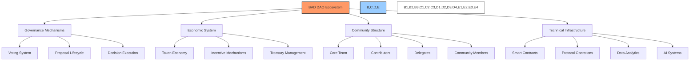
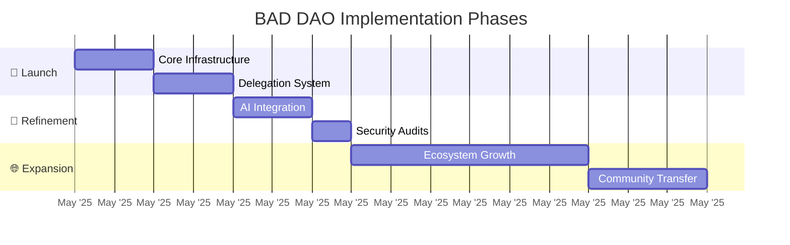
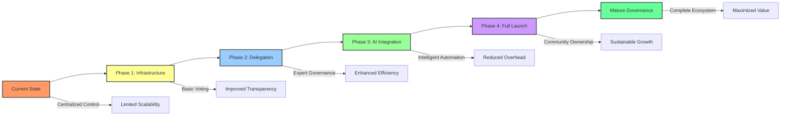

# 🔍 BAD DAO Governance: Executive Summary

## 📋 Table of Contents
- [🎯 Purpose of This Document](#-purpose-of-this-document)
- [🌐 Overview of BAD DAO](#-overview-of-bad-dao)
- [🏛️ Governance Framework](#️-governance-framework)
- [🧠 AI-Enhanced Governance](#-ai-enhanced-governance)
- [💰 Economic Model](#-economic-model)
- [📅 Implementation Overview](#-implementation-overview)
- [📈 Expected Outcomes](#-expected-outcomes)

## 🎯 Purpose of This Document

This document provides a comprehensive overview of the BAD DAO governance system, serving as an entry point for understanding the complete governance framework. It synthesizes the key components of the governance structure, decision-making processes, and economic mechanisms that drive the organization.

## 🌐 Overview of BAD DAO

Build a DAO (BAD) represents a next-generation decentralized autonomous organization designed to leverage both human expertise and artificial intelligence to create an efficient, transparent, and sustainable governance system. The BAD DAO is founded on principles of:

- 🔄 **Progressive Decentralization**: Gradual transition to community control
- 🛡️ **Security and Resilience**: Multi-layered protection mechanisms
- 🤝 **Stakeholder Alignment**: Incentive structures that reward contribution
- 🤖 **AI Enhancement**: Leveraging artificial intelligence for governance efficiency
- 📊 **Quantifiable Governance**: Data-driven decision-making

## 🏛️ Governance Framework

The BAD DAO governance framework establishes a decentralized decision-making structure that balances community participation with operational efficiency. The system incorporates:

- 🗳️ **On-chain Voting**: Transparent, immutable voting with token-weighted mechanics
- 👥 **Role-based Structure**: Defined responsibilities with appropriate authority
- ⚖️ **Time-weighted Voting**: Rewards long-term stakeholders
- 🤝 **Delegation System**: Enables efficient governance participation
- 🔒 **Security Controls**: Multi-sig requirements and time-locks for protection
- 📈 **Evolution Path**: Mechanism for governance framework improvement

The governance model uses the BAD token as the primary governance instrument, with varying proposal types requiring different quorum and approval thresholds to ensure appropriate oversight based on impact.

## 🧠 AI-Enhanced Governance

A key innovation in the BAD DAO governance system is the integration of specialized AI agents that enhance governance efficiency, objectivity, and scalability:

- 🔍 **Proposal Analyzer**: Objectively evaluates proposals for feasibility and impact
- 📊 **Voting Recommendation**: Provides data-driven voting guidance
- 💹 **Treasury Oversight**: Monitors financial activities and suggests optimizations
- ✨ **Proposal Generator**: Creates governance proposals aligned with strategic objectives
- 📋 **Task Management**: Breaks down objectives into actionable tasks
- 🗳️ **AI Voting Agent**: Participates in governance with limited, rules-based voting power

AI participation is bounded and transparent, with AI voting power limited to 10% of total voting power and requiring human oversight for critical decisions.

## 💰 Economic Model

The economic structure of BAD DAO is designed to align incentives among all stakeholders:

- 🪙 **Token Distribution**: Balanced allocation across core team, contributors, and community
- ⏱️ **Vesting Mechanisms**: Time-based release to ensure long-term alignment
- 💸 **Delegation Incentives**: Rewards efficient governance participation
- 🏦 **Treasury Management**: Automated functions with appropriate controls
- 🏆 **Contribution Rewards**: Performance-based compensation for value creation

The BAD token serves as both a governance instrument and financial asset, with utility in voting, staking, delegation, and protocol fee distribution.

## 📅 Implementation Overview

The governance framework will be implemented in a phased approach:

1. **🚀 Phase 1: Core Infrastructure** (May-June 2025)
   - Deploy governance token contract with vesting capabilities
   - Implement basic governance voting mechanisms
   - Deploy initial treasury management contract

2. **🔄 Phase 2: Delegation System** (July-August 2025)
   - Implement delegation registry
   - Deploy delegation incentive mechanisms
   - Launch delegate reputation system

3. **🤖 Phase 3: AI Integration** (September-October 2025)
   - Deploy initial AI governance agents
   - Integrate treasury automation functions
   - Implement automated reporting systems

4. **🧪 Phase 4: Refinement & Launch** (November-December 2025)
   - Security audits and optimizations
   - Community testing and feedback incorporation
   - Full governance system launch

## 📈 Expected Outcomes

The implementation of this governance framework is expected to achieve:

- 📊 **Increased Participation**: +25% governance participation in Year 1
- ⚡ **Enhanced Efficiency**: 40% reduction in time from proposal to execution
- 🛡️ **Improved Security**: Robust protections against governance attacks
- 💰 **Treasury Growth**: Sustainable economic model supporting 30% annual growth
- 🤝 **Community Ownership**: Progressive transition to full community control by 2028

---

*This document provides an executive summary of the BAD DAO governance framework. For detailed information on specific components, please refer to the corresponding supporting documentation.*

*Version: 1.0*  
*Last Updated: May 2025*  
*Document Owner: BAD DAO Core Team* 