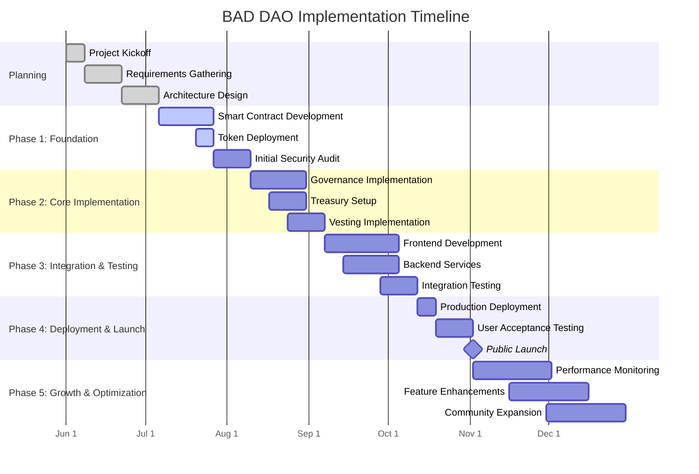
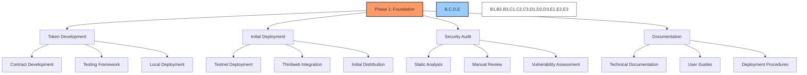
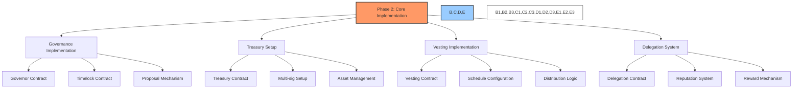
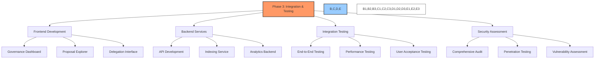
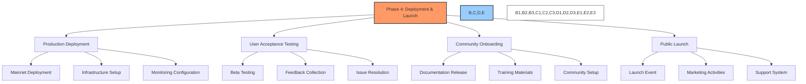
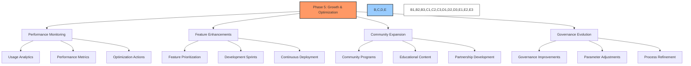
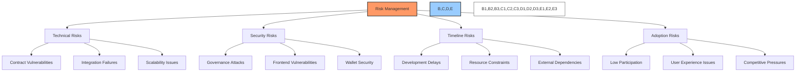
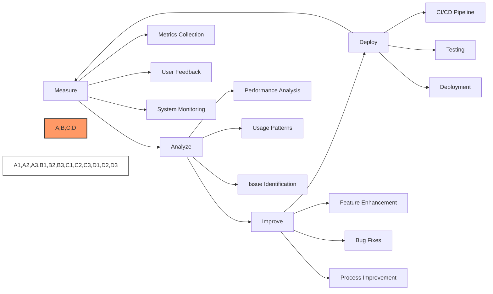

# 📅 BAD DAO: Implementation Timeline

## 📋 Table of Contents
- [🔍 Overview](#-overview)
- [📊 Timeline Summary](#-timeline-summary)
- [🚀 Phase 1: Foundation](#-phase-1-foundation)
- [🔧 Phase 2: Core Implementation](#-phase-2-core-implementation)
- [🧩 Phase 3: Integration & Testing](#-phase-3-integration--testing)
- [🌐 Phase 4: Deployment & Launch](#-phase-4-deployment--launch)
- [📈 Phase 5: Growth & Optimization](#-phase-5-growth--optimization)
- [⚠️ Risk Management](#-risk-management)
- [🔄 Continuous Improvement](#-continuous-improvement)

## 🔍 Overview

This document outlines the detailed implementation timeline for the BAD DAO governance system. It provides a comprehensive roadmap covering all phases from initial setup through full production deployment and ongoing optimization. Each phase includes specific milestones, deliverables, resource requirements, and success criteria.

The implementation timeline spans approximately 5 months from initial development to public launch, with ongoing optimization and growth activities continuing thereafter. The timeline is designed with appropriate buffer periods to accommodate unexpected challenges and to ensure thorough testing and security validation before launch.

## 📊 Timeline Summary

| Phase | Duration | Start Date | End Date | Key Deliverables |
|-------|----------|------------|----------|------------------|
| 1: Foundation | 6 weeks | July 6, 2023 | August 10, 2023 | Token contracts, initial deployment, security audit |
| 2: Core Implementation | 4 weeks | August 10, 2023 | September 7, 2023 | Governance, treasury, vesting contracts |
| 3: Integration & Testing | 5 weeks | September 7, 2023 | October 12, 2023 | Frontend, backend, testing |
| 4: Deployment & Launch | 3 weeks | October 12, 2023 | November 2, 2023 | Production deployment, UAT, public launch |
| 5: Growth & Optimization | Ongoing | November 2, 2023 | Ongoing | Monitoring, enhancements, expansion |

## 🚀 Phase 1: Foundation

### 📆 Timeline: July 6, 2023 - August 10, 2023 (6 weeks)

### 🎯 Objectives
- Develop and deploy the BAD token contract
- Establish the development and testing infrastructure
- Complete initial security audit
- Create foundational documentation

### 📝 Key Milestones

#### Week 1-3: Smart Contract Development
- **Tasks:**
  - Set up development environment
  - Implement BAD token contract
  - Develop testing framework
  - Create deployment scripts
  - Implement access control mechanisms
  - Develop initial token distribution logic
- **Deliverables:**
  - BAD token smart contract
  - Comprehensive test suite
  - Development environment documentation

#### Week 3-4: Token Deployment
- **Tasks:**
  - Deploy to testnet for initial validation
  - Configure Thirdweb integration
  - Set up deployment monitoring
  - Prepare for initial token distribution
  - Configure roles and permissions
- **Deliverables:**
  - Deployed testnet token contract
  - Thirdweb dashboard configuration
  - Deployment validation report

#### Week 4-6: Initial Security Audit
- **Tasks:**
  - Engage security audit partner
  - Conduct static analysis of token contract
  - Perform manual code review
  - Address identified vulnerabilities
  - Implement security improvements
- **Deliverables:**
  - Initial security audit report
  - Vulnerability remediation plan
  - Updated contract code with security enhancements

### 🧑‍💻 Resource Requirements
- 2 Smart Contract Developers
- 1 Security Engineer
- 1 DevOps Engineer
- 1 Technical Writer

### 🏆 Success Criteria
- BAD token successfully deployed on testnet
- All unit tests passing with >95% coverage
- No critical or high security vulnerabilities
- Complete technical documentation
- Successful initial token distribution on testnet

## 🔧 Phase 2: Core Implementation

### 📆 Timeline: August 10, 2023 - September 7, 2023 (4 weeks)

### 🎯 Objectives
- Implement governance contracts and mechanisms
- Set up treasury infrastructure and security
- Develop vesting system for team and contributors
- Create delegation system for governance participation

### 📝 Key Milestones

#### Week 1-3: Governance Implementation
- **Tasks:**
  - Develop Governor contract
  - Implement Timelock controller
  - Create proposal creation mechanism
  - Implement voting logic
  - Set up governance parameters
  - Create execution mechanisms
- **Deliverables:**
  - Governance contract suite
  - Timelock contract
  - Proposal and voting documentation
  - Governance parameter configuration

#### Week 2-3: Treasury Setup
- **Tasks:**
  - Develop Treasury contract
  - Configure multi-signature requirements
  - Set up asset management functions
  - Implement treasury controls
  - Create spending policies
  - Develop monitoring system
- **Deliverables:**
  - Treasury contract
  - Multi-sig wallet configuration
  - Treasury management documentation
  - Spending policy documentation

#### Week 3-4: Vesting Implementation
- **Tasks:**
  - Develop Vesting contract
  - Implement schedule configuration
  - Create claim functionality
  - Set up revocation mechanisms
  - Implement team and advisor vesting
  - Create vesting dashboard
- **Deliverables:**
  - Vesting contract
  - Distribution schedule configuration
  - Vesting management documentation
  - Vesting dashboard prototype

#### Week 2-4: Delegation System
- **Tasks:**
  - Develop Delegation contract
  - Implement reputation tracking
  - Create delegation incentives
  - Set up delegate discovery
  - Implement voting power transfer
  - Create delegation analytics
- **Deliverables:**
  - Delegation contract
  - Reputation system
  - Delegation documentation
  - Delegate analytics prototype

### 🧑‍💻 Resource Requirements
- 3 Smart Contract Developers
- 1 Frontend Developer
- 1 Backend Developer
- 1 Security Engineer
- 1 Technical Writer

### 🏆 Success Criteria
- Governance contracts deployed and tested on testnet
- Treasury multi-sig successfully configured and tested
- Vesting schedules implemented and verified
- Delegation system operational on testnet
- All components pass security review
- Complete documentation for all systems

## 🧩 Phase 3: Integration & Testing

### 📆 Timeline: September 7, 2023 - October 12, 2023 (5 weeks)

### 🎯 Objectives
- Develop user interfaces for all governance functions
- Implement backend services for data and analytics
- Conduct comprehensive integration testing
- Complete full security assessment

### 📝 Key Milestones

#### Week 1-4: Frontend Development
- **Tasks:**
  - Develop governance dashboard
  - Create proposal explorer
  - Implement voting interface
  - Build delegation portal
  - Create treasury monitoring dashboard
  - Implement wallet integration
  - Design responsive mobile interfaces
- **Deliverables:**
  - Governance dashboard
  - Proposal creation and voting interface
  - Delegation management portal
  - Treasury visualization dashboard
  - Responsive mobile interfaces

#### Week 1-3: Backend Services
- **Tasks:**
  - Develop API services
  - Implement data indexing and storage
  - Create analytics service
  - Set up notification system
  - Develop caching layer
  - Implement user authentication
  - Create monitoring and logging
- **Deliverables:**
  - API service documentation
  - Indexing service for blockchain data
  - Analytics dashboards
  - Notification service
  - Monitoring and logging infrastructure

#### Week 3-5: Integration Testing
- **Tasks:**
  - Develop end-to-end test suite
  - Create performance testing framework
  - Conduct load testing
  - Implement user acceptance testing
  - Test cross-browser compatibility
  - Verify mobile responsiveness
  - Conduct accessibility testing
- **Deliverables:**
  - Comprehensive test reports
  - Performance analysis
  - User acceptance testing documentation
  - Accessibility compliance report
  - Bug tracking and resolution system

#### Week 3-5: Security Assessment
- **Tasks:**
  - Conduct comprehensive security audit
  - Perform penetration testing
  - Assess smart contract vulnerabilities
  - Review frontend security
  - Test API security
  - Verify authentication mechanisms
  - Implement security improvements
- **Deliverables:**
  - Security audit report
  - Penetration testing results
  - Vulnerability assessment
  - Security enhancement implementation
  - Security documentation

### 🧑‍💻 Resource Requirements
- 3 Frontend Developers
- 2 Backend Developers
- 2 QA Engineers
- 1 Security Engineer
- 1 DevOps Engineer
- 1 UX Designer
- 1 Technical Writer

### 🏆 Success Criteria
- All user interfaces complete and functional
- Backend services deployed and operational
- All integration tests passing
- Performance meeting or exceeding targets
- No critical or high security vulnerabilities
- Accessibility compliance achieved
- Documentation complete for all components

## 🌐 Phase 4: Deployment & Launch

### 📆 Timeline: October 12, 2023 - November 2, 2023 (3 weeks)

### 🎯 Objectives
- Deploy all components to production environment
- Conduct final user acceptance testing
- Prepare community for governance participation
- Execute public launch

### 📝 Key Milestones

#### Week 1: Production Deployment
- **Tasks:**
  - Deploy smart contracts to mainnet
  - Configure production infrastructure
  - Set up monitoring and alerting
  - Implement backup procedures
  - Verify contract verification
  - Configure analytics tracking
  - Perform final deployment validation
- **Deliverables:**
  - Mainnet deployed contracts
  - Production infrastructure documentation
  - Monitoring dashboard
  - Deployment validation report
  - Emergency response procedures

#### Week 1-2: User Acceptance Testing
- **Tasks:**
  - Conduct beta testing with core users
  - Collect feedback on usability
  - Identify and resolve issues
  - Verify all critical user journeys
  - Test governance processes
  - Validate security measures
  - Finalize user documentation
- **Deliverables:**
  - UAT report
  - Issue resolution documentation
  - Final user experience assessment
  - Updated user documentation
  - Readiness assessment report

#### Week 2-3: Community Onboarding
- **Tasks:**
  - Finalize user documentation
  - Create training materials
  - Set up community channels
  - Prepare onboarding guides
  - Train community moderators
  - Create FAQ and knowledge base
  - Develop support procedures
- **Deliverables:**
  - Comprehensive user documentation
  - Video tutorials and guides
  - Community platform setup
  - Onboarding process documentation
  - Support ticketing system
  - Knowledge base and FAQ

#### Week 3: Public Launch
- **Tasks:**
  - Execute launch communications
  - Monitor system performance
  - Provide live support
  - Track engagement metrics
  - Address critical issues immediately
  - Collect initial feedback
  - Begin post-launch assessment
- **Deliverables:**
  - Launch announcement
  - Initial performance report
  - User engagement metrics
  - Early feedback summary
  - Post-launch action plan

### 🧑‍💻 Resource Requirements
- 1 Project Manager
- 2 Smart Contract Developers
- 2 Frontend Developers
- 1 Backend Developer
- 1 DevOps Engineer
- 1 Security Engineer
- 2 Community Managers
- 1 Technical Writer
- 1 Marketing Specialist

### 🏆 Success Criteria
- All contracts successfully deployed to mainnet
- Production environment stable and secure
- User acceptance testing completed with no critical issues
- Community channels established and active
- Support systems in place and operational
- Successful public launch with positive reception
- Meeting or exceeding initial user engagement targets

## 📈 Phase 5: Growth & Optimization

### 📆 Timeline: November 2, 2023 - Ongoing

### 🎯 Objectives
- Monitor system performance and user engagement
- Identify and implement feature enhancements
- Grow and nurture community participation
- Evolve governance mechanisms based on feedback and metrics

### 📝 Key Milestones

#### Month 1: Performance Monitoring
- **Tasks:**
  - Implement comprehensive analytics tracking
  - Monitor system performance metrics
  - Track user engagement statistics
  - Identify bottlenecks and issues
  - Create optimization plan
  - Establish regular reporting
  - Develop performance dashboards
- **Deliverables:**
  - Performance monitoring dashboard
  - User engagement reports
  - System health metrics
  - Optimization recommendations
  - Regular performance updates

#### Month 1-2: Feature Enhancements
- **Tasks:**
  - Collect and prioritize feature requests
  - Implement high-priority enhancements
  - Develop improvement roadmap
  - Create development sprints
  - Establish continuous deployment pipeline
  - Conduct user testing of new features
  - Document feature enhancements
- **Deliverables:**
  - Feature roadmap
  - Development sprint schedule
  - New feature documentation
  - Continuous deployment pipeline
  - User feedback reports

#### Month 1-3: Community Expansion
- **Tasks:**
  - Develop community growth strategy
  - Create educational content
  - Implement community programs
  - Establish partnership initiatives
  - Organize governance participation events
  - Track community metrics
  - Develop community leadership
- **Deliverables:**
  - Community growth plan
  - Educational content library
  - Partnership program documentation
  - Community event calendar
  - Community metrics dashboard

#### Month 2-3: Governance Evolution
- **Tasks:**
  - Analyze governance participation
  - Identify improvement opportunities
  - Implement parameter adjustments
  - Refine proposal and voting processes
  - Develop governance best practices
  - Create governance evolution roadmap
  - Document governance improvements
- **Deliverables:**
  - Governance analysis report
  - Parameter adjustment recommendations
  - Process improvement documentation
  - Governance evolution roadmap
  - Best practices documentation

### 🧑‍💻 Resource Requirements
- 1 Project Manager
- 2 Smart Contract Developers
- 2 Frontend Developers
- 1 Backend Developer
- 1 DevOps Engineer
- 2 Community Managers
- 1 Data Analyst
- 1 UX Designer

### 🏆 Success Criteria
- Stable system performance with 99.9% uptime
- Growing user engagement metrics month-over-month
- Feature roadmap implementation on schedule
- Increasing community participation in governance
- Positive user feedback and satisfaction metrics
- Successful implementation of governance improvements
- Meeting or exceeding community growth targets

## ⚠️ Risk Management

### 🔍 Key Risks & Mitigation Strategies

#### Technical Risks
1. **Smart Contract Vulnerabilities**
   - **Risk**: Critical vulnerabilities in deployed contracts
   - **Impact**: Potential loss of funds, security breaches
   - **Mitigation**: Comprehensive security audits, formal verification, bug bounty program

2. **Integration Failures**
   - **Risk**: Issues with third-party integrations
   - **Impact**: Disruption of core functionality
   - **Mitigation**: Thorough testing, fallback mechanisms, redundancy planning

3. **Scalability Challenges**
   - **Risk**: System unable to handle growth in users or transactions
   - **Impact**: Degraded performance, poor user experience
   - **Mitigation**: Performance testing, scalable architecture, optimization plan

#### Security Risks
1. **Governance Attacks**
   - **Risk**: Malicious proposals or voting manipulation
   - **Impact**: Improper governance decisions
   - **Mitigation**: Time-locks, quorum requirements, emergency protocols

2. **Frontend Vulnerabilities**
   - **Risk**: Security issues in user interfaces
   - **Impact**: Compromised user accounts or data
   - **Mitigation**: Security audits, penetration testing, regular updates

3. **Wallet Security**
   - **Risk**: Compromised user wallets
   - **Impact**: Loss of user funds
   - **Mitigation**: Security best practices education, hardware wallet support

#### Timeline Risks
1. **Development Delays**
   - **Risk**: Missed deadlines in implementation
   - **Impact**: Delayed launch, increased costs
   - **Mitigation**: Buffer periods in timeline, modular development approach

2. **Resource Constraints**
   - **Risk**: Insufficient development resources
   - **Impact**: Quality issues, timeline delays
   - **Mitigation**: Flexible resource allocation, prioritized feature development

3. **External Dependencies**
   - **Risk**: Delays in third-party services or audits
   - **Impact**: Timeline disruption
   - **Mitigation**: Early engagement, alternative providers, contingency planning

#### Adoption Risks
1. **Low Participation**
   - **Risk**: Insufficient governance participation
   - **Impact**: Ineffective governance, centralization
   - **Mitigation**: Delegation system, participation incentives, education

2. **User Experience Issues**
   - **Risk**: Complex or confusing interfaces
   - **Impact**: User frustration, low adoption
   - **Mitigation**: Usability testing, simplified workflows, guided onboarding

3. **Competitive Pressures**
   - **Risk**: Alternative governance solutions
   - **Impact**: Reduced adoption or migration
   - **Mitigation**: Unique value proposition, community engagement, continuous improvement

### 🚨 Contingency Plans

1. **Emergency Response Protocol**
   - Documented procedures for critical issues
   - Designated response team with clear roles
   - Communication templates and channels
   - Recovery processes and procedures

2. **Phased Rollout Strategy**
   - Ability to deploy functionality in stages
   - Feature flags for controlled releases
   - Rollback procedures for problematic updates
   - Limited access testing before full release

3. **Alternative Implementation Paths**
   - Simplified fallback implementations
   - Alternative technical approaches documented
   - Modular design allowing component substitution
   - Prioritized feature list for constrained scenarios

## 🔄 Continuous Improvement

### 📊 Improvement Process

1. **Measurement Framework**
   - User engagement metrics
   - System performance data
   - Governance participation statistics
   - User satisfaction measurements
   - Feature usage tracking

2. **Feedback Mechanisms**
   - User feedback forms
   - Community discussion forums
   - Regular user surveys
   - Feature request tracking
   - Issue reporting system

3. **Iteration Cycles**
   - Bi-weekly development sprints
   - Monthly feature releases
   - Quarterly strategic reviews
   - Continuous bug fixing and optimization

4. **Knowledge Management**
   - Comprehensive documentation
   - Lessons learned repository
   - Best practices guidelines
   - Shared knowledge base
   - Training materials

### 🎯 Long-term Evolution

1. **Governance Evolution**
   - Parameter adjustments based on participation data
   - Process refinements for improved efficiency
   - New governance mechanisms based on community feedback
   - Increasing decentralization over time

2. **Technical Roadmap**
   - Layer 2 scaling solutions
   - Cross-chain governance capabilities
   - Advanced analytics and simulation tools
   - Enhanced security features

3. **Community Development**
   - Expanded educational resources
   - Delegate development program
   - Regional community building
   - Partnership ecosystem growth

---

*This document outlines the implementation timeline for the BAD DAO governance system. It serves as a roadmap for all stakeholders involved in the development and deployment process. The timeline and milestones will be regularly reviewed and updated as the project progresses.*

*Version: 1.0*  
*Last Updated: June 2023*  
*Document Owner: BAD DAO Core Team* 