# 🔌 BAD DAO: Integration Requirements

## 📋 Table of Contents
- [🔍 Overview](#-overview)
- [🖥️ Frontend Requirements](#-frontend-requirements)
- [🗃️ Backend Requirements](#-backend-requirements)
- [🧩 Third-Party Integrations](#-third-party-integrations)
- [🔒 Security Requirements](#-security-requirements)
- [🧪 Testing & Validation](#-testing--validation)

## 🔍 Overview

This document outlines the comprehensive integration requirements for the BAD DAO ecosystem. It covers frontend, backend, third-party service integrations, security considerations, and testing procedures necessary for a robust and user-friendly governance experience.

```mermaid
graph TD
    A[BAD DAO Integration Ecosystem] --> B[Frontend Applications]
    A --> C[Backend Services]
    A --> D[Blockchain Interfaces]
    A --> E[Third-Party Services]
    
    B --> B1[Governance Dashboard]
    B --> B2[Proposal Explorer]
    B --> B3[Delegation Portal]
    B --> B4[Token Management]
    
    C --> C1[API Services]
    C --> C2[Data Indexing]
    C --> C3[Notification System]
    C --> C4[Analytics Engine]
    
    D --> D1[Smart Contract Interactions]
    D --> D2[Transaction Management]
    D --> D3[Wallet Connections]
    D --> D4[Gas Optimization]
    
    E --> E1[Snapshot Integration]
    E --> E2[Thirdweb Services]
    E --> E3[The Graph]
    E --> E4[IPFS/Arweave]
    
    style A fill:#f96,stroke:#333,stroke-width:2px
    style B,C,D,E fill:#9cf,stroke:#333,stroke-width:2px
    style B1,B2,B3,B4,C1,C2,C3,C4,D1,D2,D3,D4,E1,E2,E3,E4 fill:#fff,stroke:#333,stroke-width:1px
```

The integration architecture is designed with the following principles:

1. **User-Centric Design**: Prioritize intuitive interfaces and seamless user experience
2. **Security First**: Implement robust security measures at every integration point
3. **Modularity**: Design components with clean interfaces for future extensibility
4. **Performance Optimization**: Ensure responsive application performance across all platforms
5. **Comprehensive Monitoring**: Implement logging and analytics throughout the system

## 🖥️ Frontend Requirements

### 📱 Core Applications

```mermaid
graph TD
    A[Frontend Applications] --> B[Governance Dashboard]
    A --> C[Proposal Explorer]
    A --> D[Delegation Portal]
    A --> E[Treasury Monitoring]
    
    B --> B1[Proposal Creation]
    B --> B2[Voting Interface]
    B --> B3[Governance Analytics]
    B --> B4[User Profile]
    
    C --> C1[Proposal Listing]
    C --> C2[Proposal Details]
    C --> C3[Voting Records]
    C --> C4[Historical Analysis]
    
    D --> D1[Delegate Discovery]
    D --> D2[Delegation Management]
    D --> D3[Delegate Analytics]
    D --> D4[Reputation Tracking]
    
    E --> E1[Asset Allocation]
    E --> E2[Transaction History]
    E --> E3[Financial Metrics]
    E --> E4[Spending Proposals]
    
    style A fill:#f96,stroke:#333,stroke-width:2px
    style B,C,D,E fill:#9cf,stroke:#333,stroke-width:2px
    style B1,B2,B3,B4,C1,C2,C3,C4,D1,D2,D3,D4,E1,E2,E3,E4 fill:#fff,stroke:#333,stroke-width:1px
```

#### 🏛️ Governance Dashboard

**Core Features**:
- Real-time overview of active proposals
- Personalized voting queue
- Governance participation metrics
- Token voting power display
- Delegation status and options
- Role-based access to administrative functions

**Technical Requirements**:
- React.js frontend with TypeScript
- Responsive design for mobile and desktop
- Ethers.js integration for blockchain interactions
- Web3Modal for wallet connections
- Chart.js or D3.js for analytics visualizations
- State management with Redux or Context API

#### 📊 Proposal Explorer

**Core Features**:
- Comprehensive proposal listing with filtering options
- Detailed proposal view with arguments, voting status, and timeline
- Discussion threads for each proposal
- Historical voting records and analytics
- Search functionality across all proposals
- Proposal templates for common governance actions

**Technical Requirements**:
- Server-side rendering for SEO optimization
- Infinite scroll for proposal listing
- Markdown support for proposal descriptions
- Real-time updates via WebSockets
- Integrated commenting system
- Full-text search implementation

#### 🧑‍💼 Delegation Portal

**Core Features**:
- Delegate discovery with profile and voting history
- Delegation management interface
- Analytics on delegate performance
- Reputation and trust metrics visualization
- Delegation rewards tracking
- Educational resources on effective delegation

**Technical Requirements**:
- Sortable and filterable delegate directory
- Delegate profile pages with voting history
- One-click delegation process
- Real-time delegation status updates
- Automated reputation score calculation
- Delegate performance comparison tools

#### 🏦 Treasury Monitoring

**Core Features**:
- Real-time treasury asset allocation visualization
- Transaction history with filtering options
- Financial metrics and performance indicators
- Treasury proposal creation and tracking
- Budget allocation visualization
- Spending category analysis

**Technical Requirements**:
- Interactive charts for asset allocation
- Transaction table with advanced filtering
- API integration with financial data providers
- PDF report generation
- CSV export functionality
- Real-time balance updates

### 🎨 UI/UX Requirements

```mermaid
graph TD
    A[UI/UX Requirements] --> B[Design System]
    A --> C[Responsive Design]
    A --> D[Accessibility]
    A --> E[Performance]
    
    B --> B1[Component Library]
    B --> B2[Color Palette]
    B --> B3[Typography]
    B --> B4[Iconography]
    
    C --> C1[Mobile Optimization]
    C --> C2[Tablet Support]
    C --> C3[Desktop Experience]
    C --> C4[Progressive Enhancement]
    
    D --> D1[WCAG 2.1 AA Compliance]
    D --> D2[Screen Reader Support]
    D --> D3[Keyboard Navigation]
    D --> D4[Color Contrast]
    
    E --> E1[Lazy Loading]
    E --> E2[Code Splitting]
    E --> E3[Image Optimization]
    E --> E4[Performance Metrics]
    
    style A fill:#f96,stroke:#333,stroke-width:2px
    style B,C,D,E fill:#9cf,stroke:#333,stroke-width:2px
    style B1,B2,B3,B4,C1,C2,C3,C4,D1,D2,D3,D4,E1,E2,E3,E4 fill:#fff,stroke:#333,stroke-width:1px
```

1. **Design System**
   - Consistent component library
   - Standardized color palette with light/dark mode
   - Typography system with responsive sizing
   - Custom iconography for governance actions
   - Animation guidelines for interactive elements

2. **Responsive Design**
   - Mobile-first approach with progressive enhancement
   - Optimized layouts for tablet and desktop
   - Touch-friendly interface elements
   - Consistent navigation patterns across devices
   - Critical features accessible on all screen sizes

3. **Accessibility**
   - WCAG 2.1 AA compliance
   - Semantic HTML structure
   - Keyboard navigation support
   - Screen reader compatibility
   - Sufficient color contrast
   - Alternative text for all images
   - ARIA attributes where appropriate

4. **Performance**
   - Core Web Vitals optimization
   - Lazy loading for off-screen content
   - Code splitting for optimized bundle sizes
   - Image optimization and WebP support
   - Prefetching for common user journeys
   - Service worker for offline capabilities

## 🗃️ Backend Requirements

### 🔧 API Services

```mermaid
graph TD
    A[API Services] --> B[Core API]
    A --> C[Analytics API]
    A --> D[Notification API]
    A --> E[Integration APIs]
    
    B --> B1[Authentication]
    B --> B2[Proposal Management]
    B --> B3[Voting Operations]
    B --> B4[Delegation Services]
    
    C --> C1[Governance Metrics]
    C --> C2[User Activity]
    C --> C3[Treasury Analysis]
    C --> C4[Performance Tracking]
    
    D --> D1[Email Notifications]
    D --> D2[Push Notifications]
    D --> D3[In-App Alerts]
    D --> D4[Webhook Integrations]
    
    E --> E1[Snapshot Integration]
    E --> E2[Blockchain Indexing]
    E --> E3[IPFS Integration]
    E --> E4[External Data Providers]
    
    style A fill:#f96,stroke:#333,stroke-width:2px
    style B,C,D,E fill:#9cf,stroke:#333,stroke-width:2px
    style B1,B2,B3,B4,C1,C2,C3,C4,D1,D2,D3,D4,E1,E2,E3,E4 fill:#fff,stroke:#333,stroke-width:1px
```

#### 🔐 Core API

**Endpoints**:
- `/api/auth`: Authentication and authorization
- `/api/proposals`: Proposal creation, retrieval, and management
- `/api/votes`: Voting operations and records
- `/api/delegates`: Delegation management and analytics
- `/api/treasury`: Treasury operations and monitoring
- `/api/users`: User profile and preference management

**Technical Requirements**:
- RESTful API design with JSON responses
- OpenAPI/Swagger documentation
- Rate limiting and request throttling
- JWT-based authentication
- Comprehensive logging and monitoring
- Caching layer for frequently accessed data

#### 📊 Analytics API

**Endpoints**:
- `/api/analytics/governance`: Governance participation metrics
- `/api/analytics/proposals`: Proposal success and participation rates
- `/api/analytics/delegates`: Delegation performance metrics
- `/api/analytics/treasury`: Financial performance analytics
- `/api/analytics/users`: User engagement and retention metrics

**Technical Requirements**:
- Time-series data storage
- Aggregation pipelines for complex metrics
- Data export functionality (CSV, JSON)
- Visualization-ready data structures
- Real-time and historical data access
- Customizable reporting periods

#### 🔔 Notification API

**Endpoints**:
- `/api/notifications/preferences`: User notification preferences
- `/api/notifications/send`: Notification dispatch
- `/api/notifications/templates`: Notification template management
- `/api/notifications/history`: Notification history and status

**Channels**:
- Email notifications via SMTP
- Push notifications for mobile devices
- In-app notifications
- Webhook delivery for system integrations
- Telegram/Discord bot integrations

**Technical Requirements**:
- Queue-based notification processing
- Templating system for notification content
- Delivery tracking and retry logic
- Rate limiting to prevent notification spam
- User preference management
- Scheduled notifications support

### 🗄️ Data Storage

```mermaid
graph TD
    A[Data Storage] --> B[Relational Database]
    A --> C[Time-Series Database]
    A --> D[Distributed Storage]
    A --> E[Caching Layer]
    
    B --> B1[User Data]
    B --> B2[Governance Records]
    B --> B3[Delegation Data]
    B --> B4[Configuration]
    
    C --> C1[Analytics Metrics]
    C --> C2[Performance Data]
    C --> C3[Treasury Metrics]
    C --> C4[Historical Prices]
    
    D --> D1[Proposal Content]
    D --> D2[Documentation]
    D --> D3[Media Assets]
    D --> D4[Backup Storage]
    
    E --> E1[API Response Cache]
    E --> E2[Session Data]
    E --> E3[Blockchain Data]
    E --> E4[Computed Metrics]
    
    style A fill:#f96,stroke:#333,stroke-width:2px
    style B,C,D,E fill:#9cf,stroke:#333,stroke-width:2px
    style B1,B2,B3,B4,C1,C2,C3,C4,D1,D2,D3,D4,E1,E2,E3,E4 fill:#fff,stroke:#333,stroke-width:1px
```

1. **Relational Database (PostgreSQL)**
   - User accounts and profiles
   - Governance records and voting history
   - Delegation relationships
   - Treasury transactions and allocations
   - System configuration and settings

2. **Time-Series Database (InfluxDB/TimescaleDB)**
   - Performance metrics and monitoring data
   - Treasury asset price history
   - Governance participation metrics over time
   - System health and usage statistics
   - User engagement analytics

3. **Distributed Storage (IPFS/Arweave)**
   - Proposal content and attachments
   - Governance documentation
   - Media assets
   - Historical data archives
   - Cryptographic proofs and signatures

4. **Caching Layer (Redis)**
   - Frequent API response caching
   - Session management
   - Rate limiting implementation
   - Real-time data processing
   - Distributed locking mechanism

### 🔄 Indexing & Syncing

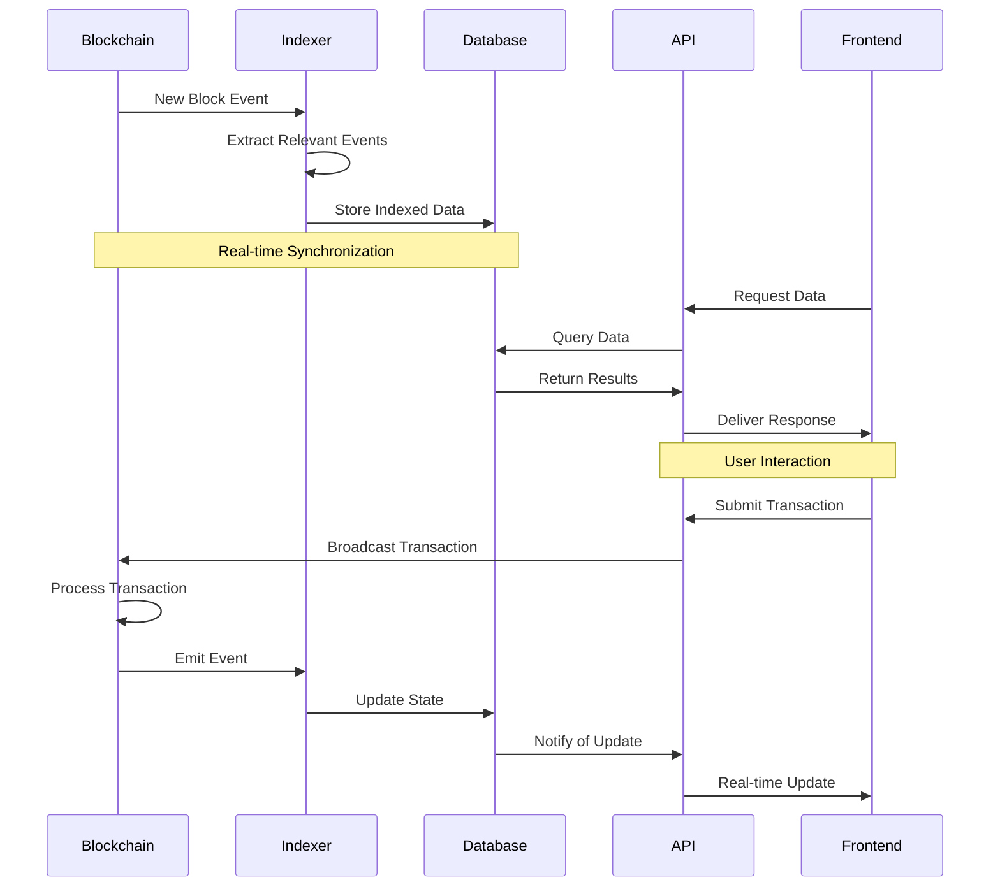

**Core Requirements**:
- Real-time blockchain event monitoring
- Efficient indexing of relevant contract events
- Data normalization for relational storage
- Historical data synchronization capabilities
- Reorg handling and data consistency checks
- Health monitoring and alerting

**Technical Implementation**:
- The Graph subgraph for primary indexing
- Custom indexer for specialized data requirements
- WebSocket connections for real-time updates
- Robust error handling and retry mechanisms
- Data validation and consistency checks
- Performance optimization for high transaction volume

## 🧩 Third-Party Integrations

### 🗳️ Snapshot Integration

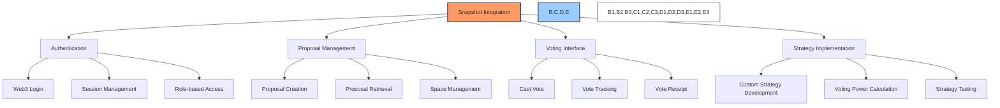

**Integration Requirements**:
- Create and configure BAD DAO Snapshot space
- Implement custom voting strategies for time-weighted voting
- Develop Snapshot proposal templates for different proposal types
- Integrate Snapshot API with BAD DAO frontend
- Implement IPFS storage for proposal content
- Create voting interface with Snapshot SDK
- Develop analytics dashboard for Snapshot voting
- Implement synchronization between on-chain and off-chain governance

**Implementation Approach**:
1. Create Snapshot space with appropriate configuration
2. Implement custom JS strategy for time-weighted voting
3. Set up IPFS pinning service for reliable content storage
4. Build proposal creation workflow with templates
5. Develop voting interface with real-time updates
6. Implement webhook notifications for vote events
7. Create admin dashboard for space management

### 🌐 Thirdweb Integration

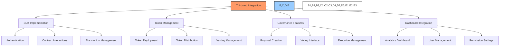

**Integration Requirements**:
- Integrate Thirdweb SDK for contract interactions
- Leverage Thirdweb Dashboard for contract management
- Implement token distribution and airdrop functionality
- Configure governance parameters through Thirdweb interface
- Set up vesting schedules for team and contributors
- Implement role-based access control
- Enable analytics and reporting features
- Integrate with existing frontend applications

**Implementation Approach**:
1. Install and configure Thirdweb SDK in applications
2. Set up token distribution through Thirdweb Dashboard
3. Configure governance parameters for proposal process
4. Implement vesting schedule creation and management
5. Design and build custom UI components
6. Create role-based access control system
7. Set up analytics tracking for key metrics

### 📊 The Graph Integration

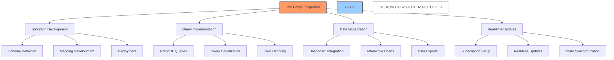

**Integration Requirements**:
- Develop custom subgraph for BAD DAO smart contracts
- Create GraphQL schema for governance entities
- Implement mappings for contract events
- Deploy and host subgraph on The Graph network
- Develop GraphQL query library for frontend applications
- Implement caching strategies for query optimization
- Create real-time data subscription system
- Build analytics visualizations based on subgraph data

**Implementation Approach**:
1. Define comprehensive GraphQL schema
2. Develop event mappings for all contracts
3. Implement entity relationships and indexing
4. Test and deploy subgraph to The Graph hosting
5. Create query library with Apollo Client
6. Implement caching and state management
7. Build real-time subscription system
8. Create data visualization components

### 🗂️ IPFS/Arweave Integration

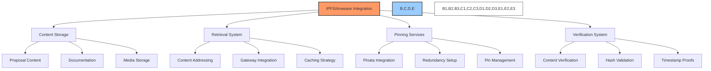

**Integration Requirements**:
- Implement IPFS storage for proposal content and documentation
- Set up Arweave for permanent storage of critical governance records
- Configure pinning services for reliable content availability
- Develop content addressing system for efficient retrieval
- Implement content verification and integrity checking
- Create backup and redundancy systems
- Build content management interface for administrators
- Implement efficient caching strategies

**Implementation Approach**:
1. Set up IPFS nodes or integration with hosted service
2. Configure Arweave for permanent record storage
3. Integrate Pinata or similar pinning service
4. Develop content addressing and retrieval system
5. Implement content verification mechanism
6. Create backup and redundancy procedures
7. Build administrative interface for content management

## 🔒 Security Requirements

### 🛡️ Smart Contract Security

```mermaid
graph TD
    A[Smart Contract Security] --> B[Audit Process]
    A --> C[Vulnerability Mitigation]
    A --> D[Ongoing Monitoring]
    A --> E[Emergency Response]
    
    B --> B1[Static Analysis]
    B --> B2[Dynamic Testing]
    B --> B3[Formal Verification]
    B --> B4[Expert Review]
    
    C --> C1[Access Control]
    C --> C2[Input Validation]
    C --> C3[Reentrancy Protection]
    C --> C4[Overflow Prevention]
    
    D --> D1[Automated Scanning]
    D --> D2[Anomaly Detection]
    D --> D3[Transaction Monitoring]
    D --> D4[Gas Usage Analysis]
    
    E --> E1[Emergency Shutdown]
    E --> E2[Incident Response Plan]
    E --> E3[Communication Protocol]
    E --> E4[Recovery Procedures]
    
    style A fill:#f96,stroke:#333,stroke-width:2px
    style B,C,D,E fill:#9cf,stroke:#333,stroke-width:2px
    style B1,B2,B3,B4,C1,C2,C3,C4,D1,D2,D3,D4,E1,E2,E3,E4 fill:#fff,stroke:#333,stroke-width:1px
```

**Key Requirements**:
- Complete smart contract audit by reputable security firm
- Automated testing with coverage >95%
- Formal verification of critical functions
- Implementation of established security patterns
- Gas optimization without security compromises
- Comprehensive access control implementation
- Transaction simulation before deployment
- Ongoing vulnerability monitoring
- Bug bounty program establishment

**Implementation Approach**:
1. Engage security audit partners
2. Implement automated testing suite
3. Apply formal verification to critical components
4. Set up continuous monitoring system
5. Create emergency response protocol
6. Document security procedures
7. Train team on security best practices

### 🔐 Application Security

```mermaid
graph TD
    A[Application Security] --> B[Authentication]
    A --> C[Authorization]
    A --> D[Data Protection]
    A --> E[Infrastructure Security]
    
    B --> B1[Web3 Authentication]
    B --> B2[Multi-factor Auth]
    B --> B3[Session Management]
    B --> B4[Auth Monitoring]
    
    C --> C1[Role-based Access]
    C --> C2[Permission System]
    C --> C3[Access Logging]
    C --> C4[Privilege Escalation Prevention]
    
    D --> D1[Encryption at Rest]
    D --> D2[Encryption in Transit]
    D --> D3[Data Minimization]
    D --> D4[Retention Policies]
    
    E --> E1[DDOS Protection]
    E --> E2[WAF Implementation]
    E --> E3[Network Security]
    E --> E4[Container Security]
    
    style A fill:#f96,stroke:#333,stroke-width:2px
    style B,C,D,E fill:#9cf,stroke:#333,stroke-width:2px
    style B1,B2,B3,B4,C1,C2,C3,C4,D1,D2,D3,D4,E1,E2,E3,E4 fill:#fff,stroke:#333,stroke-width:1px
```

**Key Requirements**:
- Secure Web3 authentication implementation
- Comprehensive authorization system
- Input validation and sanitization
- Protection against common web vulnerabilities (OWASP Top 10)
- API security best practices
- Secure data storage and transmission
- Regular security assessments
- Penetration testing
- Compliance with relevant regulations
- Privacy-by-design approach

**Implementation Approach**:
1. Implement secure authentication patterns
2. Design comprehensive role-based access control
3. Develop input validation framework
4. Configure TLS for all communications
5. Implement API security controls
6. Set up regular security scanning
7. Conduct penetration testing
8. Document security policies

### 🚨 Incident Response

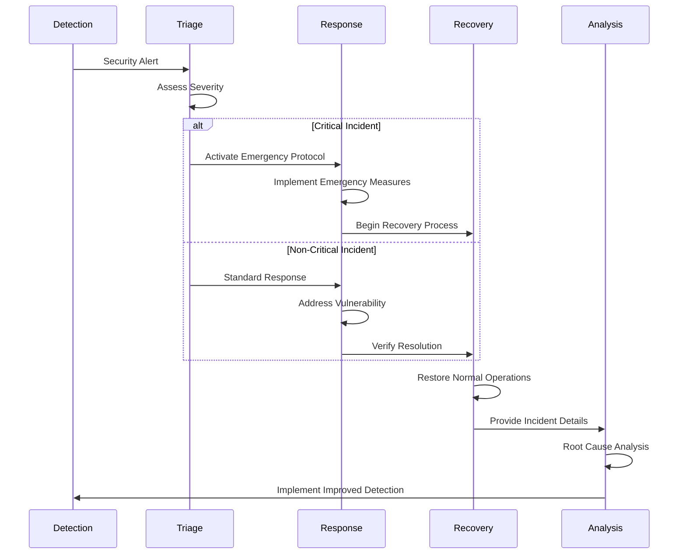

**Key Requirements**:
- Detailed incident response plan
- Clearly defined severity levels
- Emergency contacts and responsibilities
- Communication templates and protocols
- Regular incident response drills
- Post-incident analysis procedures
- Documentation and knowledge sharing
- Continuous improvement process

**Implementation Approach**:
1. Develop comprehensive incident response plan
2. Define roles and responsibilities
3. Create communication templates
4. Establish notification system
5. Conduct regular response drills
6. Document lessons learned
7. Implement continuous improvement process

## 🧪 Testing & Validation

### 🔬 Testing Strategy

```mermaid
graph TD
    A[Testing Strategy] --> B[Smart Contract Testing]
    A --> C[Frontend Testing]
    A --> D[Backend Testing]
    A --> E[Integration Testing]
    A --> F[Security Testing]
    
    B --> B1[Unit Tests]
    B --> B2[Integration Tests]
    B --> B3[Simulation Tests]
    B --> B4[Formal Verification]
    
    C --> C1[Unit Tests]
    C --> C2[Component Tests]
    C --> C3[UI Tests]
    C --> C4[Performance Tests]
    
    D --> D1[Unit Tests]
    D --> D2[API Tests]
    D --> D3[Load Tests]
    D --> D4[Database Tests]
    
    E --> E1[End-to-End Tests]
    E --> E2[System Tests]
    E --> E3[Cross-Browser Tests]
    E --> E4[Regression Tests]
    
    F --> F1[Penetration Testing]
    F --> F2[Security Scanning]
    F --> F3[Vulnerability Assessment]
    F --> F4[Compliance Testing]
    
    style A fill:#f96,stroke:#333,stroke-width:2px
    style B,C,D,E,F fill:#9cf,stroke:#333,stroke-width:2px
    style B1,B2,B3,B4,C1,C2,C3,C4,D1,D2,D3,D4,E1,E2,E3,E4,F1,F2,F3,F4 fill:#fff,stroke:#333,stroke-width:1px
```

**Testing Requirements**:
- Comprehensive test coverage for all system components
- Automated testing pipelines for continuous integration
- Performance testing under various load conditions
- Accessibility compliance testing
- Cross-browser and cross-device compatibility testing
- Security testing and vulnerability assessment
- User acceptance testing with stakeholder involvement
- Regression testing for all updates

**Implementation Tools**:
- **Smart Contract**: Hardhat, Truffle, Foundry, Ethers.js
- **Frontend**: Jest, React Testing Library, Cypress, Lighthouse
- **Backend**: Mocha, Chai, Supertest, k6
- **Security**: OWASP ZAP, SonarQube, Slither, Mythril
- **CI/CD**: GitHub Actions, CircleCI, Jenkins

### 🧠 User Testing

**Key Requirements**:
- Usability testing with representative user groups
- Metrics collection for user satisfaction and task completion
- A/B testing for UI/UX improvements
- User feedback collection and incorporation
- Accessibility testing with assistive technologies
- Internationalization and localization testing
- User journey tracking and optimization
- Performance perception assessment

**Implementation Approach**:
1. Define user testing objectives and metrics
2. Recruit representative test participants
3. Design test scenarios and tasks
4. Conduct moderated testing sessions
5. Analyze results and identify improvements
6. Implement changes based on feedback
7. Conduct follow-up testing

### 📊 Validation Metrics

```mermaid
graph TD
    A[Validation Metrics] --> B[Functional Metrics]
    A --> C[Performance Metrics]
    A --> D[Security Metrics]
    A --> E[User Experience Metrics]
    
    B --> B1[Test Coverage]
    B --> B2[Defect Density]
    B --> B3[Requirements Coverage]
    B --> B4[API Compliance]
    
    C --> C1[Response Time]
    C --> C2[Transaction Throughput]
    C --> C3[Resource Utilization]
    C --> C4[Scalability]
    
    D --> D1[Vulnerability Count]
    D --> D2[Mean Time to Remediate]
    D --> D3[Security Test Coverage]
    D --> D4[Compliance Score]
    
    E --> E1[User Satisfaction]
    E --> E2[Task Completion Rate]
    E --> E3[Error Rate]
    E --> E4[Time on Task]
    
    style A fill:#f96,stroke:#333,stroke-width:2px
    style B,C,D,E fill:#9cf,stroke:#333,stroke-width:2px
    style B1,B2,B3,B4,C1,C2,C3,C4,D1,D2,D3,D4,E1,E2,E3,E4 fill:#fff,stroke:#333,stroke-width:1px
```

**Key Metrics**:
1. **Functional Validation**
   - Test coverage: >95% for critical components
   - Defect density: <0.1 defects per 1000 lines of code
   - Requirements coverage: 100% for core functionality
   - API specification compliance: 100%

2. **Performance Validation**
   - Page load time: <2 seconds for critical pages
   - Transaction response time: <5 seconds for blockchain operations
   - API response time: <200ms for non-blockchain operations
   - Concurrent user capacity: Support for 10,000+ users

3. **Security Validation**
   - Vulnerabilities: Zero high or critical findings
   - OWASP compliance: Full compliance with OWASP Top 10
   - Security test coverage: 100% for security-critical components
   - Time to remediate: <24 hours for critical vulnerabilities

4. **User Experience Validation**
   - User satisfaction: >85% satisfaction rating
   - Task completion rate: >90% for critical user journeys
   - Error rate: <5% for common operations
   - Accessibility compliance: WCAG 2.1 AA

---

*This document outlines the integration requirements for the BAD DAO governance system. It serves as a guide for developers and stakeholders involved in the implementation process. For detailed technical specifications, API documentation, and implementation guides, please refer to the companion documents.*

*Version: 1.0*  
*Last Updated: June 2023*  
*Document Owner: BAD DAO Core Team* 