# 🧠 BAD DAO: Proposal Analyzer Agent

## 📋 Table of Contents
- [🔍 Overview](#-overview)
- [🎯 Core Purpose](#-core-purpose)
- [📊 Functional Architecture](#-functional-architecture)
- [🧮 Analysis Methodology](#-analysis-methodology)
- [🔢 Evaluation Criteria](#-evaluation-criteria)
- [📄 Reporting System](#-reporting-system)
- [⚙️ Technical Implementation](#️-technical-implementation)
- [👥 Human Oversight](#-human-oversight)
- [🔄 Integration with Other Agents](#-integration-with-other-agents)
- [📏 Performance Metrics](#-performance-metrics)
- [🛣️ Roadmap & Future Enhancements](#️-roadmap--future-enhancements)

## 🔍 Overview

The Proposal Analyzer Agent is a specialized AI system that provides objective, data-driven analysis of governance proposals within the BAD DAO ecosystem. It serves as the primary analytical engine, evaluating proposals across multiple dimensions to ensure comprehensive assessment of potential impacts, technical feasibility, economic considerations, and strategic alignment.

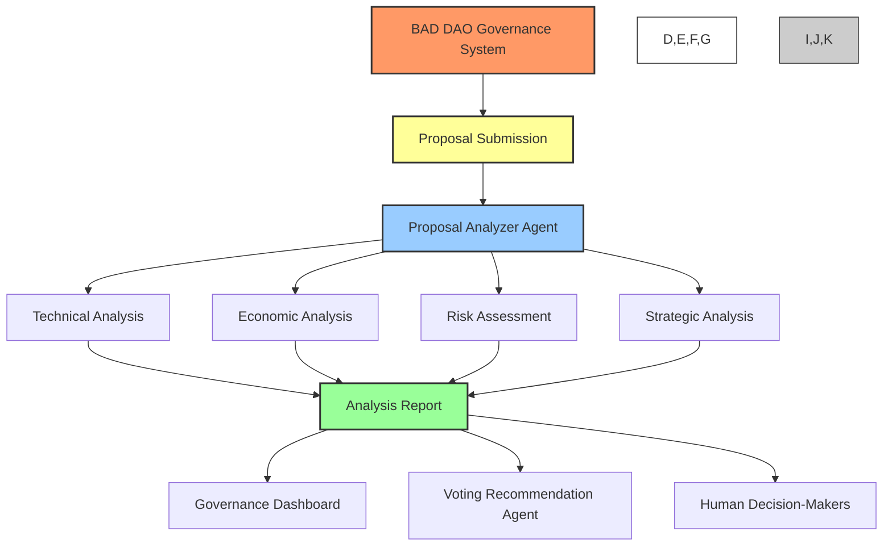

The Proposal Analyzer Agent represents a critical step in the governance workflow, ensuring that all stakeholders have access to comprehensive, unbiased information before voting on proposals. By standardizing the analytical process, it creates consistency across proposal evaluations while maintaining flexibility to handle diverse proposal types.

## 🎯 Core Purpose

The Proposal Analyzer Agent exists to:

1. **📊 Provide Objective Analysis**: Deliver consistent, data-driven evaluation of proposals free from human biases
2. **🔍 Ensure Due Diligence**: Conduct thorough assessment across all relevant dimensions
3. **🧮 Quantify Impacts**: Convert qualitative aspects into measurable metrics
4. **🚨 Identify Risks**: Surface potential issues or concerns for stakeholder awareness
5. **📋 Standardize Evaluation**: Apply consistent criteria across diverse proposal types
6. **⚖️ Support Informed Decisions**: Give stakeholders comprehensive information for voting
7. **🔗 Enable Comparison**: Facilitate relative assessment of competing proposals

## 📊 Functional Architecture

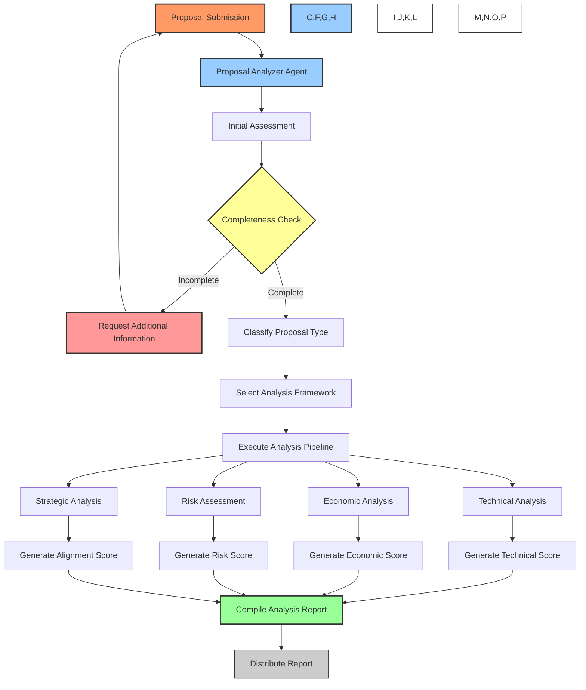

### Processing Pipeline

1. **📥 Proposal Intake**
   - Accepts proposal submissions from authorized channels
   - Verifies submission format and required metadata
   - Logs receipt in the proposal tracking system

2. **🔎 Initial Assessment**
   - Performs completeness check against proposal template requirements
   - Evaluates clarity and specificity of proposal language
   - Determines if sufficient information exists for full analysis

3. **📋 Proposal Classification**
   - Categorizes proposal by type (technical, economic, governance, etc.)
   - Identifies relevant analysis frameworks and evaluation criteria
   - Assigns appropriate weighting to evaluation dimensions

4. **🧮 Analysis Execution**
   - Runs proposal through selected analytical models
   - Conducts comparative analysis against historical proposals
   - Performs relevant simulations and impact assessments
   - Evaluates against established success metrics

5. **📊 Score Generation**
   - Calculates quantitative scores across evaluation dimensions
   - Normalizes scores against historical distributions
   - Produces confidence intervals for prediction accuracy
   - Generates overall proposal quality score

6. **📝 Report Compilation**
   - Synthesizes analysis results into standardized report
   - Highlights key strengths and concerns
   - Includes relevant supporting data and visualizations
   - Provides contextual information for interpretation

7. **🔄 Distribution**
   - Publishes report to governance dashboard
   - Forwards to Voting Recommendation Agent
   - Notifies relevant stakeholders
   - Archives for historical record

## 🧮 Analysis Methodology

The Proposal Analyzer employs multiple analytical approaches to ensure comprehensive evaluation:

### 🧪 Technical Analysis

```mermaid
graph TD
    A[Technical Analysis] --> B[Code Review]
    A --> C[Architecture Assessment]
    A --> D[Security Evaluation]
    A --> E[Performance Analysis]
    A --> F[Integration Analysis]
    
    B --> B1[Static Analysis]
    B --> B2[Logic Verification]
    B --> B3[Bug Detection]
    
    C --> C1[Design Patterns]
    C --> C2[Scalability]
    C --> C3[Maintainability]
    
    D --> D1[Attack Vector Analysis]
    D --> D2[Vulnerability Assessment]
    D --> D3[Access Control Review]
    
    E --> E1[Resource Consumption]
    E --> E2[Optimization Review]
    E --> E3[Gas Efficiency]
    
    F --> F1[Dependency Mapping]
    F --> F2[Interface Compatibility]
    F --> F3[System Impact]
    
    style A fill:#9cf,stroke:#333,stroke-width:2px
    style B,C,D,E,F fill:#cff,stroke:#333,stroke-width:1px
    style B1,B2,B3,C1,C2,C3,D1,D2,D3,E1,E2,E3,F1,F2,F3 fill:#fff,stroke:#333,stroke-width:1px
```

- **📝 Code Analysis**: Evaluates code quality, correctness, and security
- **🏗️ Architecture Review**: Assesses design patterns and structural considerations
- **🔒 Security Assessment**: Identifies potential vulnerabilities and attack vectors
- **⚡ Performance Evaluation**: Analyzes computational efficiency and resource requirements
- **🔄 Integration Impact**: Examines compatibility with existing systems

### 💰 Economic Analysis

```mermaid
graph TD
    A[Economic Analysis] --> B[Cost Analysis]
    A --> C[Value Assessment]
    A --> D[Token Economics]
    A --> E[Incentive Analysis]
    A --> F[Market Impact]
    
    B --> B1[Implementation Costs]
    B --> B2[Operational Costs]
    B --> B3[Opportunity Costs]
    
    C --> C1[Revenue Potential]
    C --> C2[Growth Impact]
    C --> C3[ROI Projection]
    
    D --> D1[Supply Effects]
    D --> D2[Demand Effects]
    D --> D3[Price Implications]
    
    E --> E1[Stakeholder Alignment]
    E --> E2[Game Theory Analysis]
    E --> E3[Behavioral Incentives]
    
    F --> F1[Competitive Position]
    F --> F2[Market Reaction]
    F --> F3[Adoption Forecast]
    
    style A fill:#9cf,stroke:#333,stroke-width:2px
    style B,C,D,E,F fill:#cff,stroke:#333,stroke-width:1px
    style B1,B2,B3,C1,C2,C3,D1,D2,D3,E1,E2,E3,F1,F2,F3 fill:#fff,stroke:#333,stroke-width:1px
```

- **💸 Cost Estimation**: Calculates implementation and operational costs
- **📈 Value Projection**: Forecasts potential benefits and returns
- **⚖️ ROI Analysis**: Assesses return on investment and payback period
- **🪙 Token Impact**: Evaluates effects on token utility, distribution, and value
- **💹 Market Analysis**: Considers competitive positioning and market response

### ⚠️ Risk Assessment

```mermaid
graph TD
    A[Risk Assessment] --> B[Technical Risks]
    A --> C[Economic Risks]
    A --> D[Governance Risks]
    A --> E[Operational Risks]
    A --> F[Regulatory Risks]
    
    B --> B1[Implementation Failure]
    B --> B2[Security Vulnerabilities]
    B --> B3[Scalability Issues]
    
    C --> C1[Financial Losses]
    C --> C2[Market Reaction]
    C --> C3[Resource Misallocation]
    
    D --> D1[Decentralization Impact]
    D --> D2[Voting Power Shifts]
    D --> D3[Process Disruption]
    
    E --> E1[Maintenance Challenges]
    E --> E2[User Experience]
    E --> E3[Support Requirements]
    
    F --> F1[Compliance Issues]
    F --> F2[Jurisdictional Exposure]
    F --> F3[Regulatory Changes]
    
    style A fill:#9cf,stroke:#333,stroke-width:2px
    style B,C,D,E,F fill:#fcc,stroke:#333,stroke-width:1px
    style B1,B2,B3,C1,C2,C3,D1,D2,D3,E1,E2,E3,F1,F2,F3 fill:#fff,stroke:#333,stroke-width:1px
```

- **🚨 Risk Identification**: Discovers potential negative outcomes
- **📊 Probability Assessment**: Estimates likelihood of identified risks
- **💥 Impact Evaluation**: Quantifies potential damage if risks materialize
- **🛡️ Mitigation Analysis**: Evaluates proposed risk controls and fallbacks
- **🎲 Uncertainty Mapping**: Highlights areas of incomplete information

### 🎯 Strategic Analysis

```mermaid
graph TD
    A[Strategic Analysis] --> B[Mission Alignment]
    A --> C[Roadmap Compatibility]
    A --> D[Competitive Position]
    A --> E[Stakeholder Impact]
    A --> F[Long-term Implications]
    
    B --> B1[Purpose Alignment]
    B --> B2[Value Consistency]
    B --> B3[Objective Support]
    
    C --> C1[Priority Alignment]
    C --> C2[Timeline Integration]
    C --> C3[Milestone Support]
    
    D --> D1[Market Differentiation]
    D --> D2[Competitive Advantage]
    D --> D3[Industry Trends]
    
    E --> E1[User Experience]
    E --> E2[Developer Experience]
    E --> E3[Investor Perception]
    
    F --> F1[Sustainability]
    F --> F2[Adaptability]
    F --> F3[Evolution Path]
    
    style A fill:#9cf,stroke:#333,stroke-width:2px
    style B,C,D,E,F fill:#cfc,stroke:#333,stroke-width:1px
    style B1,B2,B3,C1,C2,C3,D1,D2,D3,E1,E2,E3,F1,F2,F3 fill:#fff,stroke:#333,stroke-width:1px
```

- **🧭 Mission Alignment**: Evaluates consistency with organizational purpose
- **🗺️ Roadmap Compatibility**: Assesses fit with strategic roadmap
- **🏆 Competitive Analysis**: Considers market position and differentiation
- **👥 Stakeholder Analysis**: Examines impacts on various stakeholder groups
- **🔮 Future Projection**: Evaluates long-term implications and adaptability

## 🔢 Evaluation Criteria

The Proposal Analyzer employs standardized evaluation frameworks customized by proposal type:

### Technical Proposal Framework

| Criterion | Weight | Description |
|-----------|--------|-------------|
| 🔒 Security | 30% | Protection against attacks, vulnerabilities, and exploits |
| ⚙️ Functionality | 20% | Correctness and completeness of implementation |
| 📈 Scalability | 15% | Ability to handle increasing load and usage |
| 🔄 Maintainability | 15% | Code quality, documentation, and future serviceability |
| 🔌 Integration | 10% | Compatibility with existing systems and dependencies |
| 💸 Efficiency | 10% | Resource consumption and optimization |

### Economic Proposal Framework

| Criterion | Weight | Description |
|-----------|--------|-------------|
| 📊 ROI | 25% | Expected return on investment for capital deployed |
| 💰 Value Creation | 20% | Total value generated for the ecosystem |
| 🏦 Treasury Impact | 20% | Effect on treasury assets and long-term sustainability |
| 🪙 Token Economics | 15% | Impact on token value, utility, and distribution |
| 🔄 Resource Efficiency | 10% | Optimal use of available resources |
| 🔮 Growth Potential | 10% | Future expansion and scaling opportunities |

### Governance Proposal Framework

| Criterion | Weight | Description |
|-----------|--------|-------------|
| 🏛️ Decentralization | 25% | Preservation or enhancement of decentralized control |
| ⚖️ Fairness | 20% | Equitable treatment of different stakeholder groups |
| 🔍 Transparency | 20% | Visibility into processes and decision-making |
| ⚙️ Efficiency | 15% | Streamlining of governance processes |
| 🛡️ Security | 10% | Protection against governance attacks |
| 🔄 Adaptability | 10% | Ability to evolve with changing requirements |

### Community Proposal Framework

| Criterion | Weight | Description |
|-----------|--------|-------------|
| 👥 Engagement | 25% | Potential to increase active participation |
| 🌐 Growth | 20% | Contribution to ecosystem expansion |
| 🤝 Retention | 20% | Ability to maintain and strengthen community |
| 📣 Awareness | 15% | Increase in visibility and recognition |
| 🎁 Value | 10% | Tangible benefits provided to community members |
| 📊 Measurability | 10% | Ability to track and quantify outcomes |

## 📄 Reporting System

The Proposal Analyzer generates comprehensive reports with standardized components:

```mermaid
graph TD
    A[Analysis Report] --> B[Executive Summary]
    A --> C[Detailed Analysis Sections]
    A --> D[Score Dashboard]
    A --> E[Risk Assessment]
    A --> F[Recommendation Section]
    A --> G[Supporting Data]
    
    B --> B1[Overview]
    B --> B2[Key Metrics]
    B --> B3[Critical Findings]
    
    C --> C1[Technical Analysis]
    C --> C2[Economic Analysis]
    C --> C3[Strategic Analysis]
    C --> C4[Operational Analysis]
    
    D --> D1[Overall Quality Score]
    D --> D2[Dimension Scores]
    D --> D3[Historical Comparison]
    
    E --> E1[Risk Matrix]
    E --> E2[Mitigation Assessment]
    E --> E3[Contingency Analysis]
    
    F --> F1[Optimization Suggestions]
    F --> F2[Implementation Recommendations]
    F --> F3[Alternative Approaches]
    
    G --> G1[Data Visualizations]
    G --> G2[Reference Materials]
    G --> G3[Comparable Proposals]
    
    style A fill:#9cf,stroke:#333,stroke-width:2px
    style B,C,D,E,F,G fill:#cff,stroke:#333,stroke-width:1px
    style B1,B2,B3,C1,C2,C3,C4,D1,D2,D3,E1,E2,E3,F1,F2,F3,G1,G2,G3 fill:#fff,stroke:#333,stroke-width:1px
```

### Standard Report Sections

1. **📋 Executive Summary**
   - High-level overview of proposal (1-2 paragraphs)
   - Key metrics table with critical scores
   - Primary strengths and concerns
   - Overall assessment statement

2. **📊 Score Dashboard**
   - Overall quality score (0-100)
   - Dimension scores with radar chart visualization
   - Historical percentile ranking
   - Confidence interval indicators

3. **🧪 Technical Analysis Section**
   - Detailed evaluation of technical aspects
   - Code quality and architecture assessment
   - Security and performance considerations
   - Integration and dependency analysis

4. **💰 Economic Analysis Section**
   - Cost breakdown and ROI projections
   - Value creation assessment
   - Token economics impact
   - Resource allocation efficiency

5. **⚠️ Risk Assessment Section**
   - Risk matrix visualization
   - Detailed risk descriptions
   - Probability and impact ratings
   - Mitigation strategy evaluation

6. **🎯 Strategic Analysis Section**
   - Alignment with mission and roadmap
   - Stakeholder impact analysis
   - Competitive positioning
   - Long-term implications

7. **💡 Recommendation Section**
   - Improvement suggestions
   - Implementation considerations
   - Alternative approaches
   - Monitoring and success metrics

8. **📑 Supporting Data**
   - Relevant data visualizations
   - Comparative analysis with similar proposals
   - Reference to relevant documentation
   - Methodology notes and limitations

### Report Formats
- **🖥️ Interactive Dashboard**: Primary interface for governance participants
- **📱 Mobile Summary**: Condensed version for on-the-go review
- **📄 Printable PDF**: Formal documentation for record-keeping
- **📊 Data Export**: Machine-readable format for further analysis
- **🔄 API Access**: Integration with other systems and tools

## ⚙️ Technical Implementation

The Proposal Analyzer Agent is implemented using a combination of AI models and traditional analytical systems:

```mermaid
graph TD
    A[Proposal Analyzer Architecture] --> B[Natural Language Processing]
    A --> C[Code Analysis Engine]
    A --> D[Economic Modeling System]
    A --> E[Risk Assessment Framework]
    A --> F[Knowledge Graph]
    
    B --> B1[Language Understanding]
    B --> B2[Semantic Analysis]
    B --> B3[Context Extraction]
    B --> B4[Sentiment Analysis]
    
    C --> C1[Static Analysis]
    C --> C2[Dynamic Simulation]
    C --> C3[Security Scanning]
    C --> C4[Dependency Analysis]
    
    D --> D1[Cost Modeling]
    D --> D2[Value Forecasting]
    D --> D3[Market Simulation]
    D --> D4[Incentive Analysis]
    
    E --> E1[Risk Identification]
    E --> E2[Probability Models]
    E --> E3[Impact Assessment]
    E --> E4[Mitigation Analysis]
    
    F --> F1[Protocol Documentation]
    F --> F2[Historical Proposals]
    F --> F3[Governance Rules]
    F --> F4[External References]
    
    style A fill:#f96,stroke:#333,stroke-width:2px
    style B,C,D,E,F fill:#9cf,stroke:#333,stroke-width:2px
    style B1,B2,B3,B4,C1,C2,C3,C4,D1,D2,D3,D4,E1,E2,E3,E4,F1,F2,F3,F4 fill:#fff,stroke:#333,stroke-width:1px
```

### Core Components

1. **🧠 Natural Language Processing System**
   - Large language model for proposal understanding
   - Semantic analysis for intent extraction
   - Context awareness for relevant interpretation
   - Named entity recognition for reference mapping

2. **💻 Code Analysis Engine**
   - Static analysis for code quality and security
   - Dynamic simulation for functional testing
   - Automated security scanning for vulnerabilities
   - Dependency analysis for integration assessment

3. **📊 Economic Modeling System**
   - Cost modeling for resource requirements
   - Value forecasting for benefit projection
   - Market simulation for ecosystem effects
   - Incentive analysis for stakeholder alignment

4. **⚠️ Risk Assessment Framework**
   - Automated risk identification
   - Probabilistic modeling for likelihood estimation
   - Impact assessment through scenario analysis
   - Mitigation effectiveness evaluation

5. **🔗 Knowledge Graph**
   - Comprehensive protocol documentation
   - Historical proposal database
   - Governance rules and parameters
   - External reference materials

### Processing Pipeline

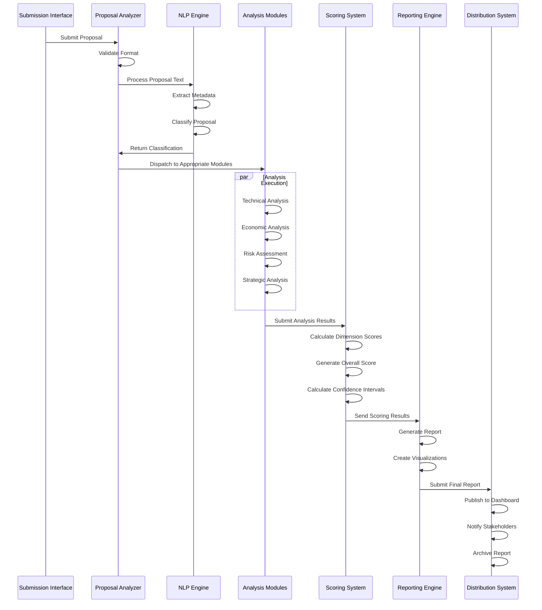

### Model Training and Data Sources

- **🧠 Model Training**
  - Supervised learning on historical proposals
  - Reinforcement learning from proposal outcomes
  - Expert-labeled data for classification
  - Feedback incorporation for continuous improvement

- **📚 Training Data Sources**
  - Historical proposal archive (approved and rejected)
  - Expert analysis of past governance decisions
  - Protocol documentation and specifications
  - External economic and market data
  - Security vulnerability databases
  - Community feedback and sentiment data

## 👥 Human Oversight

While the Proposal Analyzer operates autonomously, multiple human oversight mechanisms ensure accountability and quality:

### Oversight Mechanisms

```mermaid
graph TD
    A[Human Oversight] --> B[Quality Control Reviews]
    A --> C[Feedback Loop]
    A --> D[Calibration Sessions]
    A --> E[Audit Process]
    A --> F[Exception Handling]
    
    B --> B1[Technical Accuracy]
    B --> B2[Analysis Completeness]
    B --> B3[Bias Detection]
    
    C --> C1[Error Reporting]
    C --> C2[Improvement Suggestions]
    C --> C3[Outcome Tracking]
    
    D --> D1[Expert Validation]
    D --> D2[Model Adjustment]
    D --> D3[Parameter Tuning]
    
    E --> E1[Quarterly Audits]
    E --> E2[Independent Review]
    E --> E3[Performance Analysis]
    
    F --> F1[Human Review Triggers]
    F --> F2[Expert Escalation]
    F --> F3[Manual Override]
    
    style A fill:#f96,stroke:#333,stroke-width:2px
    style B,C,D,E,F fill:#9cf,stroke:#333,stroke-width:2px
    style B1,B2,B3,C1,C2,C3,D1,D2,D3,E1,E2,E3,F1,F2,F3 fill:#fff,stroke:#333,stroke-width:1px
```

- **👁️ Regular Review Process**
  - Scheduled quality checks by technical committee
  - Random sampling of analyses for accuracy assessment
  - Comparison of AI analysis with expert human analysis
  - Bias detection and correction procedures

- **🔄 Feedback Integration**
  - Structured feedback collection from governance participants
  - Error reporting mechanism for inaccuracies
  - Outcome tracking for prediction accuracy
  - Continuous improvement based on feedback

- **⚙️ Model Governance**
  - Quarterly calibration sessions with domain experts
  - Parameter adjustment based on performance metrics
  - Version control and rollback capability
  - Transparent release notes for model updates

## 🔄 Integration with Other Agents

The Proposal Analyzer interfaces with other agents in the BAD DAO ecosystem:

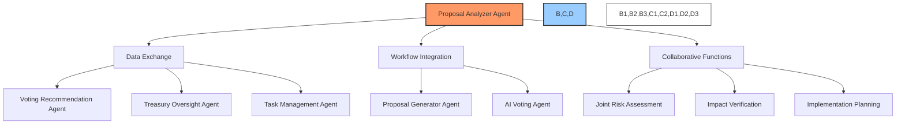

### Primary Integrations

1. **📊 Voting Recommendation Agent**
   - Provides analytical foundation for voting recommendations
   - Receives feedback on recommendation effectiveness
   - Coordinates on evaluation criteria alignment

2. **✨ Proposal Generator Agent**
   - Supplies quality metrics to improve proposal generation
   - Receives proposed drafts for pre-submission analysis
   - Collaborates on proposal refinement

3. **💹 Treasury Oversight Agent**
   - Shares economic impact assessments for treasury planning
   - Accesses treasury data for cost-benefit analysis
   - Coordinates on financial risk evaluation

4. **📋 Task Management Agent**
   - Provides implementation complexity assessments
   - Receives execution feedback for model improvement
   - Collaborates on resource requirement forecasting

5. **🗳️ AI Voting Agent**
   - Supplies analytical basis for voting decisions
   - Coordinates on evaluation criteria alignment
   - Receives voting pattern data for analytical improvement

## 📏 Performance Metrics

The Proposal Analyzer Agent is evaluated on key performance indicators:

### Accuracy Metrics

- **📊 Prediction Accuracy**: Correlation between analysis and actual outcomes
- **🎯 Score Precision**: Consistency in scoring similar proposals
- **⚖️ Comparative Accuracy**: Performance against human expert analysis
- **📈 Trend Detection**: Ability to identify patterns across proposals
- **🧩 Completeness**: Coverage of all relevant considerations

### Efficiency Metrics

- **⏱️ Processing Time**: Duration from submission to report completion
- **🔄 Throughput**: Number of proposals processed per time period
- **💻 Resource Utilization**: Computational resources required per analysis
- **📉 Error Rate**: Frequency of analytical errors or omissions
- **🔄 Rework Percentage**: Proportion of analyses requiring revision

### User Experience Metrics

- **👍 Usefulness Rating**: Stakeholder perception of analysis value
- **📚 Comprehensibility**: Clarity and accessibility of reports
- **🔍 Detail Satisfaction**: Appropriateness of analysis depth
- **💬 Feedback Volume**: Amount of corrective feedback received
- **🔄 Reference Frequency**: How often analyses are cited in discussions

## 🛣️ Roadmap & Future Enhancements

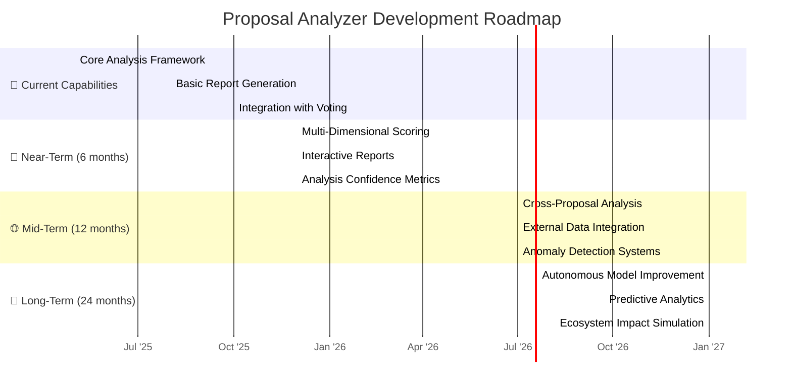

### Planned Enhancements

1. **📊 Multi-Dimensional Scoring (Q1 2026)**
   - Enhanced granularity in evaluation dimensions
   - Custom weighting by stakeholder preference
   - Comparative scoring against similar proposals
   - Confidence interval visualization

2. **🖥️ Interactive Reports (Q2 2026)**
   - Dynamic report exploration interface
   - Drill-down capability for detailed analysis
   - Custom visualization generation
   - What-if scenario modeling

3. **🔄 Cross-Proposal Analysis (Q3 2026)**
   - Identification of proposal interdependencies
   - Cumulative impact assessment
   - Pattern recognition across proposal types
   - Strategic alignment visualization

4. **🌐 External Data Integration (Q1 2027)**
   - Market data incorporation
   - Competitive protocol analysis
   - Regulatory compliance assessment
   - Macroeconomic trend correlation

5. **🔮 Predictive Analytics (Q3 2027)**
   - Long-term impact forecasting
   - Ecosystem simulation capabilities
   - Second-order effect modeling
   - Adaptive prediction based on historical accuracy

---

*This document provides a comprehensive overview of the BAD DAO Proposal Analyzer Agent. For technical specifications, implementation details, and integration guidelines, please refer to the technical implementation documentation.*

*Version: 1.0*  
*Last Updated: May 2025*  
*Document Owner: BAD DAO Technical Committee* 