# 🔄 BAD DAO: Proposal Lifecycle

## 📋 Table of Contents
- [🔍 Overview](#-overview)
- [🌱 Ideation Phase](#-ideation-phase)
- [📝 Drafting Phase](#-drafting-phase)
- [🔎 Review Phase](#-review-phase)
- [💬 Discussion Phase](#-discussion-phase)
- [🗳️ Voting Phase](#️-voting-phase)
- [⏱️ Time-lock Phase](#️-time-lock-phase)
- [🚀 Execution Phase](#-execution-phase)
- [📊 Monitoring Phase](#-monitoring-phase)

## 🔍 Overview

The BAD DAO Proposal Lifecycle outlines the complete journey of a governance proposal from conception to implementation and beyond. Understanding this lifecycle helps community members effectively participate in governance by knowing what to expect at each stage and how to maximize their impact on the decision-making process.

```mermaid
graph LR
    A[🌱 Ideation] --> B[📝 Drafting]
    B --> C[🔎 Review]
    C --> D[💬 Discussion]
    D --> E[🗳️ Voting]
    E --> F[⏱️ Time-lock]
    F --> G[🚀 Execution]
    G --> H[📊 Monitoring]
    H --> A
    
    style A fill:#f9f,stroke:#333,stroke-width:2px
    style B fill:#f9f,stroke:#333,stroke-width:2px
    style C fill:#bbf,stroke:#333,stroke-width:2px
    style D fill:#bbf,stroke:#333,stroke-width:2px
    style E fill:#bfb,stroke:#333,stroke-width:2px
    style F fill:#bfb,stroke:#333,stroke-width:2px
    style G fill:#fb9,stroke:#333,stroke-width:2px
    style H fill:#fb9,stroke:#333,stroke-width:2px
```

The lifecycle is designed to ensure:
- **Quality Governance**: Well-formed, thoughtful proposals
- **Community Involvement**: Broad participation at all stages
- **Transparency**: Clear visibility into proposal status and next steps
- **Accountability**: Tracking from idea to implementation
- **Continuous Improvement**: Learning from each proposal cycle

## 🌱 Ideation Phase

The ideation phase marks the birth of governance proposals:

### 💡 Idea Sources

Proposals can originate from various sources:

1. **Community Members**: Individual token holders identifying needs or improvements
2. **Core Team**: Protocol developers suggesting technical enhancements
3. **Working Groups**: Focused teams developing specialized proposals
4. **Delegates**: Professional governance participants representing community interests
5. **Automated Analysis**: AI-driven suggestions based on protocol data

### 🧐 Initial Assessment

Ideas undergo preliminary evaluation:

1. **Alignment Check**: Does the idea align with protocol values and roadmap?
2. **Feasibility Analysis**: Is implementation technically and economically viable?
3. **Duplicity Check**: Has this been proposed or considered before?
4. **Impact Assessment**: What would be the scope and scale of impact?
5. **Resource Requirement**: What resources would be needed to implement?

### 🌡️ Temperature Check

Ideas gauge community interest through informal mechanisms:

1. **Forum Discussion**: Posting on governance forum for initial feedback
2. **Discord Channels**: Dedicated channels for proposal brainstorming
3. **Community Calls**: Presenting concepts during regular community calls
4. **Polls**: Simple non-binding polls to gauge interest
5. **Delegate Feedback**: Getting input from established delegates

### 📝 Concept Development

Promising ideas are developed into proposal concepts:

1. **Problem Statement**: Clear articulation of the issue or opportunity
2. **Proposed Solution**: High-level description of the proposed action
3. **Expected Impact**: Anticipated effects on the protocol and community
4. **Resource Needs**: Estimated resources required
5. **Next Steps**: Path toward formal proposal

## 📝 Drafting Phase

The drafting phase transforms ideas into formal proposals:

### 📋 Template Selection

Proposals use standardized templates based on type:

1. **Protocol Change Template**: For technical modifications
2. **Treasury Proposal Template**: For financial decisions
3. **Governance Update Template**: For governance framework changes
4. **Community Initiative Template**: For ecosystem growth efforts
5. **Emergency Action Template**: For time-sensitive issues

### ✍️ Drafting Components

All proposals include standard components:

1. **Executive Summary**: Brief overview of the proposal
2. **Background**: Context and history related to the proposal
3. **Problem Statement**: Clear articulation of the issue or opportunity
4. **Proposed Solution**: Detailed description of proposed actions
5. **Implementation Plan**: Specific steps for execution
6. **Timeline**: Expected schedule for implementation
7. **Success Metrics**: How outcomes will be measured
8. **Budget**: Financial resources required (if applicable)
9. **Alternatives Considered**: Other options evaluated
10. **Risk Assessment**: Potential issues and mitigation strategies

### 🔧 Technical Specification

Technical proposals require additional details:

1. **Technical Architecture**: System design documentation
2. **Smart Contract Code**: New or modified contract code
3. **Audit Results**: Security assessment findings
4. **Testing Results**: Performance and integration test outcomes
5. **Backwards Compatibility**: Impact on existing systems
6. **Deployment Plan**: Technical implementation steps

### 💰 Economic Modeling

Treasury and economic proposals require:

1. **Financial Projections**: Expected economic impact
2. **Cost-Benefit Analysis**: ROI and value assessment
3. **Budget Breakdown**: Detailed allocation of funds
4. **Treasury Impact**: Effect on overall treasury health
5. **Economic Incentive Analysis**: Behavior and incentive effects
6. **Market Impact Assessment**: Potential market reactions

### 🤝 Collaboration Tools

Proposal drafting leverages various collaboration mechanisms:

1. **GitHub Repositories**: Version-controlled proposal development
2. **Collaborative Docs**: Multi-contributor editing platforms
3. **Research Forum**: Dedicated threads for proposal components
4. **Working Group Sessions**: Focused meetings for complex proposals
5. **Technical Workshops**: Collaborative technical development

## 🔎 Review Phase

The review phase ensures proposal quality before formal discussion:

### 🧪 Technical Review

Technical assessment of the proposal:

1. **Technical Committee Review**: Evaluation by technical experts
2. **Implementation Feasibility**: Assessment of technical viability
3. **Security Analysis**: Identification of potential vulnerabilities
4. **Integration Assessment**: Compatibility with existing systems
5. **Performance Impact**: Effect on protocol performance
6. **Maintenance Considerations**: Long-term maintenance requirements

### 💹 Economic Review

Economic and financial assessment:

1. **Treasury Committee Review**: Evaluation by financial experts
2. **Economic Impact Analysis**: Effects on protocol economics
3. **Budget Verification**: Confirmation of resource requirements
4. **Value Assessment**: Evaluation of ROI and value creation
5. **Financial Risk Analysis**: Potential downside scenarios
6. **Opportunity Cost Assessment**: Alternative uses of resources

### 📜 Governance Review

Governance structure and process assessment:

1. **Governance Committee Review**: Evaluation by governance experts
2. **Framework Compatibility**: Alignment with governance framework
3. **Precedent Analysis**: Comparison with previous proposals
4. **Stakeholder Impact**: Effects on different stakeholder groups
5. **Voting Parameter Review**: Confirmation of appropriate voting parameters
6. **Implementation Governance**: Post-approval governance requirements

### 👥 Community Review

Preliminary community assessment:

1. **Delegate Review**: Feedback from established delegates
2. **Readability Assessment**: Clarity and comprehensibility check
3. **Community Perspective**: Alignment with community values
4. **User Impact Analysis**: Effects on protocol users
5. **Inclusivity Check**: Consideration of diverse stakeholder interests

### ♻️ Revision Process

Proposal refinement based on feedback:

1. **Feedback Consolidation**: Aggregating input from all reviews
2. **Prioritization**: Identifying critical vs. minor improvements
3. **Revision Planning**: Structured approach to addressing feedback
4. **Collaborative Editing**: Working with reviewers on revisions
5. **Version Control**: Tracking changes and improvements
6. **Review Response Documentation**: Recording responses to feedback

## 💬 Discussion Phase

The discussion phase enables community deliberation:

### 📢 Forum Discussion

Structured discussion in the governance forum:

1. **Announcement Post**: Official introduction of the proposal
2. **Discussion Thread**: Dedicated space for community dialogue
3. **Category Organization**: Appropriate categorization for discovery
4. **Pinned Status**: Highlighted visibility for active proposals
5. **Update Notifications**: Alerts for significant changes or updates

### 🤔 Engagement Types

Various forms of community engagement:

1. **Questions & Answers**: Clarifications about proposal details
2. **Alternative Suggestions**: Community-proposed modifications
3. **Impact Perspectives**: Different views on potential outcomes
4. **Risk Identification**: Community-identified concerns
5. **Support Statements**: Expressions of agreement with rationale
6. **Opposition Statements**: Expressions of disagreement with rationale

### 🎙️ Live Discussion

Synchronous discussion opportunities:

1. **Proposal Presentation**: Proposer presentation of key points
2. **Community Call**: Dedicated segment in regular community calls
3. **AMA Sessions**: Question and answer sessions with proposers
4. **Working Group Discussions**: Focused analysis by topic experts
5. **Delegate Roundtables**: Deliberation among elected delegates

### 📝 Documentation & Updates

Ongoing proposal refinement:

1. **Discussion Summary**: Regular summaries of key points
2. **Proposal Updates**: Modifications based on community input
3. **Change Log**: Tracking of all proposal revisions
4. **FAQ Development**: Compilation of common questions and answers
5. **Supporting Documentation**: Additional materials addressing questions

### 🕒 Discussion Timeline

Structured timelines for productive discussion:

1. **Minimum Period**: Required minimum discussion duration by proposal type
2. **Extension Mechanism**: Process for extending discussion if needed
3. **Quiet Period**: Final 48 hours for review without major changes
4. **Discussion Closure**: Formal end of discussion phase
5. **Summary Compilation**: Comprehensive summary of discussion outcomes

## 🗳️ Voting Phase

The voting phase determines community decision through formal voting:

### 🗓️ Voting Setup

Preparation for the voting process:

1. **Snapshot Creation**: On-chain snapshot of token holdings
2. **Voting Interface Configuration**: Setting up voting UI
3. **Parameter Confirmation**: Verification of voting parameters
4. **Announcement Communications**: Multi-channel voting notifications
5. **Voting Guide Publication**: Instructions for participation

### 🔢 Voting Parameters

Specific parameters governing the vote:

1. **Voting Period**: Duration of the voting window
2. **Quorum Requirement**: Minimum participation threshold
3. **Approval Threshold**: Required percentage of "For" votes
4. **Voting Power Calculation**: How voting power is determined
5. **Vote Options**: For, Against, Abstain (counts for quorum)

### 📊 Voting Mechanics

Technical implementation of voting:

1. **On-chain Voting**: Direct blockchain-based voting
2. **Off-chain Signaling**: Gas-free snapshot voting
3. **Delegation Mechanics**: Voting through delegated representatives
4. **Vote Modification**: Ability to change vote until deadline
5. **Vote Verification**: Confirmation of vote recording

### 📈 Voting Analytics

Real-time analysis during voting:

1. **Participation Tracking**: Monitoring voter turnout
2. **Vote Distribution**: Breakdown of votes by option
3. **Voting Power Analysis**: Distribution of voting power
4. **Temporal Patterns**: Voting activity over time
5. **Delegation Analysis**: Impact of delegate voting
6. **Projected Outcome**: Forecasted result based on current votes

### 🏁 Vote Finalization

Formal conclusion of voting:

1. **Voting Deadline**: Official close of voting period
2. **Result Calculation**: Final tally of votes and percentages
3. **Quorum Verification**: Confirmation of meeting minimum participation
4. **Threshold Evaluation**: Assessment against required approval percentage
5. **Result Certification**: Official recording of voting outcome
6. **Result Announcement**: Multi-channel communication of results

## ⏱️ Time-lock Phase

The time-lock phase creates a security buffer before implementation:

### ⏲️ Time-lock Mechanism

Technical implementation of the waiting period:

1. **Transaction Queuing**: Adding approved proposal to implementation queue
2. **Duration Configuration**: Setting appropriate time-lock period
3. **Countdown Display**: Public visibility of remaining time
4. **Transaction Details**: Transparent display of pending actions
5. **Parameter Visibility**: Clear documentation of implementation parameters

### 🛡️ Security Assessment

Final security checks during time-lock:

1. **Implementation Review**: Technical team verification of implementation plan
2. **Vulnerability Scanning**: Final security checks
3. **Current Conditions Assessment**: Evaluation of current protocol state
4. **Dependency Verification**: Confirmation of external dependencies
5. **Simulation Testing**: Final implementation simulation

### 🔍 Community Monitoring

Community oversight during the waiting period:

1. **Transaction Inspection**: Community review of pending transactions
2. **Parameter Verification**: Confirmation of implementation parameters
3. **Community Alert System**: Channel for raising critical concerns
4. **Guardian Monitoring**: Oversight by designated security guardians
5. **Delegate Review**: Final assessment by governance delegates

### 🛑 Cancellation Process

Emergency stopping mechanism if necessary:

1. **Cancellation Triggers**: Conditions warranting implementation halt
2. **Cancellation Authority**: Who can initiate cancellation
3. **Evidence Requirements**: Necessary justification for cancellation
4. **Cancellation Mechanics**: Technical process for halting implementation
5. **Communication Protocol**: Notification system for cancellation events

### 🔄 Transition Planning

Preparation for implementation:

1. **Implementation Team Readiness**: Confirmation of team preparation
2. **Resource Allocation**: Ensuring necessary resources are available
3. **Communication Planning**: Preparing user and stakeholder notifications
4. **Contingency Planning**: Backup plans for potential issues
5. **Monitoring Setup**: Establishing post-implementation tracking

## 🚀 Execution Phase

The execution phase implements the approved proposal:

### ✅ Pre-execution Verification

Final checks before implementation:

1. **Technical Readiness**: Confirmation of all technical components
2. **Resource Verification**: Ensuring all required resources are available
3. **Team Coordination**: Alignment of all implementation participants
4. **Network Conditions**: Verification of appropriate network state
5. **Final Authorization**: Formal approval to proceed with execution

### 🛠️ Implementation Types

Different implementation approaches:

1. **Smart Contract Deployment**: Publishing new contract code
2. **Parameter Updates**: Modifying configurable protocol parameters
3. **Access Control Changes**: Updating permissions and authorities
4. **Treasury Transactions**: Executing financial transfers
5. **Integration Activation**: Enabling new protocol connections
6. **Governance Updates**: Modifying governance mechanisms

### 📡 Execution Monitoring

Real-time oversight during implementation:

1. **Transaction Tracking**: Monitoring execution transactions
2. **Block Confirmation**: Verifying on-chain confirmation
3. **Error Detection**: Identifying any execution issues
4. **Gas Optimization**: Managing execution costs
5. **Execution Logging**: Detailed recording of all actions

### ✔️ Implementation Verification

Confirming successful execution:

1. **Functional Testing**: Verification of implemented functionality
2. **State Validation**: Confirmation of expected protocol state
3. **Integration Testing**: Verification of system interactions
4. **Performance Validation**: Confirmation of performance metrics
5. **Security Verification**: Post-implementation security check

### 📣 Implementation Announcement

Communicating successful implementation:

1. **Official Announcement**: Formal notification of completion
2. **Technical Documentation**: Updated documentation reflecting changes
3. **User Instructions**: Guidance for users if action required
4. **Transaction Evidence**: Links to on-chain proof of implementation
5. **Next Steps**: Information about monitoring and feedback

## 📊 Monitoring Phase

The monitoring phase tracks outcomes and completes the governance cycle:

### 📡 Technical Monitoring

Tracking technical performance:

1. **Performance Metrics**: System performance measurements
2. **Error Monitoring**: Tracking any issues or failures
3. **Usage Statistics**: Adoption and utilization data
4. **Integration Status**: Monitoring system interactions
5. **Gas Consumption**: Tracking operational costs

### 📈 Economic Monitoring

Tracking financial and economic impacts:

1. **Treasury Movements**: Monitoring financial flows
2. **Economic Metrics**: Tracking economic performance indicators
3. **Market Response**: Observing market reactions
4. **User Economic Behavior**: Monitoring economic user actions
5. **Financial Projections**: Comparing actual vs. expected outcomes

### 👥 Community Feedback

Collecting user and community response:

1. **User Feedback Channels**: Designated feedback collection mechanisms
2. **Sentiment Analysis**: Tracking community sentiment
3. **Support Requests**: Monitoring related support tickets
4. **Social Media Monitoring**: Tracking external discussions
5. **Delegate Assessments**: Formal feedback from governance delegates

### 📝 Implementation Reports

Formal documentation of outcomes:

1. **30-Day Report**: Initial impact assessment
2. **Quarterly Review**: Medium-term outcome evaluation
3. **Annual Assessment**: Long-term impact analysis
4. **Success Metrics Evaluation**: Comparison against original goals
5. **Comprehensive Documentation**: Full implementation history

### 🔄 Continuous Improvement

Using insights for future governance:

1. **Lessons Learned Documentation**: Recording implementation insights
2. **Process Improvement Suggestions**: Recommendations for governance enhancement
3. **Follow-up Proposal Development**: Creating related proposals based on outcomes
4. **Knowledge Base Updates**: Adding implementation case studies
5. **Governance Metrics Updates**: Refining success metrics for future proposals

---

*This document provides a comprehensive overview of the BAD DAO Proposal Lifecycle. For technical implementation details, specific operational procedures, and integration guidelines, please refer to the technical implementation documentation.*

*Version: 1.0*  
*Last Updated: May 2025*  
*Document Owner: BAD DAO Governance Committee* 