# 📝 BAD DAO: Proposal Process

## 📋 Table of Contents
- [🔍 Overview](#-overview)
- [📜 Proposal Creation](#-proposal-creation)
- [💬 Discussion Phase](#-discussion-phase)
- [🗳️ Voting Phase](#-voting-phase)
- [⏱️ Time-lock Period](#️-time-lock-period)
- [🚀 Execution Phase](#-execution-phase)
- [📊 Post-Implementation Review](#-post-implementation-review)

## 🔍 Overview

The BAD DAO Proposal Process establishes a structured framework for community-driven governance decision-making. This document details the end-to-end lifecycle of governance proposals, from initial idea to implementation and review, ensuring transparent, fair, and effective protocol governance.

```mermaid
graph TD
    A[📝 Proposal Process] --> B[📜 Creation]
    A --> C[💬 Discussion]
    A --> D[🗳️ Voting]
    A --> E[⏱️ Time-lock]
    A --> F[🚀 Execution]
    A --> G[📊 Review]
    
    B --> B1[Proposal Drafting]
    B --> B2[Requirement Check]
    B --> B3[Formal Submission]
    
    C --> C1[Community Feedback]
    C --> C2[Analysis & Review]
    C --> C3[Iterations & Revisions]
    
    D --> D1[Voting Period]
    D --> D2[Vote Counting]
    D --> D3[Result Verification]
    
    E --> E1[Security Review]
    E --> E2[Final Amendments]
    E --> E3[Preparation for Launch]
    
    F --> F1[Code Deployment]
    F --> F2[Parameter Updates]
    F --> F3[Implementation Verification]
    
    G --> G1[Impact Assessment]
    G --> G2[Performance Tracking]
    G --> G3[Documentation Updates]
    
    style A fill:#f96,stroke:#333,stroke-width:2px
    style B,C,D,E,F,G fill:#9cf,stroke:#333,stroke-width:2px
    style B1,B2,B3,C1,C2,C3,D1,D2,D3,E1,E2,E3,F1,F2,F3,G1,G2,G3 fill:#fff,stroke:#333,stroke-width:1px
```

The proposal process is designed to balance several key objectives:

1. **Inclusive Participation**: Ensuring all stakeholders can meaningfully contribute
2. **Quality Decision-Making**: Promoting well-informed governance decisions
3. **Operational Efficiency**: Streamlining routine decisions while maintaining security
4. **Adaptability**: Accommodating different proposal types and urgency levels
5. **Transparency**: Providing clear visibility into all governance activities

## 📜 Proposal Creation

### 📋 Proposal Requirements

To submit a proposal, the following requirements must be met:

1. **Token Threshold**: Proposer must hold or have delegated a minimum of 0.1% of total BAD token supply (100,000 BAD)
2. **Delegate Sponsorship** (Alternative): Proposals can be sponsored by recognized delegates with combined voting power exceeding threshold
3. **Accountability Information**: Clear identification of proposer(s) and contact information
4. **Template Compliance**: Must use the appropriate proposal template for the proposal type
5. **Completeness**: All required sections must be filled out comprehensively

### 🧩 Proposal Templates

Different proposal types have standardized templates:

1. **🔧 Core Protocol Change Proposal**
   - Technical specifications
   - Security considerations
   - Backward compatibility analysis
   - Implementation plan with timeline
   - Testing requirements and results

2. **💰 Treasury Allocation Proposal**
   - Funding amount and schedule
   - Budget breakdown and justification
   - Expected return on investment
   - Risk assessment
   - Success metrics and reporting plan

3. **📜 Governance Update Proposal**
   - Current vs. proposed parameter/process
   - Rationale for change
   - Impact analysis on various stakeholders
   - Implementation complexity assessment
   - Transition plan

4. **👥 Working Group Proposal**
   - Mission and objectives
   - Membership criteria and initial members
   - Resource requirements and timeline
   - Accountability and reporting framework
   - Success metrics and sunset conditions

### 📤 Submission Process

The submission process follows these steps:

1. **Pre-submission Consultation** (Optional but recommended)
   - Discussion with relevant working groups
   - Informal feedback from core contributors
   - Technical feasibility assessment

2. **Draft Proposal**
   - Creation using standardized template
   - All required sections completed
   - Supporting documentation attached
   - Clear implementation path defined

3. **Forum Submission**
   - Post to the governance forum under appropriate category
   - 3-day temperature check period
   - Threshold: At least 5 positive reactions from token holders

4. **Formal Submission**
   - On-chain proposal submission
   - Link back to forum discussion
   - Payment of proposal submission fee (if applicable)
   - Verification of proposer eligibility

### 🤖 AI Proposal Analyzer

All proposals are automatically analyzed by the AI Proposal Analyzer for:

1. **Completeness Check**: Ensures all required sections are filled out
2. **Technical Feasibility**: Preliminary assessment of technical soundness
3. **Economic Impact**: Analysis of potential economic effects
4. **Risk Assessment**: Identification of potential risks and vulnerabilities
5. **Precedent Analysis**: Comparison with similar historical proposals
6. **Parameter Analysis**: Verification that proposed parameters are within safe ranges

The analysis is attached to the proposal for reference during discussion and voting phases.

## 💬 Discussion Phase

The discussion phase is critical for proposal refinement:

### 🗨️ Forum Discussions

1. **Duration**: 7 days minimum (may be extended for complex proposals)
2. **Structure**:
   - Main proposal thread for general feedback
   - Sub-threads for specific aspects (technical, economic, etc.)
   - Categorized feedback (support, concerns, questions)
3. **Facilitation**:
   - Dedicated moderators to maintain constructive discussion
   - Weekly community calls for high-impact proposals
   - Structured Q&A sessions with proposers

### 👨‍👩‍👧‍👦 Stakeholder Engagement

1. **Core Teams**: Technical assessment and implementation feasibility
2. **Subject Matter Experts**: Domain-specific analysis
3. **Delegates**: Represent broader community interests
4. **General Token Holders**: Diverse perspectives and feedback

### 📝 Proposal Iterations

The iteration process allows for proposal refinement:

1. **Change Tracking**:
   - Version history maintained on forum
   - Change log documenting all updates
   - Side-by-side comparison of versions

2. **Revision Categories**:
   - **Minor**: Clarifications, small adjustments, additional details
   - **Moderate**: Significant changes that maintain original intent
   - **Major**: Fundamental changes requiring restart of discussion period

3. **Finalization**:
   - Final call for feedback (48 hours)
   - Proposer confirmation of readiness
   - No substantial changes after finalization

### 🔎 Expert Reviews

Critical proposals receive mandatory expert reviews:

1. **Technical Committee**: Code audit and implementation review
2. **Economic Committee**: Financial impact assessment
3. **Legal Team**: Regulatory and compliance analysis
4. **Security Team**: Risk and vulnerability assessment

### 🤖 AI Voting Recommendation

At the end of the discussion phase, the AI Voting Recommendation Agent produces:

1. **Comprehensive Analysis**: Data-driven evaluation of proposal merits
2. **Precedent Comparison**: Relationship to historical governance decisions
3. **Impact Projection**: Estimated outcomes across various scenarios
4. **Risk Assessment**: Potential vulnerabilities or unintended consequences
5. **Recommendation**: Evidence-based voting recommendation

## 🗳️ Voting Phase

The voting phase determines community consensus:

### 🗳️ Voting Parameters

Different proposal types have specific voting parameters:

| Proposal Type | Voting Period | Quorum | Approval Threshold | Time-lock |
|---------------|---------------|--------|-------------------|-----------|
| Core Protocol Change | 5 days | 15% | 70% | 7 days |
| Treasury Allocation | 5 days | 10% | 60% | 3-7 days |
| Governance Update | 7 days | 20% | 75% | 14 days |
| Working Group | 3 days | 5% | 55% | 2 days |
| Emergency Action | 1 day | 10% | 80% | 24 hours |

### 📊 Voting Power Calculation

Voting power is determined by:

1. **Token Holdings**: Basic voting power from BAD token holdings
2. **Time Weighting**: Multipliers based on token holding duration
   - 30+ days: 1.2x multiplier
   - 90+ days: 1.5x multiplier
   - 180+ days: 2.0x multiplier
3. **Role Multipliers**: Additional weight for certain governance roles
   - Core team members: 1.5x multiplier (for technical proposals)
   - Verified contributors: Role-specific multipliers
4. **Delegation**: Accumulated voting power from delegators

### 🔄 Voting Mechanics

Voting utilizes the following mechanics:

1. **Voting Options**:
   - For: Support for the proposal as presented
   - Against: Opposition to the proposal
   - Abstain: Counted toward quorum but not approval percentage

2. **Voting Methods**:
   - Web interface with wallet connection
   - Direct smart contract interaction
   - Delegation to trusted representatives
   - Snapshot voting for gas-free participation

3. **Vote Privacy**:
   - Votes are publicly visible on-chain
   - Optional private voting via zero-knowledge proofs for select proposals
   - Vote justification field for accountability

4. **Vote Modification**:
   - Votes can be changed until voting period ends
   - Last recorded vote is final
   - Vote change history is publicly visible

### 📈 Voting Analysis

The system provides comprehensive voting analytics:

1. **Participation Metrics**:
   - Overall participation rate
   - Participation by token holding size
   - Participation by holding duration
   - Delegate participation effectiveness

2. **Vote Distribution**:
   - Breakdown by vote option
   - Vote concentration analysis
   - Voting power distribution curve
   - Historical comparison

3. **Temporal Analysis**:
   - Voting patterns over time
   - Last-minute voting trends
   - Early vs. late voting comparison
   - Voting momentum visualization

### 🔰 Result Determination

After the voting period concludes:

1. **Automatic Calculation**:
   - Quorum verification: Total votes >= minimum required participation
   - Approval threshold: FOR votes >= required percentage
   - Final verification of all voting parameters

2. **Result Categories**:
   - **Approved**: Met quorum and approval threshold
   - **Rejected**: Met quorum but failed approval threshold
   - **Invalid**: Failed to meet quorum requirement

3. **Result Certification**:
   - Cryptographic verification of voting integrity
   - On-chain finalization of results
   - Permanent record in governance history
   - Official announcement across all channels

## ⏱️ Time-lock Period

The time-lock period provides a security buffer:

### 🔐 Security Reviews

During the time-lock, additional security measures are implemented:

1. **Technical Committee Review**:
   - Final code review for approved technical changes
   - Parameter validation against safe ranges
   - Integration testing with existing systems
   - Security vulnerability assessment

2. **Economic Review**:
   - Financial impact verification
   - Market condition reassessment
   - Treasury impact confirmation
   - Economic simulation under current conditions

3. **External Audit**:
   - Third-party review for critical changes
   - Smart contract audit for code changes
   - Security testing and vulnerability scanning
   - Audit report publication

### 📢 Community Monitoring

The community maintains vigilance during the time-lock:

1. **Public Verification**:
   - Exact transaction details published for review
   - Parameter verification tools available
   - Real-time countdown to execution
   - Simulation tools for impact assessment

2. **Objection Mechanism**:
   - Formal process to flag critical issues
   - Requires evidence and justification
   - Guardian Council rapid evaluation
   - Emergency pause capability for valid concerns

3. **Monitoring Dashboard**:
   - Time-lock status tracking
   - Pending transaction details
   - Security review status
   - Implementation readiness indicators

### 🔏 Cancellation Conditions

In rare circumstances, proposals can be cancelled during time-lock:

1. **Security Vulnerability**: Discovery of critical security issue
2. **Material Changes**: Significant market or protocol changes affecting viability
3. **Implementation Impossibility**: Technical barriers preventing successful execution
4. **Legal/Regulatory Concerns**: New legal issues that create compliance risks

Cancellation requires:
- Guardian Council super-majority (6/9)
- Detailed justification and evidence
- Public announcement and explanation
- Consideration of alternative approaches

## 🚀 Execution Phase

The execution phase implements the approved proposal:

### 🔧 Implementation Process

Implementation follows a structured process:

1. **Technical Implementation**:
   - Smart contract deployment
   - Code integration
   - Parameter updates
   - Access control changes
   - System configuration

2. **Treasury Implementation**:
   - Fund transfers
   - Budget allocation
   - Payment scheduling
   - Grant distribution
   - Investment execution

3. **Governance Implementation**:
   - Parameter updates
   - Process changes
   - Role assignments
   - Permission modifications
   - Framework adjustments

### ✅ Verification Process

Each implementation undergoes verification:

1. **Transaction Confirmation**:
   - Block confirmation verification
   - Transaction receipt validation
   - Gas cost documentation
   - On-chain state validation

2. **Functional Testing**:
   - Post-deployment testing suite execution
   - Integration verification
   - Performance benchmarking
   - Edge case testing

3. **Security Validation**:
   - Post-deployment security scan
   - Access control verification
   - Parameter boundary testing
   - Interaction testing

### 📢 Implementation Announcement

After successful execution:

1. **Official Announcement**:
   - Implementation status update
   - Transaction details and block explorer links
   - Technical documentation links
   - User action requirements (if any)

2. **Documentation Updates**:
   - Technical documentation updates
   - API documentation revisions
   - User guide modifications
   - FAQ updates

3. **Stakeholder Notifications**:
   - Direct notification to affected users
   - Partner/integration notifications
   - Market/exchange communications (if relevant)
   - Public relations announcements (for major changes)

## 📊 Post-Implementation Review

The post-implementation phase evaluates outcomes:

### 📈 Performance Tracking

Key metrics are monitored to assess implementation success:

1. **Technical Performance**:
   - System performance metrics
   - Error rates and issues
   - Gas usage optimization
   - Contract interaction patterns

2. **Economic Impact**:
   - Token economics effects
   - Treasury performance
   - Protocol revenue changes
   - Market response

3. **User Engagement**:
   - User adoption metrics
   - Feedback sentiment
   - Support ticket volume
   - Feature usage statistics

### 📝 Implementation Report

A comprehensive report is published after significant implementations:

1. **Implementation Summary**:
   - Original proposal objectives
   - Implementation details
   - Deviations from proposal (if any)
   - Technical challenges and solutions

2. **Impact Assessment**:
   - Achieved outcomes vs. expected outcomes
   - Positive effects and benefits
   - Negative effects or issues
   - Unintended consequences

3. **Performance Metrics**:
   - Key performance indicators
   - Before/after comparison
   - Time-series data analysis
   - Comparative benchmarks

4. **Recommendations**:
   - Follow-up actions required
   - Potential improvements
   - Future proposal considerations
   - Process enhancement suggestions

### 🔄 Continuous Improvement

Lessons learned drive governance evolution:

1. **Process Refinement**:
   - Governance framework updates
   - Proposal template enhancements
   - Voting mechanism improvements
   - Security protocol refinements

2. **Knowledge Base Updates**:
   - Case studies from implementations
   - Best practice documentation
   - Common pitfall warnings
   - Implementation guidance

3. **Governance Metrics**:
   - Proposal success rate tracking
   - Implementation efficiency
   - Participation trends
   - Decision quality assessment

---

*This document provides a comprehensive overview of the BAD DAO Proposal Process. For technical implementation details, specific operational procedures, and integration guidelines, please refer to the technical implementation documentation.*

*Version: 1.0*  
*Last Updated: May 2025*  
*Document Owner: BAD DAO Governance Committee* 