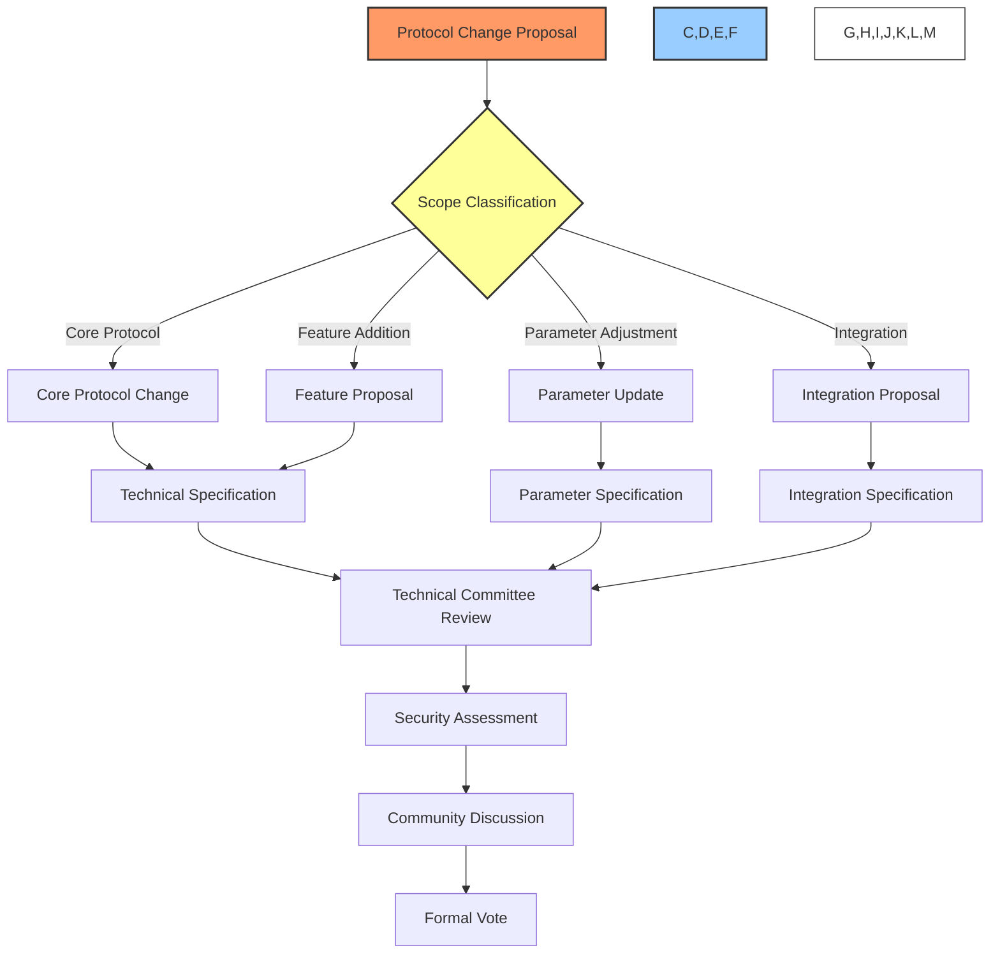
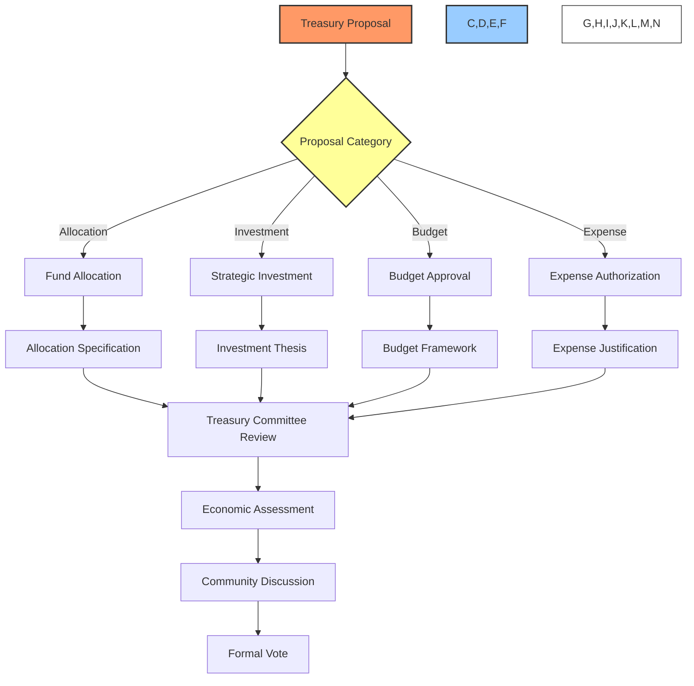
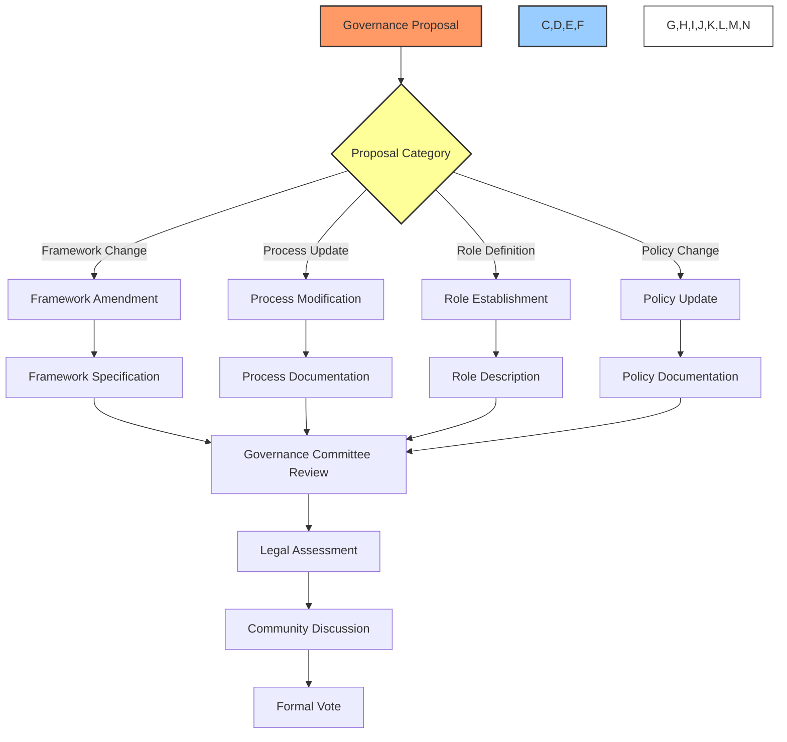
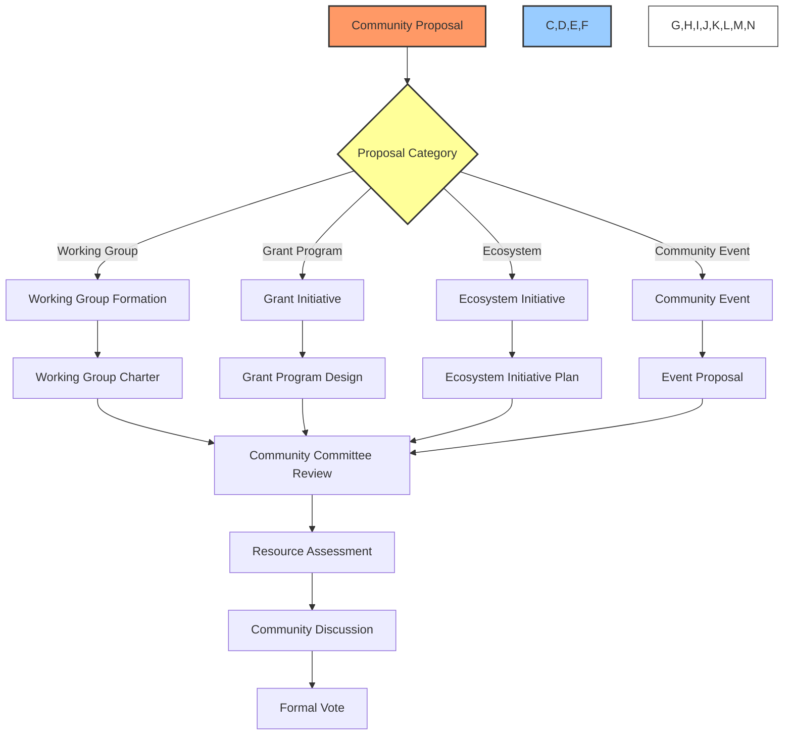
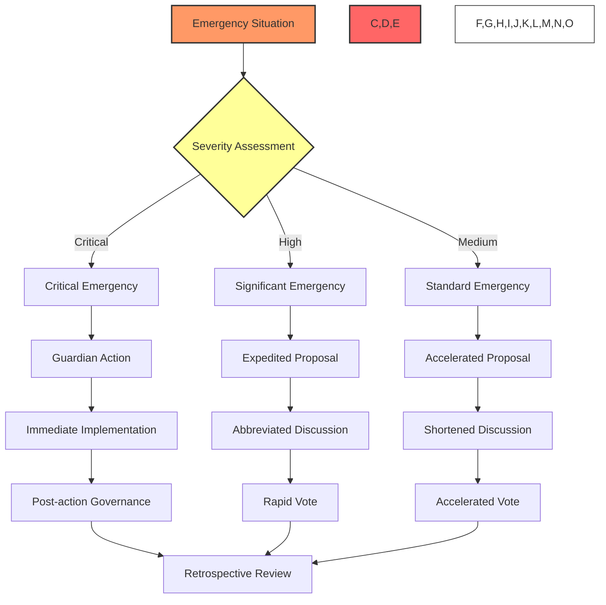

# 📑 BAD DAO: Proposal Types

## 📋 Table of Contents
- [🔍 Overview](#-overview)
- [🔧 Protocol Change Proposals](#-protocol-change-proposals)
- [💰 Treasury Proposals](#-treasury-proposals)
- [📜 Governance Proposals](#-governance-proposals)
- [👥 Community Proposals](#-community-proposals)
- [🚨 Emergency Proposals](#-emergency-proposals)
- [📊 Proposal Lifecycle Comparison](#-proposal-lifecycle-comparison)

## 🔍 Overview

The BAD DAO governance system accommodates various proposal types, each designed to address specific aspects of protocol governance. This document outlines the different proposal categories, their purposes, requirements, and processing frameworks to guide community members in selecting the appropriate mechanism for their governance initiatives.

```mermaid
graph TD
    A[BAD DAO Proposal Types] --> B[Protocol Change]
    A --> C[Treasury]
    A --> D[Governance]
    A --> E[Community]
    A --> F[Emergency]
    
    B --> B1[Core Protocol Updates]
    B --> B2[Feature Additions]
    B --> B3[Parameter Adjustments]
    B --> B4[Integration Approvals]
    
    C --> C1[Fund Allocations]
    C --> C2[Investment Decisions]
    C --> C3[Budget Approvals]
    C --> C4[Expense Authorizations]
    
    D --> D1[Framework Updates]
    D --> D2[Process Changes]
    D --> D3[Role Definitions]
    D --> D4[Policy Modifications]
    
    E --> E1[Working Groups]
    E --> E2[Grant Programs]
    E --> E3[Ecosystem Initiatives]
    E --> E4[Community Events]
    
    F --> F1[Security Responses]
    F --> F2[Critical Fixes]
    F --> F3[Urgent Actions]
    F --> F4[Time-sensitive Decisions]
    
    style A fill:#f96,stroke:#333,stroke-width:2px
    style B,C,D,E,F fill:#9cf,stroke:#333,stroke-width:2px
    style B1,B2,B3,B4,C1,C2,C3,C4,D1,D2,D3,D4,E1,E2,E3,E4,F1,F2,F3,F4 fill:#fff,stroke:#333,stroke-width:1px
```

Each proposal type has distinct:
- Submission requirements
- Review processes
- Voting parameters
- Implementation pathways
- Time-lock periods
- Documentation standards

## 🔧 Protocol Change Proposals

Protocol Change Proposals (PCPs) govern modifications to the technical infrastructure:

### 🛠️ Core Protocol Changes

**Purpose**: Fundamental modifications to the protocol's core functionality.

**Examples**:
- Smart contract upgrades
- Consensus mechanism changes
- Core architecture revisions
- Protocol-level security enhancements

**Requirements**:
- Comprehensive technical specifications
- Security audit results
- Backward compatibility assessment
- Implementation plan with timeline
- Testnet deployment results
- Risk analysis and mitigation plan

**Process Highlights**:
- Technical Committee review required
- 14-day minimum discussion period
- 70% approval threshold
- 15% quorum requirement
- 7-day time-lock period
- Post-implementation technical verification

### 🌟 Feature Additions

**Purpose**: Adding new capabilities to the protocol.

**Examples**:
- New protocol functions
- Additional user capabilities
- Enhanced protocol integrations
- Extended functionality

**Requirements**:
- Feature specification document
- Technical implementation details
- User experience considerations
- Testing strategy and results
- Resource requirements
- Deployment strategy

**Process Highlights**:
- Technical and UX review
- 10-day minimum discussion period
- 65% approval threshold
- 10% quorum requirement
- 5-day time-lock period
- Phased rollout plan

### ⚙️ Parameter Adjustments

**Purpose**: Modifying configurable protocol parameters.

**Examples**:
- Fee adjustments
- Threshold modifications
- Rate changes
- Limit adjustments

**Requirements**:
- Current vs. proposed parameter values
- Rationale for adjustment
- Expected impact analysis
- Historical context
- Parameter relationship assessment
- Monitoring plan

**Process Highlights**:
- Economic Committee review
- 5-day minimum discussion period
- 60% approval threshold
- 8% quorum requirement
- 3-day time-lock period
- Parameter effect monitoring

### 🔌 Integration Approvals

**Purpose**: Approving new protocol integrations.

**Examples**:
- New bridge connections
- Protocol-to-protocol integrations
- Oracle implementations
- External service connections

**Requirements**:
- Integration specification
- Security considerations
- Resource requirements
- Mutual benefits analysis
- Technical compatibility assessment
- Testing results

**Process Highlights**:
- Security Committee review required
- 7-day minimum discussion period
- 65% approval threshold
- 10% quorum requirement
- 5-day time-lock period
- Integration monitoring plan

## 💰 Treasury Proposals

Treasury Proposals govern the management and allocation of protocol assets:

### 💵 Fund Allocations

**Purpose**: Allocating treasury funds to specific initiatives.

**Examples**:
- Development funding
- Marketing campaigns
- Community incentives
- Protocol expansion initiatives

**Requirements**:
- Allocation amount and schedule
- Purpose and expected outcomes
- Success metrics
- Reporting commitments
- Fund recipient details
- Accountability mechanisms

**Process Highlights**:
- Treasury Committee review required
- 7-day minimum discussion period
- 60% approval threshold
- 10% quorum requirement
- 3-day time-lock period
- Milestone-based fund release

### 📈 Strategic Investments

**Purpose**: Authorizing treasury investments in strategic assets.

**Examples**:
- Protocol token investments
- Partnership token swaps
- Yield-generating strategies
- Strategic asset acquisitions

**Requirements**:
- Investment thesis
- Risk assessment
- Expected return analysis
- Exit strategy
- Portfolio impact analysis
- Monitoring plan

**Process Highlights**:
- Investment Committee review
- 10-day minimum discussion period
- 70% approval threshold
- 15% quorum requirement
- 5-day time-lock period
- Quarterly performance reporting

### 📒 Budget Approvals

**Purpose**: Approving operational and development budgets.

**Examples**:
- Quarterly operational budget
- Development team funding
- Infrastructure expense planning
- Marketing budget allocation

**Requirements**:
- Comprehensive budget breakdown
- Historical spending analysis
- Activity-based justifications
- Performance metrics
- Contingency planning
- Budget vs. actual reporting plan

**Process Highlights**:
- Treasury and Operations review
- Annual or quarterly cycle
- 55% approval threshold
- 10% quorum requirement
- 2-day time-lock period
- Monthly budget tracking

### 💳 Expense Authorizations

**Purpose**: Authorizing specific significant expenses.

**Examples**:
- Major service provider contracts
- Substantial one-time expenses
- Large consultant engagements
- Significant asset purchases

**Requirements**:
- Expense details and justification
- Vendor/recipient information
- Competitive analysis (if applicable)
- Value proposition
- Expense timing and schedule
- Success metrics

**Process Highlights**:
- Operational review
- 5-day minimum discussion period
- 55% approval threshold
- 8% quorum requirement
- 2-day time-lock period
- Expense reporting requirement

## 📜 Governance Proposals

Governance Proposals modify the governance structure itself:

### 📃 Framework Amendments

**Purpose**: Modifying the fundamental governance framework.

**Examples**:
- Voting mechanism changes
- Proposal process modifications
- Quorum requirement adjustments
- Governance token utility changes

**Requirements**:
- Current vs. proposed framework
- Rationale for changes
- Impact assessment
- Implementation plan
- Transition strategy
- Governance continuity planning

**Process Highlights**:
- Governance Committee review
- 14-day minimum discussion period
- 75% approval threshold
- 20% quorum requirement
- 14-day time-lock period
- Framework version control

### 🔄 Process Modifications

**Purpose**: Updating specific governance processes.

**Examples**:
- Discussion period adjustments
- Voting period modifications
- Template updates
- Review process changes

**Requirements**:
- Process change specification
- Rationale for modification
- Expected improvements
- Implementation details
- User experience considerations
- Evaluation metrics

**Process Highlights**:
- Process Committee review
- 7-day minimum discussion period
- 65% approval threshold
- 15% quorum requirement
- 7-day time-lock period
- Process documentation updates

### 👤 Role Establishments

**Purpose**: Creating or modifying governance roles.

**Examples**:
- New committee creation
- Role responsibility updates
- Election process modifications
- Term limit adjustments

**Requirements**:
- Role specification
- Responsibilities and authorities
- Selection/election process
- Term duration and limits
- Accountability mechanisms
- Removal/succession processes

**Process Highlights**:
- Governance Committee review
- 10-day minimum discussion period
- 70% approval threshold
- 15% quorum requirement
- 7-day time-lock period
- Role documentation

### 📋 Policy Updates

**Purpose**: Modifying governance policies.

**Examples**:
- Code of conduct changes
- Conflict resolution procedures
- Transparency requirements
- Reporting standards

**Requirements**:
- Current vs. proposed policy
- Rationale for changes
- Implementation approach
- Enforcement mechanism
- Education/training plan
- Compliance monitoring

**Process Highlights**:
- Policy Committee review
- 7-day minimum discussion period
- 60% approval threshold
- 10% quorum requirement
- 5-day time-lock period
- Policy documentation update

## 👥 Community Proposals

Community Proposals focus on ecosystem growth and engagement:

### 👥 Working Group Formations

**Purpose**: Establishing community working groups.

**Examples**:
- Technical development group
- User experience group
- Marketing and growth team
- Education and documentation group

**Requirements**:
- Working group charter
- Mission and objectives
- Membership criteria
- Resource requirements
- Expected deliverables
- Performance metrics
- Sunset conditions

**Process Highlights**:
- Community Committee review
- 5-day minimum discussion period
- 55% approval threshold
- 5% quorum requirement
- 2-day time-lock period
- Quarterly performance review

### 🏆 Grant Programs

**Purpose**: Establishing or modifying grant initiatives.

**Examples**:
- Developer grant program
- Education grant initiative
- Regional expansion grants
- Integration incentive program

**Requirements**:
- Program purpose and scope
- Funding allocation
- Grant criteria
- Application and selection process
- Evaluation metrics
- Reporting requirements
- Program duration

**Process Highlights**:
- Treasury and Community review
- 7-day minimum discussion period
- 60% approval threshold
- 10% quorum requirement
- 3-day time-lock period
- Program assessment schedule

### 🌐 Ecosystem Initiatives

**Purpose**: Supporting ecosystem growth activities.

**Examples**:
- Hackathons
- Ecosystem partnerships
- Cross-protocol collaborations
- Network expansion initiatives

**Requirements**:
- Initiative description
- Strategic alignment
- Resource requirements
- Implementation timeline
- Success metrics
- Community benefit analysis
- Reporting commitments

**Process Highlights**:
- Ecosystem Committee review
- 5-day minimum discussion period
- 55% approval threshold
- 8% quorum requirement
- 3-day time-lock period
- Initiative outcome report

### 🎉 Community Events

**Purpose**: Organizing significant community events.

**Examples**:
- Annual DAO conference
- Regional meetup series
- Virtual summit
- Community-building activities

**Requirements**:
- Event concept and purpose
- Budget and resource requirements
- Logistical plan
- Participant value proposition
- Marketing strategy
- Success metrics
- Post-event reporting plan

**Process Highlights**:
- Community Team review
- 5-day minimum discussion period
- 55% approval threshold
- 5% quorum requirement
- 2-day time-lock period
- Event report requirement

## 🚨 Emergency Proposals

Emergency Proposals address time-sensitive situations:

### 🆘 Critical Emergency Actions

**Purpose**: Immediate response to critical protocol threats.

**Examples**:
- Active exploit mitigation
- Critical vulnerability patching
- Immediate security response
- System pause during attack

**Requirements**:
- Emergency description
- Severity assessment
- Immediate action details
- Impact analysis
- Recovery plan
- Post-emergency review process

**Process Highlights**:
- Guardian Council activation
- Immediate implementation authority
- Post-action notification requirement
- 24-hour retrospective forum post
- 48-hour retroactive governance vote
- Comprehensive incident report

### ⚠️ Significant Emergency Proposals

**Purpose**: Rapid response to high-impact situations.

**Examples**:
- Significant vulnerability response
- Market disruption mitigation
- Critical partner/integration issues
- High-impact bug fixes

**Requirements**:
- Emergency justification
- Proposed action
- Risk assessment
- Implementation timeline
- Monitoring plan
- Alternative options considered

**Process Highlights**:
- Technical and Guardian review
- 24-hour abbreviated discussion
- 80% approval threshold
- 10% quorum requirement
- 24-hour time-lock (or waiver)
- Post-implementation review

### 🔔 Standard Emergency Proposals

**Purpose**: Addressing time-sensitive but non-critical issues.

**Examples**:
- Non-critical bug fixes
- Time-sensitive parameter adjustments
- Market response adjustments
- Urgent opportunity response

**Requirements**:
- Urgency justification
- Standard proposal components
- Expedited timeline request
- Risk mitigation plan
- Implementation readiness
- Monitoring approach

**Process Highlights**:
- Relevant committee fast-track review
- 3-day accelerated discussion
- 70% approval threshold
- 10% quorum requirement
- 2-day time-lock period
- Post-implementation assessment

## 📊 Proposal Lifecycle Comparison

The following table compares key characteristics across proposal types:

| Proposal Type | Discussion Period | Voting Period | Quorum | Approval | Time-lock | Implementation |
|---------------|------------------|--------------|--------|----------|-----------|----------------|
| **Protocol Changes** |
| Core Protocol | 14 days | 5 days | 15% | 70% | 7 days | Technical Team |
| Feature Addition | 10 days | 5 days | 10% | 65% | 5 days | Technical Team |
| Parameter Adjustment | 5 days | 3 days | 8% | 60% | 3 days | Technical Team |
| Integration | 7 days | 5 days | 10% | 65% | 5 days | Technical Team |
| **Treasury** |
| Fund Allocation | 7 days | 5 days | 10% | 60% | 3 days | Treasury Multi-sig |
| Strategic Investment | 10 days | 5 days | 15% | 70% | 5 days | Treasury Multi-sig |
| Budget Approval | 7 days | 5 days | 10% | 55% | 2 days | Operations Team |
| Expense Authorization | 5 days | 3 days | 8% | 55% | 2 days | Treasury Multi-sig |
| **Governance** |
| Framework Amendment | 14 days | 7 days | 20% | 75% | 14 days | Governance Committee |
| Process Modification | 7 days | 5 days | 15% | 65% | 7 days | Governance Committee |
| Role Establishment | 10 days | 5 days | 15% | 70% | 7 days | Governance Committee |
| Policy Update | 7 days | 5 days | 10% | 60% | 5 days | Governance Committee |
| **Community** |
| Working Group | 5 days | 3 days | 5% | 55% | 2 days | Community Team |
| Grant Program | 7 days | 5 days | 10% | 60% | 3 days | Grants Committee |
| Ecosystem Initiative | 5 days | 5 days | 8% | 55% | 3 days | Community Team |
| Community Event | 5 days | 3 days | 5% | 55% | 2 days | Community Team |
| **Emergency** |
| Critical | N/A | Retroactive | N/A | N/A | None | Guardian Council |
| Significant | 24 hours | 24 hours | 10% | 80% | 24h/Waived | Technical Team |
| Standard | 3 days | 2 days | 10% | 70% | 2 days | Relevant Team |

---

*This document provides a comprehensive overview of the BAD DAO Proposal Types. For technical implementation details, specific operational procedures, and integration guidelines, please refer to the technical implementation documentation.*

*Version: 1.0*  
*Last Updated: May 2025*  
*Document Owner: BAD DAO Governance Committee* 