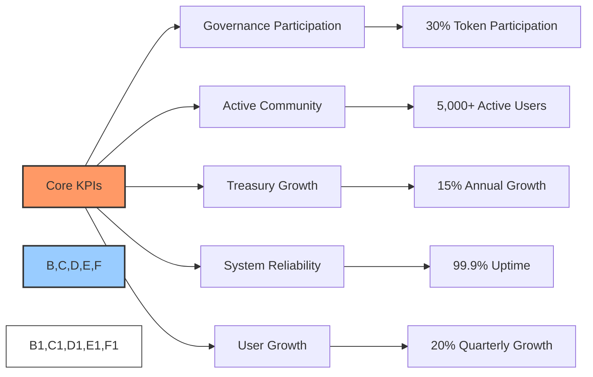
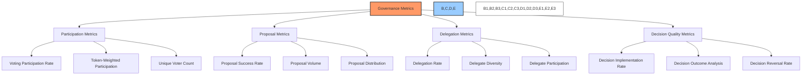
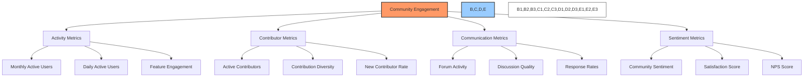
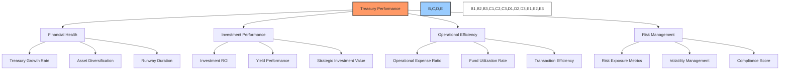
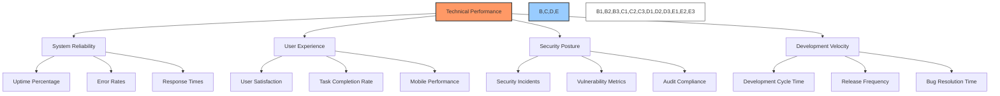
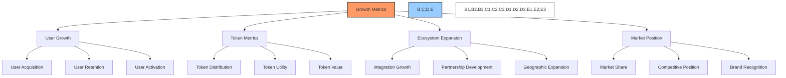
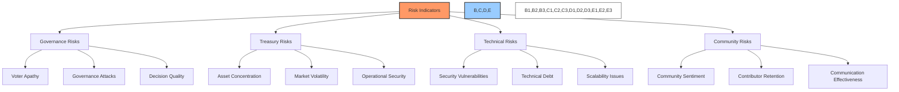

```mermaid
graph TD
    A[Reporting Framework] --> B[Data Collection]
    A --> C[Analysis Methods]
    A --> D[Reporting Cadence]
    A --> E[Transparency Practices]
    
    B --> B1[On-chain Data]
    B --> B2[Platform Analytics]
    B --> B3[User Feedback]
    B --> B4[Market Data]
    
    C --> C1[Quantitative Analysis]
    C --> C2[Qualitative Assessment]
    C --> C3[Comparative Benchmarking]
    C --> C4[Trend Analysis]
    
    D --> D1[Real-time Dashboards]
    D --> D2[Weekly Summaries]
    D --> D3[Monthly Reports]
    D --> D4[Quarterly Reviews]
    
    E --> E1[Public Dashboards]
    E --> E2[Community Reports]
    E --> E3[Governance Discussions]
    E --> E4[Data Accessibility]
    
    style A fill:#f96,stroke:#333,stroke-width:2px
    style B,C,D,E fill:#9cf,stroke:#333,stroke-width:2px
    style B1,B2,B3,B4,C1,C2,C3,C4,D1,D2,D3,D4,E1,E2,E3,E4 fill:#fff,stroke:#333,stroke-width:1px
```

# 📊 BAD DAO: Success Metrics

## 📋 Table of Contents
- [🔍 Overview](#-overview)
- [🎯 Key Performance Indicators](#-key-performance-indicators)
- [🏛️ Governance Metrics](#-governance-metrics)
- [👥 Community Engagement Metrics](#-community-engagement-metrics)
- [💰 Treasury Performance Metrics](#-treasury-performance-metrics)
- [🔧 Technical Performance Metrics](#-technical-performance-metrics)
- [📈 Growth Metrics](#-growth-metrics)
- [📉 Risk Indicators](#-risk-indicators)
- [📊 Reporting Framework](#-reporting-framework)

## 🔍 Overview

This document defines the comprehensive success metrics for evaluating the BAD DAO governance implementation. It establishes measurable criteria across governance participation, community engagement, treasury management, technical performance, and growth. These metrics will be used to track progress, identify areas for improvement, and guide strategic decisions.

```mermaid
graph TD
    A[BAD DAO Success Metrics] --> B[Governance Health]
    A --> C[Community Vitality]
    A --> D[Treasury Effectiveness]
    A --> E[Technical Performance]
    A --> F[Growth Trajectory]
    
    B --> B1[Participation Rates]
    B --> B2[Proposal Quality]
    B --> B3[Delegation Effectiveness]
    
    C --> C1[Active Users]
    C --> C2[Contributor Growth]
    C --> C3[Engagement Depth]
    
    D --> D1[Treasury Growth]
    D --> D2[Fund Utilization]
    D --> D3[ROI on Investments]
    
    E --> E1[System Reliability]
    E --> E2[Performance Metrics]
    E --> E3[Security Posture]
    
    F --> F1[User Growth]
    F --> F2[Token Metrics]
    F --> F3[Ecosystem Expansion]
    
    style A fill:#f96,stroke:#333,stroke-width:2px
    style B,C,D,E,F fill:#9cf,stroke:#333,stroke-width:2px
    style B1,B2,B3,C1,C2,C3,D1,D2,D3,E1,E2,E3,F1,F2,F3 fill:#fff,stroke:#333,stroke-width:1px
```

The success metrics are organized into five core categories, each with specific key performance indicators (KPIs) and targets. These metrics will be tracked over time to measure progress and identify trends, with regular reporting to all stakeholders.

## 🎯 Key Performance Indicators

The following high-level KPIs represent the most critical success metrics for the BAD DAO:

| KPI | Target | Timeframe | Measurement Method |
|-----|--------|-----------|-------------------|
| Governance Participation | 30% of token supply | By Q3 2023 | On-chain voting data |
| Active Community | 5,000+ monthly active users | By Q4 2023 | Platform analytics |
| Treasury Growth | 15% annual growth rate | Annual | Financial reporting |
| System Reliability | 99.9% uptime | Continuous | System monitoring |
| User Growth | 20% quarter-over-quarter | Quarterly | User registration data |

These core KPIs provide a high-level overview of the BAD DAO's success, with detailed metrics in each category providing deeper insights into specific aspects of performance.

## 🏛️ Governance Metrics

### 📊 Participation Metrics

| Metric | Description | Target | Frequency |
|--------|-------------|--------|-----------|
| Voting Participation Rate | Percentage of total token supply participating in votes | 30%+ | Per proposal |
| Token-Weighted Participation | Distribution of voting by token holder size | <50% from top 10 holders | Per proposal |
| Unique Voter Count | Number of unique addresses participating in governance | 500+ | Monthly |
| Voter Retention | Percentage of voters who participate in consecutive proposals | 70%+ | Monthly |
| First-Time Voter Rate | Percentage of voters participating for the first time | 10%+ | Monthly |

### 📝 Proposal Metrics

| Metric | Description | Target | Frequency |
|--------|-------------|--------|-----------|
| Proposal Success Rate | Percentage of proposals that pass | 70-80% | Quarterly |
| Proposal Volume | Number of proposals submitted | 10+ | Monthly |
| Proposal Distribution | Distribution of proposals across categories | Even distribution | Quarterly |
| Proposal Quality | Score based on completeness, feasibility, and impact | 8/10 average | Per proposal |
| Proposer Diversity | Number of unique proposers | 20+ | Quarterly |

### 🤝 Delegation Metrics

| Metric | Description | Target | Frequency |
|--------|-------------|--------|-----------|
| Delegation Rate | Percentage of token supply delegated | 40%+ | Monthly |
| Delegate Count | Number of active delegates | 50+ | Monthly |
| Delegate Concentration | Percentage of delegated tokens held by top 10 delegates | <60% | Monthly |
| Delegate Participation | Percentage of delegates voting on proposals | 90%+ | Per proposal |
| Delegate Performance | Score based on voting participation and alignment | 8/10 average | Monthly |

### ⚖️ Decision Quality Metrics

| Metric | Description | Target | Frequency |
|--------|-------------|--------|-----------|
| Implementation Rate | Percentage of passed proposals successfully implemented | 95%+ | Quarterly |
| Decision Impact Analysis | Qualitative assessment of proposal outcomes | Positive rating | Per proposal |
| Decision Time | Average time from proposal submission to execution | <14 days | Monthly |
| Consensus Level | Average margin of approval for passed proposals | 65%+ | Monthly |
| Decision Reversal Rate | Percentage of decisions later reversed or modified | <5% | Quarterly |

## 👥 Community Engagement Metrics

### 👥 Activity Metrics

| Metric | Description | Target | Frequency |
|--------|-------------|--------|-----------|
| Monthly Active Users | Unique users interacting with the platform | 5,000+ | Monthly |
| Daily Active Users | Unique users interacting daily | 1,000+ | Daily |
| Feature Engagement | Usage rates for different platform features | Even distribution | Monthly |
| Session Duration | Average time spent on the platform | 10+ minutes | Weekly |
| Return Rate | Percentage of users returning within 7 days | 60%+ | Weekly |

### 🛠️ Contributor Metrics

| Metric | Description | Target | Frequency |
|--------|-------------|--------|-----------|
| Active Contributors | Number of community members actively contributing | 100+ | Monthly |
| Contribution Types | Distribution across development, content, moderation, etc. | Even distribution | Quarterly |
| New Contributor Rate | New community members becoming contributors | 10+ | Monthly |
| Contributor Retention | Percentage of contributors remaining active | 80%+ | Quarterly |
| Contribution Impact | Assessment of contribution value and impact | High rating | Quarterly |

### 💬 Communication Metrics

| Metric | Description | Target | Frequency |
|--------|-------------|--------|-----------|
| Forum Activity | Number of posts and comments in governance forums | 1,000+ | Monthly |
| Discussion Quality | Assessment of discussion depth and relevance | High rating | Monthly |
| Response Time | Average time to respond to community questions | <24 hours | Weekly |
| Communication Reach | Percentage of community reached by communications | 80%+ | Monthly |
| Event Participation | Attendance at community events and calls | 200+ | Per event |

### 😊 Sentiment Metrics

| Metric | Description | Target | Frequency |
|--------|-------------|--------|-----------|
| Community Sentiment | Analysis of sentiment in community discussions | Positive | Weekly |
| Satisfaction Score | Survey-based satisfaction rating | 8/10+ | Quarterly |
| Net Promoter Score | Likelihood to recommend BAD DAO | 50+ | Quarterly |
| Trust Score | Perceived trustworthiness of governance process | 8/10+ | Quarterly |
| Feedback Implementation | Percentage of community feedback addressed | 70%+ | Quarterly |

## 💰 Treasury Performance Metrics

### 💵 Financial Health Metrics

| Metric | Description | Target | Frequency |
|--------|-------------|--------|-----------|
| Treasury Growth Rate | Annual percentage growth in treasury value | 15%+ | Annual |
| Asset Diversification | Distribution across asset classes | <30% in any single asset | Monthly |
| Runway Duration | Operational months supported by treasury | 36+ months | Quarterly |
| Treasury Size | Total value of treasury assets | $10M+ | Monthly |
| Revenue Growth | Increase in protocol revenue sources | 20%+ | Annual |

### 📈 Investment Performance Metrics

| Metric | Description | Target | Frequency |
|--------|-------------|--------|-----------|
| Investment ROI | Return on strategic investments | 20%+ | Annual |
| Yield Performance | Return on yield-generating assets | 5%+ | Monthly |
| Strategic Value Creation | Qualitative assessment of strategic investment value | High rating | Quarterly |
| Liquidity Pool Performance | Returns from liquidity provision | 10%+ | Monthly |
| Token Performance | BAD token value growth and stability | >Market average | Monthly |

### ⚙️ Operational Efficiency Metrics

| Metric | Description | Target | Frequency |
|--------|-------------|--------|-----------|
| Operational Expense Ratio | Expenses as percentage of treasury value | <5% | Annual |
| Fund Utilization Rate | Percentage of allocated funds utilized effectively | 90%+ | Quarterly |
| Transaction Efficiency | Gas and fee optimization for treasury operations | <0.1% of transaction value | Monthly |
| Budget Adherence | Adherence to approved budgets | ±10% variance | Quarterly |
| Processing Time | Time to process approved treasury transactions | <48 hours | Per transaction |

### ⚠️ Risk Management Metrics

| Metric | Description | Target | Frequency |
|--------|-------------|--------|-----------|
| Risk Exposure Score | Composite score of treasury risk exposure | Low rating | Monthly |
| Volatility Management | Effectiveness of treasury in managing volatility | <15% drawdown | Quarterly |
| Compliance Score | Adherence to governance controls and policies | 100% | Monthly |
| Security Incidents | Number of security incidents or near-misses | 0 | Monthly |
| Recovery Preparedness | Readiness for adverse financial scenarios | High rating | Quarterly |

## 🔧 Technical Performance Metrics

### 🔄 System Reliability Metrics

| Metric | Description | Target | Frequency |
|--------|-------------|--------|-----------|
| System Uptime | Percentage of time the system is operational | 99.9%+ | Monthly |
| Error Rate | Percentage of system operations resulting in errors | <0.1% | Daily |
| Transaction Success Rate | Percentage of blockchain transactions completed successfully | 99.5%+ | Daily |
| API Response Time | Average response time for API requests | <200ms | Daily |
| Page Load Time | Average page load time for web applications | <2 seconds | Daily |

### 🖥️ User Experience Metrics

| Metric | Description | Target | Frequency |
|--------|-------------|--------|-----------|
| User Satisfaction | Survey-based rating of user interface | 8/10+ | Quarterly |
| Task Completion Rate | Percentage of initiated user tasks completed successfully | 95%+ | Weekly |
| Mobile Usability | Performance and satisfaction on mobile devices | High rating | Monthly |
| Accessibility Compliance | Compliance with WCAG 2.1 AA standards | 100% | Quarterly |
| User Interface Errors | Number of UI-related error reports | <10 | Monthly |

### 🔒 Security Metrics

| Metric | Description | Target | Frequency |
|--------|-------------|--------|-----------|
| Security Incidents | Number of confirmed security incidents | 0 | Monthly |
| Vulnerability Resolution | Time to resolve identified vulnerabilities | <24 hours (critical) | Per incident |
| Audit Findings | Number of findings in security audits | 0 critical or high | Per audit |
| Security Test Coverage | Percentage of code covered by security testing | 100% | Quarterly |
| Authentication Failures | Number of suspicious authentication attempts | <10 | Weekly |

### 🚀 Development Metrics

| Metric | Description | Target | Frequency |
|--------|-------------|--------|-----------|
| Development Cycle Time | Average time from feature request to deployment | <4 weeks | Per feature |
| Release Frequency | Number of production releases | 2+ | Monthly |
| Bug Resolution Time | Average time to resolve reported bugs | <48 hours | Per bug |
| Test Coverage | Percentage of code covered by automated tests | 95%+ | Per release |
| Technical Debt | Assessment of codebase quality and maintenance | Low rating | Quarterly |

## 📈 Growth Metrics

### 👥 User Growth Metrics

| Metric | Description | Target | Frequency |
|--------|-------------|--------|-----------|
| New User Growth | Number of new users onboarded | 20%+ | Quarterly |
| User Retention | Percentage of users remaining active | 70%+ | Quarterly |
| User Activation | Percentage of new users completing key actions | 50%+ | Monthly |
| User Acquisition Cost | Resources expended per new user acquisition | Decreasing trend | Quarterly |
| User Lifetime Value | Estimated value contribution of average user | Increasing trend | Quarterly |

### 🪙 Token Metrics

| Metric | Description | Target | Frequency |
|--------|-------------|--------|-----------|
| Token Distribution | Gini coefficient of token distribution | <0.6 | Quarterly |
| Token Velocity | Rate at which tokens change hands | Healthy range | Monthly |
| Token Utility | Usage of tokens for governance and utility | Increasing trend | Monthly |
| Token Holder Growth | Growth in number of token holders | 15%+ | Quarterly |
| Token Economic Health | Composite assessment of token economy | Positive rating | Quarterly |

### 🌐 Ecosystem Expansion Metrics

| Metric | Description | Target | Frequency |
|--------|-------------|--------|-----------|
| Integration Count | Number of protocol integrations | 5+ new | Quarterly |
| Partnership Growth | Number of active partnerships | 3+ new | Quarterly |
| Geographic Distribution | Distribution of users across regions | Global presence | Quarterly |
| Ecosystem Contribution | Value contributed to broader ecosystem | Increasing trend | Annual |
| Developer Adoption | External developers building on the protocol | 10+ | Quarterly |

### 🏆 Market Position Metrics

| Metric | Description | Target | Frequency |
|--------|-------------|--------|-----------|
| Market Share | Share within target market segment | Top 5 position | Annual |
| Competitive Advantage | Assessment of unique value proposition | Strong rating | Quarterly |
| Brand Recognition | Awareness and perception metrics | Increasing trend | Quarterly |
| Media Coverage | Quantity and quality of media mentions | Positive coverage | Monthly |
| Industry Influence | Impact on industry standards and practices | Thought leadership | Annual |

## 📉 Risk Indicators

### 🚨 Key Risk Indicators

| Risk Area | Indicator | Alert Threshold | Monitoring Frequency |
|-----------|-----------|-----------------|---------------------|
| **Governance** | Voting participation | <15% for 3 consecutive proposals | Per proposal |
| **Governance** | Voter concentration | >70% from top 5 holders | Monthly |
| **Governance** | Proposal rejection rate | >50% for 3 months | Monthly |
| **Treasury** | Asset concentration | >40% in single asset | Weekly |
| **Treasury** | Value fluctuation | >30% in 30 days | Daily |
| **Treasury** | Runway reduction | <24 months | Monthly |
| **Technical** | Critical vulnerabilities | Any unresolved | Daily |
| **Technical** | System downtime | >1 hour | Real-time |
| **Technical** | Failed transactions | >5% for 24 hours | Daily |
| **Community** | Active user decline | >15% month-over-month | Weekly |
| **Community** | Negative sentiment | >40% negative for 7 days | Daily |
| **Community** | Contributor departures | >10% in 30 days | Monthly |

### 🔍 Risk Assessment Process

1. **Regular Monitoring**
   - Automated tracking of risk indicators
   - Daily dashboard review by responsible teams
   - Weekly risk assessment meetings

2. **Escalation Protocol**
   - Alert triggers for threshold breaches
   - Defined escalation paths based on severity
   - Emergency response procedures for critical risks

3. **Mitigation Planning**
   - Documented mitigation strategies for common risks
   - Regular review and updating of mitigation plans
   - Resource allocation for risk management

4. **Reporting and Transparency**
   - Regular risk reports to governance community
   - Transparent communication about identified risks
   - Post-incident analysis and learning

## 📊 Reporting Framework

### 📊 Data Collection Methods

1. **On-chain Data**
   - Blockchain transaction analysis
   - Smart contract event tracking
   - Token transfer monitoring
   - Voting pattern analysis

2. **Platform Analytics**
   - User behavior tracking
   - Feature usage statistics
   - Performance metrics
   - Error and exception logging

3. **User Feedback**
   - Surveys and questionnaires
   - User interviews
   - Forum and community discussions
   - Support ticket analysis

4. **Market Data**
   - Token price and volume tracking
   - Competitive analysis
   - Industry benchmarking
   - Macroeconomic indicators

### 📈 Analysis Methodologies

1. **Quantitative Analysis**
   - Statistical analysis of metrics
   - Trend identification and forecasting
   - Correlation and causation studies
   - Anomaly detection

2. **Qualitative Assessment**
   - User experience evaluation
   - Community sentiment analysis
   - Content quality assessment
   - Strategic alignment evaluation

3. **Benchmarking**
   - Internal historical comparisons
   - Industry standard comparisons
   - Competitive positioning
   - Best practice evaluations

4. **Integration Analysis**
   - Cross-metric correlations
   - Holistic performance assessment
   - Impact analysis of initiatives
   - Root cause identification for issues

### 📋 Reporting Schedule

| Report Type | Frequency | Audience | Purpose |
|-------------|-----------|----------|---------|
| Executive Dashboard | Real-time | Core Team | Day-to-day monitoring and alerts |
| Operations Report | Weekly | Core Team | Operational performance and issues |
| Community Update | Bi-weekly | All Users | Transparent progress sharing |
| Governance Report | Monthly | Token Holders | Governance participation and decisions |
| Treasury Report | Monthly | Token Holders | Treasury performance and allocations |
| Comprehensive Review | Quarterly | All Stakeholders | Overall health and strategic direction |
| Annual Assessment | Yearly | All Stakeholders | Year-in-review and forward strategy |

### 🌐 Public Transparency

1. **Public Dashboards**
   - Real-time governance statistics
   - Treasury composition and performance
   - System health and reliability metrics
   - Community growth and engagement data

2. **Regular Community Reports**
   - Monthly governance summaries
   - Quarterly performance reviews
   - Annual state of the DAO reports
   - Special reports for significant events

3. **Open Data Access**
   - API access to non-sensitive metrics
   - Downloadable datasets for analysis
   - Open source analytics tools
   - Community-led research initiatives

---

*This document outlines the comprehensive success metrics for the BAD DAO governance system. It serves as the framework for measuring performance, identifying improvements, and guiding strategic decisions. The metrics will be regularly reviewed and refined as the DAO evolves.*

*Version: 1.0*  
*Last Updated: June 2023*  
*Document Owner: BAD DAO Core Team* 