# 🔧 BAD DAO: Technical Implementation

## 📋 Table of Contents
- [🔍 Overview](#-overview)
- [📐 Smart Contract Architecture](#-smart-contract-architecture)
- [🔐 Security Model](#-security-model)
- [📡 External Integrations](#-external-integrations)
- [🚀 Deployment Guide](#-deployment-guide)
- [🧪 Testing Framework](#-testing-framework)

## 🔍 Overview

This document outlines the technical implementation of the BAD DAO governance system, including smart contract architecture, security considerations, external integrations, deployment procedures, and testing framework. It serves as the definitive technical reference for developers working with the BAD DAO ecosystem.

```mermaid
graph TD
    A[🔧 BAD DAO Technical Stack] --> B[📜 Smart Contracts]
    A --> C[🌐 Frontend Interface]
    A --> D[📊 Indexing & Analytics]
    A --> E[🔄 External Integrations]
    
    B --> B1[BAD Token]
    B --> B2[Governance]
    B --> B3[Treasury]
    B --> B4[Vesting]
    
    C --> C1[Governance Dashboard]
    C --> C2[Voting Interface]
    C --> C3[Delegation Portal]
    C --> C4[Treasury Management]
    
    D --> D1[Proposal Tracking]
    D --> D2[Voting Analytics]
    D --> D3[Treasury Monitoring]
    D --> D4[Activity Dashboard]
    
    E --> E1[Snapshot Integration]
    E --> E2[Thirdweb SDK]
    E --> E3[Wallet Connections]
    E --> E4[Data Providers]
    
    style A fill:#f96,stroke:#333,stroke-width:2px
    style B,C,D,E fill:#9cf,stroke:#333,stroke-width:2px
    style B1,B2,B3,B4,C1,C2,C3,C4,D1,D2,D3,D4,E1,E2,E3,E4 fill:#fff,stroke:#333,stroke-width:1px
```



## 📐 Smart Contract Architecture

The BAD DAO smart contract architecture consists of several interconnected contracts that handle token management, governance processes, treasury control, and vesting schedules. The system is designed with modularity, security, and extensibility as primary considerations.

### 🪙 BAD Token Contract

```solidity
// SPDX-License-Identifier: MIT
pragma solidity ^0.8.9;

import "@openzeppelin/contracts/token/ERC20/ERC20.sol";
import "@openzeppelin/contracts/token/ERC20/extensions/ERC20Votes.sol";
import "@openzeppelin/contracts/access/AccessControl.sol";

contract BADToken is ERC20, ERC20Votes, AccessControl {
    bytes32 public constant MINTER_ROLE = keccak256("MINTER_ROLE");
    bytes32 public constant GOVERNANCE_ROLE = keccak256("GOVERNANCE_ROLE");
    
    uint256 public constant MAX_SUPPLY = 100_000_000 * 10**18; // 100 million tokens
    
    constructor() ERC20("BAD DAO Token", "BAD") ERC20Permit("BAD DAO Token") {
        _grantRole(DEFAULT_ADMIN_ROLE, msg.sender);
        _grantRole(MINTER_ROLE, msg.sender);
    }
    
    function mint(address to, uint256 amount) external onlyRole(MINTER_ROLE) {
        require(totalSupply() + amount <= MAX_SUPPLY, "Exceeds maximum supply");
        _mint(to, amount);
    }
    
    // Override required functions for ERC20Votes compatibility
    function _afterTokenTransfer(address from, address to, uint256 amount) internal override(ERC20, ERC20Votes) {
        super._afterTokenTransfer(from, to, amount);
    }
    
    function _mint(address to, uint256 amount) internal override(ERC20, ERC20Votes) {
        super._mint(to, amount);
    }
    
    function _burn(address account, uint256 amount) internal override(ERC20, ERC20Votes) {
        super._burn(account, amount);
    }
}
```

### 🏛️ Governance Contract

```solidity
// SPDX-License-Identifier: MIT
pragma solidity ^0.8.9;

import "@openzeppelin/contracts/governance/Governor.sol";
import "@openzeppelin/contracts/governance/extensions/GovernorSettings.sol";
import "@openzeppelin/contracts/governance/extensions/GovernorCountingSimple.sol";
import "@openzeppelin/contracts/governance/extensions/GovernorVotes.sol";
import "@openzeppelin/contracts/governance/extensions/GovernorVotesQuorumFraction.sol";
import "@openzeppelin/contracts/governance/extensions/GovernorTimelockControl.sol";

contract BADGovernor is Governor, GovernorSettings, GovernorCountingSimple, GovernorVotes, 
                       GovernorVotesQuorumFraction, GovernorTimelockControl {
    constructor(
        IVotes _token,
        TimelockController _timelock,
        uint256 _votingDelay,
        uint256 _votingPeriod,
        uint256 _proposalThreshold,
        uint256 _quorumNumerator
    )
        Governor("BAD Governor")
        GovernorSettings(_votingDelay, _votingPeriod, _proposalThreshold)
        GovernorVotes(_token)
        GovernorVotesQuorumFraction(_quorumNumerator)
        GovernorTimelockControl(_timelock)
    {}

    // Override required functions
    function votingDelay() public view override(IGovernor, GovernorSettings) returns (uint256) {
        return super.votingDelay();
    }

    function votingPeriod() public view override(IGovernor, GovernorSettings) returns (uint256) {
        return super.votingPeriod();
    }

    function quorum(uint256 blockNumber) public view override(IGovernor, GovernorVotesQuorumFraction) returns (uint256) {
        return super.quorum(blockNumber);
    }

    function state(uint256 proposalId) public view override(Governor, GovernorTimelockControl) returns (ProposalState) {
        return super.state(proposalId);
    }

    function propose(
        address[] memory targets,
        uint256[] memory values,
        bytes[] memory calldatas,
        string memory description
    ) public override(Governor, IGovernor) returns (uint256) {
        return super.propose(targets, values, calldatas, description);
    }

    function proposalThreshold() public view override(Governor, GovernorSettings) returns (uint256) {
        return super.proposalThreshold();
    }

    function _execute(
        uint256 proposalId,
        address[] memory targets,
        uint256[] memory values,
        bytes[] memory calldatas,
        bytes32 descriptionHash
    ) internal override(Governor, GovernorTimelockControl) {
        super._execute(proposalId, targets, values, calldatas, descriptionHash);
    }

    function _cancel(
        address[] memory targets,
        uint256[] memory values,
        bytes[] memory calldatas,
        bytes32 descriptionHash
    ) internal override(Governor, GovernorTimelockControl) returns (uint256) {
        return super._cancel(targets, values, calldatas, descriptionHash);
    }

    function _executor() internal view override(Governor, GovernorTimelockControl) returns (address) {
        return super._executor();
    }

    function supportsInterface(bytes4 interfaceId) public view override(Governor, GovernorTimelockControl) returns (bool) {
        return super.supportsInterface(interfaceId);
    }
}
```

### ⏱️ Timelock Contract

```solidity
// SPDX-License-Identifier: MIT
pragma solidity ^0.8.9;

import "@openzeppelin/contracts/governance/TimelockController.sol";

contract BADTimelock is TimelockController {
    constructor(
        uint256 minDelay,
        address[] memory proposers,
        address[] memory executors,
        address admin
    ) TimelockController(minDelay, proposers, executors, admin) {}
}
```

### 💰 Treasury Contract

```solidity
// SPDX-License-Identifier: MIT
pragma solidity ^0.8.9;

import "@openzeppelin/contracts/access/AccessControl.sol";
import "@openzeppelin/contracts/token/ERC20/IERC20.sol";
import "@openzeppelin/contracts/token/ERC20/utils/SafeERC20.sol";

contract BADTreasury is AccessControl {
    using SafeERC20 for IERC20;
    
    bytes32 public constant GOVERNANCE_ROLE = keccak256("GOVERNANCE_ROLE");
    bytes32 public constant EXECUTOR_ROLE = keccak256("EXECUTOR_ROLE");
    
    event FundsReleased(address token, address recipient, uint256 amount);
    event EthReleased(address recipient, uint256 amount);
    
    constructor(address governance) {
        _grantRole(DEFAULT_ADMIN_ROLE, governance);
        _grantRole(GOVERNANCE_ROLE, governance);
    }
    
    function releaseFunds(address token, address recipient, uint256 amount) external onlyRole(EXECUTOR_ROLE) {
        IERC20(token).safeTransfer(recipient, amount);
        emit FundsReleased(token, recipient, amount);
    }
    
    function releaseEth(address payable recipient, uint256 amount) external onlyRole(EXECUTOR_ROLE) {
        (bool success, ) = recipient.call{value: amount}("");
        require(success, "ETH transfer failed");
        emit EthReleased(recipient, amount);
    }
    
    receive() external payable {}
}
```

### ⏳ Vesting Contract

```solidity
// SPDX-License-Identifier: MIT
pragma solidity ^0.8.9;

import "@openzeppelin/contracts/token/ERC20/IERC20.sol";
import "@openzeppelin/contracts/token/ERC20/utils/SafeERC20.sol";
import "@openzeppelin/contracts/access/AccessControl.sol";
import "@openzeppelin/contracts/security/ReentrancyGuard.sol";

contract BADVesting is AccessControl, ReentrancyGuard {
    using SafeERC20 for IERC20;
    
    struct VestingSchedule {
        uint256 totalAmount;
        uint256 claimedAmount;
        uint256 startTime;
        uint256 cliffDuration;
        uint256 duration;
        bool revocable;
        bool revoked;
    }
    
    IERC20 public immutable token;
    
    bytes32 public constant GOVERNANCE_ROLE = keccak256("GOVERNANCE_ROLE");
    
    mapping(address => VestingSchedule) public vestingSchedules;
    
    event ScheduleCreated(address beneficiary, uint256 amount, uint256 startTime, uint256 cliffDuration, uint256 duration, bool revocable);
    event TokensClaimed(address beneficiary, uint256 amount);
    event ScheduleRevoked(address beneficiary, uint256 returnedAmount);
    
    constructor(address tokenAddress) {
        token = IERC20(tokenAddress);
        _grantRole(DEFAULT_ADMIN_ROLE, msg.sender);
        _grantRole(GOVERNANCE_ROLE, msg.sender);
    }
    
    function createVestingSchedule(
        address beneficiary,
        uint256 amount,
        uint256 startTime,
        uint256 cliffDuration,
        uint256 duration,
        bool revocable
    ) external onlyRole(GOVERNANCE_ROLE) {
        require(beneficiary != address(0), "Beneficiary cannot be zero address");
        require(vestingSchedules[beneficiary].totalAmount == 0, "Vesting schedule already exists");
        require(amount > 0, "Amount must be greater than zero");
        require(duration > 0, "Duration must be greater than zero");
        require(duration >= cliffDuration, "Duration must be greater than cliff");
        
        token.safeTransferFrom(msg.sender, address(this), amount);
        
        vestingSchedules[beneficiary] = VestingSchedule({
            totalAmount: amount,
            claimedAmount: 0,
            startTime: startTime,
            cliffDuration: cliffDuration,
            duration: duration,
            revocable: revocable,
            revoked: false
        });
        
        emit ScheduleCreated(beneficiary, amount, startTime, cliffDuration, duration, revocable);
    }
    
    function claimVestedTokens() external nonReentrant {
        VestingSchedule storage schedule = vestingSchedules[msg.sender];
        require(schedule.totalAmount > 0, "No vesting schedule found");
        require(!schedule.revoked, "Vesting schedule revoked");
        
        uint256 vestedAmount = calculateVestedAmount(msg.sender);
        uint256 claimableAmount = vestedAmount - schedule.claimedAmount;
        
        require(claimableAmount > 0, "No tokens to claim");
        
        schedule.claimedAmount += claimableAmount;
        token.safeTransfer(msg.sender, claimableAmount);
        
        emit TokensClaimed(msg.sender, claimableAmount);
    }
    
    function revokeVestingSchedule(address beneficiary) external onlyRole(GOVERNANCE_ROLE) {
        VestingSchedule storage schedule = vestingSchedules[beneficiary];
        require(schedule.totalAmount > 0, "No vesting schedule found");
        require(!schedule.revoked, "Vesting already revoked");
        require(schedule.revocable, "Schedule is not revocable");
        
        uint256 vestedAmount = calculateVestedAmount(beneficiary);
        uint256 returnedAmount = schedule.totalAmount - vestedAmount;
        
        schedule.revoked = true;
        
        if (returnedAmount > 0) {
            token.safeTransfer(msg.sender, returnedAmount);
        }
        
        emit ScheduleRevoked(beneficiary, returnedAmount);
    }
    
    function calculateVestedAmount(address beneficiary) public view returns (uint256) {
        VestingSchedule memory schedule = vestingSchedules[beneficiary];
        
        if (schedule.revoked || block.timestamp < schedule.startTime) {
            return 0;
        }
        
        if (block.timestamp < schedule.startTime + schedule.cliffDuration) {
            return 0;
        }
        
        if (block.timestamp >= schedule.startTime + schedule.duration) {
            return schedule.totalAmount;
        }
        
        uint256 timeFromStart = block.timestamp - schedule.startTime;
        return (schedule.totalAmount * timeFromStart) / schedule.duration;
    }
    
    function getVestingSchedule(address beneficiary) external view returns (
        uint256 totalAmount,
        uint256 claimedAmount,
        uint256 vestedAmount,
        uint256 startTime,
        uint256 cliffEnd,
        uint256 endTime,
        bool revocable,
        bool revoked
    ) {
        VestingSchedule memory schedule = vestingSchedules[beneficiary];
        return (
            schedule.totalAmount,
            schedule.claimedAmount,
            calculateVestedAmount(beneficiary),
            schedule.startTime,
            schedule.startTime + schedule.cliffDuration,
            schedule.startTime + schedule.duration,
            schedule.revocable,
            schedule.revoked
        );
    }
}
```

### 🔄 Delegation Contract

```solidity
// SPDX-License-Identifier: MIT
pragma solidity ^0.8.9;

import "@openzeppelin/contracts/token/ERC20/extensions/ERC20Votes.sol";
import "@openzeppelin/contracts/access/AccessControl.sol";
import "@openzeppelin/contracts/security/ReentrancyGuard.sol";

contract BADDelegation is AccessControl, ReentrancyGuard {
    struct DelegateInfo {
        uint256 totalDelegated;
        uint256 lastActivityBlock;
        uint256 reputationScore;
        bool isActive;
    }
    
    struct DelegatorInfo {
        address delegate;
        uint256 amount;
        uint256 startTime;
        uint256 lockDuration;
    }
    
    ERC20Votes public immutable token;
    
    bytes32 public constant GOVERNANCE_ROLE = keccak256("GOVERNANCE_ROLE");
    bytes32 public constant REPUTATION_MANAGER_ROLE = keccak256("REPUTATION_MANAGER_ROLE");
    
    mapping(address => DelegateInfo) public delegates;
    mapping(address => DelegatorInfo) public delegators;
    
    uint256 public minLockDuration = 7 days;
    uint256 public maxDelegationCap;
    
    event DelegationCreated(address delegator, address delegate, uint256 amount, uint256 lockDuration);
    event DelegationRemoved(address delegator, address delegate, uint256 amount);
    event DelegateRegistered(address delegate);
    event DelegateDeactivated(address delegate);
    event ReputationUpdated(address delegate, uint256 newScore);
    
    constructor(address tokenAddress, uint256 _maxDelegationCap) {
        token = ERC20Votes(tokenAddress);
        maxDelegationCap = _maxDelegationCap;
        _grantRole(DEFAULT_ADMIN_ROLE, msg.sender);
        _grantRole(GOVERNANCE_ROLE, msg.sender);
        _grantRole(REPUTATION_MANAGER_ROLE, msg.sender);
    }
    
    function registerAsDelegate() external {
        require(!delegates[msg.sender].isActive, "Already registered as delegate");
        
        delegates[msg.sender] = DelegateInfo({
            totalDelegated: 0,
            lastActivityBlock: block.number,
            reputationScore: 50, // Starting reputation score
            isActive: true
        });
        
        emit DelegateRegistered(msg.sender);
    }
    
    function deactivateDelegate() external {
        require(delegates[msg.sender].isActive, "Not an active delegate");
        delegates[msg.sender].isActive = false;
        emit DelegateDeactivated(msg.sender);
    }
    
    function delegate(address delegateAddr, uint256 amount, uint256 lockDuration) external nonReentrant {
        require(delegates[delegateAddr].isActive, "Delegate not active");
        require(delegators[msg.sender].amount == 0, "Already delegating");
        require(amount > 0, "Amount must be greater than zero");
        require(lockDuration >= minLockDuration, "Lock duration too short");
        require(delegates[delegateAddr].totalDelegated + amount <= maxDelegationCap, "Exceeds delegation cap");
        
        // Delegate voting power through the token contract
        token.delegate(delegateAddr);
        
        // Update delegation info
        delegators[msg.sender] = DelegatorInfo({
            delegate: delegateAddr,
            amount: amount,
            startTime: block.timestamp,
            lockDuration: lockDuration
        });
        
        delegates[delegateAddr].totalDelegated += amount;
        delegates[delegateAddr].lastActivityBlock = block.number;
        
        emit DelegationCreated(msg.sender, delegateAddr, amount, lockDuration);
    }
    
    function removeDelegation() external nonReentrant {
        DelegatorInfo memory info = delegators[msg.sender];
        require(info.amount > 0, "No active delegation");
        require(block.timestamp >= info.startTime + info.lockDuration, "Delegation still locked");
        
        // Clean up delegation records
        address delegateAddr = info.delegate;
        uint256 amount = info.amount;
        
        delete delegators[msg.sender];
        delegates[delegateAddr].totalDelegated -= amount;
        
        // Remove delegation in token contract
        token.delegate(address(0));
        
        emit DelegationRemoved(msg.sender, delegateAddr, amount);
    }
    
    function updateReputation(address delegate, uint256 newScore) external onlyRole(REPUTATION_MANAGER_ROLE) {
        require(delegates[delegate].isActive, "Delegate not active");
        require(newScore <= 100, "Score must be between 0-100");
        
        delegates[delegate].reputationScore = newScore;
        
        emit ReputationUpdated(delegate, newScore);
    }
    
    function canRemoveDelegation(address delegator) external view returns (bool) {
        DelegatorInfo memory info = delegators[delegator];
        return info.amount > 0 && block.timestamp >= info.startTime + info.lockDuration;
    }
    
    function setMinLockDuration(uint256 newDuration) external onlyRole(GOVERNANCE_ROLE) {
        minLockDuration = newDuration;
    }
    
    function setMaxDelegationCap(uint256 newCap) external onlyRole(GOVERNANCE_ROLE) {
        maxDelegationCap = newCap;
    }
}
```

## 🔐 Security Model

### 🛡️ Access Control

The BAD DAO smart contract system uses a role-based access control pattern to manage permissions:

| Role | Description | Contracts | Functions |
|------|-------------|-----------|-----------|
| DEFAULT_ADMIN_ROLE | Contract administrator | All | Role management |
| MINTER_ROLE | Can mint new tokens | BADToken | mint() |
| GOVERNANCE_ROLE | Can execute governance actions | All | Various governance functions |
| EXECUTOR_ROLE | Can execute treasury transactions | BADTreasury | releaseFunds(), releaseEth() |
| REPUTATION_MANAGER_ROLE | Can update delegate reputation | BADDelegation | updateReputation() |

### ⚠️ Risk Mitigation

1. **Time-lock Mechanisms**
   - All critical operations have appropriate time-locks
   - Graduated time-lock periods based on action impact
   - Time-lock cancellation capabilities for recovery

2. **Input Validation**
   - Extensive parameter verification in all functions
   - Safe math operations via Solidity 0.8+
   - Boundary checking on critical values

3. **Reentrancy Protection**
   - ReentrancyGuard applied to vulnerable functions
   - CEI (Checks-Effects-Interactions) pattern implementation
   - SafeERC20 for token transfers

### 🔒 Multisig Implementation

The BAD DAO uses multi-signature wallets for critical operations:


## 📡 External Integrations

### 🗳️ Snapshot Integration

The BAD DAO utilizes Snapshot for off-chain voting, with the following integration points:

```typescript
// Snapshot Integration Example
import { SnapshotStrategy } from '@snapshot-labs/snapshot.js';

const BAD_TOKEN_ADDRESS = '0x...'; // BAD token address

// Custom voting strategy for BAD token
const badTokenStrategy: SnapshotStrategy = {
  name: 'erc20-votes-with-override',
  params: {
    symbol: 'BAD',
    address: BAD_TOKEN_ADDRESS,
    decimals: 18
  }
};

// Implementing time-weighted voting
const timeWeightedStrategy: SnapshotStrategy = {
  name: 'weighted-erc20-votes',
  params: {
    symbol: 'BAD',
    address: BAD_TOKEN_ADDRESS,
    decimals: 18,
    weightMultipliers: [
      { minHoldingDays: 30, multiplier: 1.2 },
      { minHoldingDays: 90, multiplier: 1.5 },
      { minHoldingDays: 180, multiplier: 2.0 }
    ]
  }
};
```

### 🔗 Thirdweb Integration

The BAD DAO uses Thirdweb for token deployment and management:

```typescript
// Thirdweb Integration Example
import { ThirdwebSDK } from "@thirdweb-dev/sdk";

// Initialize Thirdweb SDK
const sdk = new ThirdwebSDK("ethereum");

// Deploy BAD token
const tokenAddress = await sdk.deployer.deployToken({
  name: "BAD DAO Token",
  symbol: "BAD",
  primary_sale_recipient: "0x...",
  platform_fee_recipient: "0x...",
  platform_fee_basis_points: 0,
});

// Mint tokens
const token = await sdk.getToken(tokenAddress);
await token.mint({
  to: "0x...",
  amount: 1000000, // 1 million tokens
});

// Deploy governance contracts
const governorAddress = await sdk.deployer.deployGovernor({
  name: "BAD DAO Governor",
  voting_token: tokenAddress,
  voting_delay_in_blocks: 1, // 1 block
  voting_period_in_blocks: 10000, // ~1.5 days
  proposal_threshold: 100000, // 100,000 tokens
  voting_quorum_fraction: 4, // 4%
});
```

### 📊 The Graph Integration

The BAD DAO uses The Graph for indexing and querying blockchain data:

```graphql
# BAD DAO Subgraph Schema
type Token @entity {
  id: ID!
  totalSupply: BigInt!
  holders: [TokenHolder!]! @derivedFrom(field: "token")
  transferEvents: [Transfer!]! @derivedFrom(field: "token")
}

type TokenHolder @entity {
  id: ID!
  token: Token!
  balance: BigInt!
  votingPower: BigInt!
  delegatedTo: TokenHolder
  delegatedFrom: [TokenHolder!]! @derivedFrom(field: "delegatedTo")
  votingHistory: [Vote!]! @derivedFrom(field: "voter")
}

type Proposal @entity {
  id: ID!
  proposer: TokenHolder!
  description: String!
  startBlock: BigInt!
  endBlock: BigInt!
  targets: [String!]!
  values: [BigInt!]!
  signatures: [String!]!
  calldatas: [Bytes!]!
  votes: [Vote!]! @derivedFrom(field: "proposal")
  state: ProposalState!
  quorum: BigInt!
  createTime: BigInt!
  updateTime: BigInt!
}

enum ProposalState {
  Pending
  Active
  Canceled
  Defeated
  Succeeded
  Queued
  Expired
  Executed
}

type Vote @entity {
  id: ID!
  proposal: Proposal!
  voter: TokenHolder!
  support: Int!
  weight: BigInt!
  reason: String
  timestamp: BigInt!
}

type Transfer @entity {
  id: ID!
  token: Token!
  from: TokenHolder!
  to: TokenHolder!
  amount: BigInt!
  timestamp: BigInt!
}
```

## 🚀 Deployment Guide

### 📝 Prerequisites

- Ethereum development environment
- Node.js v16+
- Private keys for deployer account
- Infura or Alchemy API key
- Thirdweb API key and account

### 🔄 Deployment Sequence


### ⚙️ Configuration Parameters

| Parameter | Value | Notes |
|-----------|-------|-------|
| Total Supply | 100,000,000 BAD | Maximum token supply |
| Initial Distribution | See allocation table | Distribution to various stakeholders |
| Voting Delay | 1 block | Blocks before voting starts |
| Voting Period | 40,320 blocks | Approximately 7 days |
| Proposal Threshold | 100,000 BAD | Minimum tokens to create proposal |
| Quorum | 4% | Minimum participation required |
| Timelock Minimum | 172800 seconds | 2 days for standard operations |
| Timelock Critical | 604800 seconds | 7 days for critical changes |
| Delegate Lock | 604800 seconds | 7 days minimum delegation |
| Treasury Access | Multi-tiered | Based on amount and purpose |

## 🧪 Testing Framework

### 🔍 Test Suite Organization


### 💻 Testing Tools

- **Hardhat**: Primary development and testing framework
- **Chai/Mocha**: Assertion and testing structure
- **Ethers.js**: Ethereum interaction library
- **Solidity Coverage**: Code coverage reporting
- **Slither/Mythril**: Static analysis security tools
- **Tenderly**: Transaction simulation and debugging

### 🧰 Example Test Cases

```typescript
// Example token test
describe("BADToken", function() {
  let token;
  let owner;
  let user1;
  let user2;
  
  beforeEach(async function() {
    [owner, user1, user2] = await ethers.getSigners();
    
    const TokenFactory = await ethers.getContractFactory("BADToken");
    token = await TokenFactory.deploy();
    await token.deployed();
  });
  
  it("Should have correct name and symbol", async function() {
    expect(await token.name()).to.equal("BAD DAO Token");
    expect(await token.symbol()).to.equal("BAD");
  });
  
  it("Should allow minting by minter role", async function() {
    await token.mint(user1.address, ethers.utils.parseEther("1000"));
    expect(await token.balanceOf(user1.address)).to.equal(ethers.utils.parseEther("1000"));
  });
  
  it("Should enforce max supply", async function() {
    const maxSupply = await token.MAX_SUPPLY();
    await expect(
      token.mint(user1.address, maxSupply.add(1))
    ).to.be.revertedWith("Exceeds maximum supply");
  });
  
  it("Should track voting power correctly", async function() {
    await token.mint(user1.address, ethers.utils.parseEther("1000"));
    await token.connect(user1).delegate(user1.address);
    
    const votingPower = await token.getVotes(user1.address);
    expect(votingPower).to.equal(ethers.utils.parseEther("1000"));
  });
});

// Example governance test
describe("BADGovernor", function() {
  let token;
  let timelock;
  let governor;
  let owner;
  let user1;
  let user2;
  
  beforeEach(async function() {
    [owner, user1, user2] = await ethers.getSigners();
    
    // Deploy token
    const TokenFactory = await ethers.getContractFactory("BADToken");
    token = await TokenFactory.deploy();
    await token.deployed();
    
    // Deploy timelock
    const TimelockFactory = await ethers.getContractFactory("BADTimelock");
    timelock = await TimelockFactory.deploy(
      172800, // 2 days
      [], 
      [],
      owner.address
    );
    await timelock.deployed();
    
    // Deploy governor
    const GovernorFactory = await ethers.getContractFactory("BADGovernor");
    governor = await GovernorFactory.deploy(
      token.address,
      timelock.address,
      1, // 1 block voting delay
      5760, // ~1 day voting period
      ethers.utils.parseEther("100000"), // 100k tokens to propose
      4 // 4% quorum
    );
    await governor.deployed();
    
    // Setup roles
    await timelock.grantRole(await timelock.PROPOSER_ROLE(), governor.address);
    await timelock.grantRole(await timelock.EXECUTOR_ROLE(), governor.address);
    
    // Mint tokens and delegate
    await token.mint(user1.address, ethers.utils.parseEther("200000"));
    await token.connect(user1).delegate(user1.address);
  });
  
  it("Should create a proposal", async function() {
    const calldata = token.interface.encodeFunctionData(
      "mint", [user2.address, ethers.utils.parseEther("1000")]
    );
    
    await governor.connect(user1).propose(
      [token.address],
      [0],
      [calldata],
      "Mint 1000 tokens to user2"
    );
    
    const proposalId = await governor.hashProposal(
      [token.address],
      [0],
      [calldata],
      ethers.utils.keccak256(ethers.utils.toUtf8Bytes("Mint 1000 tokens to user2"))
    );
    
    expect(await governor.state(proposalId)).to.equal(0); // Pending
  });
});
```

---

*This document provides an overview of the technical implementation of the BAD DAO governance system. For detailed deployment procedures, API documentation, and integration guidelines, please refer to the companion documents.*

*Version: 1.0*  
*Last Updated: June 2023*  
*Document Owner: BAD DAO Core Team* 