# 💰 BAD DAO: Token Allocation Strategy

## 📋 Table of Contents
- [🔍 Overview](#-overview)
- [📊 Token Distribution](#-token-distribution)
- [⏱️ Vesting Schedules](#️-vesting-schedules)
- [🏛️ Treasury Management](#️-treasury-management)
- [💹 Economic Alignment](#-economic-alignment)
- [📈 Governance Impact](#-governance-impact)

## 🔍 Overview

The BAD token serves as the primary governance instrument for the BAD DAO ecosystem. This document outlines the token allocation strategy designed to ensure fair distribution, align incentives between stakeholder groups, and promote long-term ecosystem health.

## 📊 Token Distribution

| 👥 Role | 📊 Allocation Percentage | 🔢 Total Tokens | 🎯 Purpose |
|------|----------------------|--------------|---------|
| Core Team | 15% | 15,000,000 | Align long-term incentives for founding team |
| Contributors | 10% | 10,000,000 | Reward ongoing project contributions |
| Early Adopters | 5% | 5,000,000 | Reward early community support |
| Treasury | 40% | 40,000,000 | Fund ongoing development and operations |
| Community | 30% | 30,000,000 | Ensure broad distribution and participation |

## ⏱️ Vesting Schedules

### 🔶 Core Team Vesting

- 36-month vesting period
- 6-month cliff
- Linear monthly vesting thereafter
- Revocable upon departure with governance approval

### 🔷 Contributor Vesting

- 24-month vesting period
- 3-month cliff
- Linear monthly vesting
- Role-specific accelerated vesting based on contribution milestones

### 👥 Early Adopter Vesting

- 12-month vesting period
- No cliff
- Linear monthly vesting

### 🏦 Treasury

- No vesting (controlled by governance)
- Subject to spending limits and time-locks

### 🌐 Community

- Immediate availability
- Subject to participation incentives and staking rewards

## 🏛️ Treasury Management

### 🤖 Automated Treasury Functions

```mermaid
graph TD
    A[💰 Treasury Funds] --> B[🔄 Recurring Payments]
    A --> C[📊 Revenue Distribution]
    A --> D[⚖️ Treasury Rebalancing]
    
    B --> B1[👨‍💼 Core Team Compensation]
    B --> B2[🛠️ Infrastructure Costs]
    B --> B3[🏆 Contributor Rewards]
    B --> B4[🎁 Ecosystem Grants]
    
    C --> C1[⚙️ Operations: 50%]
    C --> C2[💻 Development: 30%]
    C --> C3[🌍 Community: 15%]
    C --> C4[🚨 Emergency: 5%]
    
    D --> D1[💲 Stablecoins: 40%]
    D --> D2[🪙 Native Tokens: 30%]
    D --> D3[💎 Blue-chips: 20%]
    D --> D4[📈 Investments: 10%]
    
    style A fill:#f96,stroke:#333,stroke-width:2px
    style B,C,D fill:#9cf,stroke:#333,stroke-width:2px
    style B1,B2,B3,B4,C1,C2,C3,C4,D1,D2,D3,D4 fill:#fff,stroke:#333,stroke-width:1px
```

The treasury implements automated functions to reduce governance overhead:

1. **💸 Recurring Payments**: Automatic execution of approved recurring payments for:
   - Core team compensation
   - Infrastructure costs
   - Contributor rewards
   - Ecosystem grants

2. **📈 Revenue Distribution**: Automatic allocation of incoming revenue:
   - 50% to operational treasury
   - 30% to development fund
   - 15% to community rewards
   - 5% to emergency reserves

3. **⚖️ Treasury Rebalancing**: Automated maintenance of target allocation ratios between:
   - Stable assets (USDC, DAI) - 40%
   - Protocol native tokens - 30%
   - Blue-chip crypto assets (ETH, BTC) - 20%
   - High-potential investments - 10%

## 💹 Economic Alignment

```mermaid
graph LR
    A[💹 Economic Alignment Mechanisms] --> B[📈 Staking Incentives]
    A --> C[💰 Fee Distribution]
    A --> D[⚙️ Validator Economics]
    A --> E[🤝 Delegation Rewards]
    
    B --> B1[📊 APY Boost with Lock Duration]
    B --> B2[📊 Compound Staking Returns]
    B --> B3[🏛️ Governance Power Scaling]
    
    C --> C1[💸 Protocol Fee Collection]
    C --> C2[🏦 Treasury Allocation]
    C --> C3[🧑‍🤝‍🧑 Staker Distribution]
    C --> C4[🛠️ Contributor Rewards]
    
    D --> D1[🎯 Validator Rewards]
    D --> D2[⚠️ Slashing Penalties]
    D --> D3[🚀 Performance Incentives]
    
    E --> E1[💼 Delegate Commission]
    E --> E2[🧑‍🤝‍🧑 Delegator Rewards]
    E --> E3[⭐ Delegation Performance Bonus]
    
    C1 --> F[💲 0.1% Protocol Fee]
    F --> G[📊 Fee Distribution]
    G --> H[💰 40% Treasury]
    G --> I[💰 30% Stakers]
    G --> J[💰 20% Contributors]
    G --> K[💰 10% Delegates]
    
    style A fill:#f96,stroke:#333,stroke-width:2px
    style B,C,D,E fill:#9cf,stroke:#333,stroke-width:2px
    style B1,B2,B3,C1,C2,C3,C4,D1,D2,D3,E1,E2,E3 fill:#fff,stroke:#333,stroke-width:1px
    style F,G fill:#f99,stroke:#333,stroke-width:1px
    style H,I,J,K fill:#9f9,stroke:#333,stroke-width:1px
```

The economic structure aligns incentives across different stakeholders, ensuring sustainable growth and fair value distribution. Protocol fees and rewards are distributed to various participants based on their contributions and stake in the system.

1. **📈 Staking Incentives**:
   - Rewards increase with staking duration
   - Compounding rewards for continuous staking
   - Enhanced governance power for long-term stakers

2. **💰 Protocol Fee Distribution**:
   - 0.1% fee on protocol transactions
   - Revenue allocation:
     - 40% to treasury for ongoing operations
     - 30% to stakers as passive income
     - 20% to active contributors
     - 10% to active delegates

3. **⚙️ Validator Economics**:
   - Performance-based rewards for network validators
   - Slashing penalties for malicious or negligent behavior
   - Incentive structure promoting network health

## 📈 Governance Impact

Token allocation directly impacts governance outcomes through voting power distribution:

### ⏱️ Time-Weighted Voting

Time-weighted voting incentivizes long-term commitment to the protocol by increasing voting power based on token holding duration:

- Tokens held for 30+ days: 1.2x voting power
- Tokens held for 90+ days: 1.5x voting power
- Tokens held for 180+ days: 2.0x voting power

This mechanism reduces the influence of short-term token holders and rewards long-term stakeholders who are more likely to vote in the best interest of the protocol's future.

### 📊 Role-Based Multipliers

| 👥 Role | 📊 Voting Multiplier | 🧮 Calculation Example |
|---------|----------------------|------------------------|
| Core Team | 1.5x | 10,000 tokens × 1.5 = 15,000 votes |
| Contributors | 1.0x | 10,000 tokens × 1.0 = 10,000 votes |
| Delegates | Reputation-based | 10,000 tokens × (1.0-1.3) = 10,000-13,000 votes |
| Community | 1.0x | 10,000 tokens × 1.0 = 10,000 votes |

---

*This document provides a comprehensive overview of the BAD DAO Token Allocation Strategy. For more detailed information about specific aspects, please refer to the related governance documentation.*

*Version: 1.0*  
*Last Updated: May 2025*  
*Document Owner: BAD DAO Treasury Committee* 