# 🔒 BAD DAO: Treasury Governance Controls

## 📋 Table of Contents
- [🔍 Overview](#-overview)
- [👥 Governance Roles](#-governance-roles)
- [🔐 Multi-signature Implementation](#-multi-signature-implementation)
- [⏱️ Time-lock Mechanisms](#️-time-lock-mechanisms)
- [💰 Spending Policies](#-spending-policies)
- [🚨 Emergency Controls](#-emergency-controls)
- [✅ Oversight and Compliance](#-oversight-and-compliance)

## 🔍 Overview

Treasury governance controls establish the security framework, decision-making processes, and accountability measures for BAD DAO treasury management. This document outlines the governance mechanisms designed to protect treasury assets while enabling efficient operations and maintaining appropriate decentralization.

```mermaid
graph TD
    A[🔒 Treasury Governance Controls] --> B[👥 Role-based Access]
    A --> C[🔐 Multi-signature Security]
    A --> D[⏱️ Time-lock Protections]
    A --> E[💰 Spending Permissions]
    A --> F[🚨 Emergency Systems]
    A --> G[📊 Transparency Requirements]
    
    B --> B1[Role Qualification]
    B --> B2[Privilege Scoping]
    B --> B3[Rotation Protocols]
    
    C --> C1[Key Management]
    C --> C2[Quorum Requirements]
    C --> C3[Signature Verification]
    
    D --> D1[Transaction Delays]
    D --> D2[Cancellation Mechanisms]
    D --> D3[Graduated Time-locks]
    
    E --> E1[Spending Tiers]
    E --> E2[Proposal Requirements]
    E --> E3[Budget Enforcement]
    
    F --> F1[Circuit Breakers]
    F --> F2[Emergency Response]
    F --> F3[Recovery Procedures]
    
    G --> G1[Reporting Standards]
    G --> G2[Audit Requirements]
    G --> G3[Public Verification]
    
    style A fill:#f96,stroke:#333,stroke-width:2px
    style B,C,D,E,F,G fill:#9cf,stroke:#333,stroke-width:2px
    style B1,B2,B3,C1,C2,C3,D1,D2,D3,E1,E2,E3,F1,F2,F3,G1,G2,G3 fill:#fff,stroke:#333,stroke-width:1px
```

These controls aim to establish a robust balance between:
- Protecting assets against internal and external threats
- Enabling efficient day-to-day treasury operations
- Ensuring broad community input on significant decisions
- Maintaining transparency and accountability

## 👥 Governance Roles

### 📊 Treasury Committee

The Treasury Committee is responsible for comprehensive treasury oversight:

**Composition**: 
- 7 elected members with financial expertise
- Required qualifications include:
  - Minimum 100,000 BAD tokens staked
  - Financial management experience
  - Completed treasury management training
  - Successful security assessment

**Responsibilities**:
- Strategic treasury allocation planning
- Budget development and monitoring
- Investment strategy formulation
- Multi-signature participation (primary signers)
- Regular treasury performance reviews
- Risk assessment and mitigation planning

**Terms**:
- 6-month staggered terms (3 members rotate every 3 months)
- Maximum 3 consecutive terms
- Performance-based retention metrics
- Subject to community recall vote with 75% approval

### 👑 Core Team

Core team members maintain operational treasury functions:

**Composition**:
- 5 core team members with operational responsibilities
- Chief Financial Officer serves as primary treasury liaison
- Required qualifications include:
  - Founding team membership or 12+ months contributions
  - Multi-signature security training
  - Project-specific operational knowledge
  - KYC verification and background check

**Responsibilities**:
- Day-to-day treasury operations
- Recurring payment authorization
- Multi-signature participation (operational treasury)
- Emergency response participation
- Monthly operational reviews

**Limitations**:
- Maximum 1% operational treasury authority without further approval
- Role-specific access limitations
- 24-hour transaction notification requirement
- Annual security reassessment

### 🔧 Technical Committee

The Technical Committee provides expertise on technical treasury functions:

**Composition**:
- 5 members with technical expertise
- Selected based on:
  - Smart contract development experience
  - Security audit expertise
  - Protocol infrastructure knowledge
  - Minimum 12 months technical contribution history

**Responsibilities**:
- Technical implementation of treasury controls
- Smart contract security assessment
- Multi-signature participation (technical operations)
- Technical audit oversight
- Secure wallet infrastructure management
- Security improvement recommendations

**Authority**:
- Technical implementation execution
- Security parameter adjustment authority
- Emergency technical response capabilities
- Zero direct asset management authority

### 🏛️ General Governance

The broader governance community maintains ultimate treasury authority:

**Composition**:
- All BAD token holders with voting rights
- Voting power based on token holdings and delegation
- Time-weighted voting mechanisms apply

**Responsibilities**:
- Major treasury allocation approval (>5% of treasury)
- Treasury governance parameter changes
- Treasury committee elections
- Annual budget approval
- Treasury policy ratification

**Processes**:
- Standard proposal submission process
- 7-day minimum discussion period
- 5-day voting period
- Higher quorum requirements for treasury decisions (15-20%)
- Results implemented via time-locked execution

### 🛡️ Guardian Council

The Guardian Council provides emergency oversight and protection:

**Composition**:
- 9 members with diverse expertise
- 5 elected by governance vote
- 4 appointed based on expertise (legal, security, financial, operational)
- Qualifications include:
  - Significant industry expertise
  - No conflicts of interest
  - Security clearance and verification
  - Minimum 250,000 BAD tokens staked

**Responsibilities**:
- Emergency response authorization
- Circuit breaker activation/deactivation
- Multi-signature participation (emergency functions)
- Security breach investigation
- Emergency proposal fast-tracking
- Post-incident analysis and recommendations

**Authority**:
- 72-hour maximum emergency control period
- Emergency multi-sig (6/9) requirement
- Full transparency and reporting requirements
- Post-emergency governance review mandatory

## 🔐 Multi-signature Implementation

### 🔑 Multi-signature Wallets

The treasury employs multiple multi-signature wallets with different security parameters:

1. **Operational Treasury Multi-sig**
   - **Signers**: 5 (Core team members)
   - **Threshold**: 3/5 for transactions <0.5% of treasury
                  4/5 for transactions 0.5-1% of treasury
   - **Purpose**: Day-to-day operational expenses
   - **Time-lock**: None for <0.5%, 24 hours for 0.5-1%
   - **Additional Controls**: Transaction notification, reporting requirements

2. **Growth Treasury Multi-sig**
   - **Signers**: 7 (3 Core team, 4 Treasury Committee members)
   - **Threshold**: 4/7 for transactions <1% of treasury
                  5/7 for transactions 1-3% of treasury
                  5/7 + governance vote for >3%
   - **Purpose**: Strategic investments and growth initiatives
   - **Time-lock**: 48 hours for <1%, 72 hours for 1-3%, 7 days for >3%
   - **Additional Controls**: Forum discussion required, impact assessment

3. **Reserve Treasury Multi-sig**
   - **Signers**: 9 (3 Core team, 3 Treasury Committee, 3 Guardian Council)
   - **Threshold**: 6/9 for all transactions
   - **Purpose**: Long-term reserves and emergency funds
   - **Time-lock**: 7 days minimum for all transactions
   - **Additional Controls**: Full governance vote required, security review

4. **Emergency Response Multi-sig**
   - **Signers**: 9 (Guardian Council members)
   - **Threshold**: 4/9 for initial 24-hour response, 6/9 for extended control
   - **Purpose**: Emergency security response
   - **Time-lock**: None during active security incident
   - **Additional Controls**: Auto-expiry, mandatory post-incident review

### 🔒 Key Management Protocol

The protocol implements advanced key security:

1. **Key Generation**
   - Secure, witnessed key generation ceremony
   - Air-gapped devices for key creation
   - Hardware security modules for all keys
   - Multi-location physical security

2. **Secure Storage**
   - Hardware wallet requirement for all signers
   - Geographically distributed backup storage
   - Encrypted key shards with Shamir's Secret Sharing
   - Physical security requirements for all key holders

3. **Key Rotation**
   - Mandatory quarterly security assessment
   - Scheduled semi-annual key rotation
   - Immediate rotation upon signer change
   - Emergency rotation protocol for security incidents

4. **Recovery Protocol**
   - M-of-N recovery mechanism (requires 7/12 recovery shares)
   - Geographically distributed recovery committee
   - Time-locked recovery process
   - Governance notification and validation

### 🛡️ Operational Security

Day-to-day security measures include:

1. **Transaction Verification**
   - Multi-factor authentication for all signers
   - Transaction simulation before signature
   - Human-readable transaction verification
   - Out-of-band confirmation requirement for significant transactions

2. **Signer Management**
   - Security training requirement for all signers
   - Regular security assessment of signer devices
   - Backup signer designation and preparation
   - Signer activity monitoring

3. **Environmental Security**
   - Secure network requirements for all transaction signing
   - Regular security assessment of signing environment
   - Hardware wallet firmware verification
   - Anti-phishing controls and education

## ⏱️ Time-lock Mechanisms

Time-lock mechanisms provide additional security by enforcing delay periods between transaction approval and execution:

### 📅 Graduated Time-locks

The treasury implements a graduated time-lock system based on transaction significance:

| Treasury Type | Transaction Size | Time-lock Period | Cancellation Authority |
|---------------|------------------|------------------|------------------------|
| Operational | <0.5% | None | N/A |
| Operational | 0.5-1% | 24 hours | 3/5 Multi-sig |
| Growth | <1% | 48 hours | 4/7 Multi-sig |
| Growth | 1-3% | 72 hours | 5/7 Multi-sig or Governance |
| Growth | >3% | 7 days | 5/7 Multi-sig or Governance |
| Reserve | Any | 7 days | 6/9 Multi-sig or Governance |
| Parameter Change | Any | 14 days | Governance Vote |

### 🚫 Cancellation Mechanisms

Transactions in the time-lock queue can be cancelled through:

1. **Multi-signature Cancellation**
   - Requires same or higher signature threshold as approval
   - Available throughout the time-lock period
   - Requires documented justification
   - Generates governance notification

2. **Governance Cancellation**
   - Emergency governance proposal
   - Expedited voting process (48 hours)
   - 15% quorum requirement
   - 60% approval threshold

3. **Guardian Intervention**
   - Available for security incidents only
   - Requires 6/9 Guardian multi-sig
   - Generates immediate governance notification
   - Requires post-action justification

### 🔄 Time-lock Implementation

The time-lock contract includes:

1. **Queue Management**
   - FIFO transaction execution
   - Transaction dependency tracking
   - Collision detection and resolution
   - Maximum queue capacity with overflow protection

2. **Execution Timing**
   - Exact unlock timestamp calculation
   - Gas optimization for execution timing
   - Execution attempt retry mechanism
   - Maximum execution time window

3. **Security Features**
   - On-chain verification of multi-sig approval
   - Transaction hash verification
   - Parameter validation at execution time
   - Automated execution failure handling

## 💰 Spending Policies

### 📋 Spending Frameworks

Different spending frameworks govern various treasury activities:

1. **Operational Spending Framework**
   - **Scope**: Day-to-day expenses, team compensation, infrastructure costs
   - **Process**:
     - Quarterly budget proposal created by Treasury Committee
     - Governance approval required for quarterly budget
     - Core team authorized to execute within budget constraints
     - Real-time expense tracking against budget
     - Monthly reconciliation and reporting
   - **Limits**:
     - Individual transaction limit: $50,000 equivalent
     - Monthly category caps defined in budget
     - 10% maximum category reallocation without approval
     - Unbudgeted expenses require justification and additional approval

2. **Strategic Investment Framework**
   - **Scope**: Protocol investments, strategic partnerships, token acquisitions
   - **Process**:
     - Formal investment proposal submission
     - Due diligence by Treasury Committee
     - Risk assessment and ROI projection
     - Forum discussion period (7 days minimum)
     - Governance vote for significant investments (>3% of treasury)
   - **Requirements**:
     - Comprehensive investment thesis
     - Risk analysis with multiple scenarios
     - Exit strategy and performance metrics
     - Integration or strategic alignment justification
     - Ongoing performance reporting

3. **Grant Distribution Framework**
   - **Scope**: Ecosystem grants, developer funding, community initiatives
   - **Process**:
     - Standardized grant application
     - Evaluation by Grants Committee
     - Milestone-based distribution schedule
     - Verification of milestone completion
     - Impact assessment
   - **Controls**:
     - Maximum individual grant size: $250,000 equivalent
     - Milestone-based release with verification
     - Clawback provisions for non-performance
     - Quarterly grant budget cap
     - Diversity and impact requirements

4. **Protocol Expense Framework**
   - **Scope**: Protocol operation costs, liquidity incentives, network operations
   - **Process**:
     - Technical Committee proposal
     - Cost-benefit analysis
     - Treasury Committee financial review
     - Approval based on security and financial impact
   - **Controls**:
     - Reserved budget allocation for critical infrastructure
     - Performance-based liquidity incentives
     - Auction mechanisms for cost efficiency
     - Automatic spending caps tied to protocol revenue

### 🧾 Documentation Requirements

All treasury expenditures require standardized documentation:

1. **Expenditure Request**
   - Formal request with purpose and justification
   - Amount, recipient, and timing details
   - Budget category and allocation information
   - Expected outcome and success metrics
   - Risk assessment for significant expenditures

2. **Approval Documentation**
   - Record of required approvals
   - Multi-signature transaction details
   - Time-lock information
   - Conditions or restrictions on spending
   - Links to governance decisions (if applicable)

3. **Post-Expenditure Reporting**
   - Transaction confirmation and details
   - Actual vs. planned expenditure analysis
   - Initial outcome assessment
   - Follow-up schedule for impact evaluation
   - Public disclosure requirements

### 📊 Budget Management

The treasury operates under a comprehensive budget system:

1. **Annual Planning**
   - Strategic treasury planning on 12-month horizon
   - High-level allocation across major categories
   - Reserve requirements and contingency planning
   - Growth targets and sustainability metrics
   - Community-approved financial strategy

2. **Quarterly Budgeting**
   - Detailed 3-month operational budget
   - Specific allocation by functional area
   - Performance metrics and expectations
   - Governance-approved with modification rights
   - Monthly tracking and adjustment mechanisms

3. **Budget Enforcement**
   - Automated budget tracking and enforcement
   - Overspend alerts and prevention mechanisms
   - Reallocation request protocol
   - Emergency override controls
   - Regular variance analysis

## 🚨 Emergency Controls

Emergency systems protect treasury assets during critical situations:

### 🚨 Emergency Response Protocol

The protocol defines a structured response to security threats:

1. **Threat Detection**
   - 24/7 monitoring systems for treasury contracts and wallets
   - Anomaly detection for unusual transaction patterns
   - Security alert integrations from multiple sources
   - Community-based threat reporting system

2. **Severity Assessment**
   - Standardized threat level classification:
     - **Critical**: Immediate asset risk, active exploitation
     - **High**: Significant vulnerability, no active exploitation
     - **Medium**: Limited impact vulnerability
     - **Low**: Minor issues with minimal risk
   - Rapid assessment team with security expertise
   - Documented assessment criteria and decision tree

3. **Response Activation**
   - Guardian Council notification for all severity levels
   - Automatic activation for Critical threats
   - Tiered response based on severity
   - Pre-authorized response measures for common threats

4. **Containment Measures**
   - Transaction pause capability for affected systems
   - Asset migration protocols for emergency transfers
   - Isolation procedures for compromised components
   - Whitelist-only mode for critical treasury functions

### 🛑 Circuit Breakers

Automatic circuit breakers provide protection against various threat types:

1. **Transaction Circuit Breakers**
   - **Trigger**: Unusual transaction volume or size
   - **Action**: Temporary transaction pause
   - **Reset**: Guardian Council review and reset
   - **Scope**: Affected treasury contracts only

2. **Oracle Circuit Breakers**
   - **Trigger**: Price feed anomalies or manipulation
   - **Action**: Freeze price-dependent functions
   - **Reset**: Technical Committee verification
   - **Scope**: Asset management functions

3. **Market Condition Circuit Breakers**
   - **Trigger**: Extreme market volatility
   - **Action**: Pause non-essential transactions
   - **Reset**: Treasury Committee assessment
   - **Scope**: Investment and rebalancing functions

4. **Access Circuit Breakers**
   - **Trigger**: Multiple failed access attempts
   - **Action**: Elevated approval requirements
   - **Reset**: Security verification by Guardian Council
   - **Scope**: Administrative functions

### 🛡️ Emergency Powers

The Guardian Council holds limited emergency powers:

1. **Authority Scope**
   - Temporary transaction approval requirement override
   - Emergency asset transfer authorization
   - 72-hour maximum freezing of treasury functions
   - Emergency parameter changes

2. **Activation Requirements**
   - Initial emergency action: 4/9 Guardian Council approval
   - Extended emergency control: 6/9 Guardian Council approval
   - Mandatory public disclosure within 1 hour
   - Maximum 72-hour duration without governance extension

3. **Checks and Balances**
   - Auto-expiry of emergency powers after 72 hours
   - Required governance vote for extension
   - Complete audit trail of all emergency actions
   - Post-incident review by independent committee
   - Guardian recall mechanism for misuse of powers

### 🔄 Recovery Procedures

Predefined recovery procedures address various emergency scenarios:

1. **Asset Recovery**
   - Multi-sig recovery wallet infrastructure
   - Cross-chain recovery mechanisms
   - MEV protection during recovery operations
   - Prioritized recovery sequence for critical assets

2. **System Restoration**
   - Clean state restoration procedures
   - Progressive function re-enablement
   - Verification requirements for each restoration stage
   - Post-restoration security validation

3. **Communication Protocol**
   - Emergency notification templates and channels
   - Stakeholder communication sequence
   - Regular update requirements during incidents
   - Post-resolution comprehensive reporting

## ✅ Oversight and Compliance

Comprehensive oversight ensures treasury integrity and compliance:

### 🔍 Internal Oversight

Internal monitoring provides continuous assessment:

1. **Treasury Committee Review**
   - Monthly treasury performance review
   - Quarterly allocation assessment
   - Risk evaluation and mitigation planning
   - Spending analysis and optimization
   - Compliance verification

2. **Guardian Council Monitoring**
   - Security assessment of treasury operations
   - Random transaction auditing
   - Parameter and constraint verification
   - Security improvement recommendations

3. **Core Metrics and Analytics**
   - Real-time treasury monitoring dashboard
   - Key performance indicator tracking
   - Risk exposure assessment
   - Efficiency and optimization metrics
   - Anomaly detection reporting

### 📋 Audit Requirements

Regular audits provide independent verification:

1. **Annual Security Audit**
   - Comprehensive smart contract audit
   - Multi-sig security assessment
   - Key management procedure review
   - Penetration testing of treasury systems
   - Required remediation of findings

2. **Quarterly Financial Audit**
   - Independent verification of treasury assets
   - Transaction record verification
   - Compliance with approved allocations
   - Budget adherence confirmation
   - Public disclosure of findings

3. **Process Audit**
   - Annual review of governance procedures
   - Assessment of control effectiveness
   - Decision process evaluation
   - Improvement recommendations
   - Public disclosure of assessment

### 📊 Transparency Requirements

Transparency mechanisms ensure community visibility:

1. **Regular Reporting**
   - Weekly treasury snapshot
   - Monthly detailed treasury report
   - Quarterly financial statements
   - Annual comprehensive treasury review
   - Real-time transaction visibility

2. **Disclosure Standards**
   - Transaction disclosure requirements based on size
   - Standardized reporting formats
   - Machine-readable data provision
   - Historical data maintenance
   - Exception documentation requirements

3. **Community Oversight Tools**
   - Public treasury dashboard
   - Transaction explorer integration
   - Parameter monitoring tools
   - Budget vs. actual tracking
   - Anomaly reporting system

### 🔄 Continuous Improvement

Governance controls undergo regular refinement:

1. **Quarterly Control Assessment**
   - Effectiveness review of governance controls
   - Usability vs. security assessment
   - Improvement proposal development
   - Implementation planning

2. **Annual Framework Review**
   - Comprehensive governance framework assessment
   - External expert evaluation
   - Community feedback integration
   - Adaptation to emerging best practices
   - Framework update proposal

3. **Responsive Adaptation**
   - Incident-driven control enhancement
   - Ecosystem development adaptation
   - Regulatory change response
   - Technology improvement integration

---

*This document provides a comprehensive overview of the BAD DAO Treasury Governance Controls. For technical implementation details, specific operational procedures, and integration guidelines, please refer to the technical implementation documentation.*

*Version: 1.0*  
*Last Updated: May 2025*  
*Document Owner: BAD DAO Governance Committee* 