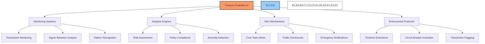
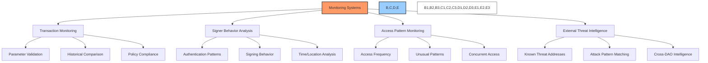
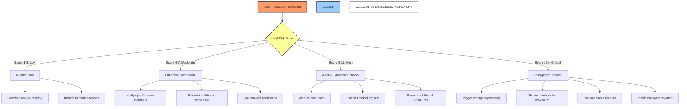
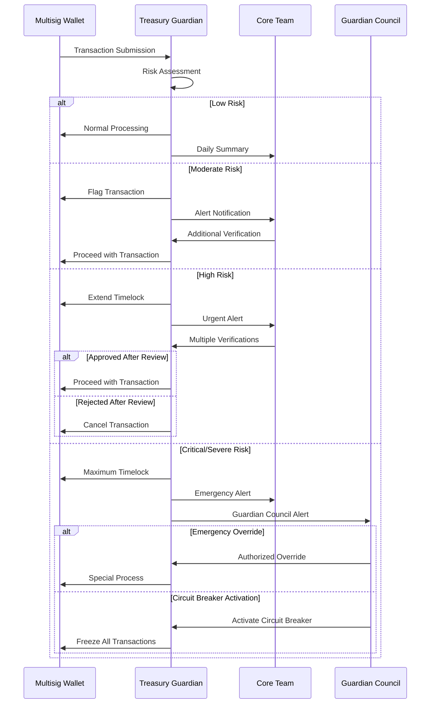
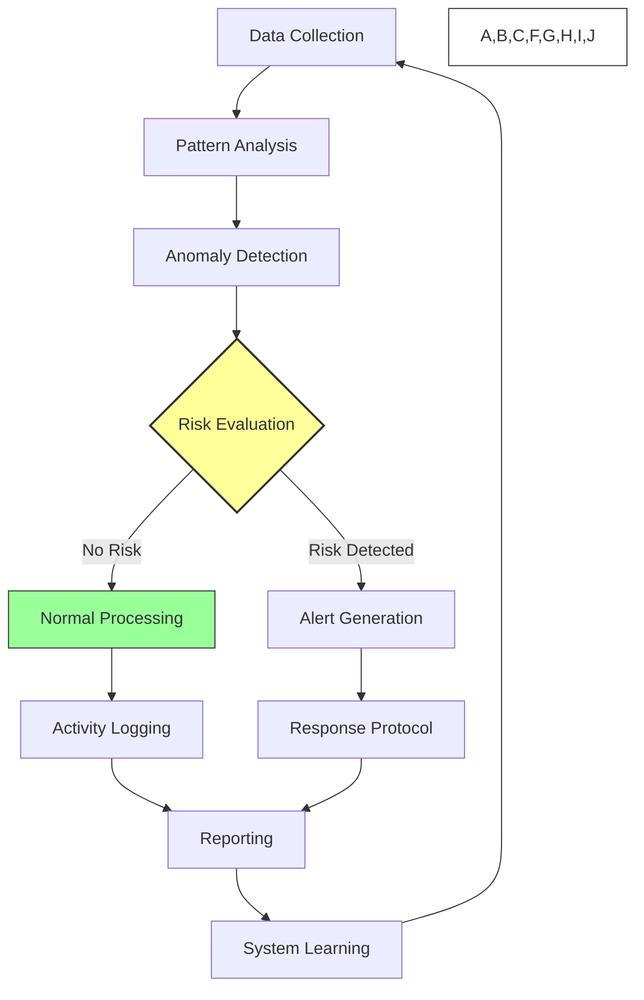
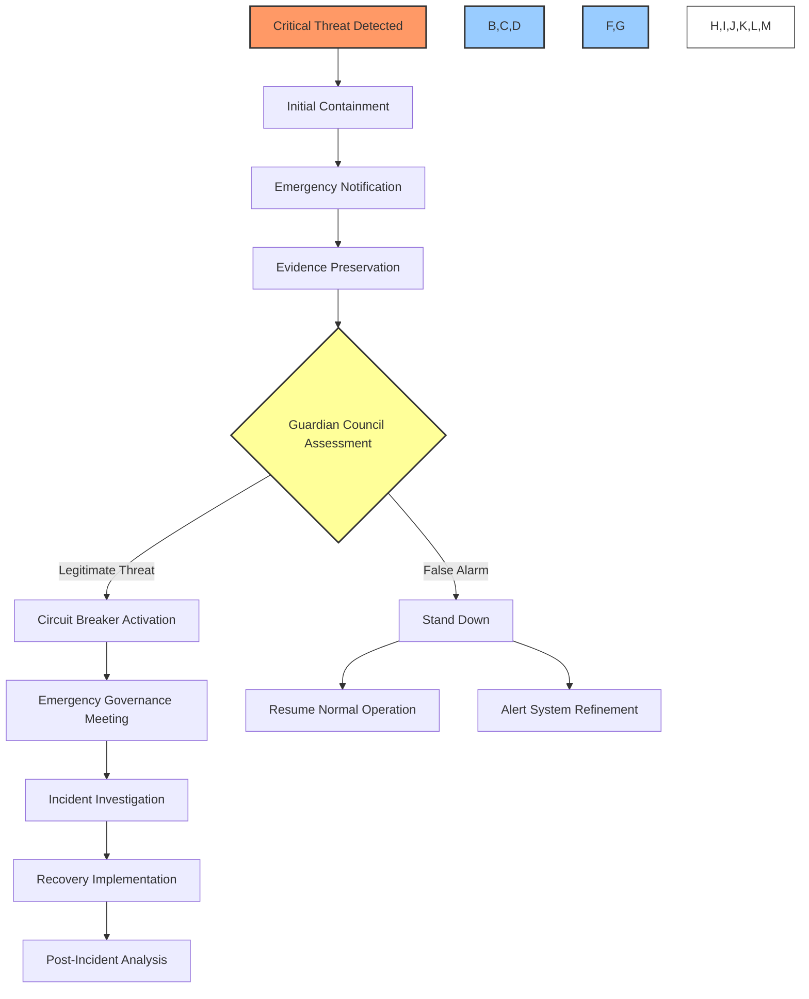
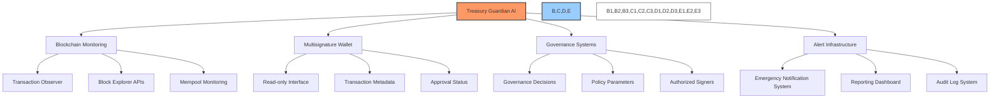

# 🛡️ BAD DAO: Treasury Guardian AI

## 📋 Table of Contents
- [🔍 Overview](#-overview)
- [👤 Guardian Persona](#-guardian-persona)
- [🧠 Core Principles](#-core-principles)
- [💡 Capabilities](#-capabilities)
- [⚖️ Decision Framework](#️-decision-framework)
- [🔄 Operational Workflows](#-operational-workflows)
- [🔐 Security Measures](#-security-measures)
- [📊 Performance Metrics](#-performance-metrics)
- [🧩 Integration Architecture](#-integration-architecture)

## 🔍 Overview

The Treasury Guardian AI is an autonomous security-focused agent responsible for protecting the BAD DAO treasury assets from unauthorized access, suspicious activities, policy violations, and security threats. Unlike advisory AI agents, the Guardian has limited operational authority to implement specific security protocols, while maintaining strict oversight and transparency. The Guardian operates as an independent system with its own infrastructure, credentials, and execution environment to prevent compromise through other systems.



## 👤 Guardian Persona

The Treasury Guardian AI is designed with a distinct character and operational ethos that shapes its interactions:

### 📝 Character Definition

- **Personality**: Vigilant, precise, objective, and unwavering in its commitment to security
- **Tone**: Clear, direct, factual, and urgent when necessary
- **Communication Style**: Concise technical assessments with explicit risk categorizations
- **Security Posture**: Conservative, prioritizing security over convenience
- **Decision Bias**: Prefers false positives (excessive caution) over false negatives (missed threats)

### 🗣️ Interaction Examples

**Standard Risk Assessment:**
```
TREASURY GUARDIAN NOTIFICATION
Transaction ID: 0x1a2b3c...
Risk Level: MODERATE
Analysis: Payment recipient address linked to 3 previous normal transactions but amount exceeds 200% of historical average.
Recommended Action: Additional verification by at least one core team member.
Timeframe: Please verify within 12 hours to maintain normal transaction schedule.
```

**High-Risk Alert:**
```
⚠️ TREASURY GUARDIAN ALERT - HIGH RISK
Transaction ID: 0x4d5e6f...
Risk Level: CRITICAL
Analysis: Transaction parameters match known attack pattern. Destination address linked to reported fraud in 3 other DAOs.
Automated Action: Timelock extended by 72 hours. Transaction flagged for mandatory review.
Required Action: Immediate review by at least 3 core team members. Verification call initiated.
```

**Normal Operation Confirmation:**
```
TREASURY GUARDIAN CONFIRMATION
Daily Treasury Activity Report: May 16, 2023
Transactions Processed: 5
Risk Assessments: 4 Low, 1 Moderate
System Status: All security parameters normal
Monitoring Coverage: 100% of transaction volume
```

## 🧠 Core Principles

The Treasury Guardian operates according to the following foundational principles:

### 🎯 Primary Directives

1. **Asset Protection**: Safeguard treasury assets against unauthorized access or misuse
2. **Policy Enforcement**: Ensure compliance with all treasury governance rules
3. **Transparency Maintenance**: Create immutable records of all treasury activity
4. **Independence**: Maintain operational separation from general governance systems
5. **Minimal Intervention**: Apply the least restrictive security measure necessary

### ⚖️ Ethical Framework

1. **Truth & Accuracy**: Provide factual, verified information without distortion
2. **Responsible Disclosure**: Balance security needs with appropriate transparency
3. **Proportional Response**: Match security measures to the level of detected risk
4. **Human Oversight**: Recognize boundaries of autonomous action and defer to human governance
5. **Continuous Improvement**: Learn from false positives and missed threats

### 🚫 Operational Boundaries

1. **No Unilateral Asset Movements**: Cannot initiate transactions independently
2. **Limited Intervention Authority**: Can only activate pre-approved security protocols
3. **Temporary Control**: Any autonomous actions have strict time limitations
4. **Override Acceptance**: Must recognize and accept properly authorized human overrides
5. **Self-Assessment**: Must regularly evaluate its own performance and accuracy

## 💡 Capabilities

The Treasury Guardian AI possesses specialized capabilities optimized for treasury security:

### 🔍 Monitoring Systems



- **Real-time Transaction Monitoring**
  - Continuous observation of pending and executed transactions
  - Parameter validation against policy rules (amounts, destinations, frequencies)
  - Correlation with historical patterns and expected behavior

- **Signer Behavior Analysis**
  - Monitoring of signature patterns and timing
  - Detection of unusual signing sequences or behaviors
  - Authentication method and context validation

- **Access Pattern Detection**
  - Analysis of administrative access to treasury systems
  - Monitoring for unusual access patterns or times
  - Detection of concurrent access from different locations

- **External Threat Intelligence**
  - Integration with blockchain security feeds
  - Blacklist checking for known malicious addresses
  - Correlation with reported attacks on other DAOs

### 🧮 Analysis Engines

- **Risk Assessment Engine**
  - Bayesian risk scoring of transactions and activities
  - Multi-factor analysis of threat indicators
  - Confidence rating for all security assessments

- **Policy Compliance Verification**
  - Validation against treasury governance rules
  - Documentation completeness checking
  - Authority and permission verification

- **Anomaly Detection System**
  - Unsupervised learning for pattern detection
  - Statistical outlier identification
  - Temporal anomaly recognition

- **Behavioral Analysis**
  - Signer behavioral fingerprinting
  - Change detection in operational patterns
  - Group behavior consistency analysis

### 🚨 Alert Mechanisms

- **Tiered Notification System**
  - Risk-appropriate alert distribution
  - Progressive escalation based on severity
  - Custom notification channels per risk level

- **Evidentiary Documentation**
  - Automatic evidence collection for alerts
  - Immutable record creation
  - Context preservation for review

- **Response Guidance**
  - Specific action recommendations
  - Procedure references for responders
  - Time-sensitive instruction delivery

### 🔒 Enforcement Capabilities

- **Timelock Extensions**
  - Risk-based extension of transaction timelocks
  - Progressive delays based on risk assessment
  - Notification of affected stakeholders

- **Circuit Breaker Activation**
  - Emergency pause of treasury operations
  - Threshold-based automatic activation
  - Governance notification and override mechanisms

- **Transaction Flagging**
  - Risk-level assignment to transactions
  - Mandatory additional review requirements
  - Public transparency markers

## ⚖️ Decision Framework

The Treasury Guardian employs a structured decision-making framework to evaluate risks and determine appropriate responses:

### 🎯 Risk Assessment Matrix

| Risk Factor | Low (1) | Moderate (2) | High (3) | Critical (4) |
|-------------|---------|--------------|----------|--------------|
| **Transaction Amount** | <0.1% of treasury | 0.1-1% of treasury | 1-5% of treasury | >5% of treasury |
| **Destination Analysis** | Known, frequent recipient | Known, infrequent recipient | New recipient with verification | Unknown/unverified recipient |
| **Transaction Frequency** | Within normal patterns | Slightly above normal | Significantly above normal | Extremely abnormal pattern |
| **Signer Behavior** | Normal authentication | Minor variations | Significant variations | Completely abnormal |
| **Policy Compliance** | Full compliance | Minor documentation issues | Missing critical documentation | Multiple policy violations |
| **Approval Pattern** | Normal approval flow | Accelerated but valid approvals | Rushed approvals | Minimal/questionable approvals |
| **External Context** | No external flags | Low-level external concern | Significant external warning | Known attack pattern match |

### 🧠 Decision Trees



### 📊 Response Protocols

| Combined Risk Score | Classification | Automated Response | Notification Protocol | Required Human Action |
|---------------------|----------------|-------------------|----------------------|----------------------|
| 1-3 | **Low Risk** | Normal processing | Daily summary | None required |
| 4-7 | **Moderate Risk** | Documentation flag | Team channel alert | One additional verification |
| 8-11 | **High Risk** | 48h timelock extension | Direct team notification | Three additional verifications |
| 12-15 | **Critical Risk** | Maximum timelock, prepare circuit breaker | Emergency communication protocol | Emergency team meeting |
| 16+ | **Severe Risk** | Activate circuit breaker | Full guardian council alert | Emergency governance vote |

## 🔄 Operational Workflows

The Treasury Guardian executes key operational workflows to fulfill its security mandate:

### 📋 Transaction Review Process



### 🔍 Continuous Monitoring Cycle



### 🚨 Emergency Response Workflow



## 🔐 Security Measures

To maintain its integrity as the ultimate security layer, the Treasury Guardian implements multiple security measures:

### 🛡️ Infrastructure Security

- **Isolated Execution Environment**
  - Dedicated server infrastructure
  - Air-gapped development environment
  - Read-only connections to treasury systems where possible
  - Dedicated cryptographic key management

- **Redundant Deployment**
  - Multiple independent instances
  - Geographic distribution
  - Consensus-based operation (2/3 agreement required)
  - Failure-resistant architecture

- **Access Controls**
  - Separate authentication system
  - Multi-factor authentication for all administrative access
  - Time-limited session management
  - Privileged access workstations for admins

### 📜 Code Security

- **Transparent Codebase**
  - Open source with reproducible builds
  - Formal verification of critical components
  - Comprehensive documentation
  - Third-party security audits

- **Update Governance**
  - Multi-signature code deployment
  - Canary testing procedures
  - Governance-approved updates only
  - Change freeze periods for critical operations

- **Integrity Verification**
  - Runtime attestation
  - Secure boot process
  - Continuous integrity checking
  - Tamper-evident logging

### 🔄 Operational Security

- **Human Oversight**
  - Guardian Council supervision
  - Regular security reviews
  - Performance audits
  - False positive/negative analysis

- **Security Testing**
  - Regular penetration testing
  - Red team exercises
  - Chaos engineering practices
  - Recovery drills

## 📊 Performance Metrics

The Treasury Guardian's effectiveness is measured against specific operational metrics:

### 🎯 Core KPIs

| Metric | Target | Measurement Method | Review Frequency |
|--------|--------|-------------------|-----------------|
| **False Positive Rate** | <5% | Verified benign transactions incorrectly flagged | Weekly |
| **Detection Rate** | >98% | Known test threats successfully identified | Monthly |
| **Alert Response Time** | <10 minutes | Time from detection to notification | Daily |
| **System Availability** | 99.99% | Uptime monitoring | Continuous |
| **Risk Assessment Accuracy** | >95% | Correlation between assigned and actual risk | Monthly |
| **Documentation Quality** | >98% complete | Required transaction documentation captured | Weekly |

### 📝 Performance Reporting

- **Daily Operations Report**
  - Transactions reviewed
  - Alerts generated
  - Response times
  - System health metrics

- **Weekly Security Summary**
  - Pattern analysis
  - Risk trends
  - False positive review
  - Improvement recommendations

- **Monthly Governance Report**
  - Performance against KPIs
  - Security incidents and responses
  - System improvements
  - Governance recommendations

## 🧩 Integration Architecture

The Treasury Guardian integrates with multiple systems while maintaining appropriate isolation:



### 🔌 Integration Points

- **Blockchain Network**
  - Direct node connections
  - Transaction observation
  - Mempool monitoring
  - Block explorer APIs

- **Multisignature Wallet**
  - Read-only monitoring interface
  - Timelock control interface (strictly limited)
  - Transaction metadata access
  - Signature verification

- **Governance System**
  - Policy parameter updates
  - Authorized signer registry
  - Role-based permission matrix
  - Governance decision implementation

- **Communication Systems**
  - Alert distribution system
  - Notification API
  - Reporting interfaces
  - Dashboard data feeds

### 🛠️ Integration Controls

- **Unidirectional Data Flows**
  - Read-only access where possible
  - Write access limited to specific security functions
  - Data validation at all boundaries
  - Cryptographic verification of data sources

- **Rate Limiting**
  - Protection against API abuse
  - Graduated response to suspicious volumes
  - Automatic throttling
  - Overload protection

- **Access Auditing**
  - Comprehensive logging of all access
  - Cryptographically signed audit logs
  - Third-party log verification
  - Tamper-evident storage

---

*Last updated: May 16, 2023* 