# 🏦 BAD DAO: Treasury Management

## 📋 Table of Contents
- [🔍 Overview](#-overview)
- [💰 Treasury Structure](#-treasury-structure)
- [🔄 Asset Allocation](#-asset-allocation)
- [⚙️ Operational Controls](#-operational-controls)
- [📊 Reporting Requirements](#-reporting-requirements)
- [🔍 Audit Framework](#-audit-framework)
- [🧮 Financial Modeling](#-financial-modeling)

## 🔍 Overview

The BAD DAO Treasury is the primary financial resource that enables the protocol's ongoing development, operations, and ecosystem growth. This document outlines the comprehensive framework for managing treasury assets, establishing appropriate controls, and ensuring transparent reporting to all stakeholders.

```mermaid
graph TD
    A[🏦 BAD DAO Treasury] --> B[💵 Asset Management]
    A --> C[🏛️ Governance Controls]
    A --> D[📊 Reporting System]
    A --> E[🔄 Operational Expenses]
    
    B --> B1[Asset Allocation Strategy]
    B --> B2[Risk Management]
    B --> B3[Growth Targets]
    
    C --> C1[Spending Authorization]
    C --> C2[Time-lock Controls]
    C --> C3[Multi-sig Security]
    
    D --> D1[Quarterly Reports]
    D --> D2[Real-time Dashboard]
    D --> D3[Annual Audit]
    
    E --> E1[Core Team Compensation]
    E --> E2[Infrastructure Costs]
    E --> E3[Development Funding]
    E --> E4[Community Incentives]
    
    style A fill:#f96,stroke:#333,stroke-width:2px
    style B,C,D,E fill:#9cf,stroke:#333,stroke-width:2px
    style B1,B2,B3,C1,C2,C3,D1,D2,D3,E1,E2,E3,E4 fill:#fff,stroke:#333,stroke-width:1px
```

The treasury management system is designed to balance multiple priorities:

1. **Long-term sustainability**: Ensuring resources for continued operations
2. **Strategic flexibility**: Maintaining capacity for opportunistic investments
3. **Risk management**: Diversifying assets to mitigate market volatility
4. **Operational efficiency**: Streamlining routine financial operations
5. **Transparency**: Providing clear visibility into treasury activities

## 💰 Treasury Structure

The BAD DAO Treasury is structured into multiple sub-treasuries, each with specific purposes and governance requirements:

### 🔵 Operational Treasury (40%)

- **Purpose**: Fund day-to-day operations and recurring expenses
- **Asset Composition**: 80% stablecoins, 20% liquid crypto assets
- **Governance**: Core team multi-sig (3/5) for expenses up to 1% of operational treasury
- **Replenishment**: Monthly transfer from main treasury based on approved budget
- **Time-lock**: 24-hour delay for transactions exceeding $50,000 equivalent

### 🟢 Growth Treasury (30%)

- **Purpose**: Strategic investments and ecosystem development
- **Asset Composition**: 40% stablecoins, 30% BAD token, 30% blue-chip crypto assets
- **Governance**: Extended multi-sig (5/7) with DAO proposal for amounts exceeding 2%
- **Evaluation Criteria**: Must demonstrate significant ROI or strategic value
- **Time-lock**: 72-hour delay for all transactions

### 🟣 Reserve Treasury (20%)

- **Purpose**: Long-term value preservation and emergency situations
- **Asset Composition**: 50% blue-chip crypto, 30% stablecoins, 20% tokenized real-world assets
- **Governance**: Full governance vote and 6/9 multi-sig approval
- **Access Conditions**: Emergency situations or strategic opportunities with 75% governance approval
- **Time-lock**: 7-day delay for all transactions

### 🟠 Community Treasury (10%)

- **Purpose**: Fund community growth and engagement activities
- **Asset Composition**: 60% BAD token, 40% stablecoins
- **Governance**: Community multi-sig (3/7) with one core team member
- **Access Process**: Regular funding waves with community proposal submission
- **Time-lock**: 48-hour delay for transactions exceeding $10,000 equivalent

## 🔄 Asset Allocation

The treasury maintains a diversified portfolio to balance growth potential with risk management:

### 💲 Stablecoin Management

- **Platforms**: Distributed across multiple reputable platforms
- **Yield Strategy**: 70% in conservative yield strategies, 30% in liquidity reserves
- **Risk Controls**: Maximum 20% exposure to any single platform
- **Diversification**: Equal distribution across USDC, DAI, and USDT
- **Rebalancing**: Monthly review and rebalancing as needed

### 🪙 Native Token (BAD) Management

- **Purpose**: Protocol operations, incentives, and governance
- **Buy-back Program**: Quarterly buy-back and burn based on protocol revenue
- **Vesting Schedule**: Released according to predetermined vesting schedules
- **Liquidity Management**: Maintain minimum liquidity thresholds across key DEXs
- **Strategic Reserve**: 10% held for strategic partnerships and integrations

### 💎 Blue-chip Crypto Management

- **Composition**: 60% ETH, 30% BTC, 10% other established assets
- **Custody**: Multi-sig hardware wallets with geographically distributed keys
- **Staking**: Portion of ETH staked for additional yield
- **Rebalancing**: Quarterly rebalancing to maintain target allocation
- **Strategic Use**: Collateral for protocol operations when beneficial

### 📈 Strategic Token Investments

- **Allocation Criteria**: Protocols offering strategic integration value
- **Position Size**: Maximum 1% of treasury in any single protocol token
- **Performance Review**: Quarterly assessment of strategic value and financial performance
- **Exit Strategy**: Predefined thresholds for position reduction or exit
- **Governance**: Full governance vote required for new strategic investments

## ⚙️ Operational Controls

To ensure secure and efficient treasury management:

### 🔐 Security Infrastructure

- **Multi-signature Requirements**: Different thresholds based on transaction size and treasury type
- **Key Management**: Distributed key holders with defined backup procedures
- **Hardware Security**: All keys stored on hardware wallets with physical security protocols
- **Transaction Verification**: Multi-level verification process for all transactions
- **Intrusion Detection**: 24/7 monitoring system for unauthorized access attempts

### 💰 Spending Limits

| Treasury Type | Transaction Size | Approval Required | Time-lock |
|---------------|------------------|-------------------|-----------|
| Operational | <0.5% | Core Team (3/5) | None |
| Operational | 0.5-1% | Core Team (4/5) | 24 hours |
| Operational | >1% | Extended Multi-sig (5/7) + Forum | 48 hours |
| Growth | <1% | Extended Multi-sig (4/7) | 48 hours |
| Growth | 1-3% | Extended Multi-sig (5/7) + Forum | 72 hours |
| Growth | >3% | Full Governance Vote | 7 days |
| Reserve | Any | Full Governance Vote + Multi-sig (6/9) | 7 days |
| Community | <$10K | Community Multi-sig (3/7) | None |
| Community | $10K-$50K | Community Multi-sig (4/7) | 48 hours |
| Community | >$50K | Community Multi-sig (5/7) + Forum | 72 hours |

### ⏱️ Time-lock Mechanics

The time-lock system provides:
- Transparency: All pending transactions are publicly visible
- Security: Delay period allows for detection of malicious transactions
- Cancellation: Transactions can be cancelled during the time-lock period
- Audit Trail: Complete history of treasury transactions maintained on-chain

### 🚨 Emergency Controls

In the event of critical security incidents:

- **Pause Mechanism**: Core team can temporarily pause all treasury movements (3/5 multi-sig)
- **Circuit Breakers**: Automatic pause if unusual transaction patterns detected
- **Emergency Committee**: Dedicated group authorized to take emergency action
- **Recovery Plans**: Predefined procedures for different security scenarios
- **Critical Response Time**: 15-minute maximum response time for critical alerts

## 📊 Reporting Requirements

To maintain transparency and accountability:

### 📔 Regular Reports

- **Monthly Treasury Summary**: Asset allocation, significant movements, performance metrics
- **Quarterly Financial Report**: Comprehensive review of treasury activities and performance
- **Annual Audit Report**: Independent audit of all treasury activities and controls
- **Expense Reports**: Itemized breakdown of all operational expenses

### 📉 Key Performance Indicators

The treasury tracks and reports on critical KPIs including:

1. **Financial Health Metrics**:
   - Runway Duration: Months of operations sustainable at current burn rate
   - Asset Growth Rate: Monthly and quarterly growth of treasury value
   - Yield Performance: Return on treasury assets compared to benchmarks

2. **Operational Efficiency**:
   - Transaction Cost Ratio: Gas and fees as percentage of transaction value
   - Operational Expense Ratio: Operating costs as percentage of treasury
   - Treasury Management Cost: Cost of treasury management as percentage of assets

3. **Growth Metrics**:
   - Revenue Growth: Increase in protocol revenue over time
   - User Growth Impact: Relationship between treasury allocation and user metrics
   - Partnership ROI: Return on partnership and integration investments

4. **Risk Management Metrics**:
   - Volatility Exposure: Measurement of treasury exposure to market volatility
   - Correlation Metrics: Correlation between different treasury assets
   - Stress Test Results: Simulated performance during adverse market conditions

### 🌐 Public Dashboard

A real-time treasury dashboard is maintained for public access with:

- Current asset allocation and balances
- Historical performance tracking
- Pending transactions in time-lock
- Treasury proposal status
- Historical expense tracking
- Key financial metrics visualization

## 🔍 Audit Framework

To ensure integrity and compliance:

### 🔎 Internal Audits

- **Monthly Reconciliation**: Internal verification of all treasury movements
- **Quarterly Process Review**: Assessment of treasury management procedures
- **Security Review**: Regular security assessment of treasury infrastructure
- **Compliance Check**: Verification of compliance with governance decisions

### 🧪 External Audits

- **Annual Independent Audit**: Comprehensive review by qualified third party
- **Security Penetration Testing**: Annual security assessment of treasury infrastructure
- **Smart Contract Audit**: Review of all treasury-related contracts upon implementation or update
- **Governance Compliance Audit**: Verification of adherence to governance framework

### 🔄 Continuous Monitoring

- **Automated Alerting**: Real-time monitoring system for unusual activity
- **Transaction Verification**: Cross-check of transaction details against approvals
- **Balance Reconciliation**: Automated daily verification of reported vs. actual balances
- **Market Risk Assessment**: Ongoing evaluation of market risks to treasury assets

## 🧮 Financial Modeling

The treasury employs sophisticated financial modeling to:

### 📊 Runway Projections

The treasury maintains multiple runway projections:

- **Base Case**: Expected expenses and revenue under normal conditions
- **Conservative Case**: Reduced revenue projections with stable expenses
- **Market Stress Case**: Significant asset devaluation scenario
- **Growth Case**: Accelerated growth with increased expenses and revenue
- **Minimum Viable Treasury**: Core operations only with emergency measures

### 💹 Treasury Growth Strategy

The treasury implements a growth strategy focused on:

1. **Yield Generation**:
   - Stablecoin yield from reputable DeFi protocols
   - Liquid staking of proof-of-stake assets
   - Strategic liquidity provision to select protocols
   - Yield optimization through automated rebalancing

2. **Strategic Investments**:
   - Early-stage protocol investments with strategic alignment
   - Infrastructure investments that benefit the ecosystem
   - Technology acquisitions that enhance protocol capabilities
   - Token swaps with complementary protocols

3. **Revenue Capture**:
   - Protocol fee accumulation into treasury
   - Revenue-sharing from partnerships and integrations
   - Licensing of protocol technology or intellectual property
   - Service fees from enterprise or specialized implementations

---

*This document provides a comprehensive overview of the BAD DAO Treasury Management framework. For technical implementation details, specific operational procedures, and integration guidelines, please refer to the technical implementation documentation.*

*Version: 1.0*  
*Last Updated: May 2025*  
*Document Owner: BAD DAO Treasury Committee* 