# 💹 BAD DAO: Treasury Oversight Agent

## 📋 Table of Contents
- [🔍 Overview](#-overview)
- [🎯 Core Purpose](#-core-purpose)
- [⚙️ Functional Architecture](#️-functional-architecture)
- [📊 Monitoring & Analysis Capabilities](#-monitoring--analysis-capabilities)
- [⚠️ Alert System](#️-alert-system)
- [💼 Reporting Framework](#-reporting-framework)
- [📈 Optimization Engine](#-optimization-engine)
- [🔗 Integration with Governance](#-integration-with-governance)
- [🔐 Security & Access Controls](#-security--access-controls)
- [📏 Performance Metrics](#-performance-metrics)
- [🛣️ Development Roadmap](#️-development-roadmap)

## 🔍 Overview

The Treasury Oversight Agent is a specialized AI system designed to continuously monitor, analyze, and optimize the BAD DAO treasury operations. It provides real-time visibility into treasury activities, detects anomalies, predicts financial trends, and recommends optimizations to ensure the long-term sustainability and growth of the DAO's financial resources.

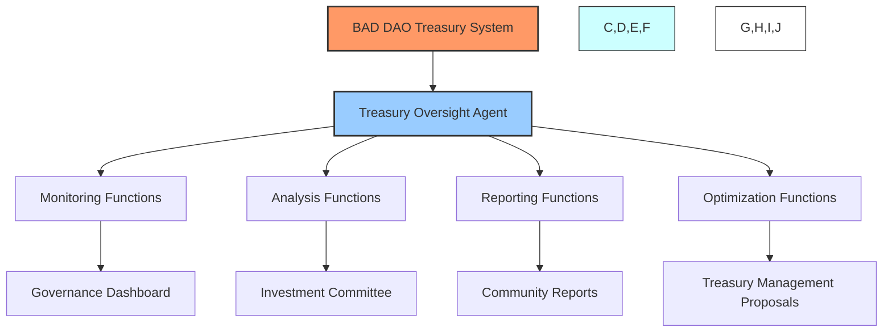

Operating at the intersection of financial management, security monitoring, and strategic planning, the Treasury Oversight Agent serves as the financial guardian of the DAO, ensuring transparency, compliance, and optimization of treasury resources while providing crucial financial intelligence to governance participants.

## 🎯 Core Purpose

The Treasury Oversight Agent exists to:

1. **👁️ Provide Transparency**: Deliver complete visibility into treasury operations and status
2. **🔍 Ensure Security**: Monitor for and detect potential security threats or anomalies
3. **📊 Enable Analysis**: Provide comprehensive financial intelligence and trend analysis
4. **💰 Optimize Resources**: Identify and recommend treasury optimization opportunities
5. **⚠️ Mitigate Risks**: Detect and address potential financial risks proactively
6. **📈 Support Growth**: Ensure sustainable treasury growth aligned with DAO objectives
7. **🔄 Automate Operations**: Streamline routine treasury management functions

## ⚙️ Functional Architecture

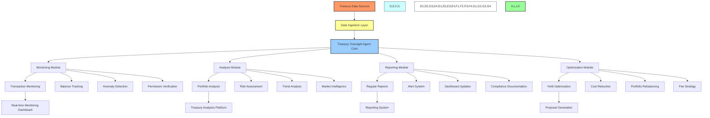

### Data Ingestion Layer

The Treasury Oversight Agent integrates data from multiple sources:

- **⛓️ On-chain Data**: Direct monitoring of blockchain transactions and balances
- **📝 Financial Records**: Integration with DAO accounting systems
- **🌐 Market Data**: Real-time price and market information
- **📊 Historical Data**: Treasury performance and transaction history
- **🖋️ Governance Decisions**: Approved financial policies and parameters

### Processing Pipeline

1. **📥 Data Collection**
   - Continuous monitoring of treasury wallets and contracts
   - Transaction event capture and categorization
   - Market data integration and normalization
   - Governance decision tracking

2. **🧮 Data Processing**
   - Transaction classification and contextualization
   - Balance reconciliation across accounts
   - Performance metric calculation
   - Pattern and anomaly detection

3. **📊 Analysis Execution**
   - Risk exposure assessment
   - Portfolio composition analysis
   - Yield performance evaluation
   - Trend identification and projection

4. **📋 Reporting Generation**
   - Automated report compilation
   - Alert triggering based on defined thresholds
   - Dashboard updating with current metrics
   - Recommendation formulation

5. **🔄 Integration**
   - Providing data to governance dashboard
   - Forwarding alerts to appropriate stakeholders
   - Submitting recommendations to governance process
   - Archiving data for historical record

## 📊 Monitoring & Analysis Capabilities

### 🔍 Transaction Monitoring

- **🔄 Real-time Transaction Tracking**: Monitors all inflows and outflows as they occur
- **📋 Transaction Categorization**: Automatically classifies transactions by type and purpose
- **✅ Authorization Verification**: Ensures transactions match approved parameters
- **👁️ Multi-chain Monitoring**: Tracks assets across multiple blockchains and layers
- **📝 Transaction Documentation**: Maintains comprehensive transaction records with context

### 📈 Portfolio Analysis

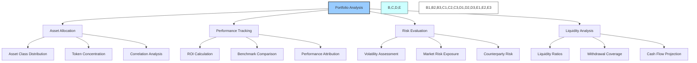

- **📊 Asset Allocation Analysis**: Evaluates composition and diversification of treasury
- **📈 Performance Measurement**: Tracks returns against defined benchmarks
- **⚖️ Risk Exposure Assessment**: Identifies concentration risks and market exposures
- **💧 Liquidity Management**: Ensures sufficient liquid assets for operational needs
- **🔄 Rebalancing Analysis**: Detects deviations from target allocation and recommends adjustments

### 🧮 Financial Forecasting

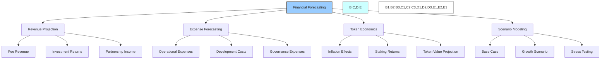

- **💰 Revenue Projections**: Forecasts income from protocol fees, investments, and other sources
- **📉 Expense Forecasting**: Projects operational, development, and governance costs
- **🔮 Cash Flow Modeling**: Predicts treasury balance changes over multiple time horizons
- **🧠 Scenario Analysis**: Models various market and operational scenarios to test resilience
- **⚡ Sensitivity Analysis**: Identifies key variables that most impact treasury performance

### 🚨 Anomaly Detection

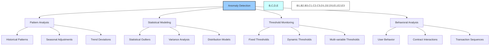

- **🔎 Pattern Recognition**: Identifies unusual transaction patterns or behaviors
- **📊 Statistical Analysis**: Uses advanced statistical methods to detect outliers
- **🚫 Fraud Detection**: Identifies potentially malicious or unauthorized activities
- **⚠️ Early Warning System**: Flags concerning trends before they become critical
- **🎯 Contextual Analysis**: Evaluates anomalies within appropriate operational context

## ⚠️ Alert System

The Treasury Oversight Agent implements a sophisticated alert system to notify stakeholders of significant events, anomalies, or required actions:

### 🚨 Alert Types

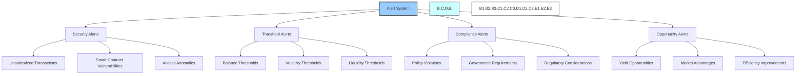

1. **🚨 Urgent Security Alerts**
   - Unauthorized transaction attempts
   - Suspicious contract interactions
   - Security vulnerabilities in treasury contracts
   - Unusual access patterns

2. **⚠️ Risk & Threshold Alerts**
   - Asset balance below defined thresholds
   - Risk exposure exceeding parameters
   - Volatility spikes in treasury assets
   - Liquidity constraints detected

3. **📋 Operational Alerts**
   - Pending transaction approval requirements
   - Scheduled treasury operations
   - Upcoming governance decisions affecting treasury
   - Maintenance and upgrade notifications

4. **💡 Opportunity Alerts**
   - Yield farming opportunities
   - Favorable market conditions for rebalancing
   - Cost-saving opportunities
   - Strategic acquisition possibilities

### 📱 Alert Distribution

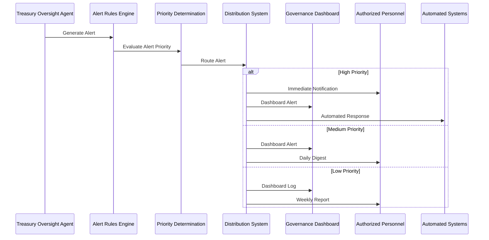

- **🎯 Targeted Distribution**: Routes alerts to appropriate stakeholders based on role and responsibility
- **⚡ Priority-Based Delivery**: Assigns priority levels determining notification urgency
- **🔄 Escalation Protocols**: Automatically escalates unaddressed critical alerts
- **📱 Multi-channel Delivery**: Distributes via dashboard, email, messaging, and mobile notifications
- **🔕 Smart Aggregation**: Prevents alert fatigue through intelligent bundling of related notifications

## 💼 Reporting Framework

The Treasury Oversight Agent generates comprehensive reports at various intervals to provide stakeholders with treasury insights:

### 📊 Report Types

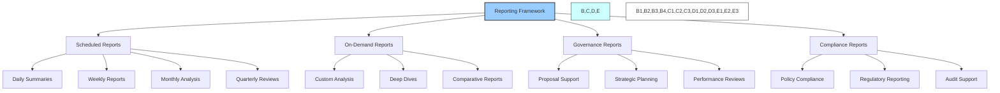

1. **📆 Daily Treasury Summary**
   - Current balance overview
   - 24-hour transaction summary
   - Key metric updates
   - Urgent alerts and notifications

2. **📆 Weekly Treasury Report**
   - Detailed transaction analysis
   - Performance against benchmarks
   - Risk exposure evaluation
   - Upcoming treasury operations

3. **📆 Monthly Treasury Analysis**
   - Comprehensive performance review
   - Market and economic analysis
   - Trend identification and forecasting
   - Optimization recommendations

4. **📆 Quarterly Treasury Review**
   - Strategic evaluation of treasury position
   - Long-term performance analysis
   - Policy and strategy recommendations
   - Governance proposals for consideration

### 📈 Treasury Dashboard

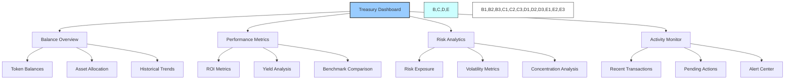

- **📊 Interactive Visualizations**: Dynamic charts and graphs for key treasury metrics
- **🔄 Real-time Updates**: Live data refreshing for current treasury status
- **🎚️ Customizable Views**: Role-based display options for different stakeholders
- **📱 Multi-device Access**: Responsive design for desktop and mobile interfaces
- **🔍 Drill-down Capabilities**: Ability to explore detailed data from high-level summaries

## 📈 Optimization Engine

The Treasury Oversight Agent actively identifies and recommends optimization opportunities to enhance treasury performance:

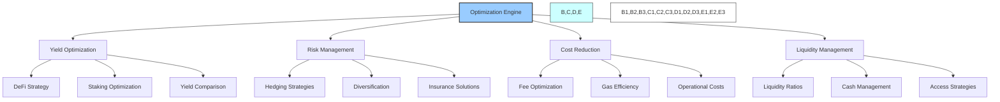

### Optimization Capabilities

1. **💰 Yield Enhancement**
   - DeFi protocol yield comparison and recommendation
   - Staking strategy optimization
   - Lending and borrowing opportunity identification
   - Strategic asset deployment recommendations

2. **⚖️ Portfolio Rebalancing**
   - Target allocation maintenance
   - Risk-adjusted rebalancing recommendations
   - Tax-efficient rebalancing strategies
   - Drift minimization approach

3. **💸 Cost Optimization**
   - Gas optimization for treasury operations
   - Fee reduction strategies
   - Efficient transfer pathways
   - Operational expense analysis

4. **🛡️ Risk Mitigation**
   - Hedging strategy recommendations
   - Insurance and protection options
   - Diversification suggestions
   - Correlation optimization

### Recommendation Process

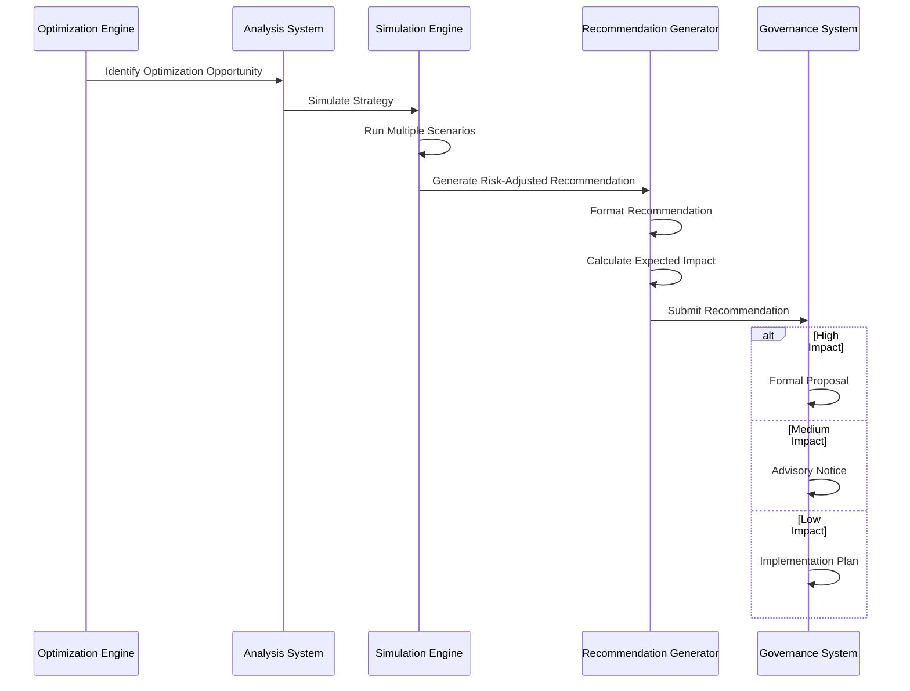

- **📊 Data-Driven Recommendations**: Evidence-based optimization suggestions
- **🧮 Impact Quantification**: Clear calculation of expected benefits
- **⚠️ Risk Assessment**: Transparent evaluation of potential downsides
- **📉 Alternative Comparison**: Side-by-side analysis of potential strategies
- **🚀 Implementation Roadmap**: Actionable steps for implementing recommendations

## 🔗 Integration with Governance

The Treasury Oversight Agent interfaces with the DAO's governance system to support financial decision-making:

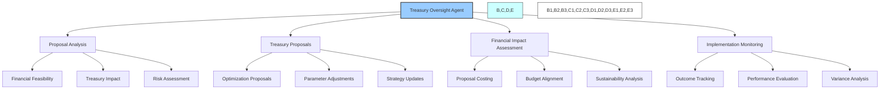

### Governance Touchpoints

1. **📊 Proposal Financial Analysis**
   - Financial impact assessment of governance proposals
   - Treasury sustainability evaluation
   - Resource allocation recommendations
   - Budget verification and validation

2. **📝 Treasury Management Proposals**
   - Automated generation of treasury optimization proposals
   - Parameter adjustment recommendations
   - Strategic asset allocation proposals
   - Risk management strategy updates

3. **📋 Budget Framework Support**
   - Budget planning assistance
   - Spending tracking against allocations
   - Variance analysis and reporting
   - Financial constraint identification

4. **📈 Financial Accountability**
   - Transparent treasury operations tracking
   - Performance measurement against objectives
   - Regular reporting to governance participants
   - Historical record of financial decisions and outcomes

## 🔐 Security & Access Controls

To ensure the integrity and security of treasury operations, the Treasury Oversight Agent implements comprehensive security measures:

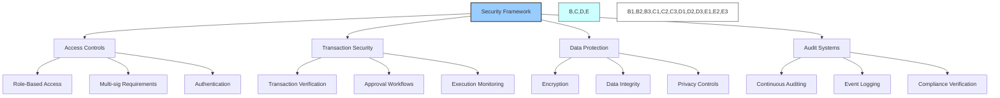

### Security Measures

1. **🔒 Access Control System**
   - Role-based permission structure
   - Multi-sig requirements for critical actions
   - Tiered authorization levels
   - Secure authentication mechanisms

2. **🛡️ Transaction Security**
   - Multi-level verification requirements
   - Threshold-based approval workflows
   - Time-lock mechanisms for large transactions
   - Simulation before execution

3. **🔐 Data Protection**
   - Encryption of sensitive financial data
   - Secure communication channels
   - Privacy-preserving analytics
   - Restricted data access

4. **📝 Audit & Compliance**
   - Comprehensive event logging
   - Immutable audit trails
   - Regular security audits
   - Compliance verification processes

## 📏 Performance Metrics

The Treasury Oversight Agent is evaluated based on key performance indicators:

### Treasury Management Metrics

- **📈 Risk-Adjusted Return**: Treasury performance relative to risk exposure
- **💰 Yield Optimization**: Improvement in yield relative to benchmarks
- **💧 Liquidity Efficiency**: Optimization of liquidity relative to operational needs
- **🛡️ Risk Reduction**: Decrease in unhedged risk exposure
- **⚖️ Diversification Improvement**: Enhanced portfolio balance and reduced concentration

### Operational Metrics

- **⚡ Response Time**: Speed of detecting and responding to treasury events
- **📊 Reporting Accuracy**: Correctness of financial data and forecasts
- **🔍 Anomaly Detection**: Effectiveness in identifying unusual activities
- **🔄 Transaction Efficiency**: Optimization of transaction costs and timing
- **💻 System Uptime**: Reliability of monitoring and reporting systems

### Value Creation Metrics

- **💹 Cost Savings**: Reduction in operational and transaction costs
- **📈 Revenue Enhancement**: Increase in treasury yield and returns
- **🛡️ Loss Prevention**: Value protected through risk mitigation
- **⚙️ Operational Efficiency**: Reduction in manual treasury management requirements
- **🧠 Intelligence Value**: Contribution to improved financial decision-making

## 🛣️ Development Roadmap

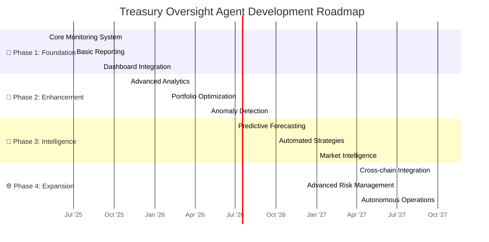

### Future Capabilities

1. **🔮 Predictive Treasury Management (Q3 2026)**
   - Advanced forecasting of treasury needs
   - Predictive market movement integration
   - Proactive rebalancing before market shifts
   - Auto-generated treasury strategies

2. **🤖 Autonomous Optimization (Q1 2027)**
   - Self-executing yield optimization within parameters
   - Dynamic portfolio rebalancing
   - Automated cost minimization
   - Intelligent liquidity management

3. **🌐 Ecosystem Integration (Q4 2027)**
   - Cross-DAO treasury coordination
   - Ecosystem-wide financial intelligence
   - Partner protocol integration
   - Multi-chain treasury operations

4. **🧠 Financial Decision Support (Q2 2028)**
   - Strategic financial planning assistance
   - Long-term sustainability modeling
   - Economic scenario simulation
   - DAO financial health optimization

---

*This document provides a comprehensive overview of the BAD DAO Treasury Oversight Agent. For technical specifications, implementation details, and integration guidelines, please refer to the technical implementation documentation.*

*Version: 1.0*  
*Last Updated: May 2025*  
*Document Owner: BAD DAO Financial Committee* 