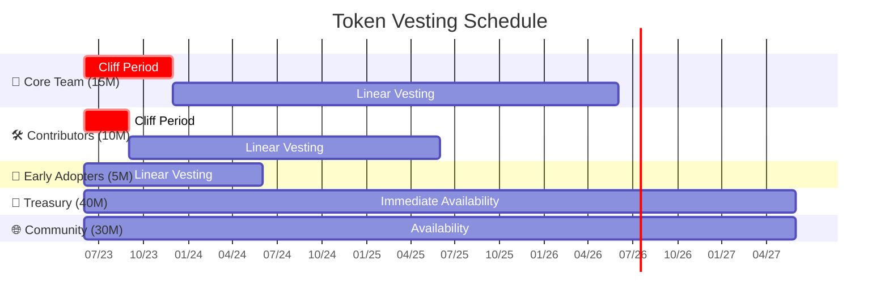
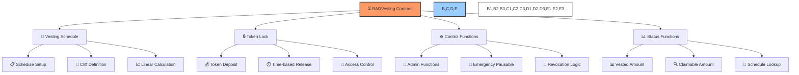
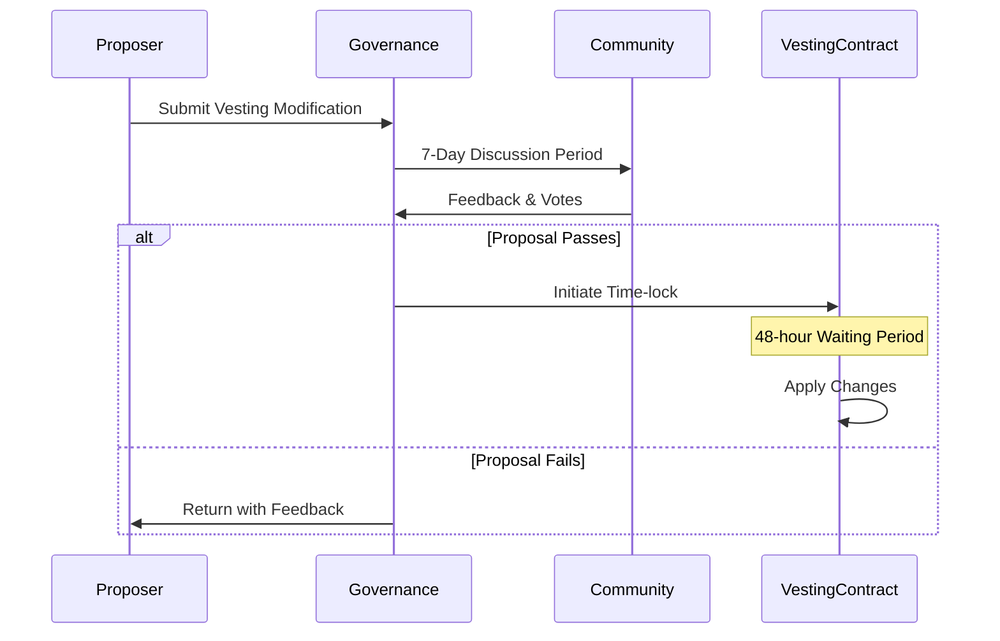

# ⏱️ BAD DAO: Token Vesting Schedules

## 📋 Table of Contents
- [🔍 Overview](#-overview)
- [📊 Vesting Timeline](#-vesting-timeline)
- [👥 Role-Based Vesting](#-role-based-vesting)
- [🛠️ Vesting Contract Implementation](#️-vesting-contract-implementation)
- [💰 Governance Controls](#-governance-controls)

## 🔍 Overview

The BAD DAO token vesting schedules are designed to create long-term alignment between the various stakeholder groups and the overall health of the protocol. These carefully calibrated vesting timelines prevent market instability from sudden token unlocks while ensuring that contributors remain motivated by their ongoing stake in the project's success.

## 📊 Vesting Timeline



The vesting schedule extends over a 4-year period with different schedules for each stakeholder group, designed to align incentives and maintain protocol stability.

## 👥 Role-Based Vesting

### 🔶 Core Team (15%)

| 📊 Parameter | ⚙️ Value | 🔍 Purpose |
|--------------|---------|----------|
| Total Allocation | 15,000,000 BAD | Align long-term incentives for founding team |
| Vesting Period | 36 months | Ensure sustained commitment to project |
| Cliff | 6 months | Prevent early departures |
| Release Schedule | Linear monthly | Provide consistent incentives |
| Revocation Terms | Governance vote | Protect against abandonment |
| Accelerated Vesting | None | Consistent long-term alignment |

**Detailed Release Schedule:**
- Months 0-6: 0 tokens (cliff period)
- Month 7: 416,667 tokens (1/36 of total allocation)
- Months 8-36: 416,667 tokens per month
- Final Release: 416,659 tokens (adjusted for rounding)

**Special Provisions:**
- In case of departure, unvested tokens subject to governance vote for potential revocation
- Multi-sig controller for emergency situations
- No individual discretionary acceleration

### 🔷 Contributors (10%)

| 📊 Parameter | ⚙️ Value | 🔍 Purpose |
|--------------|---------|----------|
| Total Allocation | 10,000,000 BAD | Reward ongoing project contributions |
| Vesting Period | 24 months | Balance commitment with flexibility |
| Cliff | 3 months | Initial contribution verification |
| Release Schedule | Linear monthly | Provide consistent incentives |
| Accelerated Vesting | Milestone-based | Reward exceptional performance |
| Milestone Acceleration | Up to 20% | Incentivize key deliverables |

**Detailed Release Schedule:**
- Months 0-3: 0 tokens (cliff period)
- Month 4: 416,667 tokens (1/24 of total allocation)
- Months 5-24: 416,667 tokens per month
- Final Release: 416,659 tokens (adjusted for rounding)

**Milestone Acceleration:**
- Technical contributors: Accelerated vesting for critical protocol upgrades
- Community contributors: Accelerated vesting for significant growth targets
- Operations contributors: Accelerated vesting for efficiency improvements
- Each milestone requires Technical Committee validation

### 👥 Early Adopters (5%)

| 📊 Parameter | ⚙️ Value | 🔍 Purpose |
|--------------|---------|----------|
| Total Allocation | 5,000,000 BAD | Reward early community support |
| Vesting Period | 12 months | Shorter timeline for early support |
| Cliff | None | Immediate reward participation |
| Release Schedule | Linear monthly | Predictable distribution |
| Accelerated Vesting | None | Consistent distribution |

**Detailed Release Schedule:**
- Month 1: 416,667 tokens (1/12 of total allocation)
- Months 2-12: 416,667 tokens per month
- Final Release: 416,659 tokens (adjusted for rounding)

### 🏦 Treasury (40%)

| 📊 Parameter | ⚙️ Value | 🔍 Purpose |
|--------------|---------|----------|
| Total Allocation | 40,000,000 BAD | Fund ongoing development and operations |
| Vesting | None (governed) | Enable operational flexibility |
| Access Controls | Multi-sig and governance | Ensure proper oversight |
| Spending Limits | Tiered by amount | Streamline operations while maintaining control |
| Time-locks | Based on transaction size | Security for larger movements |
| Quarterly Budget | Governance approved | Predictable operations funding |

**Spending Limits:**
- Up to 1% of treasury: Core team multi-sig (3/5)
- 1-5% of treasury: Extended multi-sig (5/7) with 72-hour delay
- >5% of treasury: Full governance vote with 7-day time-lock

### 🌐 Community (30%)

| 📊 Parameter | ⚙️ Value | 🔍 Purpose |
|--------------|---------|----------|
| Total Allocation | 30,000,000 BAD | Ensure broad distribution and participation |
| Distribution Method | Diversified | Reach wide community |
| Staking Incentives | Progressive APY | Encourage long-term holding |
| Participation Rewards | Activity-based | Incentivize active governance |
| Lock Options | Time-based bonuses | Allow flexible participation |

**Distribution Methods:**
- Airdrops: 10,000,000 tokens (33.3%)
- Liquidity Mining: 10,000,000 tokens (33.3%)
- Participation Incentives: 5,000,000 tokens (16.7%)
- Ecosystem Building: 5,000,000 tokens (16.7%)

## 🛠️ Vesting Contract Implementation

The vesting schedules are implemented through the BADVesting smart contract, which includes the following features:



### Technical Features

1. **📅 Vesting Schedule Management**
   - Custom schedule creation for different roles
   - Cliff period implementation
   - Linear vesting calculation

2. **🔒 Token Locking Mechanism**
   - Secure token deposit with role-based access
   - Time-based release mechanics
   - Strict access controls

3. **⚙️ Administrative Controls**
   - Governance-controlled administration
   - Emergency pause functionality
   - Revocation capabilities for departing members

4. **📊 Status Reporting**
   - Real-time vested amount calculation
   - Claimable token tracking
   - Complete schedule lookup

### Contract Interfaces

**Main Interface:**
```solidity
// SPDX-License-Identifier: MIT
interface IBADVesting {
    struct VestingSchedule {
        bool initialized;
        address beneficiary;
        uint256 cliff;
        uint256 start;
        uint256 duration;
        uint256 totalAmount;
        uint256 releasedAmount;
        bool revocable;
        bool revoked;
    }
    
    function createVestingSchedule(
        address _beneficiary,
        uint256 _start,
        uint256 _cliff,
        uint256 _duration,
        uint256 _totalAmount,
        bool _revocable
    ) external;
    
    function release(uint256 scheduleId) external;
    function revoke(uint256 scheduleId) external;
    function getVestingSchedule(uint256 scheduleId) external view returns (VestingSchedule memory);
    function computeReleasableAmount(uint256 scheduleId) external view returns (uint256);
}
```

## 💰 Governance Controls

The vesting system includes several governance controls to ensure ongoing alignment between token distribution and protocol health:

### 🔐 Security Controls

1. **🔑 Multi-signature Requirements**
   - Core team schedule changes: 4/7 multi-sig
   - Contributor schedule changes: 3/5 multi-sig
   - Emergency pause: 2/7 multi-sig with 24-hour timelock

2. **⏱️ Time-lock Mechanisms**
   - Schedule creation: 48-hour delay
   - Schedule revocation: 72-hour delay
   - Parameter changes: 48-hour delay

3. **📊 Transparency Requirements**
   - Public vesting dashboard
   - On-chain verification of schedules
   - Scheduled release calendar

### 🧪 Modification Process



1. **📝 Proposal Requirements**
   - Justification for any schedule changes
   - Impact analysis on token economics
   - Comparison to original vesting intent
   - Affected stakeholder consideration

2. **🗳️ Voting Parameters**
   - Quorum: 15% of voting power
   - Approval threshold: 75%
   - Voting period: 5 days
   - Time-lock: 48 hours

### 🚨 Emergency Provisions

1. **⏸️ Pause Mechanism**
   - Temporary freeze on all vesting releases
   - Requires documented critical vulnerability
   - Maximum 72-hour pause without governance vote
   - Full governance required for extended pause

2. **🏃‍♂️ Accelerated Vesting**
   - Protocol migration scenarios
   - Critical market conditions
   - Strategic pivot requirements
   - Requires 80% governance approval

---

*This document provides a comprehensive overview of the BAD DAO Token Vesting Schedules. For technical specifications, contract implementation details, and integration guidelines, please refer to the technical implementation documentation.*

*Version: 1.0*  
*Last Updated: May 2025*  
*Document Owner: BAD DAO Treasury Committee* 