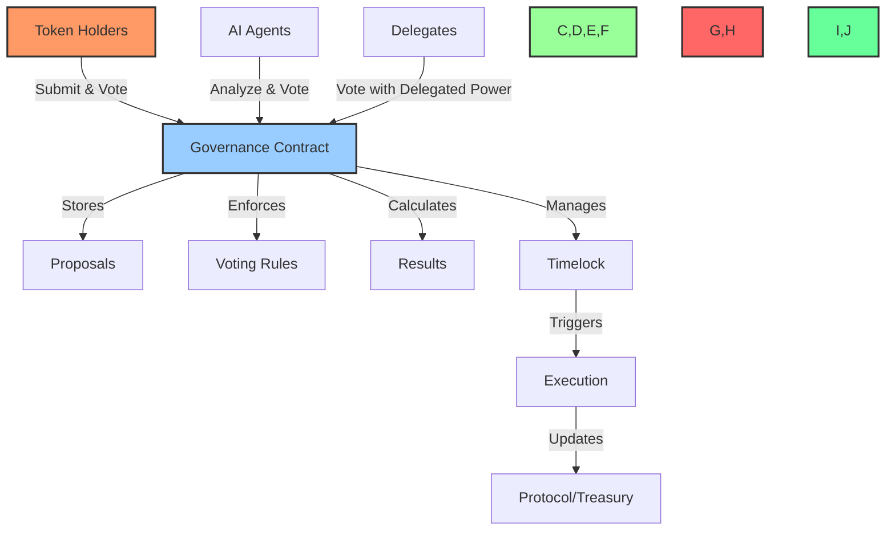
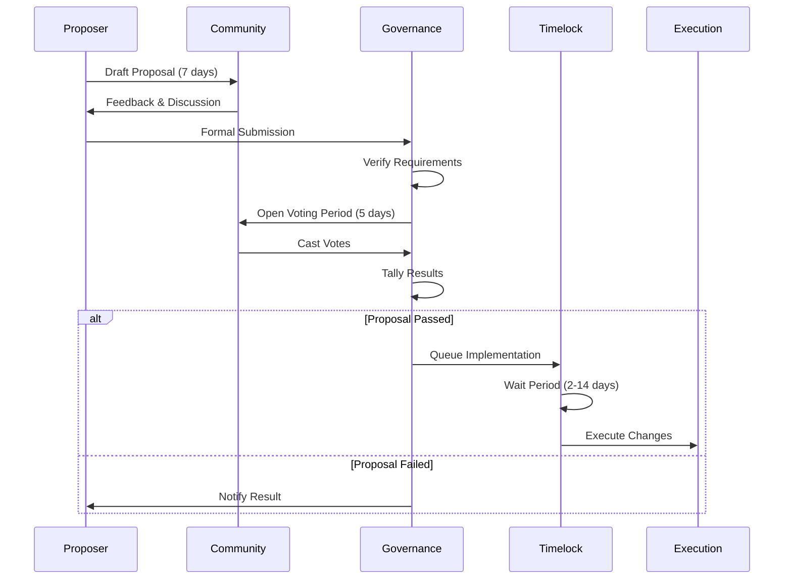
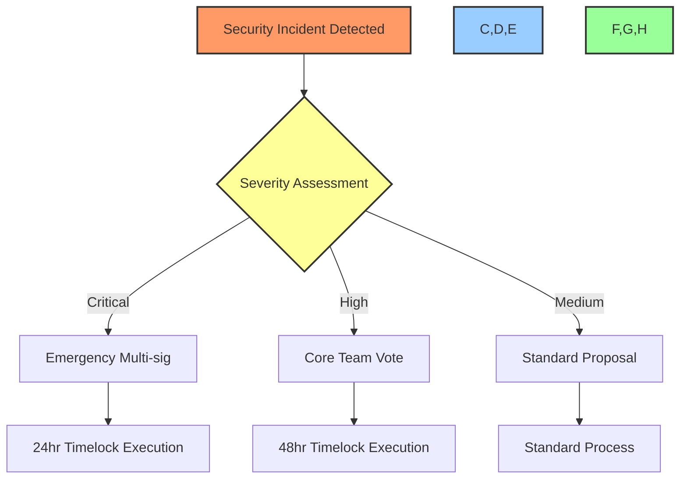
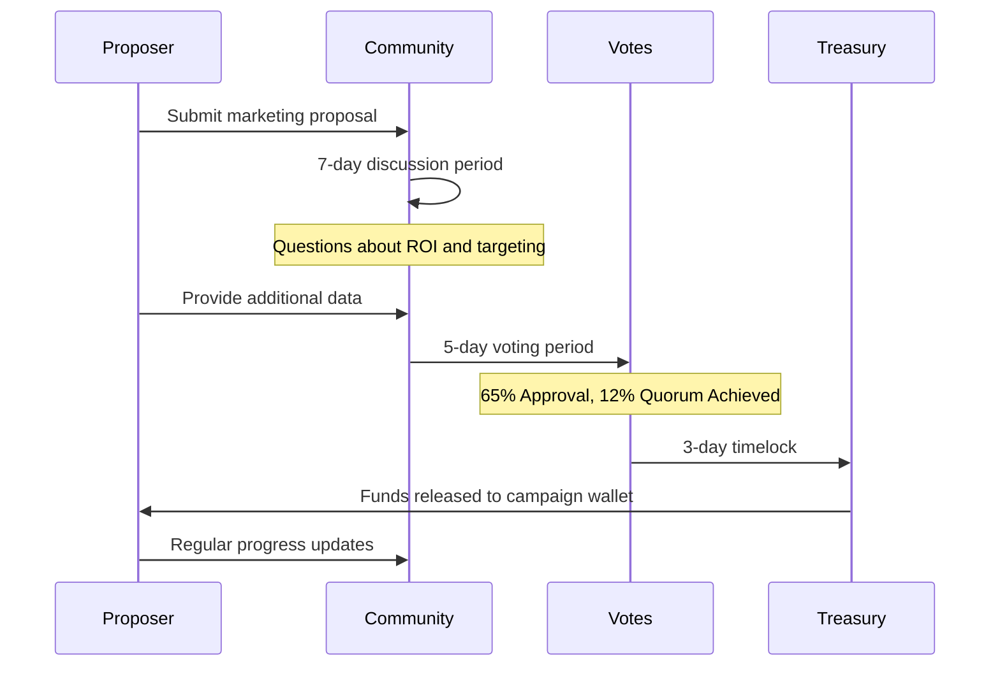
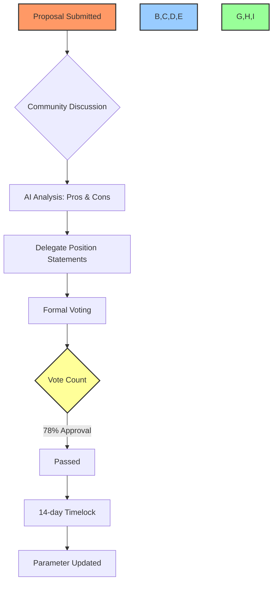
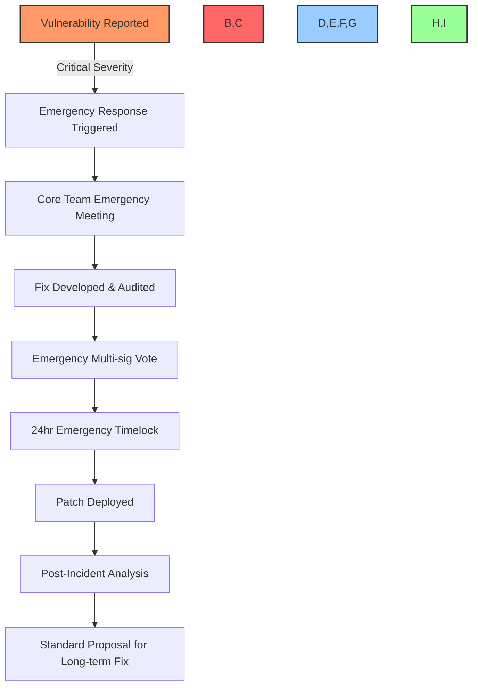

# 📋 BAD DAO Voting Guide

## Table of Contents
- [📚 Overview of Governance Voting](#-overview-of-governance-voting)
- [🏗️ BAD DAO Voting System Architecture](#️-bad-dao-voting-system-architecture)
- [📊 Proposal Categories & Thresholds](#-proposal-categories--thresholds)
- [⚖️ Voting Power & Calculation](#️-voting-power--calculation)
- [🗳️ Voting Process](#️-voting-process)
- [⏱️ Timelock & Implementation](#️-timelock--implementation)
- [🔐 Security Controls](#-security-controls)
- [🖥️ Voting Interface & Tools](#️-voting-interface--tools)
- [🤖 AI Governance Participation](#-ai-governance-participation)
- [📝 Example Voting Scenarios](#-example-voting-scenarios)
- [❓ Frequently Asked Questions](#-frequently-asked-questions)

## 📚 Overview of Governance Voting

### What is Governance Voting?

Governance voting is the primary decision-making process in the BAD DAO, allowing token holders to collectively determine the organization's direction, policies, treasury allocations, and operational decisions. Through voting, the DAO achieves decentralized governance where decisions reflect the collective will of the community rather than centralized authority.

### The Core Principles of BAD DAO Voting

The BAD DAO voting system is built on the following principles:

1. **Token-weighted Democracy**: Voting power is proportional to token holdings, ensuring stakeholders have influence relative to their stake
2. **Time-weighted Value**: Long-term holders receive enhanced voting power to reward commitment
3. **Delegation-enabled Expertise**: Token holders can delegate voting power to specialists
4. **Transparency & Accountability**: All votes are public, immutable, and require rationale
5. **Multi-level Security**: Tiered approval requirements based on proposal impact
6. **AI Augmentation**: AI systems enhance proposal quality and voting efficiency

## 🏗️ BAD DAO Voting System Architecture

The voting system consists of several key components working together:



### Core Components

1. **Governance Smart Contract**: The on-chain mechanism that handles proposal submission, voting, and execution
2. **Proposal Registry**: Stores all proposals and their metadata, status, and voting results
3. **Voting Engine**: Calculates voting power and tallies votes based on defined rules
4. **Timelock Controller**: Enforces waiting periods before implementing approved changes
5. **Execution Module**: Implements approved proposals with appropriate permissions

## 📊 Proposal Categories & Thresholds

BAD DAO uses different voting thresholds based on the impact and risk of various proposal types:

### Proposal Types & Requirements

```yaml
proposal_types:
  core_protocol_changes:
    description: "Modifications to core smart contracts or protocol parameters"
    approval_threshold: "70% approval"
    quorum: "15% of total voting power"
    timelock: "7 days"
    required_signers: "AI + Avery + Aziz + (Ruby or Fabian)"
    
  treasury_allocations:
    description: "Requests for funding from treasury"
    approval_threshold: "60% approval"
    quorum: "10% of total voting power"
    timelock: "3 days (<1% of treasury), 7 days (larger amounts)"
    required_signers: "AI + Lulu + Aziz + (Ruby, Fabian, or Avery)"
    
  governance_updates:
    description: "Changes to governance process or parameters"
    approval_threshold: "75% approval"
    quorum: "20% of total voting power"
    timelock: "14 days"
    required_signers: "5/6 Core Team Members (including AI)"
    
  working_group_formation:
    description: "Establishment of focused contributor teams"
    approval_threshold: "55% approval"
    quorum: "5% of total voting power"
    timelock: "2 days"
    required_signers: "AI + 2 others"
    
  operational_changes:
    description: "Everyday operational decisions and processes"
    approval_threshold: "Simple majority (>50%)"
    quorum: "5% of total voting power"
    timelock: "2 days"
    required_signers: "AI + 2 others"
```

### Proposal Submission Requirements

To submit a proposal, the proposer must meet minimum requirements:

- **Token Threshold**: Hold or have delegated at least 0.1% of total token supply
- **Format Compliance**: Follow the standard proposal template format
- **Completeness**: Include all required fields for the proposal type
- **Disclosure**: Declare any conflicts of interest or related prior proposals

## ⚖️ Voting Power & Calculation

### Base Voting Power

In the BAD DAO governance system:

- 1 BAD token = 1 base vote
- Voting power can be delegated without transferring token ownership
- All token holders can participate in governance votes

### Time-Weighted Voting

The BAD DAO implements time-weighted voting to reward long-term holders:

```yaml
time_weighted_voting:
  30_day_holding: "1.2x multiplier"
  90_day_holding: "1.5x multiplier"
  180_day_holding: "2.0x multiplier"
```

### Role-Based Multipliers

Certain roles receive voting weight multipliers to reflect their specialized knowledge:

```yaml
role_multipliers:
  core_team: "1.5x on technical proposals"
  domain_experts: "1.25x on proposals in their domain"
  delegates: "Based on reputation score (1.0-1.3x)"
```

### Voting Power Formula

The full voting power calculation takes into account:

```
Voting Power = Base Tokens × Time Multiplier × Role Multiplier
```

For delegated voting power, the calculation preserves the delegator's time multiplier but applies the delegate's role multiplier.

## 🗳️ Voting Process

### Proposal Lifecycle



### Step-by-Step Voting Flow

1. **Discussion Phase** (7 days):
   - Initial proposal submitted to forum
   - Community feedback and discussion
   - AI agent analysis and recommendation
   - Proposal revisions by proposer

2. **Formal Submission**:
   - Final proposal submitted on-chain
   - System verifies submission requirements
   - Proposal assigned unique ID and tracking

3. **Voting Period** (5 days):
   - All token holders can cast votes (Yes/No/Abstain)
   - Delegates vote with delegated voting power
   - AI governance agents provide voting analysis
   - Live results visible throughout the period

4. **Results Determination**:
   - Votes tallied based on voting power
   - Quorum requirement checked
   - Approval threshold verified
   - Result finalized and recorded

5. **Post-Approval Process**:
   - Passed proposals enter timelock period
   - Required signers authorize implementation
   - Changes executed after timelock expires
   - Implementation verification performed

### Voting Options

For each proposal, voters have the following options:

- **✅ Approve**: Vote in favor of the proposal
- **❌ Reject**: Vote against the proposal
- **🟡 Abstain**: Counted for quorum but not for approval percentage
- **⚪ Neither**: Not counted (equivalent to not voting)

## ⏱️ Timelock & Implementation

### Purpose of Timelocks

Timelocks serve several critical functions in the governance system:

1. **Security Buffer**: Allows time to detect and respond to malicious proposals
2. **Economic Consideration**: Gives market time to react to significant changes
3. **Technical Preparation**: Enables preparation for implementation
4. **User Awareness**: Provides notice to users about upcoming changes

### Timelock Durations

```yaml
timelock_durations:
  minimum: "2 days for low-impact proposals"
  standard: "7 days for typical proposals"
  extended: "14 days for critical/constitutional changes"
  
  treasury_tiers:
    small: "24 hours for <1% of treasury"
    medium: "72 hours for 1-5% of treasury"
    large: "7 days for >5% of treasury"
```

### Implementation Execution

After the timelock period, implementation occurs through:

1. **Multi-signature Authorization**: Required signers provide approval
2. **Automated Execution**: Smart contract automatically executes the changes
3. **Verification Process**: System confirms successful implementation
4. **Status Update**: Proposal marked as implemented with transaction proof

## 🔐 Security Controls

### Multi-Signature Requirements

BAD DAO uses role-based multi-signature requirements to ensure security:

```yaml
multisig_requirements:
  smart_contract_change: "AI + Avery + Aziz + (Ruby or Fabian)"
  treasury_transfer: "AI + Lulu + Aziz + (Ruby, Fabian, or Avery)"
  operational_change: "AI + 2 others"
```

### Emergency Actions

For critical security incidents, an emergency response system exists:



### Anti-Takeover Protections

The system includes multiple protections against governance attacks:

1. **Distributed Authority**: No single entity can control decisions
2. **AI Validation**: AI agents analyze and flag suspicious proposals
3. **Graduated Thresholds**: Higher impact = higher requirements
4. **Time-Weighted Voting**: Prevents flash loan or market manipulation attacks
5. **Circuit Breakers**: Automatic protection triggers for unusual activity

## 🖥️ Voting Interface & Tools

### Voting Dashboard

The BAD DAO voting interface provides:

- **Active Proposals**: List of all proposals currently in voting phase
- **Proposal Details**: Comprehensive information on each proposal
- **Voting Controls**: Simple interface for casting votes
- **Your Voting Power**: Display of current voting power and options
- **History & Analytics**: Record of past votes and governance metrics

### Supporting Tools

Complementary tools enhance the voting experience:

- **Proposal Calendar**: Timeline of upcoming governance events
- **Delegation Manager**: Interface for managing vote delegation
- **Voting Simulator**: Tool to estimate proposal outcomes
- **Notification System**: Alerts for new proposals and voting deadlines
- **Mobile Access**: Responsive design for on-the-go participation

## 🤖 AI Governance Participation

### AI Voting Agents

BAD DAO incorporates specialized AI agents in the governance process:

```yaml
ai_governance:
  voting_power: "Limited to 10% of total"
  proposal_analysis: "Comprehensive analysis of all proposals"
  voting_recommendations: "Data-driven suggestions with rationale"
  treasury_monitoring: "Real-time treasury activity oversight"
```

### AI Voting Rules

AI participation follows strict rules:

1. AI agents may vote on all proposals, including self-generated ones
2. AI voting power is capped at 10% of total voting power
3. AI votes follow programmatic rules approved by governance
4. AI-generated proposals require at least 3 human votes from qualified roles
5. AI votes include transparent, on-chain rationale for decisions
6. AI voting patterns undergo regular audits for bias and alignment

### AI-Human Collaboration

The governance system leverages both AI and human intelligence:

- AI provides objective, data-driven analysis
- Humans contribute subjective judgment and values
- AI flags potential issues in complex proposals
- Humans make final decisions on critical matters
- AI ensures consistency and institutional memory
- Humans guide overall direction and principles

## 📝 Example Voting Scenarios

### Scenario 1: Treasury Allocation Proposal

**Example Proposal**: Request for $50,000 from treasury for marketing campaign



**Outcome**:
- Proposal passes with 65% approval and meets 10% quorum requirement
- 3-day timelock due to treasury amount (<1%)
- Funds released after Treasury multi-sig authorization
- Implementation includes reporting requirements

### Scenario 2: Governance Parameter Change

**Example Proposal**: Adjust voting period from 5 days to 7 days



**Outcome**:
- High approval rate (78%) exceeds the 75% threshold for governance changes
- Extended 14-day timelock for governance parameter changes
- Implementation requires code update to governance contract
- Change applies to all future proposals

### Scenario 3: Emergency Security Response

**Example Scenario**: Critical vulnerability discovered in smart contract



**Outcome**:
- Emergency response bypasses standard proposal process
- Core team and security experts develop immediate fix
- 24-hour emergency timelock instead of standard timelock
- Emergency multi-sig authorization (AI + required signers)
- Post-incident analysis and regular proposal for permanent solution

## ❓ Frequently Asked Questions

### General Voting Questions

**Q: How do I know when it's time to vote on proposals?**  
A: The BAD DAO governance dashboard shows all active proposals, and you can opt in to receive notifications when new proposals enter the voting phase.

**Q: Can I change my vote after submitting it?**  
A: Yes, you can change your vote at any time during the active voting period. The most recent vote is the one that counts.

**Q: What happens if a proposal doesn't reach quorum?**  
A: If a proposal doesn't reach the required quorum, it automatically fails, regardless of the approval percentage. The proposer can resubmit with modifications after the standard waiting period.

### Technical Voting Questions

**Q: How is quorum calculated?**  
A: Quorum is calculated as a percentage of the total voting power (all tokens in circulation). Both "Yes" and "No" votes count toward quorum, as do "Abstain" votes.

**Q: Does delegating my voting power affect my ability to vote directly?**  
A: Yes, when you delegate your voting power, your delegate votes on your behalf. You cannot vote directly while your tokens are delegated, unless you first undelegate (subject to the 7-day timelock).

**Q: How are vote results calculated?**  
A: Approval percentage is calculated as: (Yes Votes) ÷ (Yes Votes + No Votes) × 100%. Abstain votes count for quorum but not for approval calculation.

### Proposal and Implementation Questions

**Q: Can a proposal be canceled after submission?**  
A: Proposers can cancel their proposals during the discussion phase but not after formal on-chain submission unless there is a critical flaw identified (requiring core team intervention).

**Q: What happens if a proposal passes but can't be implemented?**  
A: If technical issues prevent implementation, the core team will submit an implementation failure report. The proposer can then submit a modified proposal addressing the issues.

**Q: Can the timelock be shortened for urgent matters?**  
A: Yes, through the emergency response system for critical security issues. Ordinary proposals cannot have shortened timelocks unless the governance parameters themselves have been modified through a governance proposal.

---

This guide will be updated as the BAD DAO voting system evolves. For questions or suggestions, please submit them through the governance forum or directly to the core team.

*Last updated: 2023-05-01* 