# 📊 BAD DAO: Voting Recommendation Agent

## 📋 Table of Contents
- [🔍 Overview](#-overview)
- [🎯 Core Purpose](#-core-purpose)
- [⚙️ Functional Architecture](#️-functional-architecture)
- [🧠 Recommendation Methodology](#-recommendation-methodology)
- [📊 Data Analysis Components](#-data-analysis-components)
- [📝 Recommendation Outputs](#-recommendation-outputs)
- [🔗 Integration with Governance System](#-integration-with-governance-system)
- [👥 Human Oversight](#-human-oversight)
- [📈 Performance Metrics](#-performance-metrics)
- [🛡️ Bias Prevention & Ethics](#️-bias-prevention--ethics)
- [🔮 Future Enhancements](#-future-enhancements)

## 🔍 Overview

The Voting Recommendation Agent is a specialized AI system that generates data-driven governance recommendations to support informed decision-making within the BAD DAO. Working in concert with the Proposal Analyzer Agent, it transforms analytical data into actionable voting guidance while maintaining transparency about its reasoning process.

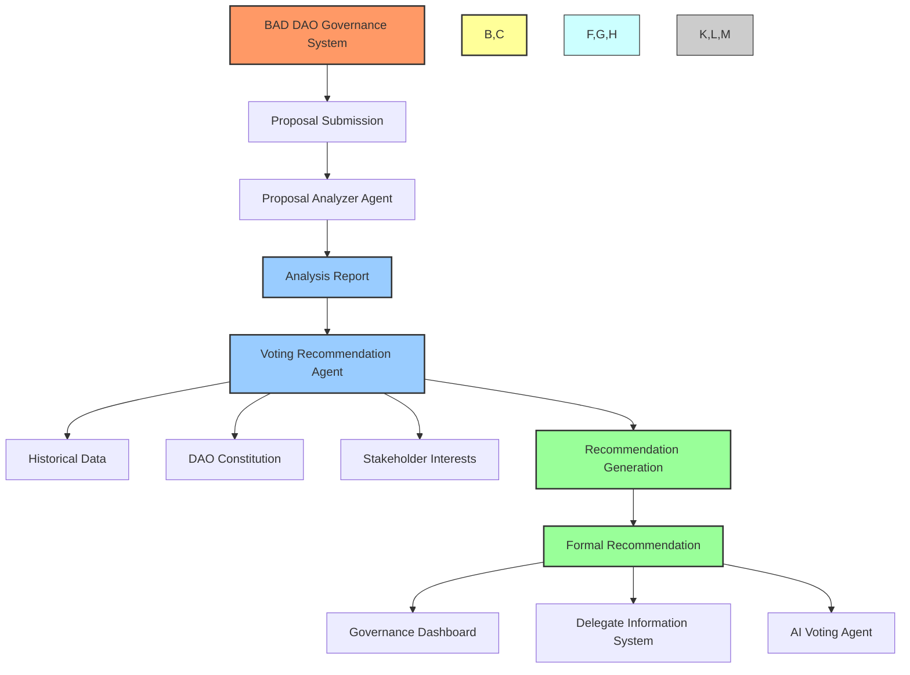

The Voting Recommendation Agent serves as a crucial bridge between raw analytical data and actionable governance decisions. By synthesizing complex information and presenting clear, evidence-based recommendations, it enhances the governance process while ensuring that all stakeholders have access to objective guidance.

## 🎯 Core Purpose

The Voting Recommendation Agent exists to:

1. **💡 Provide Guidance**: Deliver clear, actionable voting recommendations based on objective analysis
2. **🧩 Synthesize Complexity**: Convert detailed analytical results into accessible guidance
3. **⚖️ Ensure Balanced Analysis**: Present both supporting and opposing viewpoints
4. **🔎 Surface Key Considerations**: Highlight critical factors that may influence voting decisions
5. **🔗 Connect to Precedent**: Relate current proposals to historical decisions and outcomes
6. **📚 Educate Stakeholders**: Improve governance literacy through explanation and context
7. **🛡️ Minimize Bias**: Reduce human cognitive biases in governance decision-making

## ⚙️ Functional Architecture

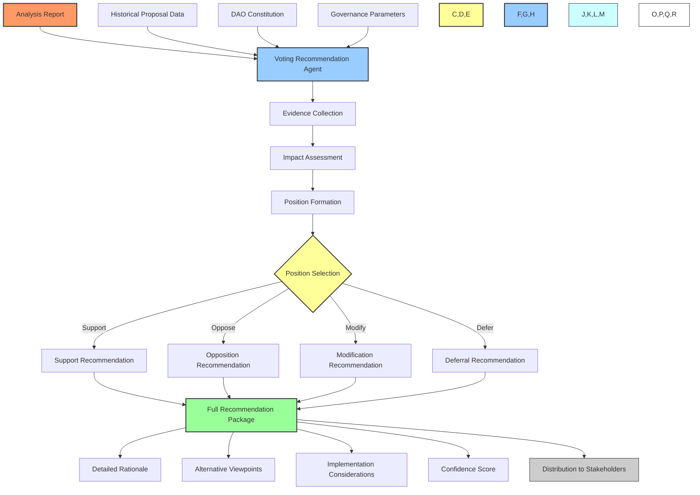

### Processing Pipeline

1. **📥 Input Processing**
   - Receives detailed analysis report from Proposal Analyzer
   - Loads relevant historical data and precedents
   - Retrieves applicable governance parameters and guidelines
   - Accesses DAO constitution and principles

2. **🧮 Evidence Collection**
   - Extracts key points from analysis report
   - Identifies relevant precedents from historical data
   - Gathers applicable constitutional principles
   - Compiles stakeholder impact information

3. **⚖️ Impact Assessment**
   - Evaluates consequences of approval or rejection
   - Assesses alignment with strategic objectives
   - Considers trade-offs and opportunity costs
   - Analyzes stakeholder impacts

4. **📋 Position Formation**
   - Weighs evidence for and against proposal
   - Applies decision framework based on proposal type
   - Generates confidence score for recommendation
   - Identifies potential modifications if applicable

5. **📝 Recommendation Compilation**
   - Formulates clear position statement
   - Provides detailed rationale for recommendation
   - Presents alternative viewpoints and considerations
   - Includes implementation guidance if approved
   - Attaches confidence score and contextual information

6. **🔄 Distribution**
   - Publishes recommendation to governance dashboard
   - Sends notification to relevant stakeholders
   - Provides data to AI Voting Agent
   - Archives recommendation with proposal

## 🧠 Recommendation Methodology

The Voting Recommendation Agent employs specialized methodologies based on proposal types:

### 🔧 Technical Proposal Methodology

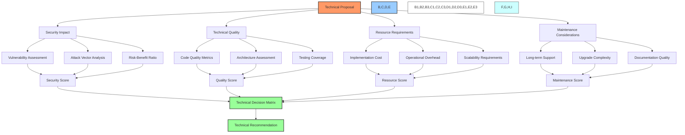

- **🔒 Security-First Approach**: Prioritizes protection against vulnerabilities and exploits
- **⚡ Performance Impact Analysis**: Evaluates effects on system performance and efficiency
- **🔄 Integration Assessment**: Considers compatibility with existing systems
- **🧪 Test Coverage Review**: Evaluates thoroughness of testing and edge case handling

### 💰 Economic Proposal Methodology

- **📊 ROI-Based Evaluation**: Calculates expected return on investment with confidence intervals
- **🏦 Treasury Health Prioritization**: Considers long-term treasury sustainability
- **🪙 Token Value Assessment**: Analyzes impact on token utility and value
- **⚖️ Opportunity Cost Analysis**: Compares against alternative capital allocations

### 🏛️ Governance Proposal Methodology

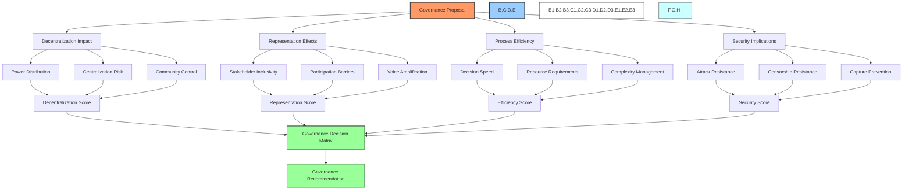

- **🗳️ Decentralization Focus**: Evaluates impact on power distribution within the DAO
- **👥 Representation Analysis**: Assesses effects on different stakeholder groups
- **⚡ Efficiency Enhancement**: Considers improvements to governance processes
- **🛡️ Governance Security**: Analyzes resistance to governance attacks

### 👥 Community Proposal Methodology

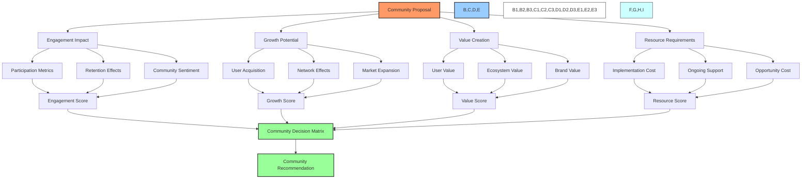

- **💬 Engagement Optimization**: Focuses on maximizing community participation
- **🌱 Growth-Oriented Analysis**: Evaluates potential to expand ecosystem
- **👍 Value-to-User Emphasis**: Assesses direct benefits to community members
- **📊 Measurability Review**: Considers how outcomes can be tracked and verified

## 📊 Data Analysis Components

The Voting Recommendation Agent employs multiple analytical components to generate recommendations:

### 📈 Historical Pattern Analysis

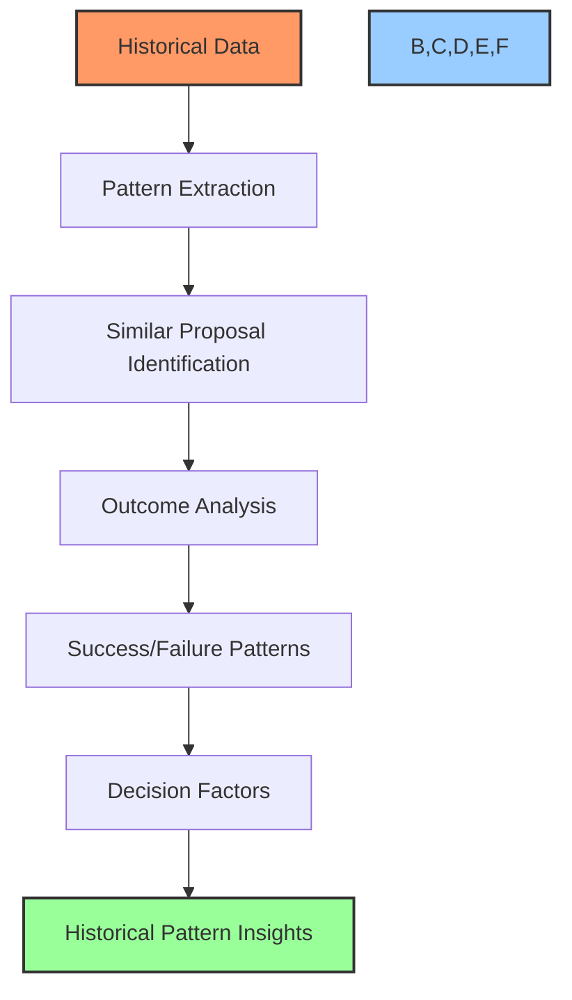

- **🔄 Pattern Recognition**: Identifies recurring patterns in proposal characteristics
- **📊 Outcome Correlation**: Maps proposal attributes to historical outcomes
- **🧮 Success Factor Analysis**: Identifies elements common to successful proposals
- **⚠️ Failure Warning Detection**: Flags similarities to previously rejected proposals
- **📉 Implementation Tracking**: Analyzes post-approval implementation success

### 🔮 Impact Projection

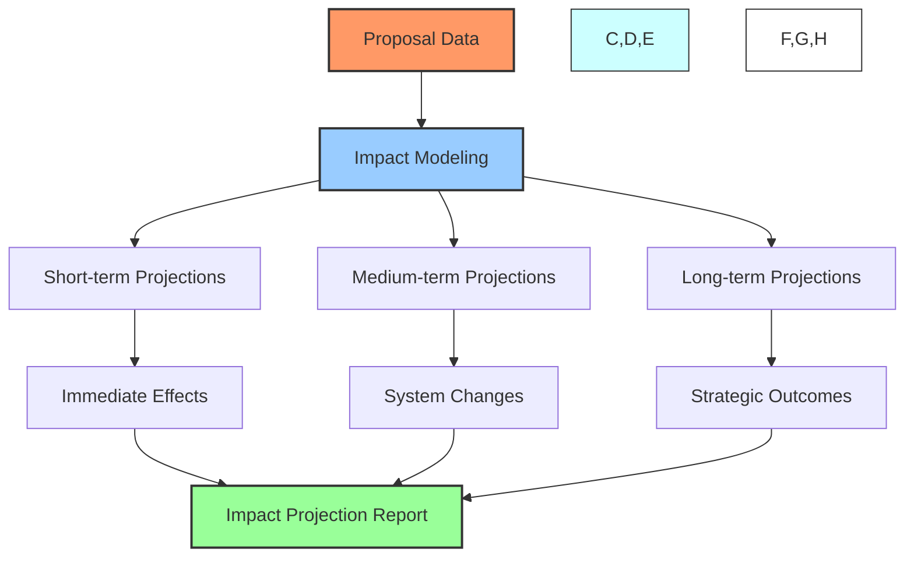

- **📊 Quantitative Modeling**: Mathematical projections of proposal outcomes
- **🔄 System Dynamics**: Analysis of cascading effects throughout the ecosystem
- **⏱️ Time-Horizon Analysis**: Short, medium, and long-term impact assessment
- **👥 Stakeholder Impact Maps**: Projection of effects on different user groups
- **🧬 Scenario Simulation**: Multiple scenario modeling with probability weighting

### 📐 Principle Alignment

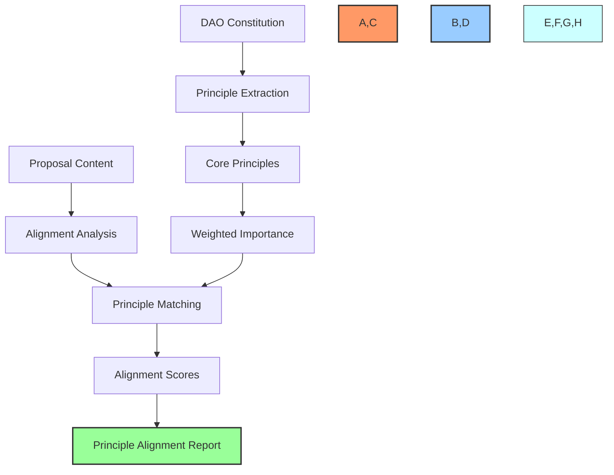

- **📜 Constitutional Mapping**: Evaluation against core DAO principles
- **🧭 Mission Alignment**: Assessment of consistency with organizational mission
- **🔎 Value Consistency**: Checks for alignment with stated DAO values
- **🎯 Strategic Fit**: Analysis of contribution to strategic objectives
- **⚖️ Trade-off Evaluation**: Balancing of competing principles when in tension

### 🧠 Precedent Analysis

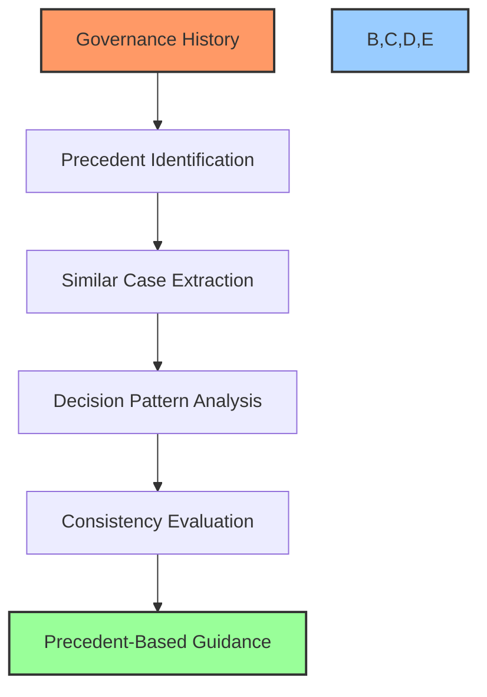

- **📚 Case Library**: Database of previous governance decisions
- **🔎 Similarity Matching**: Identification of relevant historical precedents
- **⚖️ Decision Consistency**: Evaluation of alignment with past decisions
- **⚠️ Divergence Flagging**: Identification of departures from precedent
- **📝 Rationale Comparison**: Analysis of reasoning in similar historical cases

## 📝 Recommendation Outputs

The Voting Recommendation Agent produces structured outputs tailored to different stakeholder needs:

### 📋 Standard Recommendation Structure

```mermaid
graph TD
    A[Complete Recommendation] --> B[Executive Summary]
    A --> C[Position Statement]
    A --> D[Detailed Rationale]
    A --> E[Alternative Views]
    A --> F[Implementation Guidance]
    A --> G[Risk Assessment]
    
    B --> B1[Recommendation Type]
    B --> B2[Confidence Score]
    B --> B3[Key Considerations]
    
    C --> C1[Clear Position]
    C --> C2[Decision Basis]
    C --> C3[Qualifying Factors]
    
    D --> D1[Supporting Evidence]
    D --> D2[Precedent Citations]
    D --> D3[Analysis References]
    
    E --> E1[Counter-Arguments]
    E --> E2[Alternative Approaches]
    E --> E3[Trade-off Analysis]
    
    F --> F1[Execution Considerations]
    F --> F2[Success Metrics]
    F --> F3[Monitoring Guidance]
    
    G --> G1[Key Risks]
    G --> G2[Mitigation Suggestions]
    G --> G3[Warning Indicators]
    
    style A fill:#9cf,stroke:#333,stroke-width:2px
    style B,C,D,E,F,G fill:#cff,stroke:#333,stroke-width:1px
    style B1,B2,B3,C1,C2,C3,D1,D2,D3,E1,E2,E3,F1,F2,F3,G1,G2,G3 fill:#fff,stroke:#333,stroke-width:1px
```

1. **📌 Executive Summary**
   - Concise recommendation overview (1-2 paragraphs)
   - Recommendation type (Support, Oppose, Modify, Defer)
   - Confidence score (0-100 with uncertainty range)
   - Key deciding factors

2. **👍 Position Statement**
   - Clear statement of recommendation position
   - Primary basis for the decision
   - Any qualifying conditions or caveats

3. **📝 Detailed Rationale**
   - Comprehensive explanation of reasoning
   - Supporting evidence and data points
   - Reference to analysis results
   - Historical precedent citations

4. **⚖️ Alternative Viewpoints**
   - Counter-arguments to recommendation
   - Valid opposing perspectives
   - Trade-offs and opportunity costs
   - Consideration of minority stakeholder interests

5. **📋 Implementation Guidance** (for supported proposals)
   - Key execution considerations
   - Success metrics and monitoring suggestions
   - Potential improvements or optimizations
   - Timeline and resource recommendations

6. **⚠️ Risk Assessment**
   - Primary risks if recommendation is followed
   - Suggested mitigation strategies
   - Warning indicators to monitor
   - Contingency suggestions

### 💯 Confidence Scoring System

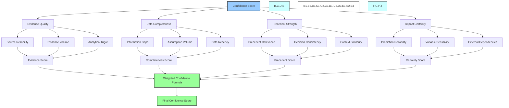

The confidence score provides a numerical representation (0-100) of the recommendation's reliability:

- **90-100**: Very High Confidence - Comprehensive evidence, strong precedent, high certainty
- **75-89**: High Confidence - Substantial evidence, relevant precedent, good certainty
- **60-74**: Moderate Confidence - Adequate evidence, some precedent, reasonable certainty
- **40-59**: Low Confidence - Limited evidence, weak precedent, significant uncertainty
- **0-39**: Very Low Confidence - Minimal evidence, no precedent, highly uncertain

### 🗂️ Recommendation Types

The agent provides four primary recommendation types:

1. **👍 Support Recommendation**
   - Clear endorsement of the proposal
   - Evidence of positive impact
   - Implementation guidance
   - Risk mitigation strategies

2. **👎 Oppose Recommendation**
   - Clear recommendation against the proposal
   - Evidence of potential negative impacts
   - Alternative approaches suggestion
   - Explanation of critical concerns

3. **🔄 Modify Recommendation**
   - Conditional support with specific changes
   - Identified improvement opportunities
   - Detailed modification suggestions
   - Implementation path with modifications

4. **⏱️ Defer Recommendation**
   - Suggestion to delay decision
   - Explanation of additional information needed
   - Process for resolving uncertainty
   - Timeline for reconsideration

## 🔗 Integration with Governance System

The Voting Recommendation Agent interfaces with multiple components of the BAD DAO governance system:

```mermaid
graph TD
    A[Voting Recommendation Agent] --> B[Governance Dashboard]
    A --> C[Delegate Interface]
    A --> D[Mobile Notification System]
    A --> E[AI Voting Agent]
    A --> F[Discussion Forum]
    
    B --> B1[Recommendation Display]
    B --> B2[Voting Interface]
    B --> B3[Analytics Dashboard]
    
    C --> C1[Delegate Briefings]
    C --> C2[Delegation Analytics]
    C --> C3[Voting History]
    
    D --> D1[Alert Notifications]
    D --> D2[Recommendation Summaries]
    D --> D3[Vote Reminders]
    
    E --> E1[Recommendation Data Feed]
    E --> E2[Vote Alignment Analysis]
    E --> E3[Decision Framework]
    
    F --> F1[Discussion Context]
    F --> F2[Community Feedback]
    F --> F3[Q&A Support]
    
    style A fill:#f96,stroke:#333,stroke-width:2px
    style B,C,D,E,F fill:#9cf,stroke:#333,stroke-width:2px
    style B1,B2,B3,C1,C2,C3,D1,D2,D3,E1,E2,E3,F1,F2,F3 fill:#fff,stroke:#333,stroke-width:1px
```

### Key Integration Points

1. **🖥️ Governance Dashboard**
   - Recommendation presentation in user interface
   - Interactive exploration of rationale
   - Visual representation of confidence and reasoning
   - Integration with voting interface

2. **👥 Delegate Information System**
   - Specialized delegate briefings
   - Comprehensive recommendation packages
   - Delegation impact analysis
   - Historical voting pattern comparison

3. **📱 Mobile Notification System**
   - Alert delivery for new recommendations
   - Concise mobile-optimized summaries
   - Time-sensitive voting reminders
   - Quick-view decision support

4. **🤖 AI Voting Agent**
   - Structured data feed for automated voting
   - Decision framework alignment
   - Vote correlation analysis
   - Feedback loop for recommendation improvement

5. **💬 Discussion Forum**
   - Context for community deliberation
   - Reference material for discussions
   - Clarification of recommendation rationale
   - Q&A support for governance participants

## 👥 Human Oversight

To ensure recommendations remain aligned with community values and expectations, multiple human oversight mechanisms are implemented:

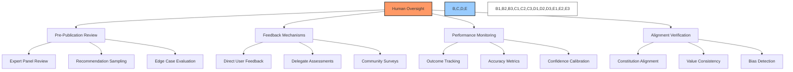

### Oversight Mechanisms

1. **👁️ Pre-Publication Review**
   - Expert panel review of high-impact recommendations
   - Random sampling of recommendations for quality control
   - Special evaluation process for edge cases and novel situations
   - Manual review of recommendations with low confidence scores

2. **💬 Feedback Collection**
   - Structured feedback mechanism for governance participants
   - Regular assessment by delegate committee
   - Community surveys on recommendation quality
   - Direct improvement suggestions from stakeholders

3. **📈 Performance Monitoring**
   - Tracking of recommendation outcomes over time
   - Accuracy metrics comparing recommendations to final decisions
   - Confidence score calibration based on historical precision
   - Identification of systematic biases or blind spots

4. **🔄 Continuous Improvement**
   - Regular model updates based on feedback and performance
   - Parameter adjustment to align with community expectations
   - Documentation of recommendation methodology evolution
   - Transparent reporting on improvement initiatives

## 📈 Performance Metrics

The Voting Recommendation Agent is evaluated against key performance indicators:

### Quality Metrics

- **🎯 Decision Alignment**: Correlation between recommendations and final governance decisions
- **📊 Outcome Correlation**: Alignment between predicted and actual proposal impacts
- **⏱️ Long-term Accuracy**: Correctness of impact projections over extended timeframes
- **🧩 Comprehensiveness**: Coverage of all relevant considerations in recommendations
- **📜 Principle Consistency**: Alignment with DAO constitutional principles

### User Experience Metrics

- **👍 User Satisfaction**: Stakeholder rating of recommendation helpfulness
- **📚 Comprehensibility**: Clarity and accessibility of recommendation rationale
- **🔍 Usefulness**: Reported impact on decision-making process
- **⚡ Response Speed**: Time from proposal analysis to recommendation publication
- **🔄 Adaptation Speed**: Responsiveness to feedback and changing conditions

### Operational Metrics

- **📉 Error Rate**: Frequency of significant errors or oversights
- **🔄 Consistency**: Similar recommendations for similar proposals
- **💻 Resource Efficiency**: Computational resources required for recommendation generation
- **⚡ Processing Time**: Duration of recommendation generation process
- **📊 Quality Variation**: Consistency of recommendation quality across proposal types

## 🛡️ Bias Prevention & Ethics

The Voting Recommendation Agent implements multiple safeguards to prevent bias and ensure ethical operation:

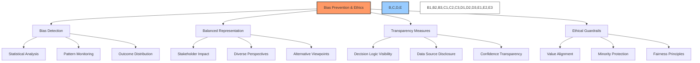

### Bias Prevention Mechanisms

1. **🔍 Systematic Bias Detection**
   - Regular statistical analysis of recommendation patterns
   - Monitoring of outcome distribution across stakeholder groups
   - Tracking of recommendation alignment with different interests
   - Third-party bias audits and evaluations

2. **⚖️ Balanced Representation**
   - Explicit consideration of diverse stakeholder perspectives
   - Inclusion of minority viewpoints in recommendation rationale
   - Equal weighting of similar inputs regardless of source
   - Active countering of status quo bias

3. **👁️ Transparency Requirements**
   - Complete visibility into decision-making logic
   - Full disclosure of data sources and precedents used
   - Clear explanation of confidence levels and uncertainty
   - Documentation of methodology and any limitations

4. **🛡️ Ethical Standards**
   - Constitutional alignment with DAO values
   - Protection of minority stakeholder interests
   - Fairness principles embedded in decision frameworks
   - Regular ethical review of recommendation patterns

## 🔮 Future Enhancements

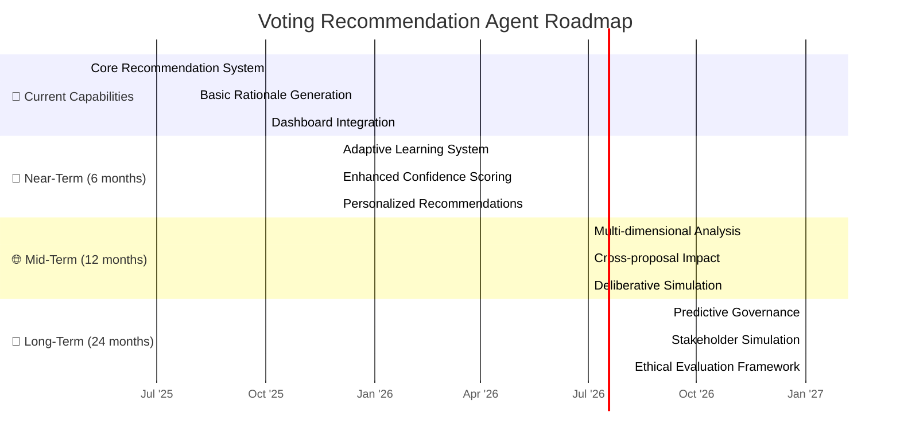

### Planned Enhancements

1. **🧠 Adaptive Learning System (Q1 2026)**
   - Dynamic adjustment based on governance outcomes
   - Personalized recommendation targeting based on role
   - Feedback-driven improvement of decision models
   - Self-calibrating confidence scoring

2. **📊 Multi-dimensional Analysis (Q3 2026)**
   - Complex interrelationship mapping between proposals
   - System-wide impact analysis across multiple dimensions
   - Temporal analysis showing effects over different timeframes
   - Stakeholder-specific impact projections

3. **🔮 Deliberative Simulation (Q1 2027)**
   - Virtual deliberation processes simulating discussion
   - Modeling of various stakeholder perspectives
   - Dynamic adjustment based on simulated debate
   - Identification of consensus-building opportunities

4. **🧩 Predictive Governance (Q3 2027)**
   - Anticipation of future governance needs
   - Proactive recommendation generation
   - Strategic sequence optimization for related proposals
   - Long-term governance path optimization

---

*This document provides a comprehensive overview of the BAD DAO Voting Recommendation Agent. For technical specifications, implementation details, and integration guidelines, please refer to the technical implementation documentation.*

*Version: 1.0*  
*Last Updated: May 2025*  
*Document Owner: BAD DAO Technical Committee* 