# 🌍 BAD DAO Community Engagement Strategy

**Date**: May 15, 2024  
**Author**: BAD DAO Core Team  
**Version**: 1.0  
**Status**: 🟡 Draft for Review

## 📋 Table of Contents
- [🔍 Executive Summary](#-executive-summary)
- [🎯 Strategic Objectives](#-strategic-objectives)
- [👥 Value-Centric Engagement Model](#-value-centric-engagement-model)
- [🗺️ Four-Year Completionist Framework](#-four-year-completionist-framework)
- [🧩 Role Definitions and Responsibilities](#-role-definitions-and-responsibilities)
- [💰 Contributor Compensation Framework](#-contributor-compensation-framework)
- [🛡️ Anti-Monopolization Measures](#-anti-monopolization-measures)
- [📝 Proposal Process](#-proposal-process)
- [🔄 Role Interaction Workflows](#-role-interaction-workflows)
- [📊 Key Performance Indicators](#-key-performance-indicators)
- [🛠️ Actionable Framework Implementation](#-actionable-framework-implementation)
- [📅 12-Month Campaign Calendar](#-12-month-campaign-calendar)
- [📣 Call-to-Action Templates](#-call-to-action-templates)

## 🔍 Executive Summary

The BAD DAO Community Engagement Strategy establishes a new paradigm for decentralized community building that centers on value contribution rather than token speculation. This strategy transforms traditional community engagement models by requiring all participation to be backed by tangible contributions of knowledge, work, or resources.

```mermaid
graph TD
    A[🌍 Community Engagement Strategy] --> B[🎯 Value Contribution]
    A --> C[👥 Role-Based Structure]
    A --> D[🗺️ Four-Year Framework]
    A --> E[💰 Contribution-Driven Rewards]
    
    B --> B1[🧠 Knowledge Contribution]
    B --> B2[👩‍💻 Work Contribution]
    B --> B3[💼 Resource Contribution]
    
    C --> C1[👑 Core Team]
    C --> C2[🛠️ Contributors]
    C --> C3[🏢 Board of Directors]
    C --> C4[🧑‍💼 Delegates]
    
    D --> D1[🌱 Season 1-4: Foundation]
    D --> D2[🌿 Season 5-8: Growth]
    D --> D3[🌲 Season 9-12: Expansion]
    D --> D4[🌳 Season 13-16: Maturity]
    
    E --> E1[🏆 Token Rewards]
    E --> E2[💸 Financial Compensation]
    E --> E3[🔝 Reputation Building]
    
    style A fill:#f96,stroke:#333,stroke-width:2px
    style B,C,D,E fill:#9cf,stroke:#333,stroke-width:2px
    style B1,B2,B3,C1,C2,C3,C4,D1,D2,D3,D4,E1,E2,E3 fill:#fff,stroke:#333,stroke-width:1px
```



This strategy rejects the passive "airdrop hunter" mentality and embraces an active "value builder" approach. By implementing a comprehensive four-year completionist framework divided into 16 seasons, the BAD DAO creates a sustainable path to community growth and project evolution.

## 🎯 Strategic Objectives

The BAD DAO Community Engagement Strategy aims to:

1. **🏗️ Build a Value-First Community**: Create a community where every member contributes tangible value.
2. **🔄 Establish Sustainable Engagement Cycles**: Design participation mechanisms that create ongoing involvement rather than transactional interactions.
3. **🧭 Create Clear Progression Paths**: Provide transparent advancement routes for all community members.
4. **⚖️ Balance Fairness and Meritocracy**: Ensure equal access to opportunities while rewarding exceptional contributions.
5. **🛡️ Prevent Resource Centralization**: Implement measures to prevent excessive control by any individual or group.
6. **📈 Align Incentives Across Stakeholders**: Create rewards systems that benefit both individuals and the collective.
7. **🌱 Foster Organic Growth**: Prioritize authentic community building over artificial growth metrics.
8. **🔍 Enable Community Self-Regulation**: Establish mechanisms for the community to maintain its own standards.

## 👥 Value-Centric Engagement Model

The BAD DAO rejects the traditional "follow for airdrop" model and instead implements a value-centric engagement approach:


### Core Principles

1. **🎖️ Contribution Before Rewards**: All token distributions are tied to specific contributions.
2. **📚 Knowledge Building**: Educational resources prepare community members for meaningful participation.
3. **🧪 Progressive Testing**: Knowledge verification ensures participants understand the ecosystem.
4. **🤝 Mentorship Networks**: Experienced members guide newcomers through contribution paths.
5. **🏆 Recognition Systems**: Public acknowledgment of valuable contributions reinforces positive behaviors.
6. **📊 Transparent Metrics**: Clear measurement of contributions ensures fair reward distribution.
7. **🔄 Feedback Loops**: Regular assessment of engagement tactics drives continuous improvement.

## 🗺️ Four-Year Completionist Framework

The BAD DAO implements a four-year strategic framework divided into 16 seasons (3 months each), creating a clear roadmap for community evolution:


### Year One (2025-2026): Foundation

#### 🌱 Season 1: Community Formation (May-Jul 2025)
- Establish core community infrastructure
- Launch initial educational materials
- Create onboarding processes
- Recruit initial contributors

#### 📚 Season 2: Educational Foundation (Aug-Oct 2025)
- Expand educational content
- Launch learning incentive programs
- Develop contribution pathways
- Create knowledge verification systems

#### 🏛️ Season 3: Governance Activation (Nov 2025-Jan 2026)
- Transition to community governance
- Initiate first proposal rounds
- Establish delegation systems
- Create governance participation metrics

#### 👥 Season 4: Contributor Network (Feb-Apr 2026)
- Launch specialized working groups
- Implement contributor reputation systems
- Create mentorship programs
- Establish cross-functional collaboration frameworks

### Year Two (2026-2027): Growth

#### 🔄 Season 5: Ecosystem Integration (May-Jul 2026)
- Develop partnerships with complementary projects
- Create interoperability standards
- Launch ecosystem-wide initiatives
- Establish cross-DAO collaboration frameworks

#### 💡 Season 6: Innovation Programs (Aug-Oct 2026)
- Launch innovation funds
- Create incubation programs
- Establish research collectives
- Develop prototype testing frameworks

#### 🤝 Season 7: Partnership Development (Nov 2026-Jan 2027)
- Form strategic institutional partnerships
- Create integration frameworks
- Develop co-marketing initiatives
- Establish partnership governance models

#### 🚀 Season 8: Protocol Expansion (Feb-Apr 2027)
- Scale technical infrastructure
- Enhance protocol capabilities
- Implement advanced governance features
- Create multi-chain presence

### Years Three and Four continue this progression toward full decentralization and ecosystem maturity.

## 🧩 Role Definitions and Responsibilities

The BAD DAO community structure consists of clearly defined roles with specific responsibilities and requirements:

### 👑 Core Team

**Role Definition**: Founding members and full-time project leads responsible for strategic direction and core development.

**Responsibilities**:
- Setting strategic direction
- Maintaining core infrastructure
- Leading development initiatives
- Managing emergency response
- Representing the DAO in strategic partnerships

**Requirements**:
- Full-time commitment (min. 30 hours/week)
- Demonstrated expertise in relevant domains
- Minimum 1-year commitment
- Performance evaluation every quarter

**Compensation**:
- Monthly salary: $5,000 (USD equivalent)
- Token allocation: Per vesting schedule
- Performance bonuses tied to KPI achievement

### 🛠️ Contributors

**Role Definition**: Part-time participants who contribute specific skills, resources, or knowledge to the ecosystem.

**Responsibilities**:
- Delivering on accepted proposals
- Participating in governance
- Contributing to community knowledge base
- Mentoring new members

**Requirements**:
- Pass knowledge qualification tests
- Submit and complete approved proposals
- Maintain active participation metrics
- Adhere to contributor guidelines

**Compensation**:
- Project-based compensation per approved proposals
- Token allocation based on contribution value
- Reputation points toward role advancement

### 🏢 Board of Directors

**Role Definition**: Strategic advisors who provide expertise, oversight, and network connections.

**Responsibilities**:
- Providing strategic guidance
- Opening partnership opportunities
- Ensuring governance compliance
- Resolving high-level disputes
- Approving annual budgets

**Requirements**:
- Distinguished expertise in relevant fields
- Minimum quarterly participation in board meetings
- Strategic contribution to growth objectives
- No conflicts of interest

**Compensation**:
- Annual token allocation
- Performance-based incentives
- Expense coverage for official activities

### 🧑‍💼 Delegates

**Role Definition**: Governance specialists who research proposals and vote on behalf of token delegators.

**Responsibilities**:
- Analyzing all proposals in their domain
- Publishing voting rationales
- Maintaining high voting participation
- Communicating with delegators

**Requirements**:
- Pass advanced governance knowledge tests
- Maintain minimum 80% voting participation
- Publish analysis of all major proposals
- Disclose any conflicts of interest

**Compensation**:
- Delegation rewards from governance incentives
- Recognition in governance systems
- Access to specialized information channels

### 🤝 Partners

**Role Definition**: External organizations collaborating on mutual initiatives.

**Responsibilities**:
- Maintaining agreed integration points
- Co-developing shared initiatives
- Participating in cross-ecosystem governance
- Contributing to shared knowledge resources

**Requirements**:
- Formal partnership agreement
- Designated partnership liaison
- Quarterly collaboration reviews
- Transparent communication channels

**Compensation**:
- Revenue sharing on joint initiatives
- Co-marketing opportunities
- Integration benefits

### 💵 Sponsors

**Role Definition**: Financial supporters who contribute capital without direct operational involvement.

**Responsibilities**:
- Providing financial resources
- Offering domain expertise
- Opening network connections
- Participating in strategic reviews

**Requirements**:
- Minimum financial contribution thresholds
- Alignment with DAO values and objectives
- Transparent disclosure of support terms
- Non-interference in community governance

**Benefits**:
- Brand visibility in sponsored initiatives
- Access to ecosystem developments
- Attribution in supported projects
- Non-voting observer status in governance

### 💼 Investors

**Role Definition**: Capital providers in approved funding rounds with formalized terms.

**Responsibilities**:
- Providing investment capital
- Supporting growth initiatives
- Offering strategic guidance
- Respecting governance independence

**Requirements**:
- Compliance with investment terms
- Disclosure of investment interests
- Respect for decentralized governance
- Adherence to investor agreement terms

**Benefits**:
- Token allocation per investment terms
- Regular performance reporting
- Strategic update access
- Advisory board consideration

### 🏆 Bounty Developers

**Role Definition**: Technical contributors who complete specific, pre-defined development tasks.

**Responsibilities**:
- Delivering quality code for bounties
- Meeting specified requirements
- Documenting implementations
- Supporting integration of delivered features

**Requirements**:
- Technical skill verification
- Quality submission meeting standards
- Code documentation compliance
- Participation in review process

**Compensation**:
- Bounty-specific rewards
- Reputation building toward contributor status
- Recognition for completed work
- Consideration for future development opportunities

### 📣 Marketing Contributors

**Role Definition**: Content creators, community managers, and promoters who expand ecosystem awareness.

**Responsibilities**:
- Creating quality promotional materials
- Building community presence
- Representing the DAO accurately
- Expanding reach to target audiences

**Requirements**:
- Marketing skill verification
- Content approval process compliance
- Adherence to brand guidelines
- Regular activity reporting

**Compensation**:
- Task-specific rewards
- Audience growth incentives
- Content engagement bonuses
- Pathways to contributor status

## 💰 Contributor Compensation Framework

The BAD DAO implements a balanced compensation framework that rewards both token-based contributions and work effort:


### 🏆 Token Contribution (40%)

- **Token Delegation (15%)**: Rewards delegating tokens to active governance participants
- **Token Holding Duration (10%)**: Incentivizes long-term participation over speculation
- **Governance Participation (15%)**: Rewards active voting and proposal participation

### 👩‍💻 Work Effort (60%)

- **Task Completion (25%)**: Basic reward for completing assigned tasks
- **Quality Assessment (20%)**: Bonus based on quality evaluation of contributions
- **Complexity Factor (15%)**: Additional compensation based on task difficulty and expertise required

### 📊 Compensation Formula

```
Total Compensation = Base Rate × (
  (Token Delegation × 0.15) +
  (Token Holding × 0.10) +
  (Governance Score × 0.15) +
  (Task Completion × 0.25) +
  (Quality Score × 0.20) +
  (Complexity Multiplier × 0.15)
)
```

Where:
- Base Rate is determined by the type of contribution
- All factors are normalized to a 0-1 scale
- Quarterly reviews adjust individual factor weightings

## 🛡️ Anti-Monopolization Measures

To prevent excessive concentration of resources or influence, the BAD DAO implements several anti-monopolization measures:


### 🪙 Token Distribution Controls

- **Maximum Allocation**: No individual can receive more than 5% of seasonal token distributions
- **Diminishing Returns**: Rewards scale logarithmically with contribution size
- **Diversification Incentives**: Additional rewards for spreading tokens across delegates

### 🗳️ Voting Limitations

- **Quadratic Voting**: Implemented in certain proposal categories to limit large holder influence
- **Category Caps**: Maximum influence of 15% in any decision category
- **Cooldown Periods**: Mandatory periods between major governance actions

### 👥 Delegation Constraints

- **Maximum Delegation**: Delegates can only receive up to 10% of total delegated tokens
- **Mandatory Distribution**: Core Team must delegate to at least 5 different delegates
- **Transparency Requirements**: Public disclosure of large delegations

### 📋 Work Allocation Restrictions

- **Maximum Assignments**: Contributors limited to 3 concurrent major tasks
- **Varied Distribution**: No contributor can receive more than 20% of bounties in a season
- **Qualification Rotation**: Periodic reassessment of qualification status

### 🔄 Mandatory Role Rotation

- **Term Limits**: Maximum continuous service in leadership roles
- **Cooling Periods**: Mandatory breaks between terms
- **Cross-training Requirements**: Leaders must participate in varied capacities

## 📝 Proposal Process

The BAD DAO uses a structured proposal process to ensure quality, transparency, and effective decision-making:


### 💡 Ideation Phase

- Use idea template to capture initial concept
- Conduct preliminary community discussion
- Gather feedback on basic viability
- Identify potential collaborators

### 📝 Development Phase

- Create detailed proposal draft
- Include comprehensive implementation plan
- Define success metrics and timeline
- Calculate required resources and budget
- Identify risks and mitigation strategies

### ✅ Qualification Phase

- Pass automatic validation checks
- Complete required proposal sections
- Verify token-holding requirements
- Confirm proposal category alignment

### 📤 Submission Phase

- Format according to proposal standards
- Include all supporting documents
- Sign with cryptographic signature
- Submit through official channels

### 💬 Discussion Phase

- Minimum 7-day discussion period
- Structured Q&A with proposer
- Expert review for technical proposals
- Impact assessment preparation
- Revision based on community feedback

### 🗳️ Voting Phase

- 7-day voting period
- Different quorum requirements by category
- Results verification by observers
- Transparent vote counting and publication

### 🚀 Implementation Phase

- Assignment of responsible parties
- Resource allocation
- Progress tracking
- Regular status updates
- Change management process

### 🔍 Verification Phase

- Success metrics evaluation
- Deliverables quality assessment
- Budget utilization review
- Impact assessment
- Lessons learned documentation

## 🔄 Role Interaction Workflows

The BAD DAO establishes clear workflows for interaction between different roles:

### 🤝 Contributor Onboarding Workflow


### 📋 Proposal Review Workflow


### 💼 Task Allocation Workflow


### 🔍 Dispute Resolution Workflow


## 📊 Key Performance Indicators

The BAD DAO measures community engagement through multiple dimensions:

### 🌍 Community Health Metrics

- **Active Participant Ratio**: % of token holders actively participating
- **Retention Rate**: % of contributors remaining active after 3, 6, and 12 months
- **Knowledge Growth**: Increase in community quiz scores over time
- **Role Progression**: Number of members advancing between roles
- **Diversity Index**: Measurement of skill set and demographic diversity

### 🏗️ Contribution Metrics

- **Proposal Throughput**: Number of proposals processed successfully
- **Implementation Rate**: % of approved proposals that reach completion
- **Quality Score**: Average quality assessment of deliverables
- **Documentation Growth**: Expansion of knowledge base
- **Code Contribution**: Lines of code and technical documentation added

### 🗳️ Governance Metrics

- **Voting Participation**: % of eligible voters participating
- **Delegation Activity**: % of tokens actively delegated
- **Proposal Quality**: Score based on completeness and feasibility
- **Decision Efficiency**: Time from proposal to implementation
- **Consensus Level**: Average approval percentage across proposals

### 🔄 Engagement Loop Metrics

- **Feedback Rate**: % of contributions receiving feedback
- **Improvement Trends**: Progress on repeated quality assessments
- **Mentorship Activity**: Hours spent in mentorship relationships
- **Educational Completion**: Completion rates for educational modules
- **Cross-functional Collaboration**: Rate of multi-discipline projects

## 🛠️ Actionable Framework Implementation

The BAD DAO provides practical implementation steps for this engagement strategy:

### 🔧 Technical Infrastructure

- **Community Platform**: Implement Discourse for discussions and Commonwealth for governance
- **Token Dashboard**: Deploy a custom dashboard showing contribution metrics
- **Knowledge Verification**: Build quiz system integrated with role progression
- **Proposal System**: Implement structured proposal templates with automatic validation
- **Analytics Dashboard**: Create public metrics display for all KPIs

### 📚 Educational Resources

- **Onboarding Series**: Create progressive educational modules for new members
- **Role Guides**: Develop detailed guides for each community role
- **Governance Handbook**: Publish comprehensive explanation of decision processes
- **Contribution Cookbook**: Provide templates and examples of valued contributions
- **Mentorship Guides**: Create resources for effective knowledge transfer

### 🎮 Gamification Elements

- **Achievement System**: Implement badges for contribution milestones
- **Progression Visualization**: Create visual representation of advancement paths
- **Leaderboards**: Display top contributors in various categories
- **Season Challenges**: Create themed contribution challenges each season
- **Collaboration Bonuses**: Provide additional rewards for cross-functional teams

### 🔄 Feedback Systems

- **Contribution Ratings**: Implement peer review system for all contributions
- **Sentiment Analysis**: Regular community surveys and sentiment tracking
- **Improvement Tracking**: Record and display individual progression
- **Exit Interviews**: Conduct interviews with departing contributors
- **Strategy Adjustment**: Quarterly review and adaptation of engagement approach

## 📅 12-Month Campaign Calendar

The first year of the BAD DAO engagement strategy follows this campaign calendar:

### 🌱 May 2025: Foundation Month
- Launch core community platforms
- Release initial educational materials
- Establish onboarding process
- Host kickoff events

### 🏗️ June 2025: Building Month
- Start first contributor cohort
- Launch knowledge verification system
- Create initial working groups
- Begin documentation initiatives

### 🔍 July 2025: Discovery Month
- Run first hackathon
- Implement feedback collection systems
- Launch mentorship program
- Start role progression tracking

### 📚 August 2025: Education Month
- Expand learning resources
- Launch advanced training modules
- Create knowledge sharing events
- Implement skill verification system

### 🌐 September 2025: Connection Month
- Start partnership initiatives
- Launch cross-DAO collaboration
- Create networking opportunities
- Begin ecosystem integration

### 💡 October 2025: Innovation Month
- Run ideation tournaments
- Launch first innovation grants
- Create prototype testing framework
- Start research collectives

### 🏛️ November 2025: Governance Month
- Launch full governance system
- Begin proposal acceleration program
- Create governance analytics
- Start delegate program

### 🎉 December 2025: Celebration Month
- Host achievement recognition events
- Distribute Season 1-2 rewards
- Publish progress reports
- Launch Season 3 preparation

### 🔄 January 2026: Evolution Month
- Review and adapt strategy
- Implement system improvements
- Launch enhanced role definitions
- Begin advanced governance features

### 👫 February 2026: Community Month
- Start community-led initiatives
- Launch collaborative projects
- Create community spotlights
- Begin specialized working groups

### 🚀 March 2026: Acceleration Month
- Implement scaling initiatives
- Launch advanced contributor tools
- Start specialized development tracks
- Create contribution optimization resources

### 📊 April 2026: Analysis Month
- Conduct comprehensive year-one review
- Publish detailed metrics analysis
- Create year-two strategy
- Launch contributor survey program

## 📣 Call-to-Action Templates

The BAD DAO provides standardized templates for engaging community members:

### 🆕 New Member Onboarding

```
🌍 Welcome to BAD DAO!

Ready to build the future of decentralized organizations? Follow these steps:

1️⃣ Complete our introductory course: [LINK]
2️⃣ Join the community chat: [LINK]
3️⃣ Attend the next newcomer session: [DATE/TIME]
4️⃣ Complete your first microtask: [LINK]

Questions? Reach out to our Community Guides: [CONTACT]
```

### 🛠️ Contributor Recruitment

```
👩‍💻 BAD DAO Needs Your Skills!

We're looking for contributors in:
• Smart Contract Development
• Community Education
• Content Creation
• Governance Analysis

Requirements:
• Pass the relevant skill verification
• Commit to at least 10 hours/month
• Participate in governance

Apply here: [LINK] by [DEADLINE]
```

### 🏆 Task Announcement

```
🚀 New Opportunity Alert!

Task: [BRIEF DESCRIPTION]
Skill Level: [BEGINNER/INTERMEDIATE/ADVANCED]
Estimated Time: [X HOURS]
Compensation: [REWARD DETAILS]
Deadline: [DATE]

Requirements:
• [SPECIFIC SKILLS]
• [QUALIFICATION LEVEL]
• [OTHER REQUIREMENTS]

Apply here: [LINK]
```

### 🎓 Educational Program

```
📚 Level Up Your DAO Knowledge!

Join our [PROGRAM NAME] starting [DATE]

What you'll learn:
• [KEY TOPIC 1]
• [KEY TOPIC 2]
• [KEY TOPIC 3]

Program includes:
• [X] live sessions
• Hands-on projects
• Mentorship opportunities
• Certification upon completion

Register now: [LINK]
```

### 🗳️ Governance Participation

```
🏛️ Your Voice Matters - Vote Now!

Active Proposal: [PROPOSAL TITLE]
Voting Period: [START DATE] - [END DATE]

Summary:
• [KEY POINT 1]
• [KEY POINT 2]
• [KEY POINT 3]

Resources:
• Full Proposal: [LINK]
• Discussion Thread: [LINK]
• Expert Analysis: [LINK]

Cast your vote: [LINK]
```

---

This Community Engagement Strategy provides a comprehensive framework for building a value-centric community for the BAD DAO. By focusing on tangible contributions, clear role progression, and sustainable engagement patterns, this strategy aims to create a thriving ecosystem that rewards meaningful participation while preventing speculation-driven behavior.

The four-year completionist framework provides a clear roadmap for community evolution, while the detailed role definitions and interaction workflows ensure effective collaboration across all participant types. The measurement framework and KPIs enable data-driven refinement of the strategy over time.

Implementation of this strategy begins with Season 1 in May 2025, with the 12-month campaign calendar providing a detailed month-by-month plan for the first year of community building activities.