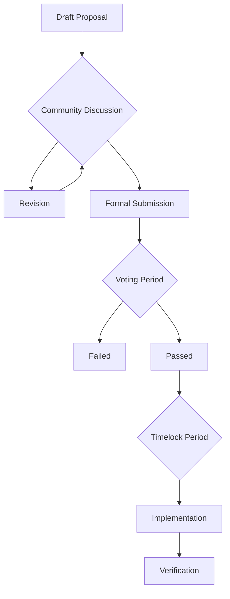

# 📝 BAD DAO Proposal Template Guide

## Overview
This document defines the standard format for all Build a DAO governance proposals. Each proposal must adhere to this structure to ensure consistency, clarity, and machine readability for the AI governance system.

## Proposal Naming Convention
`BAD-PROP-YYYYMMDD-XXXX-CATEGORY`

Where:
- `YYYYMMDD`: Date of submission
- `XXXX`: Sequential 4-digit number (0001, 0002, etc.)
- `CATEGORY`: The proposal category (GOV, VEST, DEL, TKN, ROLE, PAY, etc.)

## Template Structure

```markdown
# 📋 BAD-PROP-[YYYYMMDD]-[XXXX]-[CATEGORY]

## 📊 Metadata
- **Title:** [Concise proposal title]
- **Author:** [Author name or pseudonym]
- **Date:** [YYYY-MM-DD]
- **Category:** [Governance/Vesting/Delegation/Tokenomics/Role/Payment]
- **Status:** 🟡 Draft | 🔵 Review | 🟢 Approved | 🔴 Rejected | ⚪ Superseded
- **Required Approvals:** [Roles required to approve]
- **Implementation Timeframe:** [Immediate/24h/48h/7d]

## 🔍 Executive Summary
[1-2 paragraph summary of the proposal]

## 📋 Proposal Details

### 🎯 Objective
[Clear statement of proposal's main objective]

### 📝 Description
[Detailed description of the proposal, including all relevant information]

### 📊 Specifications
[Technical specifications, parameters, or configuration]

```yaml
parameter1: value1
parameter2: value2
```

### 💰 Financial Impact (if applicable)
[Description of any financial implications]

```yaml
cost: [amount]
timeframe: [period]
affected_accounts: [list]
```

## 🔄 Implementation

### 📝 Implementation Steps
1. [Step one]
2. [Step two]
3. [Step three]

### ⏱️ Timeline
- [Date/Milestone 1]: [Action]
- [Date/Milestone 2]: [Action]

## 📊 Voting

### 🗳️ Voting Options
- ✅ Approve
- ❌ Reject
- 🟡 Abstain

### 🔢 Threshold Requirements
- Quorum: [Minimum percentage of voting power required]
- Approval: [Minimum percentage of votes needed to pass]
- Timelock: [Time period before implementation if approved]

## 📚 Supporting Documents
- [Link to document 1](https://drive.google.com/...)
- [Link to document 2](https://drive.google.com/...)

## 💬 Discussion
[Link to discussion forum thread]

## 📝 Changelog
- [YYYY-MM-DD]: Initial proposal
- [YYYY-MM-DD]: [Changes made]
```

## Category-Specific Fields

### GOV: Governance Proposals
Additional fields:
- Governance Parameters Affected
- Previous Governance Structure
- Proposed Governance Structure
- Risk Assessment

### VEST: Vesting Proposals
Additional fields:
- Vesting Schedule
- Token Allocation
- Cliff Period
- Linear Vesting Period
- Revocation Conditions

### DEL: Delegation Proposals
Additional fields:
- Delegation Mechanics
- Delegate Powers
- Delegation Period
- Revocation Mechanism
- Delegate Responsibilities

### TKN: Tokenomics Proposals
Additional fields:
- Token Supply Changes
- Distribution Mechanism
- Utility Modifications
- Economic Model Impact

### ROLE: Role Change Proposals
Additional fields:
- Role Description
- Responsibilities
- Qualifications
- Term Limits
- Removal Conditions

### PAY: Payment/Compensation Proposals
Additional fields:
- Compensation Structure
- Payment Schedule
- Performance Metrics
- Review Period
- Termination Conditions

## AI Readability Requirements

For optimal AI processing, ensure:
1. Consistent formatting without deviations from the template
2. Clear YAML or JSON blocks for structured data
3. No embedded images (use links instead)
4. Proper nesting of headers (H1, H2, H3)
5. Clear delineation between sections with markdown separators
6. No personal identifiable information outside of Author field
7. Supporting documents must use approved sources (Google Drive, GitHub)

## Smart Contract Integration Fields

For proposals that require on-chain execution:

```yaml
contract_address: "0x..."
function_name: "functionToCall"
function_parameters:
  - name: "paramName1" 
    type: "uint256"
    value: "100"
  - name: "paramName2"
    type: "address"
    value: "0x..."
verification_mechanism: "multisig" # or "timelock", "vote"
```

## Proposal Workflow



1. **Draft**: Author creates proposal using template
2. **Discussion**: Community feedback (7 days recommended)
3. **Revision**: Updates based on feedback
4. **Submission**: Formal on-chain submission
5. **Voting**: According to category requirements
6. **Timelock**: Wait period after approval
7. **Implementation**: Execution of approved changes
8. **Verification**: Confirm successful implementation

## Best Practices

1. Be specific and unambiguous
2. Include all relevant data
3. Anticipate questions and address them in the proposal
4. Provide clear implementation steps
5. Specify exact parameter changes
6. Include links to supporting research/documentation
7. Avoid vague language or subjective statements
8. Define clear success metrics for post-implementation assessment
9. Limit proposals to a single coherent change
10. Include contingency plans for potential issues

## Proposal Versioning

If a proposal needs revision after formal submission:
1. Create a new version with the same ID but append `-v2`, `-v3`, etc.
2. Include a changelog detailing all changes
3. Reference the previous version(s)
4. Indicate which version supersedes previous ones

## Final Checklist

- [ ] All required fields completed
- [ ] Formatting matches template
- [ ] YAML/JSON blocks validated
- [ ] Links functional and using approved sources
- [ ] Supporting documents attached
- [ ] Financial impacts clearly detailed
- [ ] Implementation steps specific and actionable
- [ ] Timeline realistic
- [ ] Required approvals identified
- [ ] Voting thresholds specified 