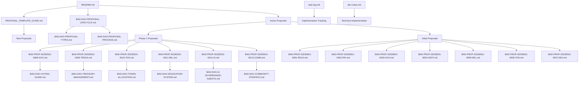
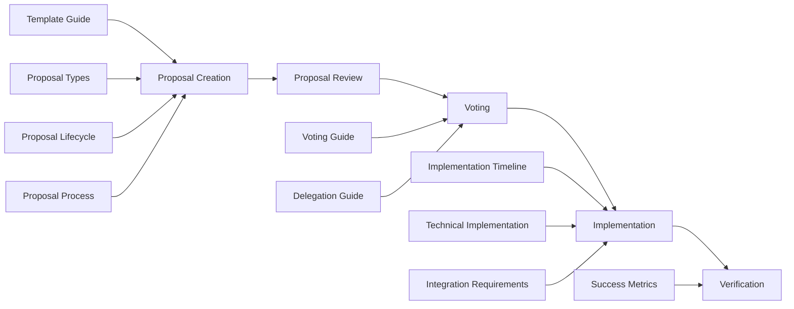

# 🌳 BAD DAO Governance Proposal File Structure

## 📂 Overview

This document outlines the file structure of the BAD DAO governance proposal system, showing the relationships between different components and documentation files.

## 📁 Directory Structure

```
_DOCS/
└── build-a-dao-proposals/
    ├── README.md                                # Proposal index and overview
    ├── PROPOSAL_TEMPLATE_GUIDE.md               # Guide for creating new proposals
    ├── task-log.md                              # Implementation tracking
    ├── dev-notes.md                             # Technical implementation details
    ├── file-tree.md                             # This file - structural documentation
    │
    ├── BAD-DAO-PROPOSAL-LIFECYCLE.md            # Proposal lifecycle documentation
    ├── BAD-DAO-PROPOSAL-TYPES.md                # Proposal types documentation
    ├── BAD-DAO-PROPOSAL-PROCESS.md              # Proposal process documentation
    │
    ├── BAD-DAO-TECHNICAL-IMPLEMENTATION.md      # Technical implementation overview
    ├── BAD-DAO-INTEGRATION-REQUIREMENTS.md      # Integration requirements
    ├── BAD-DAO-IMPLEMENTATION-TIMELINE.md       # Implementation timeline
    ├── BAD-DAO-SUCCESS-METRICS.md               # Success metrics
    │
    ├── BAD-DAO-EXECUTIVE-SUMMARY.md             # Executive summary
    ├── BAD-DAO-VOTING-GUIDE.md                  # Voting guide
    ├── BAD-DAO-DELEGATION-GUIDE.md              # Delegation guide
    │
    ├── BAD-DAO-TREASURY-MANAGEMENT.md           # Treasury management
    ├── BAD-DAO-TREASURY-GOVERNANCE-CONTROLS.md  # Treasury governance controls
    ├── BAD-DAO-AUTOMATED-TREASURY-FUNCTIONS.md  # Automated treasury functions
    │
    ├── BAD-DAO-TOKEN-ALLOCATION.md              # Token allocation
    ├── BAD-DAO-VESTING-SCHEDULES.md             # Vesting schedules
    │
    ├── BAD-DAO-DELEGATION-SYSTEM.md             # Delegation system
    ├── BAD-DAO-DELEGATION-MECHANICS.md          # Delegation mechanics
    ├── BAD-DAO-DELEGATION-INCENTIVES.md         # Delegation incentives
    │
    ├── BAD-DAO-AI-GOVERNANCE-AGENTS.md          # AI governance agents overview
    ├── BAD-DAO-PROPOSAL-ANALYZER-AGENT.md       # Proposal analyzer agent
    ├── BAD-DAO-VOTING-RECOMMENDATION-AGENT.md   # Voting recommendation agent
    ├── BAD-DAO-TREASURY-OVERSIGHT-AGENT.md      # Treasury oversight agent
    │
    ├── BAD-DAO-COMMUNITY-STRATEGY.md            # Community strategy
    ├── BAD_Community_Engagement_Strategy.md     # Community engagement strategy
    │
    ├── BAD-PROP-20230501-0001-ROLE.md           # Leadership reorganization proposal
    ├── BAD-PROP-20230501-0002-PAY.md            # Core team compensation proposal
    ├── BAD-PROP-20230501-0003-GOV.md            # Governance framework proposal
    ├── BAD-PROP-20230501-0004-VEST.md           # Token vesting structure proposal
    ├── BAD-PROP-20230501-0005-DEL.md            # Delegation system proposal
    ├── BAD-PROP-20230501-0006-TKN.md            # Tokenomics model proposal
    ├── BAD-PROP-20230501-0007-DEV.md            # Development review proposal
    │
    ├── BAD-PROP-20230515-0008-GOV.md            # Snapshot governance proposal
    ├── BAD-PROP-20230515-0009-TREAS.md          # Treasury management proposal
    ├── BAD-PROP-20230515-0010-TKN.md            # Token distribution proposal
    ├── BAD-PROP-20230515-0011-DEL.md            # Delegation system proposal
    ├── BAD-PROP-20230515-0012-AI.md             # AI governance agents proposal
    └── BAD-PROP-20230515-0013-COMM.md           # Community engagement proposal
```

## 🔄 File Relationships



## 📊 Component Relationships

### Proposal System Components



### Governance Implementation Components

```mermaid
graph TD
    A[Snapshot Governance] --> B[Voting System]
    A --> C[Proposal System]
    
    D[Treasury Management] --> E[Treasury Controls]
    D --> F[Automated Functions]
    
    G[Token Distribution] --> H[Vesting Schedules]
    G --> I[Allocation Model]
    
    J[Delegation System] --> K[Delegation Mechanics]
    J --> L[Delegation Incentives]
    
    M[AI Governance Agents] --> N[Proposal Analyzer]
    M --> O[Voting Recommender]
    M --> P[Treasury Oversight]
    
    Q[Community Engagement] --> R[Communication Channels]
    Q --> S[Education Resources]
    Q --> T[Incentive Programs]
```



## 📏 File Metrics

| Category | File Count | Total Lines | Average Size |
|----------|------------|-------------|--------------|
| Core Documentation | 6 | 2,032 | 339 lines |
| Proposal Process | 3 | 2,382 | 794 lines |
| Technical Implementation | 4 | 3,362 | 841 lines |
| Treasury Management | 3 | 1,966 | 655 lines |
| Token Management | 2 | 545 | 273 lines |
| Delegation System | 3 | 2,171 | 724 lines |
| AI Governance | 4 | 3,143 | 786 lines |
| Community | 2 | 1,706 | 853 lines |
| Active Proposals | 13 | 1,666 | 128 lines |
| **Total** | **40** | **18,973** | **474 lines** |

## 🔄 Workflow Processes

### Proposal Creation Process

1. Review `PROPOSAL_TEMPLATE_GUIDE.md`
2. Create new proposal file using template
3. Add proposal to `README.md` index
4. Create GitHub issue for proposal tracking
5. Add proposal to milestone
6. Update `task-log.md` with implementation tasks

### Implementation Tracking Process

1. Update `task-log.md` with task status
2. Document technical details in `dev-notes.md`
3. Update GitHub issues with progress
4. Link implementation artifacts to proposal

### Documentation Update Process

1. Update related documentation files
2. Maintain cross-references between files
3. Update file-tree.md when adding new files
4. Keep README.md index current

---

*Last updated: May 15, 2023* 