# 📝 DAO Signing, Delegation & Voting Guide

## Table of Contents
- [👥 Core Team Roles & Responsibilities](#core-team-roles--responsibilities)
- [📋 Proposal Categories](#proposal-categories)
- [🔑 Role Hierarchy & Signing Power](#role-hierarchy--signing-power)
- [🔄 Voting & Delegation Workflows](#voting--delegation-workflows)
- [🧩 Example Scenarios](#example-scenarios)
- [📌 Best Practices](#best-practices)
- [⚖️ Balance of Power & Security Analysis](#balance-of-power--security-analysis)

---

## 👥 Core Team Roles & Responsibilities

| Role | Name | Responsibilities |
|------|------|-----------------|
| 🏛️ President | Aziz | Final authority, strategic decisions, emergency powers |
| 💎 Head of Asset Ops | Lulu | Treasury, asset transfers, financial compliance |
| 🧠 Head of Strategy | Ruby | Roadmap, partnerships, business strategy |
| 🛠️ Head of Intelligence / Architect | Avery | Smart contract, systems, security |
| 🤝 Head of CRC | Fabian | Collaboration, research, consultancy, onboarding |
| 🤖 Admin & Ops | AI | Automation, ops, compliance, proposal management |

---

## 📋 Proposal Categories
- 🛠️ **Smart Contract Change**: Upgrades, deployments, critical fixes
- 💸 **Treasury/Asset Transfer**: Fund movement, payments, investments
- ⚙️ **Operational**: Policy, process, admin, routine ops
- 🤝 **Partnership/Strategy**: New partners, major roadmap changes
- 👥 **Team/Role Change**: Onboarding, offboarding, delegation

---

## 🔄 Updated Multi-Sig & Voting Model

- **Signers:** Aziz, Lulu, Ruby, Avery, Fabian, and AI (AI is always a required signer)
- **AI Role:** Compliance, proposal validation, contextual/IRL validation, and emergency coordination
- **Quorum:** 4 of 6 signatures required for critical actions (AI + 2 role-specific + 1 additional core member)
- **Special Condition:** If a required signer is unavailable, AI can be temporarily delegated limited power to add a substitute signer, but this must be voted in by the remaining signers
- **Anti-Takeover/Collusion:** No single group can unilaterally control funds or governance; AI enforces compliance and can flag suspicious activity for board/community review

---

## 🔑 Role Hierarchy & Signing Power

```mermaid
graph TD
    Aziz[🏛️ Aziz\nPresident] --> All
    Lulu[💎 Lulu\nAsset Ops] --> Treasury
    Ruby[🧠 Ruby\nStrategy] --> Roadmap
    Avery[🛠️ Avery\nIntelligence] --> SmartContract
    Fabian[🤝 Fabian\nCRC] --> Research
    AI[🤖 AI\nAdmin] --> Ops
    All[Core Team]
    All --> MultiSig[🔑 Multi-Sig Wallet]
    MultiSig --> Proposal[📋 Proposal System]
    Proposal --> Voting[🗳️ Voting]
    Voting --> Execution[✅ Execution]
```



- **Multi-Sig Wallet:** Requires multiple signatures for critical actions
- **Delegation:** Roles can delegate signing power for specific proposal types

---

## 🔄 Voting & Delegation Workflows (Updated)

### 🛠️ Smart Contract Change (4/6 required: AI + Avery + Aziz + (Ruby or Fabian))

```mermaid
graph LR
    Proposal[📋 Proposal: Smart Contract Change] --> Avery[🛠️ Avery]
    Proposal --> Aziz[🏛️ Aziz]
    Proposal --> AI[🤖 AI]
    Proposal --> Ruby[🧠 Ruby]
    Proposal --> Fabian[🤝 Fabian]
    Avery --> Voting[🗳️ Vote]
    Aziz --> Voting
    AI --> Voting
    Ruby --> Voting
    Fabian --> Voting
    Voting --> MultiSig[🔑 Multi-Sig: 4/6 required]
    MultiSig --> Execution[✅ Upgrade Executed]
```

- **Required:** AI, Avery, Aziz, and one of Ruby or Fabian

### 💸 Treasury Transfer (4/6 required: AI + Lulu + Aziz + (Ruby, Fabian, or Avery))

```mermaid
graph LR
    Proposal[📋 Proposal: Treasury Transfer] --> Lulu[💎 Lulu]
    Proposal --> Aziz[🏛️ Aziz]
    Proposal --> AI[🤖 AI]
    Proposal --> Ruby[🧠 Ruby]
    Proposal --> Fabian[🤝 Fabian]
    Proposal --> Avery[🛠️ Avery]
    Lulu --> Voting[🗳️ Vote]
    Aziz --> Voting
    AI --> Voting
    Ruby --> Voting
    Fabian --> Voting
    Avery --> Voting
    Voting --> MultiSig[🔑 Multi-Sig: 4/6 required]
    MultiSig --> Execution[✅ Transfer Executed]
```

- **Required:** AI, Lulu, Aziz, and one of Ruby, Fabian, or Avery

### ⚙️ Operational Proposal (3/6 required: AI + 2 others)

```mermaid
graph LR
    Proposal[📋 Proposal: Ops Change] --> AI[🤖 AI]
    Proposal --> Fabian[🤝 Fabian]
    Proposal --> Aziz[🏛️ Aziz]
    Proposal --> Ruby[🧠 Ruby]
    Proposal --> Lulu[💎 Lulu]
    Proposal --> Avery[🛠️ Avery]
    AI --> Voting[🗳️ Vote]
    Fabian --> Voting
    Aziz --> Voting
    Ruby --> Voting
    Lulu --> Voting
    Avery --> Voting
    Voting --> MultiSig[🔑 Multi-Sig: 3/6 required]
    MultiSig --> Execution[✅ Ops Change]
```

- **Required:** AI and any two other core members

---

## 🧩 Example Scenarios (Updated)

### 1. 🛠️ Smart Contract Upgrade
- Proposal submitted by Avery (Architect)
- Requires signatures from AI, Avery, Aziz, and one of Ruby or Fabian (4/6)
- If a required signer is unavailable, AI can be delegated limited power to add a substitute signer (must be voted in by remaining signers)
- AI validates proposal context, compliance, and IRL status

### 2. 💸 Treasury Transfer
- Lulu initiates transfer proposal
- Requires signatures from AI, Lulu, Aziz, and one of Ruby, Fabian, or Avery (4/6)
- If a required signer is unavailable, AI can be delegated limited power to add a substitute signer (must be voted in by remaining signers)
- AI validates fund movement, compliance, and IRL status

### 3. ⚙️ Operational Change
- AI or Fabian proposes new process
- Requires AI and any two other core members (3/6)
- AI validates compliance and records all delegation/voting

---

## 🛡️ Special Conditions & Protections
- **Unavailable Signer:** If a required signer is unavailable, AI can be temporarily delegated limited power to add a substitute signer, but this must be voted in by the remaining signers and recorded
- **Anti-Takeover:** No single group can unilaterally control funds or governance; AI enforces compliance and flags suspicious activity
- **AI Validation:** AI always validates proposal context, compliance, and IRL status before execution

---

## 📌 Best Practices
- Always document delegation and voting records
- Use proposal categories to route to correct signers
- Maintain clear role assignments and update as team evolves
- Use AI for compliance, reminders, and emergency fallback

## ⚖️ Balance of Power & Security Analysis

### 🏛️ Role Hierarchy & Signing Power Explained

The Build a DAO governance structure is designed to maximize decentralization, transparency, and security. No single individual—including the President—can unilaterally control the DAO, its treasury, or its smart contracts. All critical actions require group consensus and AI compliance validation.

#### 👥 Core Roles & Their Powers
- **🏛️ President (Aziz):**
  - Strategic leadership, emergency powers, and final authority in tie-breaks
  - **Cannot** move funds, change smart contracts, or alter governance without group approval and AI validation
- **💎 Head of Asset Ops (Lulu):**
  - Manages treasury operations, but **cannot** move funds alone
- **🧠 Head of Strategy (Ruby):**
  - Guides roadmap and partnerships, but **cannot** alter contracts or funds alone
- **🛠️ Head of Intelligence (Avery):**
  - Leads smart contract/system changes, but **cannot** deploy upgrades alone
- **🤝 Head of CRC (Fabian):**
  - Manages collaboration and research, but **cannot** act unilaterally
- **🤖 AI (Admin/Compliance):**
  - Always required for compliance, validation, and contextual/IRL checks
  - Cannot be overridden or bypassed in multi-sig actions

### 🔒 Why Unilateral Action is Nearly Impossible
- **Multi-Sig Wallet:** 4 of 6 signatures required for critical actions (AI + 2 role-specific + 1 additional core member)
- **AI Required:** AI must always sign, validate, and record all actions
- **No Single Point of Failure:** Even the President needs 3 other signers (including AI) for any critical action
- **Delegation Controls:** If a signer is unavailable, AI can only add a substitute with a group vote
- **Transparency:** All actions are logged, auditable, and visible to the community/board

### 📊 Probability & Risk Analysis
- **Probability of President Unilaterally Moving Funds:** <0.1% (requires collusion with 3 others + AI)
- **Probability of Unilateral Smart Contract Change:** <0.1% (requires collusion with 3 others + AI)
- **Probability of Collusion Among 4/6 (with AI):** Extremely low, as AI is programmed for compliance and cannot be bribed or coerced

```mermaid
bar
    title Risk of Unilateral Action
    "President Alone" : 0.1
    "President + 1" : 0.5
    "President + 2" : 1.0
    "President + 3 (w/AI)" : 0.1
    "Full Group (4/6)" : 0.01
```

### 🛡️ SWOT Analysis
| Strengths | Weaknesses |
|-----------|------------|
| Decentralized, multi-sig, AI compliance | Requires coordination for urgent actions |
| No single point of failure | Complexity for new users |
| Transparent, auditable | Reliance on AI uptime |
| Group consensus for all critical actions | |

| Opportunities | Threats |
|---------------|---------|
| Scalable to more signers/delegates | Collusion among multiple signers (very low risk) |
| Can add more AI/automation | AI malfunction (mitigated by audits) |
| Community/board oversight | Social engineering (mitigated by transparency) |

### 📝 Summary
- **No single individual—including the President—can take over the DAO or act against its charter.**
- **All critical actions require group consensus and AI validation.**
- **The system is designed for maximum transparency, security, and resilience.**

[Back to Top](#dao-signing-delegation--voting-guide) 